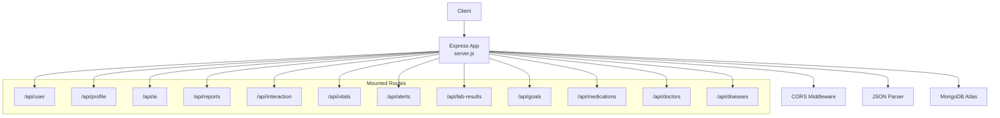
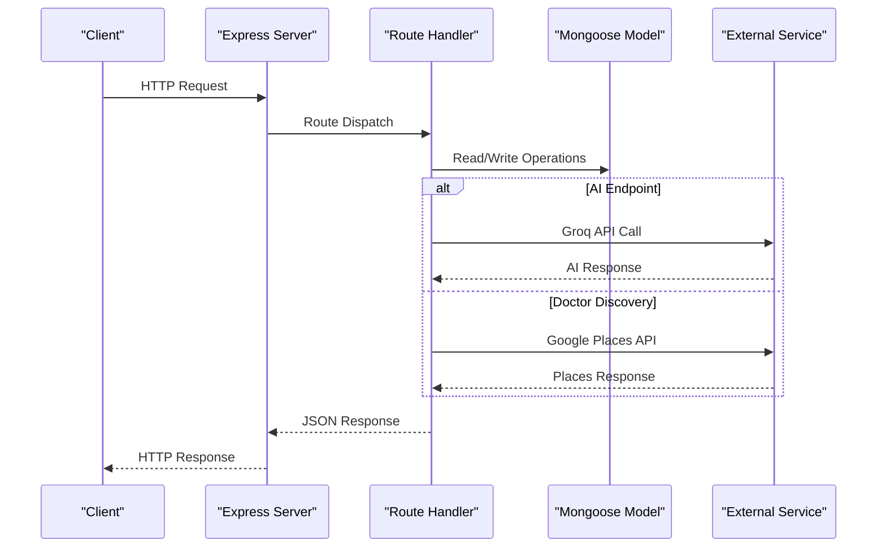
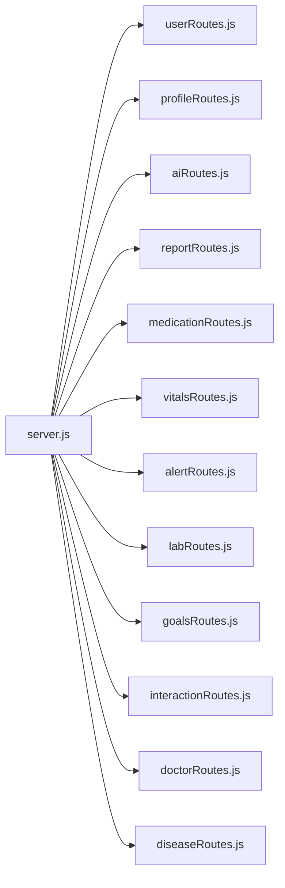

# API Reference

<cite>
**Referenced Files in This Document**
- [server.js](file://backend/server.js)
- [package.json](file://backend/package.json)
- [userRoutes.js](file://backend/src/routes/userRoutes.js)
- [profileRoutes.js](file://backend/src/routes/profileRoutes.js)
- [aiRoutes.js](file://backend/src/routes/aiRoutes.js)
- [reportRoutes.js](file://backend/src/routes/reportRoutes.js)
- [medicationRoutes.js](file://backend/src/routes/medicationRoutes.js)
- [vitalsRoutes.js](file://backend/src/routes/vitalsRoutes.js)
- [alertRoutes.js](file://backend/src/routes/alertRoutes.js)
- [labRoutes.js](file://backend/src/routes/labRoutes.js)
- [goalsRoutes.js](file://backend/src/routes/goalsRoutes.js)
- [interactionRoutes.js](file://backend/src/routes/interactionRoutes.js)
- [doctorRoutes.js](file://backend/src/routes/doctorRoutes.js)
- [diseaseRoutes.js](file://backend/src/routes/diseaseRoutes.js)
</cite>

## Table of Contents
1. [Introduction](#introduction)
2. [Project Structure](#project-structure)
3. [Core Components](#core-components)
4. [Architecture Overview](#architecture-overview)
5. [Detailed Component Analysis](#detailed-component-analysis)
6. [Dependency Analysis](#dependency-analysis)
7. [Performance Considerations](#performance-considerations)
8. [Troubleshooting Guide](#troubleshooting-guide)
9. [Conclusion](#conclusion)
10. [Appendices](#appendices)

## Introduction
This document provides a comprehensive API reference for VaidyaSetu’s backend. It catalogs all public REST endpoints grouped by functional domains: authentication and user lifecycle, health profile and history, AI services, reports, vitals monitoring, alerts, lab results, goals, medication tracking, disease insights, and doctor discovery. For each endpoint, you will find HTTP methods, URL patterns, request/response schemas, authentication requirements, error handling, and operational notes such as rate limiting, pagination, filtering, and sorting. Security, CORS, monitoring, and integration guidance are also included.

## Project Structure
The backend is an Express server that mounts modular route groups under the base path /api. Each domain has its own route module and corresponding Mongoose models. The server initializes middleware, connects to MongoDB, and exposes a health check endpoint.

**Diagram sources**
- [server.js:46-66](file://backend/server.js#L46-L66)
- [server.js:37-38](file://backend/server.js#L37-L38)
- [server.js:41-43](file://backend/server.js#L41-L43)

**Section sources**
- [server.js:33-94](file://backend/server.js#L33-L94)
- [package.json:13-31](file://backend/package.json#L13-L31)

## Core Components
- Base URL: https://your-host/api
- Authentication: Not enforced at the HTTP level in the provided routes; clients should integrate with upstream identity (e.g., Clerk) and pass identifiers such as clerkId as required by endpoints.
- CORS: Enabled globally via the cors() middleware.
- Rate Limiting: Not configured in the provided code; consider adding express-rate-limit middleware at the app level.
- Pagination, Filtering, Sorting: Implemented per-route using query parameters and MongoDB queries.

## Architecture Overview
The API follows a layered architecture:
- Entry points: server.js mounts route modules.
- Routing: Route modules define HTTP handlers and orchestrate model operations.
- Data Access: Handlers interact with Mongoose models.
- External Services: AI endpoints integrate with Groq; doctor discovery integrates with Google Places; OCR uploads use Multer.

**Diagram sources**
- [server.js:46-66](file://backend/server.js#L46-L66)
- [aiRoutes.js:14-200](file://backend/src/routes/aiRoutes.js#L14-L200)
- [doctorRoutes.js:63-90](file://backend/src/routes/doctorRoutes.js#L63-L90)

## Detailed Component Analysis

### Health Check
- Method: GET
- Path: /api/health
- Description: Returns service health and database connectivity status.
- Response: status, message, db_status
- Errors: None defined; returns 200 with status object.

**Section sources**
- [server.js:68-75](file://backend/server.js#L68-L75)

### Authentication and User Lifecycle
- Methods and Paths:
  - POST /api/user/profile: Initial profile save during onboarding.
  - DELETE /api/user/:clerkId: Purge account data.
- Request/Response:
  - POST /api/user/profile
    - Request body: Includes clerkId and profile fields; fields are flattened to nested schema with metadata.
    - Response: status, message, data (UserProfile).
  - DELETE /api/user/:clerkId
    - Path param: clerkId.
    - Response: status, message.
- Validation:
  - Missing clerkId in POST returns 400.
  - Profile not found returns 404 in dependent flows.
- Error Handling:
  - 500 on internal errors; logs error messages.

**Section sources**
- [userRoutes.js:11-80](file://backend/src/routes/userRoutes.js#L11-L80)
- [userRoutes.js:83-98](file://backend/src/routes/userRoutes.js#L83-L98)

### Profile Management
- Methods and Paths:
  - GET /api/profile/:clerkId: Retrieve profile with data quality metrics.
  - POST /api/profile/update: Update profile with change detection and history logging.
  - GET /api/profile/history/:clerkId: Retrieve history entries.
  - PUT /api/profile/history/:id/reclassify: Reclassify a history entry.
  - PATCH /api/profile/settings/:clerkId: Update platform settings.
  - GET /api/profile/export/:clerkId: Export consolidated health data.
  - DELETE /api/profile/account/:clerkId: Permanently delete account and all related data.
  - POST /api/profile/saved-doctors: Save a doctor to profile.
  - DELETE /api/profile/saved-doctors/:clerkId/:placeId: Remove a saved doctor.
  - PATCH /api/profile/saved-doctors/:clerkId/:placeId/notes: Update doctor notes.
  - PATCH /api/profile/card-meta/:clerkId: Persist card review/dismissal metadata.
- Request/Response:
  - GET /api/profile/:clerkId
    - Response: status, data (UserProfile), dataQuality (score and label).
  - POST /api/profile/update
    - Request body: clerkId, updates (key-value map), optional intent, notes, changeDate.
    - Response: status, message, data (UserProfile), changesLogged.
  - PUT /api/profile/history/:id/reclassify
    - Request body: changeType (enumerated).
    - Response: status, message, data (History record).
  - PATCH /api/profile/settings/:clerkId
    - Request body: settings (object).
    - Response: status, message, data (settings).
  - GET /api/profile/export/:clerkId
    - Response: status, data (consolidated health data).
  - DELETE /api/profile/account/:clerkId
    - Response: status, message.
  - POST /api/profile/saved-doctors
    - Request body: clerkId, doctor (object).
    - Response: status, data (updated savedDoctors).
  - DELETE /api/profile/saved-doctors/:clerkId/:placeId
    - Response: status, data (updated savedDoctors).
  - PATCH /api/profile/saved-doctors/:clerkId/:placeId/notes
    - Request body: notes (string).
    - Response: status, data (updated savedDoctors).
  - PATCH /api/profile/card-meta/:clerkId
    - Request body: updates (map of diseaseId -> meta).
    - Response: status, data (updated cardMeta).
- Validation and Behavior:
  - Missing required fields return 400.
  - Profile not found returns 404.
  - BMI auto-calculated and synchronized when height/weight updated.
  - Data quality recalculated after updates.
- Error Handling:
  - 500 on internal errors; logs error messages.

**Section sources**
- [profileRoutes.js:9-27](file://backend/src/routes/profileRoutes.js#L9-L27)
- [profileRoutes.js:30-141](file://backend/src/routes/profileRoutes.js#L30-L141)
- [profileRoutes.js:143-184](file://backend/src/routes/profileRoutes.js#L143-L184)
- [profileRoutes.js:187-213](file://backend/src/routes/profileRoutes.js#L187-L213)
- [profileRoutes.js:224-252](file://backend/src/routes/profileRoutes.js#L224-L252)
- [profileRoutes.js:258-279](file://backend/src/routes/profileRoutes.js#L258-L279)
- [profileRoutes.js:282-318](file://backend/src/routes/profileRoutes.js#L282-L318)
- [profileRoutes.js:321-339](file://backend/src/routes/profileRoutes.js#L321-L339)
- [profileRoutes.js:342-364](file://backend/src/routes/profileRoutes.js#L342-L364)

### AI Services
- Methods and Paths:
  - POST /api/ai/generate-report: Generate a personalized health report using AI.
  - POST /api/ai/medicine-insight: Get AI insights for a specific medicine.
- Request/Response:
  - POST /api/ai/generate-report
    - Request body: clerkId, changeContext (optional).
    - Response: status, data (Report).
    - Notes: Integrates vitals and active medications; returns structured JSON with advice, mitigations, category insights, and risk scores.
  - POST /api/ai/medicine-insight
    - Request body: clerkId (optional), medicineName.
    - Response: status, data (AI-generated insights).
- Validation and Behavior:
  - Missing clerkId or required fields return 400.
  - Uses Groq chat completions; falls back model on rate limit.
- Error Handling:
  - 500 on internal errors; logs error messages.

**Section sources**
- [aiRoutes.js:14-200](file://backend/src/routes/aiRoutes.js#L14-L200)
- [aiRoutes.js:203-296](file://backend/src/routes/aiRoutes.js#L203-L296)

### Reports
- Methods and Paths:
  - GET /api/reports/:clerkId: Retrieve the latest report for a user.
- Request/Response:
  - GET /api/reports/:clerkId
    - Response: status, data (Report + userProfile).
- Validation and Behavior:
  - Returns 404 if no report found.
- Error Handling:
  - 500 on internal errors.

**Section sources**
- [reportRoutes.js:9-37](file://backend/src/routes/reportRoutes.js#L9-L37)

### Medication Tracking
- Methods and Paths:
  - GET /api/medications/:clerkId: List active medications for a user.
  - POST /api/medications: Add a new medication.
  - PATCH /api/medications/:id/take: Mark a dose as taken and update adherence.
  - DELETE /api/medications/:id: Deactivate a medication.
- Request/Response:
  - GET /api/medications/:clerkId
    - Response: status, data (array of active Medications).
  - POST /api/medications
    - Request body: Medication fields.
    - Response: status, data (Medication), 201 on creation.
  - PATCH /api/medications/:id/take
    - Response: status, data (Medication).
  - DELETE /api/medications/:id
    - Response: status, message.
- Validation and Behavior:
  - Missing required fields return 400.
  - Not found returns 404.
- Error Handling:
  - 500 on internal errors.

**Section sources**
- [medicationRoutes.js:9-16](file://backend/src/routes/medicationRoutes.js#L9-L16)
- [medicationRoutes.js:22-30](file://backend/src/routes/medicationRoutes.js#L22-L30)
- [medicationRoutes.js:36-50](file://backend/src/routes/medicationRoutes.js#L36-L50)
- [medicationRoutes.js:56-63](file://backend/src/routes/medicationRoutes.js#L56-L63)

### Vitals Monitoring
- Methods and Paths:
  - POST /api/vitals: Log a new vital reading.
  - GET /api/vitals/latest/:clerkId: Get latest reading for each vital type.
  - GET /api/vitals/:clerkId: Get vitals history with optional type filter and limit.
  - GET /api/vitals/:clerkId/trends: Weekly/monthly averages for a vital type.
  - PATCH /api/vitals/:id: Update a specific reading.
  - DELETE /api/vitals/:id: Delete a specific reading.
- Request/Response:
  - POST /api/vitals
    - Request body: Required clerkId, type, value; optional unit, timestamp, source, notes, mealContext.
    - Response: status, data (Vital), 201 on creation.
  - GET /api/vitals/latest/:clerkId
    - Response: status, data (array of latest vitals).
  - GET /api/vitals/:clerkId
    - Query params: type (optional), limit (default 100).
    - Response: status, data (array of vitals).
  - GET /api/vitals/:clerkId/trends
    - Query params: type (required), days (default 30).
    - Response: status, data (aggregation results).
  - PATCH /api/vitals/:id
    - Response: status, data (Vital).
  - DELETE /api/vitals/:id
    - Response: status, message.
- Validation and Behavior:
  - Missing required fields return 400.
  - Not found returns 404.
  - Automated threshold-based alerts generated asynchronously.
- Error Handling:
  - 500 on internal errors.

**Section sources**
- [vitalsRoutes.js:90-115](file://backend/src/routes/vitalsRoutes.js#L90-L115)
- [vitalsRoutes.js:121-146](file://backend/src/routes/vitalsRoutes.js#L121-L146)
- [vitalsRoutes.js:152-168](file://backend/src/routes/vitalsRoutes.js#L152-L168)
- [vitalsRoutes.js:174-210](file://backend/src/routes/vitalsRoutes.js#L174-L210)
- [vitalsRoutes.js:216-224](file://backend/src/routes/vitalsRoutes.js#L216-L224)
- [vitalsRoutes.js:230-238](file://backend/src/routes/vitalsRoutes.js#L230-L238)

### Alert Management
- Methods and Paths:
  - GET /api/alerts/:clerkId: Fetch alerts with optional status and priority filters.
  - PATCH /api/alerts/:id/read: Mark an alert as read.
  - DELETE /api/alerts/:id: Dismiss an alert.
  - POST /api/alerts: Internal helper to create alerts.
  - GET /api/alerts/:clerkId/count: Unread count for badge display.
  - GET /api/alerts/:clerkId/summary: Last 30 days analytics.
  - PATCH /api/alerts/:clerkId/read-all: Bulk mark read.
  - POST /api/alerts/:id/feedback: Submit relevance feedback.
- Request/Response:
  - GET /api/alerts/:clerkId
    - Query params: status, priority.
    - Response: status, data (array of alerts).
  - PATCH /api/alerts/:id/read
    - Response: status, data (Alert).
  - DELETE /api/alerts/:id
    - Response: status, message.
  - POST /api/alerts
    - Request body: Alert fields.
    - Response: status, data (Alert), 201 on creation.
  - GET /api/alerts/:clerkId/count
    - Response: status, data (count).
  - GET /api/alerts/:clerkId/summary
    - Response: status, data (summary).
  - PATCH /api/alerts/:clerkId/read-all
    - Response: status, message.
  - POST /api/alerts/:id/feedback
    - Request body: rating ('helpful' or 'not_helpful').
    - Response: status, data (Alert).
- Validation and Behavior:
  - Missing required fields return 400.
  - Not found returns 404.
- Error Handling:
  - 500 on internal errors.

**Section sources**
- [alertRoutes.js:9-25](file://backend/src/routes/alertRoutes.js#L9-L25)
- [alertRoutes.js:31-48](file://backend/src/routes/alertRoutes.js#L31-L48)
- [alertRoutes.js:54-71](file://backend/src/routes/alertRoutes.js#L54-L71)
- [alertRoutes.js:77-85](file://backend/src/routes/alertRoutes.js#L77-L85)
- [alertRoutes.js:91-101](file://backend/src/routes/alertRoutes.js#L91-L101)
- [alertRoutes.js:107-128](file://backend/src/routes/alertRoutes.js#L107-L128)
- [alertRoutes.js:134-145](file://backend/src/routes/alertRoutes.js#L134-L145)
- [alertRoutes.js:151-165](file://backend/src/routes/alertRoutes.js#L151-L165)

### Lab Results
- Methods and Paths:
  - POST /api/lab-results/upload: Upload a PDF or image report.
  - POST /api/lab-results: Add a new lab result.
  - GET /api/lab-results/:clerkId: Get history sorted by sampleDate.
  - GET /api/lab-results/:clerkId/trends/:testName: Numeric trends for a test.
  - DELETE /api/lab-results/:id: Delete a result.
- Request/Response:
  - POST /api/lab-results/upload
    - Form field: report (PDF or image).
    - Response: status, message, fileUrl.
  - POST /api/lab-results
    - Request body: Required clerkId, testName, resultValue; optional unit, sampleDate, source, reportRef.
    - Response: status, data (LabResult), 201 on creation.
  - GET /api/lab-results/:clerkId
    - Response: status, data (array of results).
  - GET /api/lab-results/:clerkId/trends/:testName
    - Response: status, data (array of { value, date, unit }).
  - DELETE /api/lab-results/:id
    - Response: status, message.
- Validation and Behavior:
  - Missing required fields return 400.
  - Not found returns 404.
  - File type restricted to PDF and images.
- Error Handling:
  - 500 on internal errors.

**Section sources**
- [labRoutes.js:31-44](file://backend/src/routes/labRoutes.js#L31-L44)
- [labRoutes.js:50-72](file://backend/src/routes/labRoutes.js#L50-L72)
- [labRoutes.js:77-88](file://backend/src/routes/labRoutes.js#L77-L88)
- [labRoutes.js:94-111](file://backend/src/routes/labRoutes.js#L94-L111)
- [labRoutes.js:117-125](file://backend/src/routes/labRoutes.js#L117-L125)

### Goals
- Methods and Paths:
  - POST /api/goals: Create a new health goal.
  - GET /api/goals/:clerkId: Get all goals sorted by creation time.
  - PATCH /api/goals/:id: Update progress or status; auto-complete on target.
  - GET /api/goals/:clerkId/summary: Dashboard summary.
  - DELETE /api/goals/:id: Remove a goal.
- Request/Response:
  - POST /api/goals
    - Request body: Required clerkId, goalType, targetValue; optional progressValue, unit, startDate, targetDate.
    - Response: status, data (HealthGoal), 201 on creation.
  - GET /api/goals/:clerkId
    - Response: status, data (array of goals).
  - PATCH /api/goals/:id
    - Request body: progressValue (optional), status (optional).
    - Response: status, data (HealthGoal).
  - GET /api/goals/:clerkId/summary
    - Response: status, data (summary).
  - DELETE /api/goals/:id
    - Response: status, message.
- Validation and Behavior:
  - Missing required fields return 400.
  - Not found returns 404.
  - Auto-completes when progress reaches target.
- Error Handling:
  - 500 on internal errors.

**Section sources**
- [goalsRoutes.js:9-31](file://backend/src/routes/goalsRoutes.js#L9-L31)
- [goalsRoutes.js:37-47](file://backend/src/routes/goalsRoutes.js#L37-L47)
- [goalsRoutes.js:53-76](file://backend/src/routes/goalsRoutes.js#L53-L76)
- [goalsRoutes.js:82-95](file://backend/src/routes/goalsRoutes.js#L82-L95)
- [goalsRoutes.js:101-109](file://backend/src/routes/goalsRoutes.js#L101-L109)

### Drug Interaction Engine
- Methods and Paths:
  - POST /api/interaction/match: Fuzzy match medicine names.
  - POST /api/interaction/check: Detect interactions among confirmed medicines.
  - POST /api/interaction/explain-interaction: AI explanation of interaction risks.
  - GET /api/interaction/history/:clerkId: Retrieve interaction history.
- Request/Response:
  - POST /api/interaction/match
    - Request body: medicines (array).
    - Response: status, data (matches).
  - POST /api/interaction/check
    - Request body: clerkId (optional), confirmedMedicines (array).
    - Response: status, data (findings).
  - POST /api/interaction/explain-interaction
    - Request body: drug1, drug2.
    - Response: status, explanation.
  - GET /api/interaction/history/:clerkId
    - Response: status, data (InteractionHistory).
- Validation and Behavior:
  - Missing required fields return 400.
  - Optional clerkId enables history logging and alerts.
- Error Handling:
  - 500 on internal errors.

**Section sources**
- [interactionRoutes.js:11-22](file://backend/src/routes/interactionRoutes.js#L11-L22)
- [interactionRoutes.js:25-42](file://backend/src/routes/interactionRoutes.js#L25-L42)
- [interactionRoutes.js:45-57](file://backend/src/routes/interactionRoutes.js#L45-L57)
- [interactionRoutes.js:60-67](file://backend/src/routes/interactionRoutes.js#L60-L67)

### Doctor Discovery
- Methods and Paths:
  - GET /api/doctors/nearby: Find nearby doctors by disease or specialty.
  - POST /api/doctors/save: Save a doctor to user profile.
- Request/Response:
  - GET /api/doctors/nearby
    - Query params: diseaseId (optional), lat, lng, radius (optional), specialtyOverride (optional).
    - Response: status, source ('google_places' or 'mock'), data (doctors).
  - POST /api/doctors/save
    - Request body: clerkId, doctor (object).
    - Response: status, message, data (SavedDoctor).
- Validation and Behavior:
  - Missing lat/lng returns 400.
  - Missing API key triggers mock behavior.
- Error Handling:
  - 500 on internal errors.

**Section sources**
- [doctorRoutes.js:10-96](file://backend/src/routes/doctorRoutes.js#L10-L96)
- [doctorRoutes.js:100-130](file://backend/src/routes/doctorRoutes.js#L100-L130)

### Disease Insights
- Methods and Paths:
  - GET /api/diseases/:diseaseId/details: Get disease details and personalized insights.
  - POST /api/diseases/:diseaseId/add-data: Add data and recalculate risk.
  - PATCH /api/diseases/:diseaseId/review: Mark insight as reviewed.
- Request/Response:
  - GET /api/diseases/:diseaseId/details
    - Query params: clerkId (required).
    - Response: status, data (disease metadata, risk metrics, mitigation steps, doctor info, sources, emergency alerts).
  - POST /api/diseases/:diseaseId/add-data
    - Request body: clerkId, field, value, unit (optional).
    - Response: status, message, data (updated DiseaseInsight).
  - PATCH /api/diseases/:diseaseId/review
    - Request body: clerkId (required).
    - Response: status, data (updated DiseaseInsight).
- Validation and Behavior:
  - Missing required fields return 400.
  - Not found returns 404.
- Error Handling:
  - 500 on internal errors.

**Section sources**
- [diseaseRoutes.js:11-73](file://backend/src/routes/diseaseRoutes.js#L11-L73)
- [diseaseRoutes.js:77-122](file://backend/src/routes/diseaseRoutes.js#L77-L122)
- [diseaseRoutes.js:126-146](file://backend/src/routes/diseaseRoutes.js#L126-L146)

## Dependency Analysis
- External Dependencies:
  - express-rate-limit: Not configured in code; recommended for rate limiting.
  - @google/generative-ai, groq-sdk: Used by AI routes.
  - axios: Used by doctor discovery route.
  - multer: Used by lab results upload route.
- Internal Dependencies:
  - Route modules depend on Mongoose models and utility services.
  - AI routes depend on risk scoring and external AI providers.
  - Vitals routes depend on alert service for automated monitoring.

**Diagram sources**
- [server.js:46-66](file://backend/server.js#L46-L66)

**Section sources**
- [package.json:13-31](file://backend/package.json#L13-L31)

## Performance Considerations
- Asynchronous Operations:
  - Vitals threshold checks and AI report generation are asynchronous to avoid blocking requests.
- Aggregation Queries:
  - Trends endpoints use aggregation pipelines; ensure appropriate indexes on timestamp fields.
- Batch Operations:
  - Profile updates leverage bulk history insertion and data quality recalculation.
- Recommendations:
  - Add rate limiting middleware at the app level.
  - Implement caching for frequently accessed static data.
  - Use pagination and limits for large collections.

## Troubleshooting Guide
- Common Status Codes:
  - 400: Missing required fields or invalid input.
  - 404: Resource not found.
  - 500: Internal server error.
- Logging:
  - Routes log errors and specific events (e.g., AI report generation, alert creation).
- Diagnostics:
  - Use /api/health to verify service and DB connectivity.
  - Validate clerkId presence for endpoints requiring user identity.

**Section sources**
- [server.js:68-75](file://backend/server.js#L68-L75)
- [aiRoutes.js:196-199](file://backend/src/routes/aiRoutes.js#L196-L199)
- [vitalsRoutes.js:108](file://backend/src/routes/vitalsRoutes.js#L108)

## Conclusion
This API reference consolidates VaidyaSetu’s REST endpoints across health monitoring, AI assistance, alerts, and user management. Clients should integrate identity upstream and pass identifiers like clerkId as required. For production, add rate limiting, implement robust input validation, and consider caching and indexing strategies for optimal performance.

## Appendices

### Authentication and Authorization
- Current Implementation: Not enforced at the HTTP level in the provided routes.
- Recommendation: Integrate with upstream identity provider (e.g., Clerk) and enforce bearer tokens or session-based auth at the app middleware level.

### CORS Configuration
- Current Implementation: Enabled globally via cors().
- Recommendation: Configure allowed origins, methods, and headers according to deployment needs.

### Rate Limiting
- Current Implementation: Not configured.
- Recommendation: Add express-rate-limit middleware at the app level to protect endpoints.

### Pagination, Filtering, and Sorting
- Implemented per-route:
  - GET /api/vitals/:clerkId supports type and limit.
  - GET /api/alerts/:clerkId supports status and priority filters.
  - GET /api/lab-results/:clerkId/trends/:testName sorts by sampleDate.
  - GET /api/goals/:clerkId sorts by createdAt.
  - GET /api/profile/history/:clerkId sorts by timestamp.

### Example Requests and Responses
- Example: POST /api/user/profile
  - Request body: { clerkId, name, age, gender, height, weight, ... }
  - Response: { status: "success", message: "...", data: UserProfile }
- Example: POST /api/ai/generate-report
  - Request body: { clerkId, changeContext: "..." }
  - Response: { status: "success", data: Report }
- Example: POST /api/vitals
  - Request body: { clerkId, type, value, unit, timestamp, source, notes, mealContext }
  - Response: { status: "success", data: Vital }

### Client Implementation Guidelines
- Use consistent headers: Content-Type: application/json.
- Propagate clerkId in requests where required.
- Implement retry with exponential backoff for AI endpoints.
- Store and refresh access tokens from upstream identity provider.

### SDK Usage Examples
- Not provided in the repository.
- Recommendation: Generate OpenAPI/Swagger specs from route definitions and scaffold SDKs using tools like Swagger Codegen or openapi-generator-cli.

### API Versioning, Backward Compatibility, and Deprecation
- Current Implementation: No explicit versioning scheme observed.
- Recommendation:
  - Use URL versioning (/api/v1/...) or Accept-Version header.
  - Maintain backward compatibility windows and deprecation timelines.
  - Announce deprecations with migration guides.

### Security Considerations
- Transport: Enforce HTTPS in production.
- Inputs: Sanitize and validate all inputs; consider input length and type constraints.
- Secrets: Store API keys in environment variables; avoid logging sensitive data.
- Permissions: Enforce user scoping using clerkId; verify ownership before mutating resources.

### Monitoring Approaches
- Health: Use /api/health for liveness/readiness checks.
- Logs: Capture structured logs for errors and key events.
- Metrics: Track request latency, error rates, and throughput per endpoint.
- Tracing: Correlate requests across route handlers and external service calls.