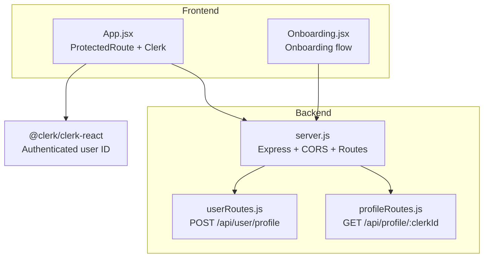
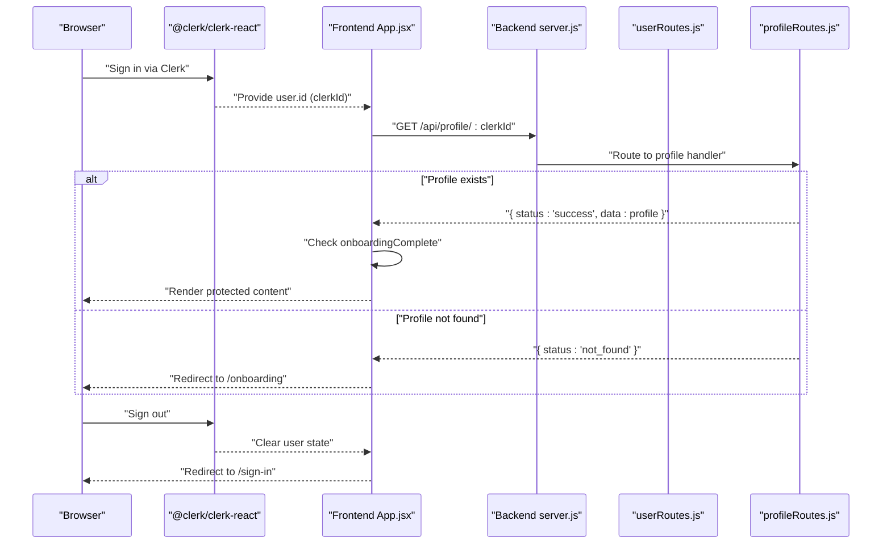
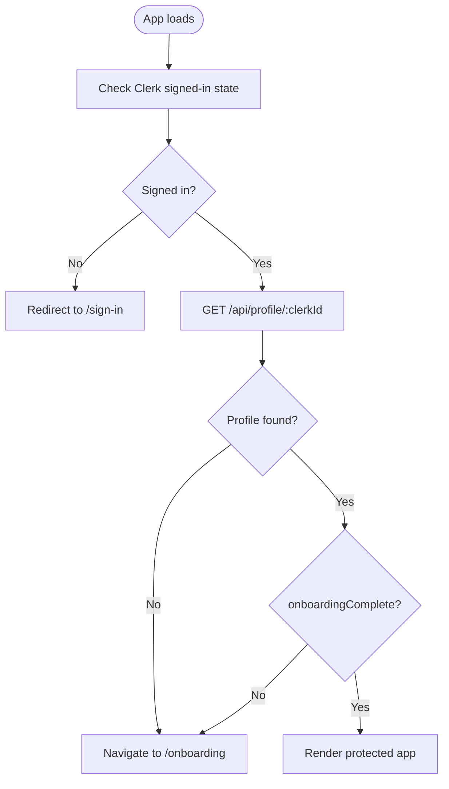
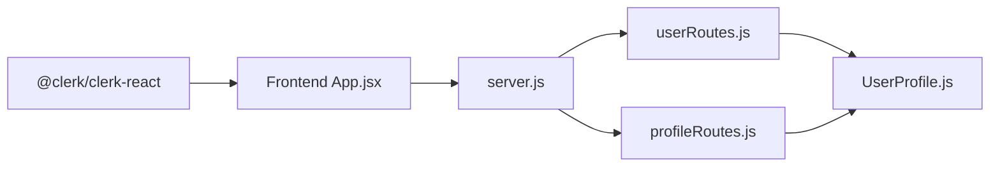

# Authentication API

<cite>
**Referenced Files in This Document**
- [server.js](file://backend/server.js)
- [userRoutes.js](file://backend/src/route/userRoutes.js)
- [profileRoutes.js](file://backend/src/route/profileRoutes.js)
- [UserProfile.js](file://backend/src/models/UserProfile.js)
- [App.jsx](file://frontend/src/App.jsx)
- [Onboarding.jsx](file://frontend/src/pages/Onboarding.jsx)
</cite>

## Table of Contents
1. [Introduction](#introduction)
2. [Project Structure](#project-structure)
3. [Core Components](#core-components)
4. [Architecture Overview](#architecture-overview)
5. [Detailed Component Analysis](#detailed-component-analysis)
6. [Dependency Analysis](#dependency-analysis)
7. [Performance Considerations](#performance-considerations)
8. [Troubleshooting Guide](#troubleshooting-guide)
9. [Conclusion](#conclusion)
10. [Appendices](#appendices)

## Introduction
This document describes the authentication and session management APIs used by VaidyaSetu. It focuses on how Clerk authentication integrates with the backend, how user profiles are created and managed, and how sessions are validated client-side. It also documents the available endpoints for user onboarding, profile retrieval and updates, and account deletion.

The backend exposes REST endpoints under the /api base path. The frontend uses Clerk SDK for authentication and validates sessions by fetching the user’s profile from the backend.

## Project Structure
The authentication flow spans the backend server and frontend application:
- Backend server registers route modules and exposes endpoints under /api.
- Clerk manages sign-in/sign-out and provides the authenticated user ID.
- Frontend uses Clerk hooks to guard protected routes and fetches the user’s profile to determine onboarding state.



**Diagram sources**
- [server.js:46-66](file://backend/server.js#L46-L66)
- [userRoutes.js:10-80](file://backend/src/route/userRoutes.js#L10-L80)
- [profileRoutes.js:8-27](file://backend/src/route/profileRoutes.js#L8-L27)
- [App.jsx:34-83](file://frontend/src/App.jsx#L34-L83)
- [Onboarding.jsx:13-27](file://frontend/src/pages/Onboarding.jsx#L13-L27)

**Section sources**
- [server.js:46-66](file://backend/server.js#L46-L66)
- [App.jsx:32-83](file://frontend/src/App.jsx#L32-L83)

## Core Components
- Clerk authentication: Provides signed-in state and user ID used by the backend to manage user profiles.
- Backend routes:
  - POST /api/user/profile: Creates or updates a user profile during onboarding using the Clerk user ID.
  - GET /api/profile/:clerkId: Retrieves the user’s profile by Clerk ID.
- Frontend guards:
  - ProtectedRoute ensures unauthenticated users are redirected to the sign-in page.
  - Onboarding flow is triggered when the profile is not yet complete.

Key integration points:
- Clerk user ID is passed from the frontend to the backend as the clerkId field.
- The frontend checks the backend for profile existence and completion to decide navigation.

**Section sources**
- [userRoutes.js:10-80](file://backend/src/route/userRoutes.js#L10-L80)
- [profileRoutes.js:8-27](file://backend/src/route/profileRoutes.js#L8-L27)
- [App.jsx:34-83](file://frontend/src/App.jsx#L34-L83)

## Architecture Overview
The authentication architecture relies on Clerk for identity and the backend for profile persistence and session validation.



**Diagram sources**
- [server.js:46-66](file://backend/server.js#L46-L66)
- [profileRoutes.js:8-27](file://backend/src/route/profileRoutes.js#L8-L27)
- [App.jsx:34-83](file://frontend/src/App.jsx#L34-L83)

## Detailed Component Analysis

### Endpoint: POST /api/user/profile (User Onboarding)
Purpose:
- Create or update a user profile during onboarding using the Clerk user ID.

Request
- Path: POST /api/user/profile
- Headers: Content-Type: application/json
- Body fields:
  - Required: clerkId (string)
  - Optional: name, age, gender, height, weight, bmi, bmiCategory, activityLevel, sleepHours, stressLevel, isSmoker, alcoholConsumption, dietType, sugarIntake, saltIntake, eatsLeafyGreens, eatsFruits, junkFoodFrequency, allergies, medicalHistory, otherConditions
- Behavior:
  - Validates presence of clerkId.
  - Upserts a profile with onboardingComplete set to true.
  - Logs initial history entries for provided fields.
  - Updates data quality metrics.

Response
- Success: { status: "success", message: string, data: UserProfile }
- Errors:
  - 400: Missing clerkId
  - 500: Internal server error

Notes:
- The endpoint accepts a flattened set of fields and stores them in a nested structure within the profile.
- Uses Clerk user ID as the primary key for profile storage.

**Section sources**
- [userRoutes.js:10-80](file://backend/src/route/userRoutes.js#L10-L80)

### Endpoint: GET /api/profile/:clerkId (Profile Retrieval)
Purpose:
- Retrieve a user’s profile by Clerk ID.

Request
- Path: GET /api/profile/:clerkId
- Path parameters:
  - clerkId: string (Clerk user identifier)
- Headers: none required

Response
- Success: { status: "success", data: UserProfile, dataQuality: { score, label } }
- Errors:
  - 404: Profile not found
  - 500: Internal server error

Behavior:
- Returns the stored profile and computed data quality metrics.

**Section sources**
- [profileRoutes.js:8-27](file://backend/src/route/profileRoutes.js#L8-L27)

### Session Validation and Frontend Integration
Frontend behavior:
- ProtectedRoute enforces that only signed-in users can access protected pages.
- On load, the app fetches the user’s profile from the backend using the Clerk user ID.
- If the profile does not exist or is not complete, the app navigates to onboarding.



**Diagram sources**
- [App.jsx:34-83](file://frontend/src/App.jsx#L34-L83)

**Section sources**
- [App.jsx:34-83](file://frontend/src/App.jsx#L34-L83)

### Data Model: UserProfile
UserProfile is the core model used for storing user health profile data keyed by Clerk ID.

Key characteristics:
- Primary key: clerkId (string)
- Stores nested fields for biometrics, lifestyle, diet, and medical history.
- Tracks onboarding completion and data quality metrics.

```mermaid
erDiagram
USER_PROFILE {
string clerkId
boolean onboardingComplete
jsonb fields...
number dataQualityScore
string dataQualityLabel
}
```

**Diagram sources**
- [UserProfile.js](file://backend/src/models/UserProfile.js)

**Section sources**
- [UserProfile.js](file://backend/src/models/UserProfile.js)

### Client-Side Implementation Examples

React (Vite):
- Use Clerk SDK to obtain the authenticated user ID.
- Protect routes with a wrapper that redirects unauthenticated users to the sign-in page.
- On successful sign-in, fetch the user’s profile from the backend to determine onboarding state.

Example references:
- Clerk integration and protected route pattern: [App.jsx:34-44](file://frontend/src/App.jsx#L34-L44)
- Profile fetch and onboarding redirect: [App.jsx:68-82](file://frontend/src/App.jsx#L68-L82)
- Onboarding page entry point: [Onboarding.jsx:13-27](file://frontend/src/pages/Onboarding.jsx#L13-L27)

Mobile (React Native):
- Use Clerk SDK for RN to obtain the current user ID.
- Implement a similar protected-route mechanism.
- Call GET /api/profile/:clerkId after sign-in to check onboarding status and navigate accordingly.

## Dependency Analysis
- Backend depends on Clerk for user identity and on MongoDB for profile storage.
- Frontend depends on Clerk SDK for authentication state and Axios for HTTP requests.
- Routes depend on the UserProfile model for persistence.



**Diagram sources**
- [server.js:46-66](file://backend/server.js#L46-L66)
- [userRoutes.js:3](file://backend/src/route/userRoutes.js#L3)
- [profileRoutes.js:3](file://backend/src/route/profileRoutes.js#L3)
- [UserProfile.js](file://backend/src/models/UserProfile.js)

**Section sources**
- [server.js:46-66](file://backend/server.js#L46-L66)
- [userRoutes.js:3](file://backend/src/route/userRoutes.js#L3)
- [profileRoutes.js:3](file://backend/src/route/profileRoutes.js#L3)

## Performance Considerations
- Profile retrieval is a single query by Clerk ID; ensure indexes exist on clerkId for optimal performance.
- Onboarding upsert operation writes nested fields and logs history entries; batch history writes are performed efficiently.
- Frontend should avoid redundant profile fetches by caching results per session.

## Troubleshooting Guide
Common issues and resolutions:
- Invalid or missing clerkId:
  - Symptom: 400 Bad Request on POST /api/user/profile.
  - Resolution: Ensure the frontend passes the authenticated user ID from Clerk as clerkId.
- Profile not found:
  - Symptom: 404 Not Found on GET /api/profile/:clerkId.
  - Resolution: Trigger onboarding flow to create the profile via POST /api/user/profile.
- Session expired or revoked:
  - Symptom: Clerk indicates no signed-in user; protected route redirects to sign-in.
  - Resolution: Re-authenticate via Clerk; upon successful sign-in, re-fetch profile from backend.

Error codes summary:
- 400: Missing required fields (e.g., clerkId).
- 404: Resource not found (e.g., profile).
- 500: Internal server error.

**Section sources**
- [userRoutes.js:16-18](file://backend/src/route/userRoutes.js#L16-L18)
- [profileRoutes.js:12-13](file://backend/src/route/profileRoutes.js#L12-L13)
- [App.jsx:78-81](file://frontend/src/App.jsx#L78-L81)

## Conclusion
VaidyaSetu’s authentication and session management rely on Clerk for identity and a simple backend profile API for onboarding and session validation. The frontend guards protected routes and orchestrates onboarding based on backend responses. The documented endpoints and flows provide a clear blueprint for integrating authentication across web and mobile clients.

## Appendices

### API Definitions

- POST /api/user/profile
  - Description: Create or update a user profile during onboarding.
  - Request body: { clerkId: string, optional profile fields... }
  - Responses:
    - 200 OK: { status: "success", message: string, data: UserProfile }
    - 400 Bad Request: Missing clerkId
    - 500 Internal Server Error

- GET /api/profile/:clerkId
  - Description: Retrieve a user’s profile by Clerk ID.
  - Path parameters: clerkId: string
  - Responses:
    - 200 OK: { status: "success", data: UserProfile, dataQuality: { score, label } }
    - 404 Not Found: Profile not found
    - 500 Internal Server Error

Security and headers:
- No explicit JWT handling is present in the backend routes shown.
- Frontend uses Clerk SDK for authentication; ensure HTTPS in production.
- Recommended headers for API calls:
  - Authorization: Bearer <token> (if using JWT)
  - Content-Type: application/json