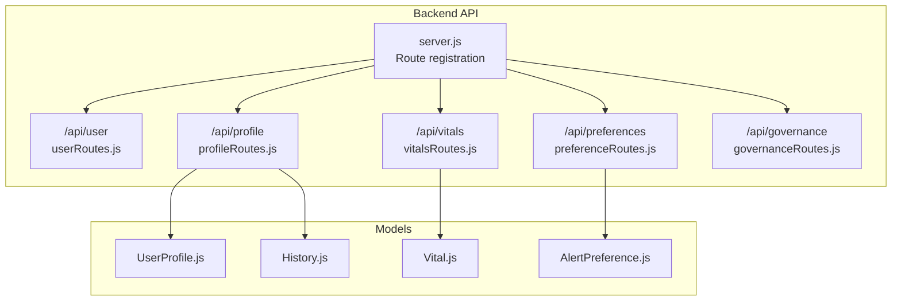
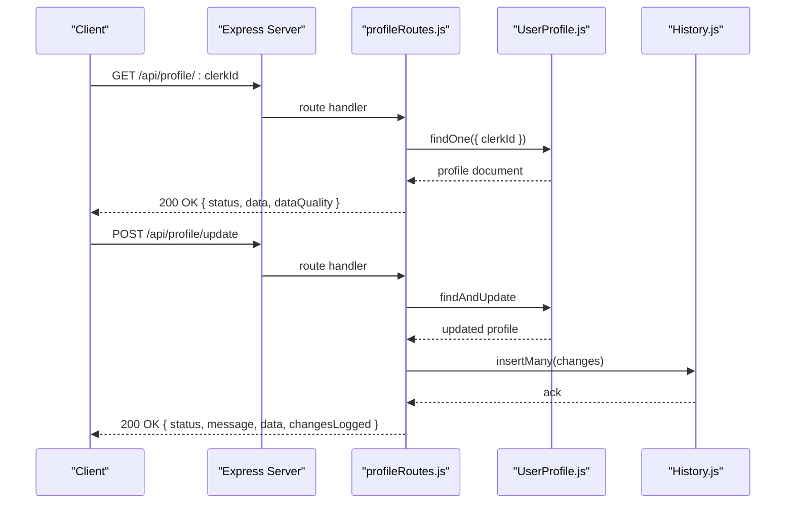
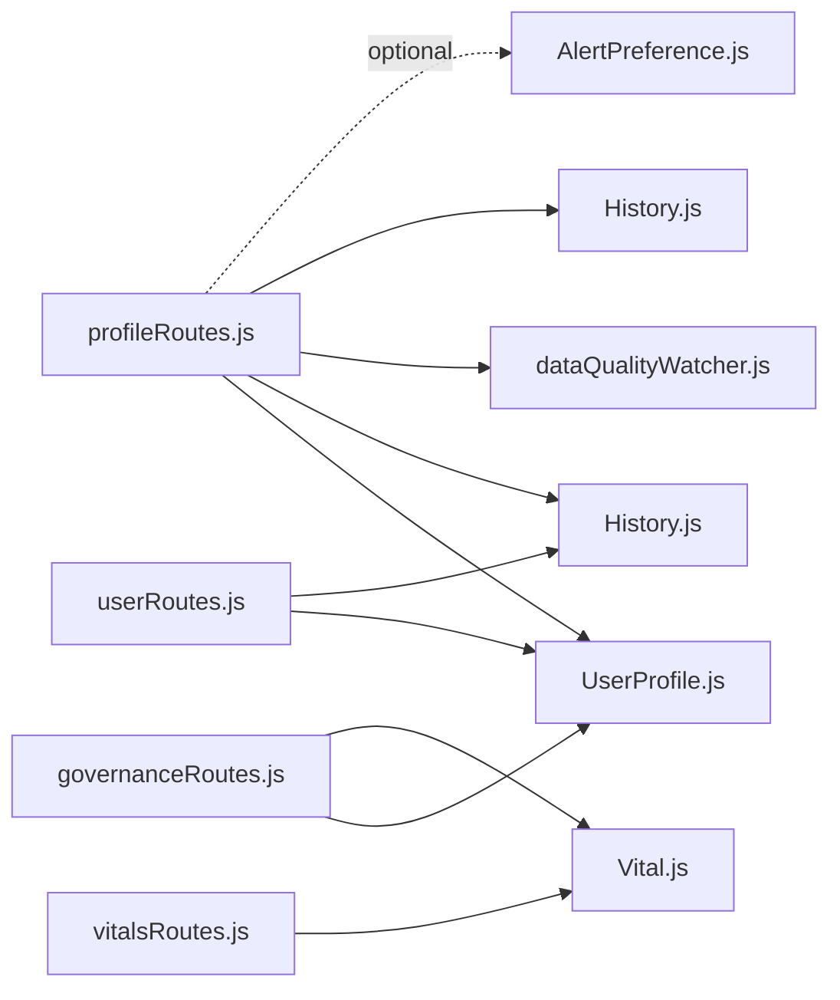

# User Management API

<cite>
**Referenced Files in This Document**
- [server.js](file://backend/server.js)
- [profileRoutes.js](file://backend/src/routes/profileRoutes.js)
- [userRoutes.js](file://backend/src/routes/userRoutes.js)
- [vitalsRoutes.js](file://backend/src/routes/vitalsRoutes.js)
- [preferenceRoutes.js](file://backend/src/routes/preferenceRoutes.js)
- [governanceRoutes.js](file://backend/src/routes/governanceRoutes.js)
- [UserProfile.js](file://backend/src/models/UserProfile.js)
- [Vital.js](file://backend/src/models/Vital.js)
- [AlertPreference.js](file://backend/src/models/AlertPreference.js)
- [History.js](file://backend/src/models/History.js)
- [dataQualityWatcher.js](file://backend/src/utils/dataQualityWatcher.js)
</cite>

## Table of Contents
1. [Introduction](#introduction)
2. [Project Structure](#project-structure)
3. [Core Components](#core-components)
4. [Architecture Overview](#architecture-overview)
5. [Detailed Component Analysis](#detailed-component-analysis)
6. [Dependency Analysis](#dependency-analysis)
7. [Performance Considerations](#performance-considerations)
8. [Troubleshooting Guide](#troubleshooting-guide)
9. [Conclusion](#conclusion)

## Introduction
This document provides comprehensive API documentation for user profile management within the VaidyaSetu backend. It covers:
- Retrieving and updating user health profiles
- Managing personal information and preferences
- Collecting health data via vitals endpoints
- Profile completion status tracking and onboarding progress
- Data privacy controls and consent management endpoints

The API follows REST conventions and operates under the base path /api with modular route groups for user, profile, vitals, preferences, and governance.

## Project Structure
The backend is organized around Express.js routes grouped by domain:
- User onboarding and account lifecycle
- Profile management (health metrics, settings, saved doctors, card metadata)
- Vitals logging and trend analytics
- Alert preferences and testing
- Data governance (export and purge)

**Diagram sources**
- [server.js:46-66](file://backend/server.js#L46-L66)
- [userRoutes.js:1-101](file://backend/src/routes/userRoutes.js#L1-L101)
- [profileRoutes.js:1-367](file://backend/src/routes/profileRoutes.js#L1-L367)
- [vitalsRoutes.js:1-241](file://backend/src/routes/vitalsRoutes.js#L1-L241)
- [preferenceRoutes.js:1-110](file://backend/src/routes/preferenceRoutes.js#L1-L110)
- [governanceRoutes.js:1-71](file://backend/src/routes/governanceRoutes.js#L1-L71)
- [UserProfile.js:1-175](file://backend/src/models/UserProfile.js#L1-L175)
- [Vital.js:1-55](file://backend/src/models/Vital.js#L1-L55)
- [AlertPreference.js:1-44](file://backend/src/models/AlertPreference.js#L1-L44)
- [History.js:1-44](file://backend/src/models/History.js#L1-L44)

**Section sources**
- [server.js:46-66](file://backend/server.js#L46-L66)

## Core Components
- User onboarding and initial profile creation
- Profile retrieval, updates, and history
- Vitals logging, latest readings, trends, and alerts
- Alert preferences management and testing
- Data quality scoring and profile completion tracking
- Data governance (export and purge)

**Section sources**
- [userRoutes.js:11-80](file://backend/src/routes/userRoutes.js#L11-L80)
- [profileRoutes.js:9-141](file://backend/src/routes/profileRoutes.js#L9-L141)
- [vitalsRoutes.js:90-146](file://backend/src/routes/vitalsRoutes.js#L90-L146)
- [preferenceRoutes.js:9-52](file://backend/src/routes/preferenceRoutes.js#L9-L52)
- [dataQualityWatcher.js:6-84](file://backend/src/utils/dataQualityWatcher.js#L6-L84)
- [governanceRoutes.js:13-68](file://backend/src/routes/governanceRoutes.js#L13-L68)

## Architecture Overview
The user management API is composed of:
- Route handlers that validate inputs, enforce business rules, and orchestrate persistence
- Mongoose models representing user profiles, vitals, alert preferences, and audit history
- Utility functions for data quality scoring
- Governance endpoints for data portability and deletion

**Diagram sources**
- [profileRoutes.js:9-27](file://backend/src/routes/profileRoutes.js#L9-L27)
- [profileRoutes.js:30-141](file://backend/src/routes/profileRoutes.js#L30-L141)
- [UserProfile.js:15-172](file://backend/src/models/UserProfile.js#L15-L172)
- [History.js:3-38](file://backend/src/models/History.js#L3-L38)

## Detailed Component Analysis

### User Onboarding and Initial Profile
- Purpose: Create or initialize a user profile during onboarding
- Endpoint: POST /api/user/profile
- Request body fields:
  - Required: clerkId
  - Optional: name, age, gender, height, weight, bmi, bmiCategory, activityLevel, sleepHours, stressLevel, isSmoker, alcoholConsumption, dietType, sugarIntake, saltIntake, eatsLeafyGreens, eatsFruits, junkFoodFrequency, allergies, medicalHistory, otherConditions
- Behavior:
  - Converts flat onboarding payload into nested field schema with updateType set to initial
  - Upserts profile and logs initial history entries
  - Recalculates data quality score and label
- Response: 201 on success with profile data and quality metrics

Validation rules applied:
- Required field: clerkId
- Nested field schema ensures each included metric has value, lastUpdated, and updateType

**Section sources**
- [userRoutes.js:11-80](file://backend/src/routes/userRoutes.js#L11-L80)
- [UserProfile.js:15-71](file://backend/src/models/UserProfile.js#L15-L71)
- [History.js:3-38](file://backend/src/models/History.js#L3-L38)
- [dataQualityWatcher.js:6-84](file://backend/src/utils/dataQualityWatcher.js#L6-L84)

### Profile Retrieval and Updates
- Retrieve profile: GET /api/profile/:clerkId
  - Returns profile document and computed data quality score/label
- Update profile: POST /api/profile/update
  - Validates presence of clerkId and updates payload
  - Compares old vs new values per field and logs changes to History
  - Special handling for weight/height to compute BMI and category
  - Supports intent and notes for change classification
  - Re-classification endpoint: PUT /api/profile/history/:id/reclassify (changeType enum validation)
- Platform settings: PATCH /api/profile/settings/:clerkId
  - Updates top-level settings object (language, theme, font size, contrast, animations, voice guidance, units, glucose units, reminders, filters)
- Saved doctors: 
  - POST /api/profile/saved-doctors (add)
  - DELETE /api/profile/saved-doctors/:clerkId/:placeId (remove)
  - PATCH /api/profile/saved-doctors/:clerkId/:placeId/notes (update notes)
- Card metadata persistence: PATCH /api/profile/card-meta/:clerkId
  - Deep merges updates into cardMeta map for UI persistence
- Export profile: GET /api/profile/export/:clerkId
  - Aggregates profile, history, reports, vitals, lab results, goals, alerts
- Account deletion: DELETE /api/profile/account/:clerkId
  - Cascades deletion across related collections

Validation and business rules:
- Weight/height → BMI recalculation with category assignment
- Change detection supports correction vs real_change intent
- Enum validation for changeType and settings fields
- Duplicate prevention for saved doctors by placeId/name

**Section sources**
- [profileRoutes.js:9-27](file://backend/src/routes/profileRoutes.js#L9-L27)
- [profileRoutes.js:30-141](file://backend/src/routes/profileRoutes.js#L30-L141)
- [profileRoutes.js:154-184](file://backend/src/routes/profileRoutes.js#L154-L184)
- [profileRoutes.js:187-213](file://backend/src/routes/profileRoutes.js#L187-L213)
- [profileRoutes.js:282-318](file://backend/src/routes/profileRoutes.js#L282-L318)
- [profileRoutes.js:321-339](file://backend/src/routes/profileRoutes.js#L321-L339)
- [profileRoutes.js:342-364](file://backend/src/routes/profileRoutes.js#L342-L364)
- [profileRoutes.js:224-252](file://backend/src/routes/profileRoutes.js#L224-L252)
- [profileRoutes.js:258-279](file://backend/src/routes/profileRoutes.js#L258-L279)
- [UserProfile.js:15-172](file://backend/src/models/UserProfile.js#L15-L172)
- [History.js:3-38](file://backend/src/models/History.js#L3-L38)

### Vitals Data Collection and Alerts
- Log vitals: POST /api/vitals
  - Required: clerkId, type, value
  - Supported types: blood_pressure, heart_rate, blood_glucose, weight, body_temperature, oxygen_saturation, sleep_duration, water_intake, steps
  - Optional: unit, timestamp, source (manual/device_sync), notes, mealContext (fasting/before_meal/after_meal/none)
  - Triggers automated monitoring and threshold-based alerts
- Latest vitals: GET /api/vitals/latest/:clerkId
  - Returns most recent reading for each vital type
- Vitals history: GET /api/vitals/:clerkId?type=...&limit=...
  - Paginates and filters by type
- Trends: GET /api/vitals/:clerkId/trends?type=&days=
  - Aggregates daily averages over N days
- Update/Delete vitals: PATCH /api/vitals/:id, DELETE /api/vitals/:id

Threshold-based alerts:
- Blood pressure: critical/high ranges trigger alerts
- Blood glucose: severe hyperglycemia and hypoglycemia thresholds
- Sleep duration: acute deprivation warning
- Steps: sedentary activity level warning

**Section sources**
- [vitalsRoutes.js:90-115](file://backend/src/routes/vitalsRoutes.js#L90-L115)
- [vitalsRoutes.js:121-146](file://backend/src/routes/vitalsRoutes.js#L121-L146)
- [vitalsRoutes.js:152-168](file://backend/src/routes/vitalsRoutes.js#L152-L168)
- [vitalsRoutes.js:174-210](file://backend/src/routes/vitalsRoutes.js#L174-L210)
- [vitalsRoutes.js:216-238](file://backend/src/routes/vitalsRoutes.js#L216-L238)
- [Vital.js:3-52](file://backend/src/models/Vital.js#L3-L52)
- [vitalsRoutes.js:11-84](file://backend/src/routes/vitalsRoutes.js#L11-L84)

### Alert Preferences and Testing
- Get preferences: GET /api/preferences/:clerkId
  - Returns alert preferences; creates default if not found
- Update preferences: PATCH /api/preferences/:clerkId
  - Accepts preferences array, quietHours, customThresholds
- Reset to defaults: POST /api/preferences/:clerkId/reset
  - Populates predefined defaults for alert types, quiet hours, and thresholds
- Test alert: POST /api/preferences/:clerkId/test
  - Generates a sample test alert for verification

**Section sources**
- [preferenceRoutes.js:9-25](file://backend/src/routes/preferenceRoutes.js#L9-L25)
- [preferenceRoutes.js:31-52](file://backend/src/routes/preferenceRoutes.js#L31-L52)
- [preferenceRoutes.js:58-85](file://backend/src/routes/preferenceRoutes.js#L58-L85)
- [preferenceRoutes.js:91-107](file://backend/src/routes/preferenceRoutes.js#L91-L107)
- [AlertPreference.js:3-41](file://backend/src/models/AlertPreference.js#L3-L41)

### Data Privacy Controls and Consent Management
- Export user health data: GET /api/governance/export/:clerkId
  - Returns consolidated dataset including user profile and health history
- Purge health records: DELETE /api/governance/purge/:clerkId
  - Removes vitals, lab results, medications, goals, alerts for the user

Note: Consent management endpoints are not present in the current codebase. Organizations should implement explicit consent flows and audit logs for data processing activities.

**Section sources**
- [governanceRoutes.js:13-44](file://backend/src/routes/governanceRoutes.js#L13-L44)
- [governanceRoutes.js:49-68](file://backend/src/routes/governanceRoutes.js#L49-L68)

### Profile Completion Status Tracking
- Data quality scoring:
  - Completeness: core fields coverage (age, gender, weight, height, activityLevel, sleepHours, stressLevel, isSmoker, alcoholConsumption, dietType, allergies, medicalHistory)
  - Freshness: based on the most recent update across core fields
  - Validity: bonus for verified sources and basic plausibility checks (height/weight ranges)
- Labels: Basic, Good, Excellent with contextual messages
- Endpoints:
  - Profile retrieval includes dataQuality score/label
  - Onboarding/updating triggers recalculation and persistence

**Section sources**
- [dataQualityWatcher.js:6-84](file://backend/src/utils/dataQualityWatcher.js#L6-L84)
- [profileRoutes.js:9-27](file://backend/src/routes/profileRoutes.js#L9-L27)
- [userRoutes.js:61-69](file://backend/src/routes/userRoutes.js#L61-L69)

## Dependency Analysis

**Diagram sources**
- [profileRoutes.js:1-367](file://backend/src/routes/profileRoutes.js#L1-L367)
- [userRoutes.js:1-101](file://backend/src/routes/userRoutes.js#L1-L101)
- [vitalsRoutes.js:1-241](file://backend/src/routes/vitalsRoutes.js#L1-L241)
- [governanceRoutes.js:1-71](file://backend/src/routes/governanceRoutes.js#L1-L71)
- [UserProfile.js:1-175](file://backend/src/models/UserProfile.js#L1-L175)
- [Vital.js:1-55](file://backend/src/models/Vital.js#L1-L55)
- [AlertPreference.js:1-44](file://backend/src/models/AlertPreference.js#L1-L44)
- [History.js:1-44](file://backend/src/models/History.js#L1-L44)
- [dataQualityWatcher.js:1-87](file://backend/src/utils/dataQualityWatcher.js#L1-L87)

**Section sources**
- [server.js:46-66](file://backend/server.js#L46-L66)

## Performance Considerations
- Batch operations: Profile export and governance export use Promise.all to minimize round-trips
- Indexing: History and Vital schemas include indexes on clerkId and timestamp for efficient queries
- Asynchronous alert generation: Threshold checks are fire-and-forget to avoid blocking write operations
- Recommendations:
  - Add pagination and filtering for large datasets (already present for vitals history)
  - Consider caching frequently accessed profile metadata
  - Monitor aggregation pipeline performance for trend calculations

[No sources needed since this section provides general guidance]

## Troubleshooting Guide
Common errors and resolutions:
- Missing required fields:
  - Profile update requires clerkId and updates payload
  - Vitals logging requires clerkId, type, and value
- Not found:
  - Profile, history record, or vital not found returns 404
- Validation failures:
  - changeType must be one of the allowed enum values
  - Vitals type must be one of supported enumerations
- Internal errors:
  - 500 responses indicate server-side exceptions; check logs for detailed messages

Operational tips:
- Use GET /api/health to verify service availability and database connectivity
- For alert testing, use the test endpoint to validate notification configuration

**Section sources**
- [profileRoutes.js:34-41](file://backend/src/routes/profileRoutes.js#L34-L41)
- [vitalsRoutes.js:94-96](file://backend/src/routes/vitalsRoutes.js#L94-L96)
- [profileRoutes.js:157-165](file://backend/src/routes/profileRoutes.js#L157-L165)
- [vitalsRoutes.js:218-220](file://backend/src/routes/vitalsRoutes.js#L218-L220)
- [server.js:69-75](file://backend/server.js#L69-L75)

## Conclusion
The VaidyaSetu user management API provides a robust foundation for profile lifecycle, health data capture, and privacy controls. It emphasizes structured field schemas, audit trails, and data quality scoring to support accurate risk assessment and reporting. Future enhancements could include explicit consent management endpoints and extended validation rules for health metrics.