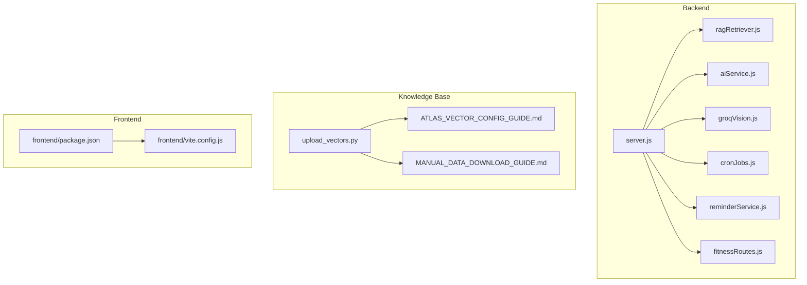
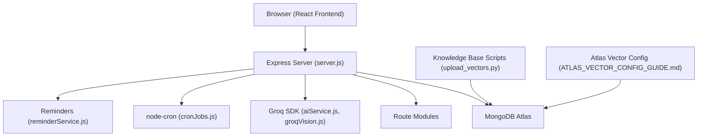
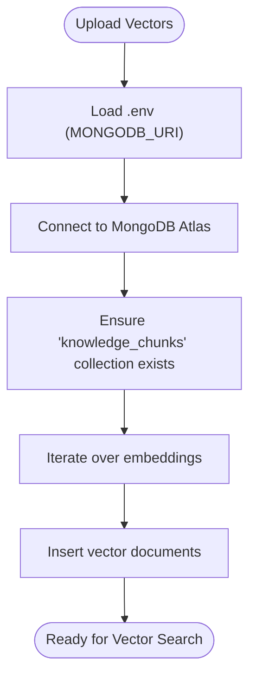
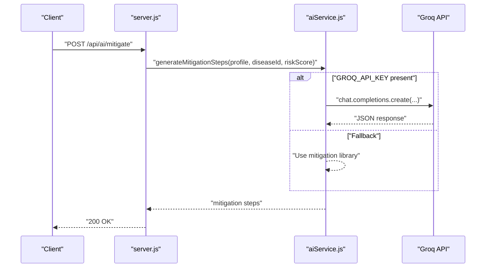
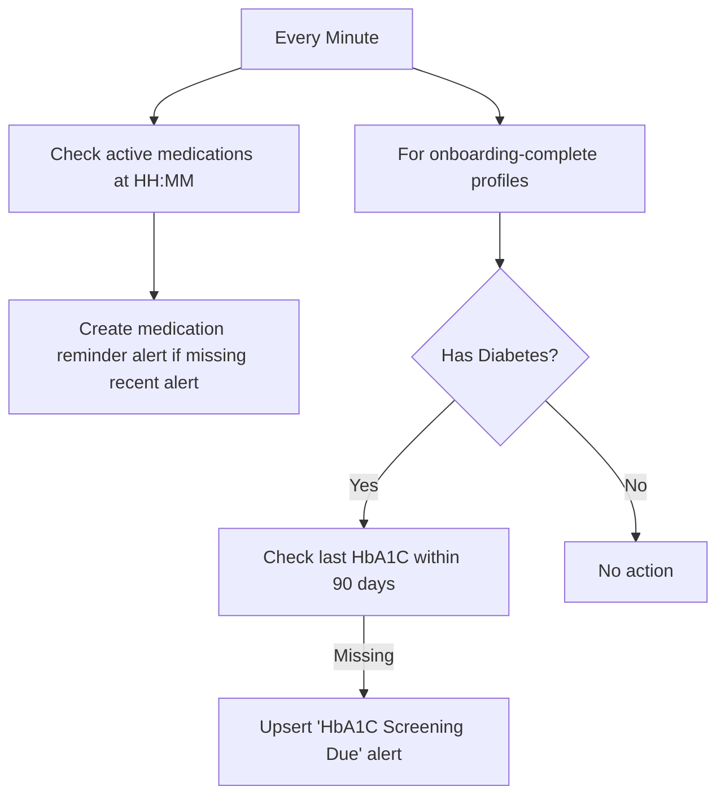
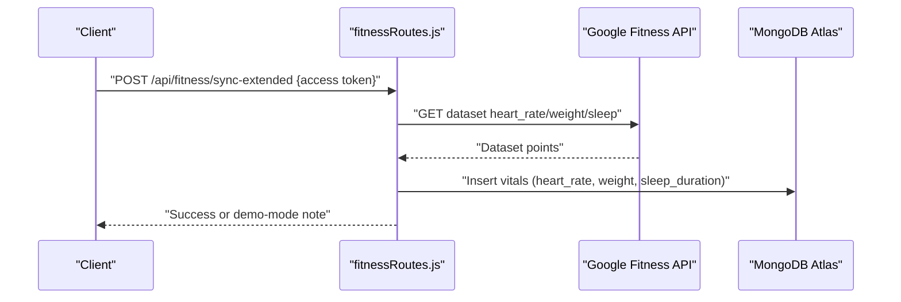
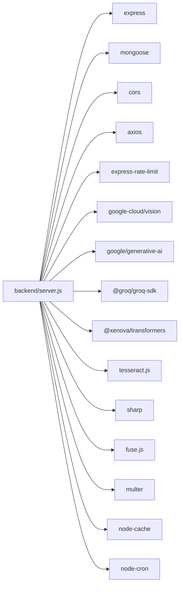

# Configuration and Deployment

<cite>
**Referenced Files in This Document**
- [backend/package.json](file://backend/package.json)
- [backend/server.js](file://backend/server.js)
- [backend/src/utils/ragRetriever.js](file://backend/src/utils/ragRetriever.js)
- [backend/src/services/aiService.js](file://backend/src/services/aiService.js)
- [backend/src/services/groqVision.js](file://backend/src/services/groqVision.js)
- [backend/src/scripts/cronJobs.js](file://backend/src/scripts/cronJobs.js)
- [backend/src/services/reminderService.js](file://backend/src/services/reminderService.js)
- [backend/src/routes/fitnessRoutes.js](file://backend/src/routes/fitnessRoutes.js)
- [backend/knowledge-base/ATLAS_VECTOR_CONFIG_GUIDE.md](file://backend/knowledge-base/ATLAS_VECTOR_CONFIG_GUIDE.md)
- [backend/knowledge-base/MANUAL_DATA_DOWNLOAD_GUIDE.md](file://backend/knowledge-base/MANUAL_DATA_DOWNLOAD_GUIDE.md)
- [backend/knowledge-base/scripts/upload_vectors.py](file://backend/knowledge-base/scripts/upload_vectors.py)
- [frontend/package.json](file://frontend/package.json)
- [frontend/vite.config.js](file://frontend/vite.config.js)
- [README.md](file://README.md)
</cite>

## Table of Contents
1. [Introduction](#introduction)
2. [Project Structure](#project-structure)
3. [Core Components](#core-components)
4. [Architecture Overview](#architecture-overview)
5. [Detailed Component Analysis](#detailed-component-analysis)
6. [Dependency Analysis](#dependency-analysis)
7. [Performance Considerations](#performance-considerations)
8. [Troubleshooting Guide](#troubleshooting-guide)
9. [Conclusion](#conclusion)
10. [Appendices](#appendices)

## Introduction
This document provides comprehensive configuration and deployment guidance for VaidyaSetu. It covers environment configuration (database connections, API keys, external service credentials, and application settings), development versus production differences, containerization and cloud deployment strategies, database setup and vector index configuration, external service integrations, infrastructure provisioning, CI/CD and automated testing, security and monitoring, troubleshooting, performance optimization, scaling, backups, disaster recovery, and maintenance.

## Project Structure
VaidyaSetu consists of:
- A Node.js/Express backend that serves APIs, orchestrates AI/ML services, and manages MongoDB Atlas connectivity.
- A React-based frontend built with Vite.
- A knowledge base with data ingestion and vector upload scripts for MongoDB Atlas Vector Search.
- Documentation for manual data downloads and Atlas vector index setup.

**Diagram sources**
- [backend/server.js:1-94](file://backend/server.js#L1-L94)
- [backend/src/utils/ragRetriever.js:1-218](file://backend/src/utils/ragRetriever.js#L1-L218)
- [backend/src/services/aiService.js:1-83](file://backend/src/services/aiService.js#L1-L83)
- [backend/src/services/groqVision.js:1-67](file://backend/src/services/groqVision.js#L1-L67)
- [backend/src/scripts/cronJobs.js:1-67](file://backend/src/scripts/cronJobs.js#L1-L67)
- [backend/src/services/reminderService.js:1-84](file://backend/src/services/reminderService.js#L1-L84)
- [backend/src/routes/fitnessRoutes.js:1-65](file://backend/src/routes/fitnessRoutes.js#L1-L65)
- [backend/knowledge-base/scripts/upload_vectors.py:1-44](file://backend/knowledge-base/scripts/upload_vectors.py#L1-L44)
- [backend/knowledge-base/ATLAS_VECTOR_CONFIG_GUIDE.md:1-46](file://backend/knowledge-base/ATLAS_VECTOR_CONFIG_GUIDE.md#L1-L46)
- [backend/knowledge-base/MANUAL_DATA_DOWNLOAD_GUIDE.md:1-70](file://backend/knowledge-base/MANUAL_DATA_DOWNLOAD_GUIDE.md#L1-L70)
- [frontend/package.json:1-46](file://frontend/package.json#L1-L46)
- [frontend/vite.config.js:1-12](file://frontend/vite.config.js#L1-L12)

**Section sources**
- [backend/server.js:1-94](file://backend/server.js#L1-L94)
- [frontend/package.json:1-46](file://frontend/package.json#L1-L46)
- [frontend/vite.config.js:1-12](file://frontend/vite.config.js#L1-L12)
- [backend/knowledge-base/ATLAS_VECTOR_CONFIG_GUIDE.md:1-46](file://backend/knowledge-base/ATLAS_VECTOR_CONFIG_GUIDE.md#L1-L46)
- [backend/knowledge-base/MANUAL_DATA_DOWNLOAD_GUIDE.md:1-70](file://backend/knowledge-base/MANUAL_DATA_DOWNLOAD_GUIDE.md#L1-L70)

## Core Components
- Environment configuration: The backend loads environment variables via dotenv and uses process.env for runtime configuration.
- Database: MongoDB Atlas connection string is required; the backend connects on startup and logs readiness.
- AI/LLM services: Groq SDK is used for LLM-based mitigation steps and vision fallback OCR.
- OCR: Vision services integrate with Groq Vision for extracting medicine names from prescriptions.
- Cron and reminders: Background tasks handle alert expiry cleanup, temporary file cleanup, and periodic reminders for medications and lab tests.
- Google Fit integration: Routes support syncing extended fitness metrics using Google OAuth access tokens.
- Frontend build: Vite-based React app with Tailwind CSS plugin.

Key configuration touchpoints:
- Backend dependencies and scripts: [backend/package.json](file://backend/package.json)
- Express server bootstrap and environment loading: [backend/server.js](file://backend/server.js)
- RAG retrieval and vector search: [backend/src/utils/ragRetriever.js](file://backend/src/utils/ragRetriever.js)
- AI mitigation generation: [backend/src/services/aiService.js](file://backend/src/services/aiService.js)
- Vision fallback OCR: [backend/src/services/groqVision.js](file://backend/src/services/groqVision.js)
- Cron jobs: [backend/src/scripts/cronJobs.js](file://backend/src/scripts/cronJobs.js)
- Reminder service: [backend/src/services/reminderService.js](file://backend/src/services/reminderService.js)
- Google Fit route: [backend/src/routes/fitnessRoutes.js](file://backend/src/routes/fitnessRoutes.js)
- Frontend build config: [frontend/vite.config.js](file://frontend/vite.config.js)

**Section sources**
- [backend/package.json:1-37](file://backend/package.json#L1-L37)
- [backend/server.js:1-94](file://backend/server.js#L1-L94)
- [backend/src/utils/ragRetriever.js:1-218](file://backend/src/utils/ragRetriever.js#L1-L218)
- [backend/src/services/aiService.js:1-83](file://backend/src/services/aiService.js#L1-L83)
- [backend/src/services/groqVision.js:1-67](file://backend/src/services/groqVision.js#L1-L67)
- [backend/src/scripts/cronJobs.js:1-67](file://backend/src/scripts/cronJobs.js#L1-L67)
- [backend/src/services/reminderService.js:1-84](file://backend/src/services/reminderService.js#L1-L84)
- [backend/src/routes/fitnessRoutes.js:1-65](file://backend/src/routes/fitnessRoutes.js#L1-L65)
- [frontend/vite.config.js:1-12](file://frontend/vite.config.js#L1-L12)

## Architecture Overview
The backend initializes Express, loads environment variables, connects to MongoDB Atlas, registers routes, and starts background services. The frontend builds with Vite and integrates with backend APIs. Vector search relies on MongoDB Atlas indexes and Python scripts to upload embeddings.

**Diagram sources**
- [backend/server.js:1-94](file://backend/server.js#L1-L94)
- [backend/src/services/aiService.js:1-83](file://backend/src/services/aiService.js#L1-L83)
- [backend/src/services/groqVision.js:1-67](file://backend/src/services/groqVision.js#L1-L67)
- [backend/src/scripts/cronJobs.js:1-67](file://backend/src/scripts/cronJobs.js#L1-L67)
- [backend/src/services/reminderService.js:1-84](file://backend/src/services/reminderService.js#L1-L84)
- [backend/knowledge-base/scripts/upload_vectors.py:1-44](file://backend/knowledge-base/scripts/upload_vectors.py#L1-L44)
- [backend/knowledge-base/ATLAS_VECTOR_CONFIG_GUIDE.md:1-46](file://backend/knowledge-base/ATLAS_VECTOR_CONFIG_GUIDE.md#L1-L46)

## Detailed Component Analysis

### Environment Configuration and Secrets Management
- The backend loads environment variables at startup using dotenv.
- Required environment variables observed in the codebase:
  - MONGODB_URI: MongoDB Atlas connection string.
  - GROQ_API_KEY: For Groq SDK-based AI and vision fallback.
  - PORT: Optional override for the HTTP port (default 5000).
- Additional secrets and credentials:
  - Google OAuth client ID and secret for Google Fit integration (see manual setup steps).
  - External API keys for RxNav/OpenFDA are used indirectly via route/service logic.

Recommended practice:
- Store secrets in a secrets manager or environment injection system in production.
- Keep .env files out of version control; use deployment-specific configuration overlays.

**Section sources**
- [backend/server.js:1-94](file://backend/server.js#L1-L94)
- [backend/src/services/aiService.js:1-83](file://backend/src/services/aiService.js#L1-L83)
- [backend/src/services/groqVision.js:1-67](file://backend/src/services/groqVision.js#L1-L67)
- [README.md:8-14](file://README.md#L8-L14)

### Database Setup and Vector Search
- MongoDB Atlas connection is established on startup.
- Vector search index configuration is documented and must be created in the Atlas dashboard.
- Knowledge base vector upload is performed via a Python script that reads .env for MONGODB_URI and inserts records into the knowledge_chunks collection.

**Diagram sources**
- [backend/knowledge-base/scripts/upload_vectors.py:1-44](file://backend/knowledge-base/scripts/upload_vectors.py#L1-L44)
- [backend/knowledge-base/ATLAS_VECTOR_CONFIG_GUIDE.md:1-46](file://backend/knowledge-base/ATLAS_VECTOR_CONFIG_GUIDE.md#L1-L46)

**Section sources**
- [backend/server.js:40-43](file://backend/server.js#L40-L43)
- [backend/knowledge-base/ATLAS_VECTOR_CONFIG_GUIDE.md:1-46](file://backend/knowledge-base/ATLAS_VECTOR_CONFIG_GUIDE.md#L1-L46)
- [backend/knowledge-base/scripts/upload_vectors.py:1-44](file://backend/knowledge-base/scripts/upload_vectors.py#L1-L44)

### AI and Vision Services
- LLM-based mitigation steps rely on Groq API key availability; falls back to a mitigation library when unavailable.
- Vision fallback uses Groq Vision to extract medicine names from images, requiring a valid API key.

**Diagram sources**
- [backend/src/services/aiService.js:10-78](file://backend/src/services/aiService.js#L10-L78)

**Section sources**
- [backend/src/services/aiService.js:1-83](file://backend/src/services/aiService.js#L1-L83)
- [backend/src/services/groqVision.js:1-67](file://backend/src/services/groqVision.js#L1-L67)

### Background Jobs and Reminders
- Cron jobs manage:
  - Daily health tips placeholder.
  - Alert expiry cleanup (dismissed alerts older than 30 days).
  - Temporary file cleanup under uploads.
- Reminder service periodically checks due medications and lab test due dates, creating alerts accordingly.

**Diagram sources**
- [backend/src/services/reminderService.js:11-81](file://backend/src/services/reminderService.js#L11-L81)

**Section sources**
- [backend/src/scripts/cronJobs.js:1-67](file://backend/src/scripts/cronJobs.js#L1-L67)
- [backend/src/services/reminderService.js:1-84](file://backend/src/services/reminderService.js#L1-L84)

### Google Fit Integration
- Extended fitness sync endpoint accepts an access token and writes heart rate, weight, and sleep duration to the vitals collection.
- Demo mode note indicates graceful degradation when external API calls fail.

**Diagram sources**
- [backend/src/routes/fitnessRoutes.js:23-63](file://backend/src/routes/fitnessRoutes.js#L23-L63)

**Section sources**
- [backend/src/routes/fitnessRoutes.js:1-65](file://backend/src/routes/fitnessRoutes.js#L1-L65)
- [README.md:8-14](file://README.md#L8-L14)

### Frontend Build and Development
- The frontend uses Vite with React and Tailwind CSS.
- Development and build commands are defined in package.json.

**Section sources**
- [frontend/package.json:1-46](file://frontend/package.json#L1-L46)
- [frontend/vite.config.js:1-12](file://frontend/vite.config.js#L1-L12)

## Dependency Analysis
Runtime dependencies include Express, Mongoose, CORS, rate limiting, OCR libraries, and Groq SDK. Development dependencies include Jest and Supertest for testing.

**Diagram sources**
- [backend/package.json:13-31](file://backend/package.json#L13-L31)

**Section sources**
- [backend/package.json:1-37](file://backend/package.json#L1-L37)

## Performance Considerations
- Vector search caching: The RAG retriever caches embeddings to reduce repeated computation.
- Index tuning: Ensure the Atlas vector index similarity metric and dimensionality match the embedding model.
- Background tasks: Tune cron intervals and cleanup thresholds to balance resource usage and data freshness.
- Rate limiting: Enable and configure rate limits at the gateway or middleware level to prevent abuse.
- CDN and static assets: Serve frontend bundles via a CDN for reduced latency.
- Database indexing: Create appropriate indexes for frequent query filters (e.g., clerkId, timestamps).

[No sources needed since this section provides general guidance]

## Troubleshooting Guide
Common deployment issues and resolutions:
- MongoDB connection failures:
  - Verify MONGODB_URI correctness and network access.
  - Confirm Atlas cluster is reachable and whitelisted.
- Vector search errors:
  - Ensure the knowledge_chunks collection exists and the vector index is Active in Atlas.
- Missing Groq API key:
  - Provide GROQ_API_KEY; otherwise, fallback logic applies.
- Google Fit integration:
  - Confirm OAuth client configuration and authorized origins/redirects.
  - Validate access token scopes and expiration.
- Health endpoint:
  - Use GET /api/health to confirm backend and DB readiness.

**Section sources**
- [backend/server.js:40-43](file://backend/server.js#L40-L43)
- [backend/knowledge-base/ATLAS_VECTOR_CONFIG_GUIDE.md:1-46](file://backend/knowledge-base/ATLAS_VECTOR_CONFIG_GUIDE.md#L1-L46)
- [backend/src/services/aiService.js:18-56](file://backend/src/services/aiService.js#L18-L56)
- [README.md:8-14](file://README.md#L8-L14)

## Conclusion
VaidyaSetu’s backend is modular, with clear separation of concerns for routing, AI/ML services, background jobs, and integrations. Proper environment configuration, Atlas vector index setup, and external service credentials are essential for reliable operation. The frontend is straightforward to build and deploy. Adopting CI/CD, monitoring, and security best practices will ensure a robust production deployment.

[No sources needed since this section summarizes without analyzing specific files]

## Appendices

### A. Environment Variables Reference
- MONGODB_URI: MongoDB Atlas connection string.
- GROQ_API_KEY: Groq API key for LLM and vision fallback.
- PORT: HTTP port override (default 5000).
- Google OAuth credentials: Client ID and Secret for Google Fit integration.

**Section sources**
- [backend/server.js:34](file://backend/server.js#L34)
- [backend/src/services/aiService.js:4](file://backend/src/services/aiService.js#L4)
- [backend/src/services/groqVision.js:3-5](file://backend/src/services/groqVision.js#L3-L5)
- [README.md:8-14](file://README.md#L8-L14)

### B. Database and Vector Search Setup Checklist
- Create the knowledge_chunks collection in the vaidyasetu database.
- Define the vector index named vector_index with cosine similarity and required filter fields.
- Upload vector embeddings using the provided Python script after populating .env.
- Verify Atlas index status is Active before running vector search queries.

**Section sources**
- [backend/knowledge-base/ATLAS_VECTOR_CONFIG_GUIDE.md:7-45](file://backend/knowledge-base/ATLAS_VECTOR_CONFIG_GUIDE.md#L7-L45)
- [backend/knowledge-base/scripts/upload_vectors.py:30-44](file://backend/knowledge-base/scripts/upload_vectors.py#L30-L44)

### C. External Service Integration Requirements
- Groq API key for LLM and vision fallback.
- Google Cloud project with Fitness API and Cloud Vision API enabled.
- OAuth 2.0 web application credentials configured with authorized origins and redirects.

**Section sources**
- [backend/src/services/aiService.js:4](file://backend/src/services/aiService.js#L4)
- [backend/src/services/groqVision.js:3-5](file://backend/src/services/groqVision.js#L3-L5)
- [README.md:8-14](file://README.md#L8-L14)

### D. CI/CD and Automated Testing
- Testing framework: Jest and Supertest are declared as dev dependencies.
- Recommended pipeline stages:
  - Install dependencies (backend/frontend).
  - Lint and test (unit/integration).
  - Build artifacts (frontend).
  - Deploy backend to containerized runtime.
  - Deploy frontend to CDN/static hosting.
- Secrets injection: Inject environment variables at runtime via deployment platform.

**Section sources**
- [backend/package.json:32-35](file://backend/package.json#L32-L35)
- [frontend/package.json:6-11](file://frontend/package.json#L6-L11)

### E. Security and Monitoring
- Transport security: Enforce HTTPS/TLS termination at the edge/load balancer.
- Secrets management: Use platform-managed secrets stores; avoid committing sensitive values.
- Network policies: Restrict inbound access to backend and allow outbound to Atlas and external APIs.
- Observability: Instrument backend with metrics and structured logs; monitor DB connection pool and vector search latencies.
- Rate limiting: Apply at gateway or middleware to protect upstream services.

[No sources needed since this section provides general guidance]

### F. Scaling and High Availability
- Horizontal scaling: Stateless backend behind a load balancer; scale pods based on CPU/memory.
- Stateful data: MongoDB Atlas cluster for high availability and automatic failover.
- Background workers: Offload heavy tasks to queues or scheduled jobs; monitor queue depth.
- CDN: Serve frontend assets via CDN for global performance.

[No sources needed since this section provides general guidance]

### G. Backup and Disaster Recovery
- Database: Use Atlas backup snapshots and point-in-time recovery; retain cross-region backups.
- Knowledge base: Version control data ingestion scripts and embeddings metadata; rebuild vectors if needed.
- Secrets: Maintain encrypted backups of configuration and rotate keys regularly.
- DR plan: Practice restoring from backups and validating vector index reactivation.

[No sources needed since this section provides general guidance]

### H. Maintenance Schedule
- Weekly: Review cron job logs and clean-up thresholds.
- Monthly: Audit vector index performance and re-index if necessary.
- Quarterly: Rotate API keys, review access scopes, and update dependencies.

[No sources needed since this section provides general guidance]