# Core Features

<cite>
**Referenced Files in This Document**
- [server.js](file://backend/server.js)
- [package.json](file://backend/package.json)
- [UserProfile.js](file://backend/src/models/UserProfile.js)
- [Medication.js](file://backend/src/models/Medication.js)
- [Vital.js](file://backend/src/models/Vital.js)
- [Alert.js](file://backend/src/models/Alert.js)
- [userRoutes.js](file://backend/src/routes/userRoutes.js)
- [medicationRoutes.js](file://backend/src/routes/medicationRoutes.js)
- [vitalsRoutes.js](file://backend/src/routes/vitalsRoutes.js)
- [aiRoutes.js](file://backend/src/routes/aiRoutes.js)
- [ragRoutes.js](file://backend/src/routes/ragRoutes.js)
- [aiService.js](file://backend/src/services/aiService.js)
- [alertService.js](file://backend/src/services/alertService.js)
- [riskScorer.js](file://backend/src/utils/riskScorer.js)
- [interactionEngine.js](file://backend/src/utils/interactionEngine.js)
- [ragRetriever.js](file://backend/src/utils/ragRetriever.js)
</cite>

## Table of Contents
1. [Introduction](#introduction)
2. [Project Structure](#project-structure)
3. [Core Components](#core-components)
4. [Architecture Overview](#architecture-overview)
5. [Detailed Component Analysis](#detailed-component-analysis)
6. [Dependency Analysis](#dependency-analysis)
7. [Performance Considerations](#performance-considerations)
8. [Troubleshooting Guide](#troubleshooting-guide)
9. [Conclusion](#conclusion)

## Introduction
This document describes VaidyaSetu’s core health management features and how they integrate to deliver a comprehensive platform. It covers the user management system, health risk assessment engine, drug interaction safety system, AI-powered recommendations, medication management, vitals monitoring, alert system, and AI chat assistant. For each feature, we explain the underlying algorithms, data models, user workflows, and integration patterns, along with implementation details, configuration options, and usage examples. We also analyze relationships between features, performance characteristics, scalability aspects, and extensibility points.

## Project Structure
The backend is an Express server that exposes REST endpoints grouped by domain capability. Data is persisted via Mongoose models. Core logic resides in services and utilities, while routes orchestrate requests and coordinate with models and utilities.

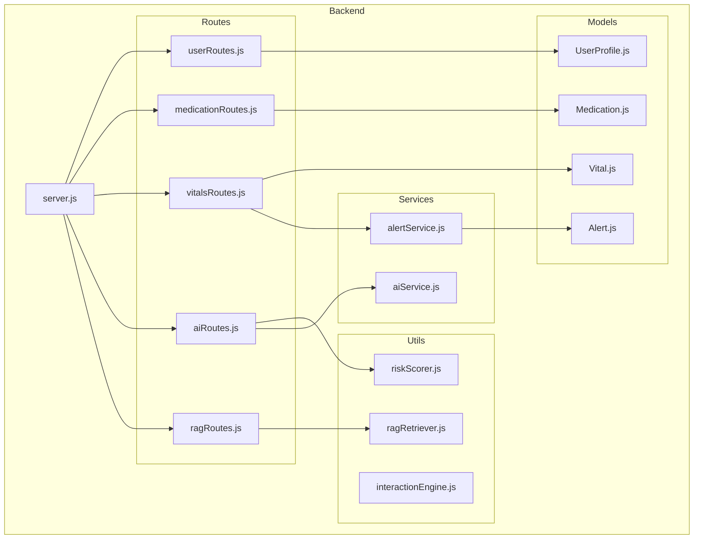

**Diagram sources**
- [server.js:1-94](file://backend/server.js#L1-L94)
- [userRoutes.js:1-101](file://backend/src/routes/userRoutes.js#L1-L101)
- [medicationRoutes.js:1-66](file://backend/src/routes/medicationRoutes.js#L1-L66)
- [vitalsRoutes.js:1-241](file://backend/src/routes/vitalsRoutes.js#L1-L241)
- [aiRoutes.js:1-299](file://backend/src/routes/aiRoutes.js#L1-L299)
- [ragRoutes.js:1-136](file://backend/src/routes/ragRoutes.js#L1-L136)
- [UserProfile.js:1-175](file://backend/src/models/UserProfile.js#L1-L175)
- [Medication.js:1-46](file://backend/src/models/Medication.js#L1-L46)
- [Vital.js:1-55](file://backend/src/models/Vital.js#L1-L55)
- [Alert.js:1-48](file://backend/src/models/Alert.js#L1-L48)
- [aiService.js:1-83](file://backend/src/services/aiService.js#L1-L83)
- [alertService.js:1-99](file://backend/src/services/alertService.js#L1-L99)
- [riskScorer.js:1-286](file://backend/src/utils/riskScorer.js#L1-L286)
- [interactionEngine.js:1-71](file://backend/src/utils/interactionEngine.js#L1-L71)
- [ragRetriever.js:1-218](file://backend/src/utils/ragRetriever.js#L1-L218)

**Section sources**
- [server.js:1-94](file://backend/server.js#L1-L94)
- [package.json:1-37](file://backend/package.json#L1-L37)

## Core Components
- User Management System: Stores biometric, lifestyle, diet, and medical data with structured fields and settings. Supports onboarding and account deletion.
- Health Risk Assessment Engine: Computes preliminary and detailed risk scores across multiple disease categories, integrates vitals and medications, and generates mitigations.
- Drug Interaction Safety System: Fuzzy medicine matching, vector search over knowledge chunks, live API retrieval, and LLM synthesis into a safety report.
- AI-Powered Recommendations: Generates personalized health reports and medicine insights using LLMs with user context.
- Medication Management: CRUD operations for medications, adherence tracking, and “mark taken” updates.
- Vitals Monitoring: Logs readings, computes thresholds, triggers alerts, and provides trend analytics.
- Alert System: Centralized alert creation and escalation for vitals and interactions.
- AI Chat Assistant: Routes for generating reports and medicine insights powered by Groq.

**Section sources**
- [UserProfile.js:1-175](file://backend/src/models/UserProfile.js#L1-L175)
- [riskScorer.js:1-286](file://backend/src/utils/riskScorer.js#L1-L286)
- [ragRetriever.js:1-218](file://backend/src/utils/ragRetriever.js#L1-L218)
- [aiRoutes.js:1-299](file://backend/src/routes/aiRoutes.js#L1-L299)
- [medicationRoutes.js:1-66](file://backend/src/routes/medicationRoutes.js#L1-L66)
- [vitalsRoutes.js:1-241](file://backend/src/routes/vitalsRoutes.js#L1-L241)
- [alertService.js:1-99](file://backend/src/services/alertService.js#L1-L99)
- [aiService.js:1-83](file://backend/src/services/aiService.js#L1-L83)

## Architecture Overview
The system follows a layered architecture:
- Entry points: Express routes
- Orchestration: Routes call models and utilities
- Data: Mongoose models backed by MongoDB
- Intelligence: Utilities implement risk scoring, interaction checks, and RAG retrieval
- AI: Groq SDK for LLM completions
- Background tasks: Reminder service and cron jobs initialized at startup

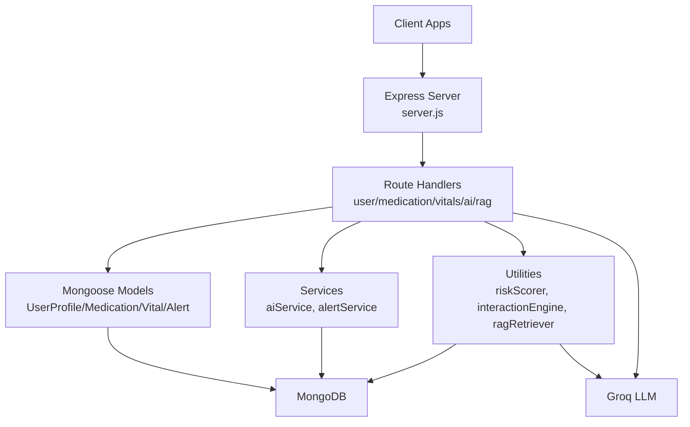

**Diagram sources**
- [server.js:1-94](file://backend/server.js#L1-L94)
- [aiRoutes.js:1-299](file://backend/src/routes/aiRoutes.js#L1-L299)
- [ragRoutes.js:1-136](file://backend/src/routes/ragRoutes.js#L1-L136)
- [riskScorer.js:1-286](file://backend/src/utils/riskScorer.js#L1-L286)
- [ragRetriever.js:1-218](file://backend/src/utils/ragRetriever.js#L1-L218)
- [UserProfile.js:1-175](file://backend/src/models/UserProfile.js#L1-L175)
- [Medication.js:1-46](file://backend/src/models/Medication.js#L1-L46)
- [Vital.js:1-55](file://backend/src/models/Vital.js#L1-L55)
- [Alert.js:1-48](file://backend/src/models/Alert.js#L1-L48)

## Detailed Component Analysis

### User Management System
- Purpose: Onboard users, persist biometric/lifestyle/diet/medical data, compute data quality, and support account deletion.
- Data model: UserProfile aggregates fields with metadata (lastUpdated, updateType, unit) and settings.
- Workflow:
  - POST /api/user/profile saves initial profile and logs history entries.
  - DELETE /api/user/:clerkId purges user data across related collections.
- Integration: Used by AI report generation and RAG safety checks to personalize outputs.

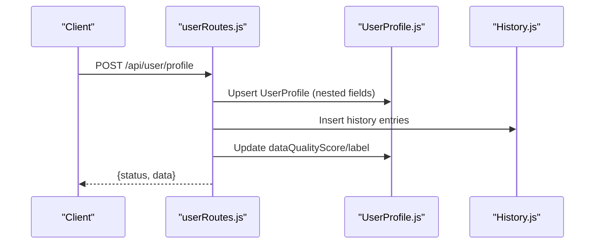

**Diagram sources**
- [userRoutes.js:11-80](file://backend/src/routes/userRoutes.js#L11-L80)
- [UserProfile.js:15-71](file://backend/src/models/UserProfile.js#L15-L71)

**Section sources**
- [userRoutes.js:1-101](file://backend/src/routes/userRoutes.js#L1-L101)
- [UserProfile.js:1-175](file://backend/src/models/UserProfile.js#L1-L175)

### Health Risk Assessment Engine
- Purpose: Compute preliminary and detailed risk scores across 20+ disease categories, select mitigations, and trigger consultation recommendations.
- Algorithms:
  - IDRS for diabetes.
  - Likelihood ratio model for thyroid.
  - Protective factor reductions and bounds enforcement.
  - Emergency symptom capture and missing data prompts.
- Data model: Uses UserProfile fields to build factor breakdowns and mitigations.
- Workflow:
  - AI route flattens profile for scorer.
  - Scorer returns risk scores, factor breakdown, protective factors, missing data, mitigations, completeness, and emergency alerts.

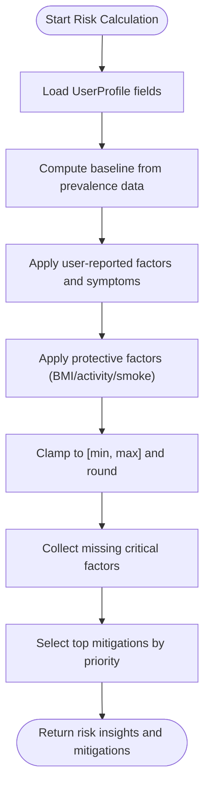

**Diagram sources**
- [riskScorer.js:51-262](file://backend/src/utils/riskScorer.js#L51-L262)

**Section sources**
- [riskScorer.js:1-286](file://backend/src/utils/riskScorer.js#L1-L286)
- [aiRoutes.js:14-83](file://backend/src/routes/aiRoutes.js#L14-L83)

### Drug Interaction Safety System
- Purpose: Detect interactions between allopathic and complementary medicines using fuzzy matching, vector search, live APIs, and LLM synthesis.
- Algorithms:
  - Fuzzy search over master medicine list.
  - Vector search over knowledge chunks with post-filtering.
  - RxNav/OpenFDA integration for direct clinical matches.
  - Prompt engineering and Groq LLM to produce a safety report.
- Workflow:
  - POST /api/rag/check-safety orchestrates retrieval, compiles prompt, calls Groq (with fallback), and optionally creates alerts.

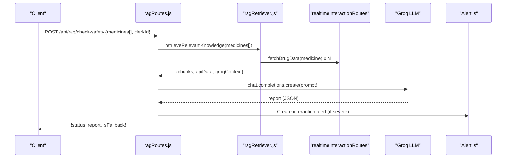

**Diagram sources**
- [ragRoutes.js:22-133](file://backend/src/routes/ragRoutes.js#L22-L133)
- [ragRetriever.js:156-215](file://backend/src/utils/ragRetriever.js#L156-L215)

**Section sources**
- [ragRoutes.js:1-136](file://backend/src/routes/ragRoutes.js#L1-L136)
- [ragRetriever.js:1-218](file://backend/src/utils/ragRetriever.js#L1-L218)
- [interactionEngine.js:1-71](file://backend/src/utils/interactionEngine.js#L1-L71)

### AI-Powered Recommendations
- Purpose: Generate personalized health reports and medicine insights using LLMs with user context.
- Features:
  - Report generation: Integrates vitals, medications, allergies, and risk scores.
  - Medicine insight: Provides mechanism, side effects, warnings, alternatives, and lifestyle tips.
- Workflow:
  - POST /api/ai/generate-report builds a comprehensive prompt and saves a Report model.
  - POST /api/ai/medicine-insight queries LLM with user context and returns structured insights.

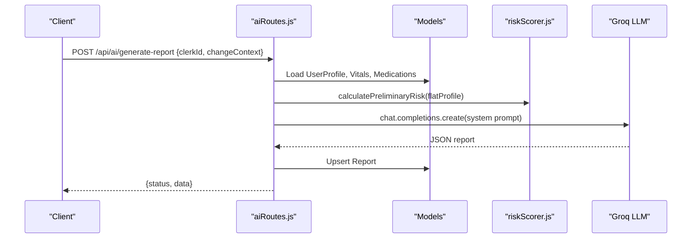

**Diagram sources**
- [aiRoutes.js:14-200](file://backend/src/routes/aiRoutes.js#L14-L200)
- [riskScorer.js:264-279](file://backend/src/utils/riskScorer.js#L264-L279)

**Section sources**
- [aiRoutes.js:1-299](file://backend/src/routes/aiRoutes.js#L1-L299)
- [aiService.js:1-83](file://backend/src/services/aiService.js#L1-L83)

### Medication Management
- Purpose: Track medications, timings, adherence, and lifecycle.
- Data model: Medication includes name, dosage, frequency, timings, dates, active flag, and adherence counters.
- Workflow:
  - GET /api/medications/:clerkId lists active medications.
  - POST /api/medications adds a new medication.
  - PATCH /api/medications/:id/take updates lastTaken and increments adherence.
  - DELETE /api/medications/:id deactivates a medication.

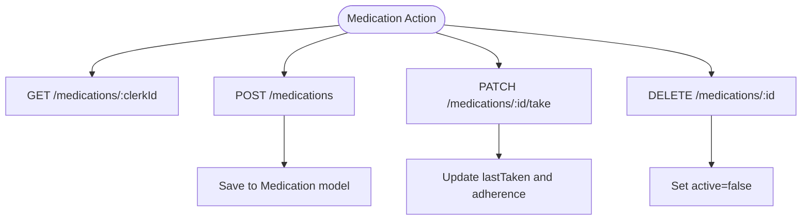

**Diagram sources**
- [medicationRoutes.js:9-63](file://backend/src/routes/medicationRoutes.js#L9-L63)
- [Medication.js:3-43](file://backend/src/models/Medication.js#L3-L43)

**Section sources**
- [medicationRoutes.js:1-66](file://backend/src/routes/medicationRoutes.js#L1-L66)
- [Medication.js:1-46](file://backend/src/models/Medication.js#L1-L46)

### Vitals Monitoring
- Purpose: Log, analyze, and alert on vital signs with built-in thresholds and trend analytics.
- Data model: Vital supports multiple types (e.g., blood pressure, glucose, heart rate) with units, timestamps, and optional meal context.
- Workflow:
  - POST /api/vitals logs a reading and triggers alertService and threshold checks.
  - GET /api/vitals/latest/:clerkId returns the most recent reading per type.
  - GET /api/vitals/:clerkId/:type/history retrieves historical readings.
  - GET /api/vitals/:clerkId/trends computes averages over a window.

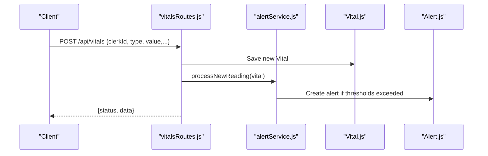

**Diagram sources**
- [vitalsRoutes.js:90-115](file://backend/src/routes/vitalsRoutes.js#L90-L115)
- [alertService.js:8-59](file://backend/src/services/alertService.js#L8-L59)

**Section sources**
- [vitalsRoutes.js:1-241](file://backend/src/routes/vitalsRoutes.js#L1-L241)
- [Vital.js:1-55](file://backend/src/models/Vital.js#L1-L55)
- [alertService.js:1-99](file://backend/src/services/alertService.js#L1-L99)

### Alert System
- Purpose: Centralized alert creation and escalation for vitals and interactions.
- Data model: Alert captures type, priority, title, description, status, and optional expiry/action.
- Workflow:
  - processNewReading(vital) evaluates custom thresholds and creates alerts.
  - triggerInteractionAlert(clerkId, findings) escalates severe interactions.
  - createAlert(alertData) persists alerts.

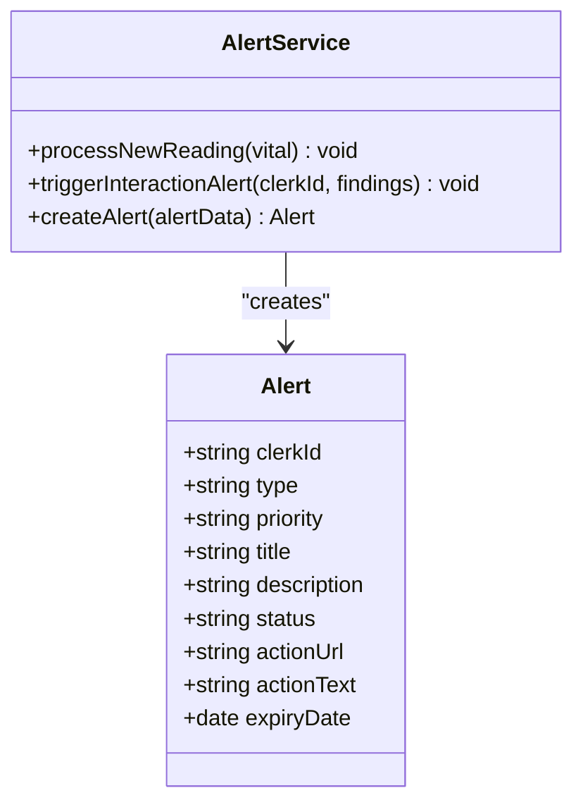

**Diagram sources**
- [Alert.js:3-45](file://backend/src/models/Alert.js#L3-L45)
- [alertService.js:4-96](file://backend/src/services/alertService.js#L4-L96)

**Section sources**
- [alertService.js:1-99](file://backend/src/services/alertService.js#L1-L99)
- [Alert.js:1-48](file://backend/src/models/Alert.js#L1-L48)

### AI Chat Assistant
- Purpose: Provide conversational health insights and report generation.
- Implementation:
  - aiRoutes.js exposes endpoints to generate reports and medicine insights using Groq.
  - aiService.js provides mitigation steps generation with LLM fallback.

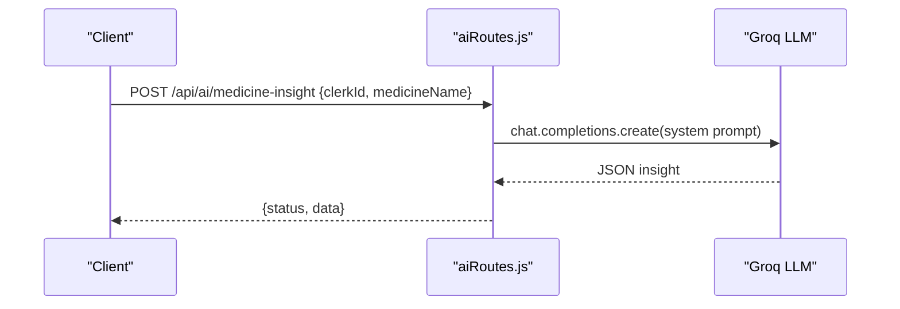

**Diagram sources**
- [aiRoutes.js:202-296](file://backend/src/routes/aiRoutes.js#L202-L296)
- [aiService.js:10-78](file://backend/src/services/aiService.js#L10-L78)

**Section sources**
- [aiRoutes.js:1-299](file://backend/src/routes/aiRoutes.js#L1-L299)
- [aiService.js:1-83](file://backend/src/services/aiService.js#L1-L83)

## Dependency Analysis
- Routing layer depends on models and utilities/services.
- AI and RAG features depend on Groq SDK and MongoDB.
- Alert system depends on Alert model and preferences.
- Risk scoring depends on prevalence data and mitigation library.

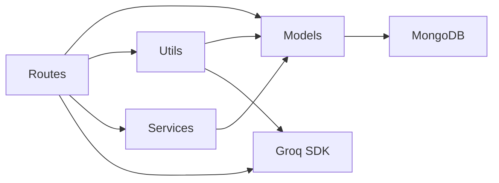

**Diagram sources**
- [server.js:46-66](file://backend/server.js#L46-L66)
- [aiRoutes.js:11](file://backend/src/routes/aiRoutes.js#L11)
- [ragRoutes.js:20](file://backend/src/routes/ragRoutes.js#L20)
- [UserProfile.js:1](file://backend/src/models/UserProfile.js#L1)
- [Medication.js:1](file://backend/src/models/Medication.js#L1)
- [Vital.js:1](file://backend/src/models/Vital.js#L1)
- [Alert.js:1](file://backend/src/models/Alert.js#L1)

**Section sources**
- [server.js:1-94](file://backend/server.js#L1-L94)
- [package.json:13-31](file://backend/package.json#L13-L31)

## Performance Considerations
- Vector search and embedding caching: ragRetriever caches embeddings and uses efficient aggregation pipelines to minimize latency.
- Parallel retrieval: RAG orchestrates live API calls and vector search concurrently.
- Rate limiting and fallback: RAG falls back to a smaller model when rate-limited; AI service uses a robust fallback library for mitigation steps.
- Indexing: Routes and models leverage indexes on clerkId and timestamps for faster queries.
- Background tasks: Reminder service and cron jobs are initialized at startup to offload periodic work.

[No sources needed since this section provides general guidance]

## Troubleshooting Guide
- Health endpoint: GET /api/health confirms service and DB connectivity.
- Rate limits: RAG routes handle 429 responses by falling back to a smaller model.
- Parsing errors: AI report generation includes robust JSON parsing with fallback extraction.
- Alert failures: AlertService wraps operations with try/catch and logs errors.

**Section sources**
- [server.js:68-75](file://backend/server.js#L68-L75)
- [ragRoutes.js:70-96](file://backend/src/routes/ragRoutes.js#L70-L96)
- [aiRoutes.js:150-165](file://backend/src/routes/aiRoutes.js#L150-L165)
- [alertService.js:56-94](file://backend/src/services/alertService.js#L56-L94)

## Conclusion
VaidyaSetu’s core features form a cohesive health management ecosystem:
- User profiles power risk scoring and personalization.
- Risk scoring integrates vitals and medications to guide mitigations.
- RAG-driven interaction safety synthesizes multiple knowledge sources and escalates critical findings.
- AI recommendations provide actionable insights and medicine guidance.
- Medication and vitals workflows enable adherence and trend monitoring.
- Alerts unify notifications across vitals and interactions.
This architecture is modular, extensible, and designed for scalability with background processing and resilient LLM fallbacks.