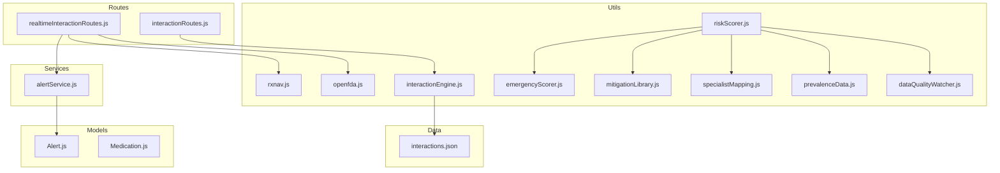
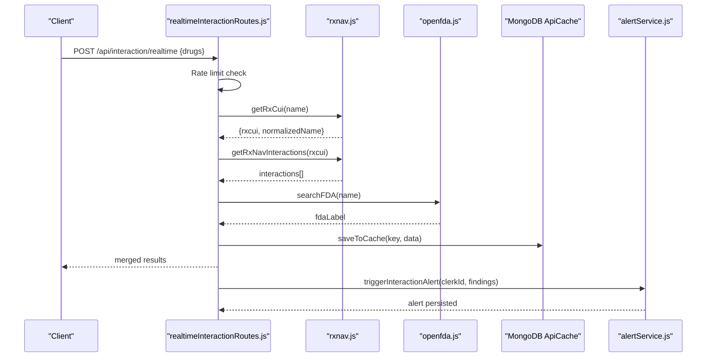
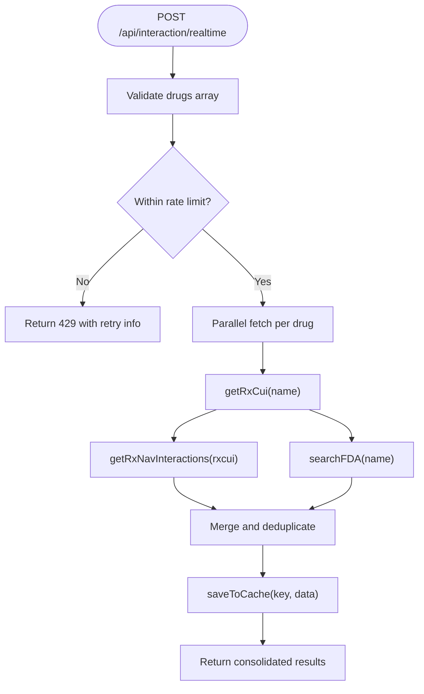
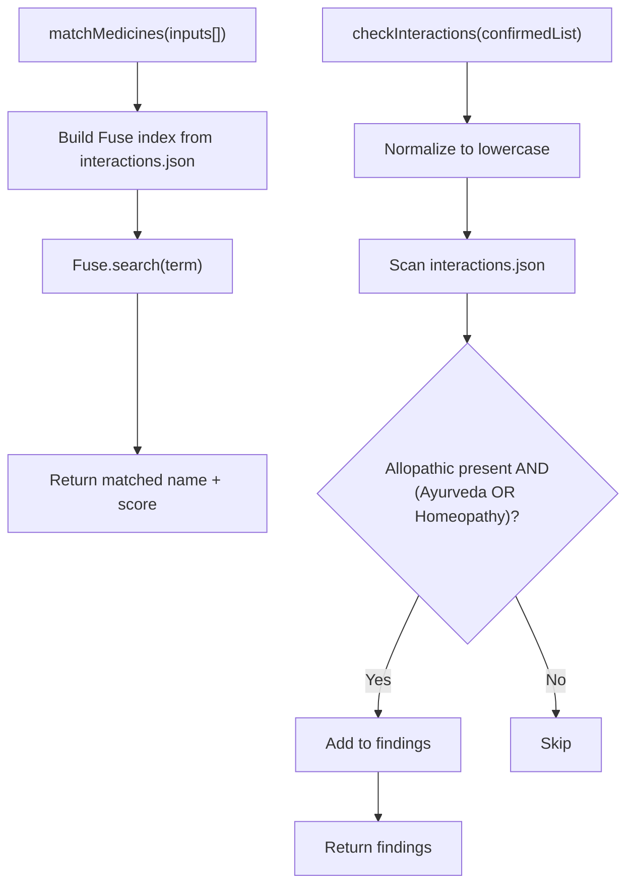
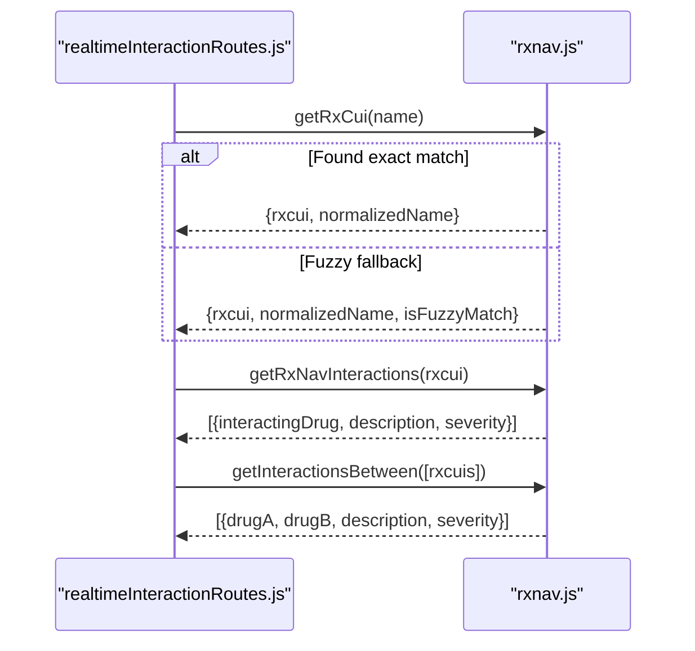
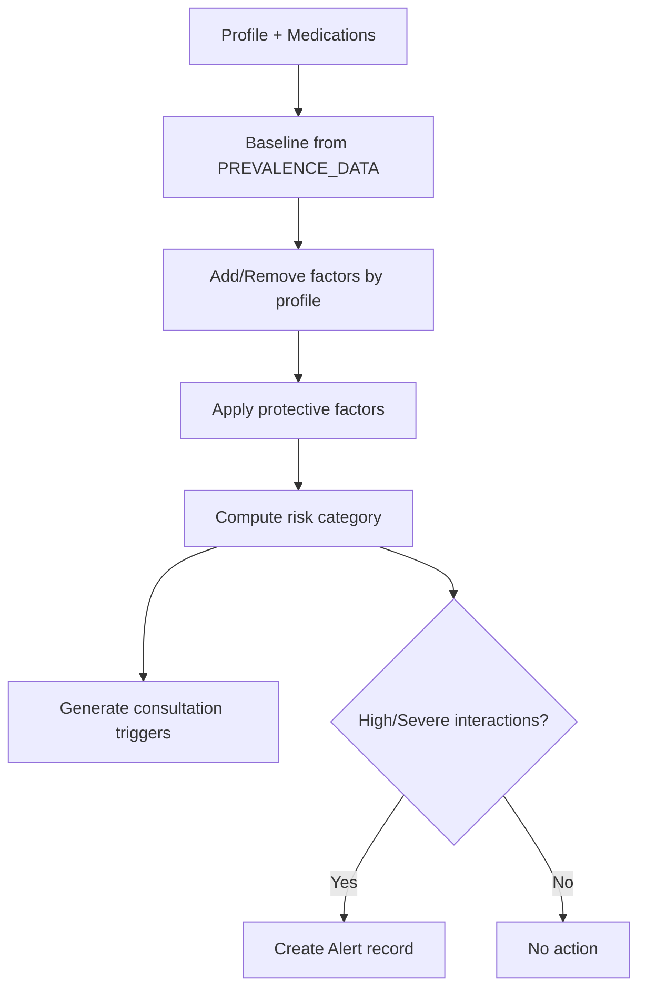
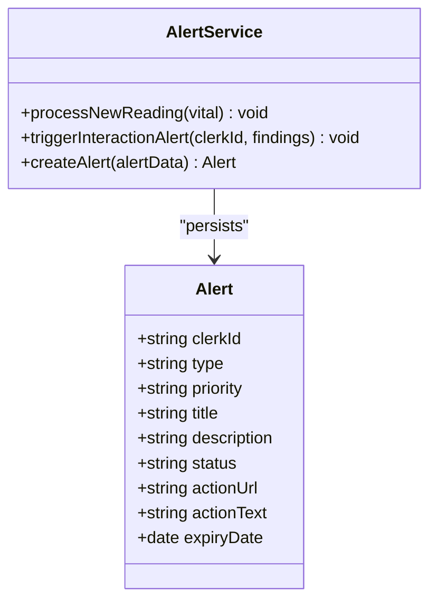
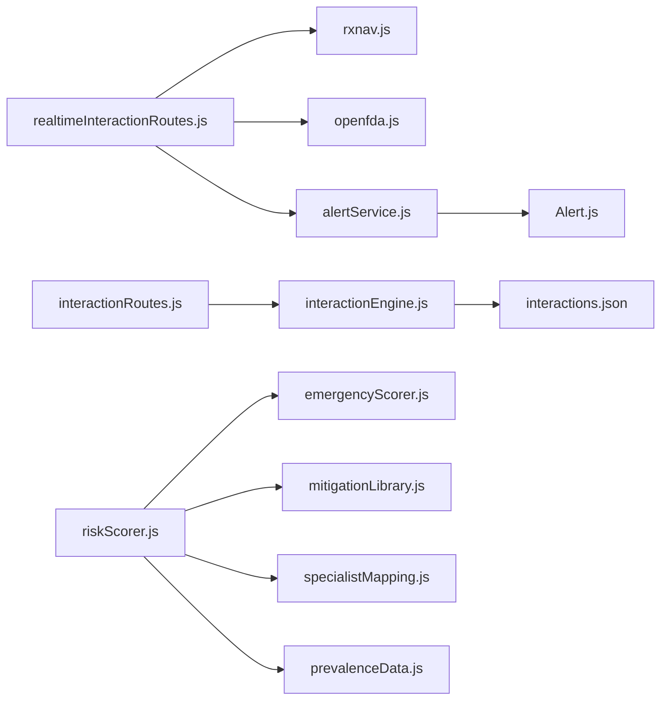

# Drug Interaction Safety System

<cite>
**Referenced Files in This Document**
- [interactions.json](file://backend/src/data/interactions.json)
- [interactionEngine.js](file://backend/src/utils/interactionEngine.js)
- [rxnav.js](file://backend/src/utils/rxnav.js)
- [openfda.js](file://backend/src/utils/openfda.js)
- [realtimeInteractionRoutes.js](file://backend/src/routes/realtimeInteractionRoutes.js)
- [interactionRoutes.js](file://backend/src/routes/interactionRoutes.js)
- [alertService.js](file://backend/src/services/alertService.js)
- [Alert.js](file://backend/src/models/Alert.js)
- [riskScorer.js](file://backend/src/utils/riskScorer.js)
- [emergencyScorer.js](file://backend/src/utils/emergencyScorer.js)
- [mitigationLibrary.js](file://backend/src/utils/mitigationLibrary.js)
- [specialistMapping.js](file://backend/src/utils/specialistMapping.js)
- [prevalenceData.js](file://backend/src/utils/prevalenceData.js)
- [dataQualityWatcher.js](file://backend/src/utils/dataQualityWatcher.js)
- [Medication.js](file://backend/src/models/Medication.js)
</cite>

## Table of Contents
1. [Introduction](#introduction)
2. [Project Structure](#project-structure)
3. [Core Components](#core-components)
4. [Architecture Overview](#architecture-overview)
5. [Detailed Component Analysis](#detailed-component-analysis)
6. [Dependency Analysis](#dependency-analysis)
7. [Performance Considerations](#performance-considerations)
8. [Troubleshooting Guide](#troubleshooting-guide)
9. [Conclusion](#conclusion)
10. [Appendices](#appendices)

## Introduction
This document describes VaidyaSetu’s drug interaction safety system with emphasis on:
- Interaction detection algorithms and RxNorm integration
- Real-time safety analysis using external APIs
- Interaction scoring, severity classification, and warning generation
- Integration with external drug databases (RxNav, OpenFDA)
- Interaction database maintenance and automated safety alerts
- Implementation examples for analyzing medications, determining safety thresholds, and generating clinical recommendations
- Consultation triggers, alternative suggestions, and healthcare provider notifications
- Data accuracy, update mechanisms, and EHR alignment

## Project Structure
The backend implements a modular safety pipeline:
- Routes orchestrate requests for real-time interaction checks and local interaction detection
- Utilities encapsulate RxNorm normalization, external API queries, fuzzy medicine matching, and scoring logic
- Services handle alerting and persistence
- Models define alert and medication schemas
- Data files maintain curated interaction knowledge

**Diagram sources**
- [realtimeInteractionRoutes.js:1-206](file://backend/src/routes/realtimeInteractionRoutes.js#L1-L206)
- [interactionRoutes.js:1-70](file://backend/src/routes/interactionRoutes.js#L1-L70)
- [rxnav.js:1-137](file://backend/src/utils/rxnav.js#L1-L137)
- [openfda.js](file://backend/src/utils/openfda.js)
- [interactionEngine.js:1-71](file://backend/src/utils/interactionEngine.js#L1-L71)
- [riskScorer.js:1-286](file://backend/src/utils/riskScorer.js#L1-L286)
- [emergencyScorer.js:1-92](file://backend/src/utils/emergencyScorer.js#L1-L92)
- [mitigationLibrary.js:1-235](file://backend/src/utils/mitigationLibrary.js#L1-L235)
- [specialistMapping.js:1-172](file://backend/src/utils/specialistMapping.js#L1-L172)
- [prevalenceData.js:1-88](file://backend/src/utils/prevalenceData.js#L1-L88)
- [dataQualityWatcher.js:1-87](file://backend/src/utils/dataQualityWatcher.js#L1-L87)
- [alertService.js:1-99](file://backend/src/services/alertService.js#L1-L99)
- [Alert.js:1-48](file://backend/src/models/Alert.js#L1-L48)
- [Medication.js:1-46](file://backend/src/models/Medication.js#L1-L46)
- [interactions.json:1-257](file://backend/src/data/interactions.json#L1-L257)

**Section sources**
- [realtimeInteractionRoutes.js:1-206](file://backend/src/routes/realtimeInteractionRoutes.js#L1-L206)
- [interactionRoutes.js:1-70](file://backend/src/routes/interactionRoutes.js#L1-L70)
- [rxnav.js:1-137](file://backend/src/utils/rxnav.js#L1-L137)
- [openfda.js](file://backend/src/utils/openfda.js)
- [interactionEngine.js:1-71](file://backend/src/utils/interactionEngine.js#L1-L71)
- [riskScorer.js:1-286](file://backend/src/utils/riskScorer.js#L1-L286)
- [emergencyScorer.js:1-92](file://backend/src/utils/emergencyScorer.js#L1-L92)
- [mitigationLibrary.js:1-235](file://backend/src/utils/mitigationLibrary.js#L1-L235)
- [specialistMapping.js:1-172](file://backend/src/utils/specialistMapping.js#L1-L172)
- [prevalenceData.js:1-88](file://backend/src/utils/prevalenceData.js#L1-L88)
- [dataQualityWatcher.js:1-87](file://backend/src/utils/dataQualityWatcher.js#L1-L87)
- [alertService.js:1-99](file://backend/src/services/alertService.js#L1-L99)
- [Alert.js:1-48](file://backend/src/models/Alert.js#L1-L48)
- [Medication.js:1-46](file://backend/src/models/Medication.js#L1-L46)
- [interactions.json:1-257](file://backend/src/data/interactions.json#L1-L257)

## Core Components
- Real-time interaction API: Orchestrates RxNorm normalization and OpenFDA label search, merges results, caches outcomes, and enforces rate limits.
- Local interaction engine: Fuzzy medicine name matching and cross-checking between allopathic, Ayurvedic, and homeopathic entries.
- RxNorm integration: Name normalization to RxCUI and interaction queries between multiple RxCUIs.
- Scoring and risk engine: Evidence-based scoring with severity categorization, protective factors, missing data prompts, and consultation triggers.
- Alert service: Generates and persists safety alerts for high-severity interactions and abnormal vitals.
- Knowledge base: Curated interaction dataset with severity, mechanism, and recommendations.

**Section sources**
- [realtimeInteractionRoutes.js:1-206](file://backend/src/routes/realtimeInteractionRoutes.js#L1-L206)
- [interactionEngine.js:1-71](file://backend/src/utils/interactionEngine.js#L1-L71)
- [rxnav.js:1-137](file://backend/src/utils/rxnav.js#L1-L137)
- [riskScorer.js:1-286](file://backend/src/utils/riskScorer.js#L1-L286)
- [alertService.js:1-99](file://backend/src/services/alertService.js#L1-L99)
- [interactions.json:1-257](file://backend/src/data/interactions.json#L1-L257)

## Architecture Overview
The system integrates three pillars:
- RxNorm normalization and interaction lookup for high precision
- OpenFDA label search for additional safety signals
- Local interaction database for cross-complementary modalities (allopathic + Ayurvedic/Homeopathic)

**Diagram sources**
- [realtimeInteractionRoutes.js:1-206](file://backend/src/routes/realtimeInteractionRoutes.js#L1-L206)
- [rxnav.js:1-137](file://backend/src/utils/rxnav.js#L1-L137)
- [openfda.js](file://backend/src/utils/openfda.js)
- [alertService.js:1-99](file://backend/src/services/alertService.js#L1-L99)

## Detailed Component Analysis

### Real-Time Interaction API
- Purpose: Normalize drug names to RxNorm, query RxNav for interactions, search OpenFDA labels, merge and deduplicate results, cache responses, and enforce rate limits.
- Key behaviors:
  - Name normalization via RxNorm RxCUI resolution
  - Multi-source merging with de-duplication
  - Caching with TTL semantics via MongoDB
  - Resilient orchestration using Promise settlement tracking
  - Rate limiting to stay within OpenFDA quotas

**Diagram sources**
- [realtimeInteractionRoutes.js:1-206](file://backend/src/routes/realtimeInteractionRoutes.js#L1-L206)
- [rxnav.js:1-137](file://backend/src/utils/rxnav.js#L1-L137)
- [openfda.js](file://backend/src/utils/openfda.js)

**Section sources**
- [realtimeInteractionRoutes.js:1-206](file://backend/src/routes/realtimeInteractionRoutes.js#L1-L206)

### Local Interaction Engine
- Purpose: Match user-entered names to a curated master list and detect interactions between confirmed medicines across modalities.
- Key behaviors:
  - Build a fuzzy search index from the interaction dataset
  - Fuzzy matching with configurable threshold
  - Interaction detection across allopathic, Ayurvedic, and homeopathic entries
  - Case-insensitive intersection logic

**Diagram sources**
- [interactionEngine.js:1-71](file://backend/src/utils/interactionEngine.js#L1-L71)
- [interactions.json:1-257](file://backend/src/data/interactions.json#L1-L257)

**Section sources**
- [interactionEngine.js:1-71](file://backend/src/utils/interactionEngine.js#L1-L71)
- [interactions.json:1-257](file://backend/src/data/interactions.json#L1-L257)

### RxNorm Integration
- Purpose: Normalize drug names to RxNorm identifiers and query interactions between multiple RxCUIs.
- Key behaviors:
  - getRxCui: primary match, fallback to approximateTerm prioritizing ingredient-level matches
  - getRxNavInteractions: retrieve known interactions for a single RxCUI
  - getInteractionsBetween: retrieve pairwise interactions for multiple RxCUIs

**Diagram sources**
- [rxnav.js:1-137](file://backend/src/utils/rxnav.js#L1-L137)
- [realtimeInteractionRoutes.js:1-206](file://backend/src/routes/realtimeInteractionRoutes.js#L1-L206)

**Section sources**
- [rxnav.js:1-137](file://backend/src/utils/rxnav.js#L1-L137)

### Interaction Scoring, Severity Classification, and Warning Generation
- Scoring system:
  - Risk categories: Very Low, Low, Moderate, High, Very High
  - Evidence-based factors, protective factors, and missing data prompts
  - Specialty mapping and consultation triggers
- Severity classification:
  - RxNav provides severity levels; local dataset includes severity and recommendations
- Warning generation:
  - Critical and high interactions trigger alerts with action links

**Diagram sources**
- [riskScorer.js:1-286](file://backend/src/utils/riskScorer.js#L1-L286)
- [emergencyScorer.js:1-92](file://backend/src/utils/emergencyScorer.js#L1-L92)
- [mitigationLibrary.js:1-235](file://backend/src/utils/mitigationLibrary.js#L1-L235)
- [specialistMapping.js:1-172](file://backend/src/utils/specialistMapping.js#L1-L172)
- [prevalenceData.js:1-88](file://backend/src/utils/prevalenceData.js#L1-L88)
- [alertService.js:1-99](file://backend/src/services/alertService.js#L1-L99)

**Section sources**
- [riskScorer.js:1-286](file://backend/src/utils/riskScorer.js#L1-L286)
- [emergencyScorer.js:1-92](file://backend/src/utils/emergencyScorer.js#L1-L92)
- [mitigationLibrary.js:1-235](file://backend/src/utils/mitigationLibrary.js#L1-L235)
- [specialistMapping.js:1-172](file://backend/src/utils/specialistMapping.js#L1-L172)
- [prevalenceData.js:1-88](file://backend/src/utils/prevalenceData.js#L1-L88)
- [alertService.js:1-99](file://backend/src/services/alertService.js#L1-L99)

### Automated Safety Alerts and Healthcare Provider Notifications
- Alert model captures type, priority, title, description, status, and optional actions.
- Alert service:
  - Processes vital readings and creates alerts exceeding custom thresholds
  - Triggers interaction alerts for critical and high severity findings
- Integration points:
  - Clerk ID ties alerts to user profiles
  - Action URLs route users to relevant dashboards

**Diagram sources**
- [Alert.js:1-48](file://backend/src/models/Alert.js#L1-L48)
- [alertService.js:1-99](file://backend/src/services/alertService.js#L1-L99)

**Section sources**
- [Alert.js:1-48](file://backend/src/models/Alert.js#L1-L48)
- [alertService.js:1-99](file://backend/src/services/alertService.js#L1-L99)

### Implementation Examples
- Analyzing medications for potential interactions:
  - Use the local engine to normalize and detect cross-modal interactions
  - Use the real-time API to enrich with RxNorm and OpenFDA signals
- Determining safety thresholds:
  - Use RxNav severity labels and local dataset severity to classify risks
  - Apply consultation triggers based on risk categories and missing data
- Generating clinical recommendations:
  - Mitigation library provides regionally calibrated dietary and lifestyle steps
  - Specialist mapping suggests appropriate specialties for follow-up

**Section sources**
- [interactionEngine.js:1-71](file://backend/src/utils/interactionEngine.js#L1-L71)
- [realtimeInteractionRoutes.js:1-206](file://backend/src/routes/realtimeInteractionRoutes.js#L1-L206)
- [rxnav.js:1-137](file://backend/src/utils/rxnav.js#L1-L137)
- [mitigationLibrary.js:1-235](file://backend/src/utils/mitigationLibrary.js#L1-L235)
- [specialistMapping.js:1-172](file://backend/src/utils/specialistMapping.js#L1-L172)

## Dependency Analysis
- External dependencies:
  - RxNav REST API for normalization and interaction lookup
  - OpenFDA API for label-based safety signals
  - Fuse.js for fuzzy medicine name matching
- Internal dependencies:
  - Routes depend on utils for normalization and API orchestration
  - Alert service depends on Alert model
  - Risk scoring depends on prevalence, mitigation, specialist, and emergency modules

**Diagram sources**
- [realtimeInteractionRoutes.js:1-206](file://backend/src/routes/realtimeInteractionRoutes.js#L1-L206)
- [interactionRoutes.js:1-70](file://backend/src/routes/interactionRoutes.js#L1-L70)
- [rxnav.js:1-137](file://backend/src/utils/rxnav.js#L1-L137)
- [openfda.js](file://backend/src/utils/openfda.js)
- [interactionEngine.js:1-71](file://backend/src/utils/interactionEngine.js#L1-L71)
- [interactions.json:1-257](file://backend/src/data/interactions.json#L1-L257)
- [riskScorer.js:1-286](file://backend/src/utils/riskScorer.js#L1-L286)
- [emergencyScorer.js:1-92](file://backend/src/utils/emergencyScorer.js#L1-L92)
- [mitigationLibrary.js:1-235](file://backend/src/utils/mitigationLibrary.js#L1-L235)
- [specialistMapping.js:1-172](file://backend/src/utils/specialistMapping.js#L1-L172)
- [prevalenceData.js:1-88](file://backend/src/utils/prevalenceData.js#L1-L88)
- [alertService.js:1-99](file://backend/src/services/alertService.js#L1-L99)
- [Alert.js:1-48](file://backend/src/models/Alert.js#L1-L48)

**Section sources**
- [realtimeInteractionRoutes.js:1-206](file://backend/src/routes/realtimeInteractionRoutes.js#L1-L206)
- [interactionRoutes.js:1-70](file://backend/src/routes/interactionRoutes.js#L1-L70)
- [rxnav.js:1-137](file://backend/src/utils/rxnav.js#L1-L137)
- [openfda.js](file://backend/src/utils/openfda.js)
- [interactionEngine.js:1-71](file://backend/src/utils/interactionEngine.js#L1-L71)
- [interactions.json:1-257](file://backend/src/data/interactions.json#L1-L257)
- [riskScorer.js:1-286](file://backend/src/utils/riskScorer.js#L1-L286)
- [emergencyScorer.js:1-92](file://backend/src/utils/emergencyScorer.js#L1-L92)
- [mitigationLibrary.js:1-235](file://backend/src/utils/mitigationLibrary.js#L1-L235)
- [specialistMapping.js:1-172](file://backend/src/utils/specialistMapping.js#L1-L172)
- [prevalenceData.js:1-88](file://backend/src/utils/prevalenceData.js#L1-L88)
- [alertService.js:1-99](file://backend/src/services/alertService.js#L1-L99)
- [Alert.js:1-48](file://backend/src/models/Alert.js#L1-L48)

## Performance Considerations
- Caching: Responses are cached in MongoDB to reduce repeated external API calls and improve latency.
- Rate limiting: Built-in limiter prevents exceeding OpenFDA quotas and ensures graceful degradation.
- Resilience: Parallel processing with settlement tracking avoids single-point failures.
- Indexing: Fuse.js fuzzy index accelerates name matching against a large master list.

[No sources needed since this section provides general guidance]

## Troubleshooting Guide
- RxNav failures:
  - Environment variable can simulate failures for testing; monitor logs for transient errors and retry strategies.
- Cache issues:
  - Verify cache reads/writes and inspect cache statistics endpoint.
- Missing or mismatched names:
  - Use fuzzy matching results and confirm normalization; leverage approximateTerm fallback.
- Alert delivery:
  - Confirm alert preferences and statuses; verify action URLs and priorities.

**Section sources**
- [rxnav.js:98-101](file://backend/src/utils/rxnav.js#L98-L101)
- [realtimeInteractionRoutes.js:45-68](file://backend/src/routes/realtimeInteractionRoutes.js#L45-L68)
- [realtimeInteractionRoutes.js:184-201](file://backend/src/routes/realtimeInteractionRoutes.js#L184-L201)

## Conclusion
VaidyaSetu’s drug interaction safety system combines RxNorm normalization, OpenFDA enrichment, and a curated interaction database to deliver robust, real-time safety analysis. It integrates scoring, severity classification, and automated alerts, while offering clinical recommendations and specialty guidance tailored to the Indian context. The system emphasizes data quality, caching, and resilient orchestration to ensure reliable operation at scale.

[No sources needed since this section summarizes without analyzing specific files]

## Appendices

### Interaction Dataset Schema and Maintenance
- Dataset includes:
  - Allopathic drug and aliases
  - Ayurvedic herbs and homeopathic remedies
  - Severity, mechanism, effect, and recommendation
- Maintenance:
  - Regular updates from authoritative sources
  - Versioned entries with source attribution

**Section sources**
- [interactions.json:1-257](file://backend/src/data/interactions.json#L1-L257)

### Data Accuracy and Update Mechanisms
- Data quality scoring considers completeness, freshness, and validity to inform risk assessment reliability.
- Update mechanisms:
  - Connectable health data sources (e.g., Google Fit) to refresh profile fields
  - Periodic re-scores when profile data is updated

**Section sources**
- [dataQualityWatcher.js:1-87](file://backend/src/utils/dataQualityWatcher.js#L1-L87)

### EHR Alignment Notes
- Clerk ID linkage enables user-centric safety records
- Alert persistence supports longitudinal safety monitoring
- Medication schema supports structured medication histories for EHR interoperability

**Section sources**
- [alertService.js:1-99](file://backend/src/services/alertService.js#L1-L99)
- [Alert.js:1-48](file://backend/src/models/Alert.js#L1-L48)
- [Medication.js:1-46](file://backend/src/models/Medication.js#L1-L46)