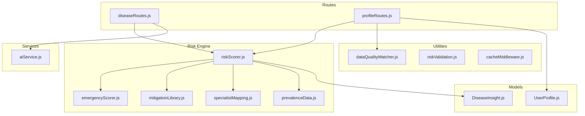
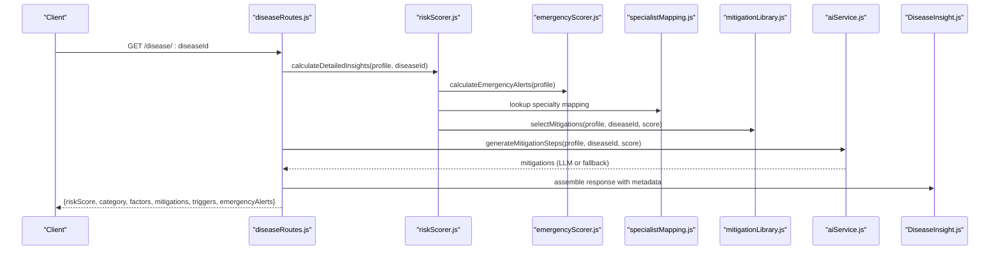
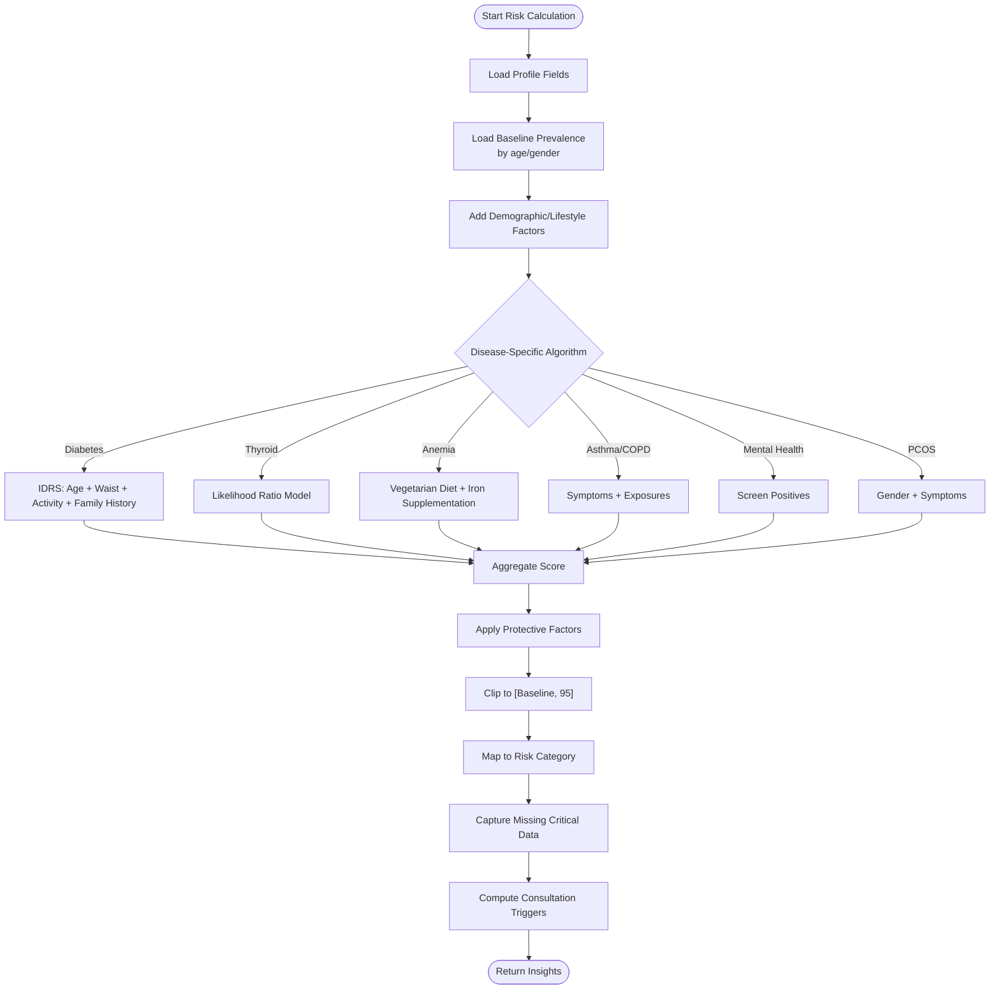
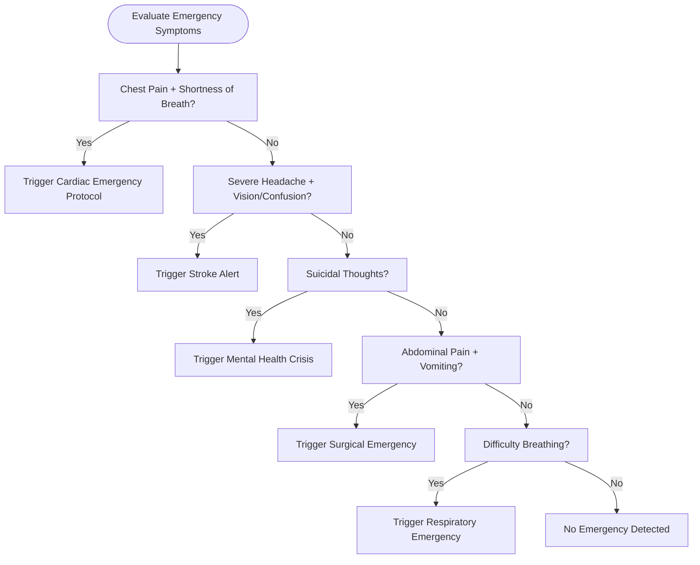
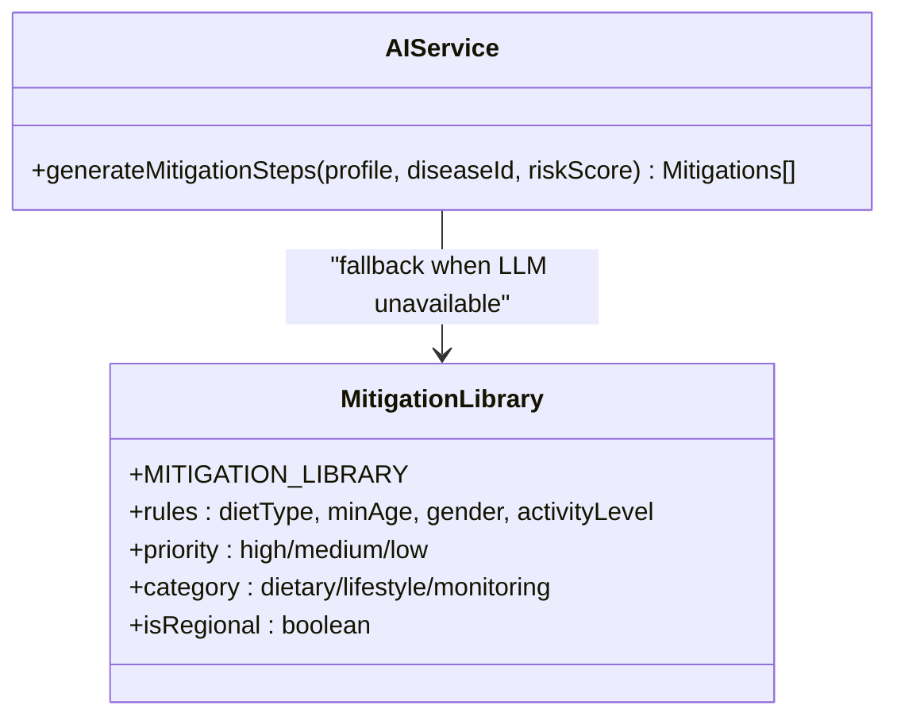
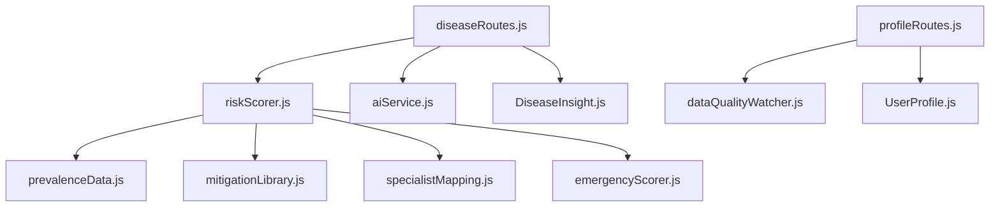

# Health Risk Assessment Engine

<cite>
**Referenced Files in This Document**
- [riskScorer.js](file://backend/src/utils/riskScorer.js)
- [emergencyScorer.js](file://backend/src/utils/emergencyScorer.js)
- [mitigationLibrary.js](file://backend/src/utils/mitigationLibrary.js)
- [specialistMapping.js](file://backend/src/utils/specialistMapping.js)
- [prevalenceData.js](file://backend/src/utils/prevalenceData.js)
- [UserProfile.js](file://backend/src/models/UserProfile.js)
- [DiseaseInsight.js](file://backend/src/models/DiseaseInsight.js)
- [diseaseRoutes.js](file://backend/src/routes/diseaseRoutes.js)
- [profileRoutes.js](file://backend/src/routes/profileRoutes.js)
- [aiService.js](file://backend/src/services/aiService.js)
- [dataQualityWatcher.js](file://backend/src/utils/dataQualityWatcher.js)
- [riskValidation.js](file://backend/src/tests/riskValidation.js)
- [cacheMiddleware.js](file://backend/src/utils/cacheMiddleware.js)
- [package.json](file://backend/package.json)
</cite>

## Table of Contents
1. [Introduction](#introduction)
2. [Project Structure](#project-structure)
3. [Core Components](#core-components)
4. [Architecture Overview](#architecture-overview)
5. [Detailed Component Analysis](#detailed-component-analysis)
6. [Dependency Analysis](#dependency-analysis)
7. [Performance Considerations](#performance-considerations)
8. [Troubleshooting Guide](#troubleshooting-guide)
9. [Conclusion](#conclusion)
10. [Appendices](#appendices)

## Introduction
This document describes VaidyaSetu’s Health Risk Assessment Engine, focusing on the evidence-based algorithms that compute disease risk scores, the integration of mitigation libraries and specialist mapping, and the emergency detection mechanisms. It explains how user profiles are processed, risk factors are evaluated, and personalized recommendations are generated. It also covers the emergency alert system, consultation triggers, cultural intelligence embedded in risk assessment, performance optimization strategies, data quality requirements, and validation processes.

## Project Structure
The risk engine resides primarily under backend/src/utils and backend/src/services, with supporting models and routes. Key modules include:
- Risk scoring and scoring categories
- Emergency detection aligned with Indian protocols
- Mitigation library tailored to the Indian context
- Specialist mapping aligned with IMA categories
- Prevalence baselines from ICMR/NFHS
- Data quality scoring and profile schema
- AI-backed mitigation generation with fallback
- Route orchestration for disease insights and profile management

**Diagram sources**
- [riskScorer.js:1-286](file://backend/src/utils/riskScorer.js#L1-L286)
- [emergencyScorer.js:1-92](file://backend/src/utils/emergencyScorer.js#L1-L92)
- [mitigationLibrary.js:1-235](file://backend/src/utils/mitigationLibrary.js#L1-L235)
- [specialistMapping.js:1-172](file://backend/src/utils/specialistMapping.js#L1-L172)
- [prevalenceData.js:1-88](file://backend/src/utils/prevalenceData.js#L1-L88)
- [UserProfile.js:1-175](file://backend/src/models/UserProfile.js#L1-L175)
- [DiseaseInsight.js:1-88](file://backend/src/models/DiseaseInsight.js#L1-L88)
- [diseaseRoutes.js:102-164](file://backend/src/routes/diseaseRoutes.js#L102-L164)
- [profileRoutes.js:1-367](file://backend/src/routes/profileRoutes.js#L1-L367)
- [aiService.js:1-83](file://backend/src/services/aiService.js#L1-L83)
- [dataQualityWatcher.js:1-87](file://backend/src/utils/dataQualityWatcher.js#L1-L87)
- [riskValidation.js:1-122](file://backend/src/tests/riskValidation.js#L1-L122)
- [cacheMiddleware.js:1-43](file://backend/src/utils/cacheMiddleware.js#L1-L43)

**Section sources**
- [riskScorer.js:1-286](file://backend/src/utils/riskScorer.js#L1-L286)
- [diseaseRoutes.js:102-164](file://backend/src/routes/diseaseRoutes.js#L102-L164)
- [profileRoutes.js:1-367](file://backend/src/routes/profileRoutes.js#L1-L367)

## Core Components
- Risk Scoring Engine: Computes disease-specific risk scores using Indian population baselines, demographic and lifestyle factors, and disease-specific algorithms (e.g., IDRS for diabetes, likelihood ratios for thyroid).
- Emergency Detection: Identifies critical symptom combinations triggering Indian emergency protocols.
- Mitigation Library: Provides culturally grounded, regionally relevant, and personalized health recommendations.
- Specialist Mapping: Maps risks to appropriate specialties aligned with IMA categories and urgency levels.
- Data Quality: Scores completeness, freshness, and validity of user profiles to guide risk interpretation.
- AI Mitigation Generation: Generates personalized mitigation steps via LLM with a robust rules-based fallback.
- Disease Insights Model: Stores structured risk insights, factor breakdowns, protective factors, missing data, mitigations, and consultation triggers.

**Section sources**
- [riskScorer.js:6-286](file://backend/src/utils/riskScorer.js#L6-L286)
- [emergencyScorer.js:1-92](file://backend/src/utils/emergencyScorer.js#L1-L92)
- [mitigationLibrary.js:1-235](file://backend/src/utils/mitigationLibrary.js#L1-L235)
- [specialistMapping.js:1-172](file://backend/src/utils/specialistMapping.js#L1-L172)
- [prevalenceData.js:1-88](file://backend/src/utils/prevalenceData.js#L1-L88)
- [DiseaseInsight.js:1-88](file://backend/src/models/DiseaseInsight.js#L1-L88)
- [aiService.js:1-83](file://backend/src/services/aiService.js#L1-L83)
- [dataQualityWatcher.js:1-87](file://backend/src/utils/dataQualityWatcher.js#L1-L87)

## Architecture Overview
The engine orchestrates user profile ingestion, risk computation, emergency detection, mitigation generation, and specialist mapping. Results are returned through disease routes and persisted via the DiseaseInsight model.

**Diagram sources**
- [diseaseRoutes.js:102-164](file://backend/src/routes/diseaseRoutes.js#L102-L164)
- [riskScorer.js:51-262](file://backend/src/utils/riskScorer.js#L51-L262)
- [emergencyScorer.js:55-89](file://backend/src/utils/emergencyScorer.js#L55-L89)
- [specialistMapping.js:6-172](file://backend/src/utils/specialistMapping.js#L6-L172)
- [mitigationLibrary.js:6-235](file://backend/src/utils/mitigationLibrary.js#L6-L235)
- [aiService.js:10-78](file://backend/src/services/aiService.js#L10-L78)
- [DiseaseInsight.js:41-81](file://backend/src/models/DiseaseInsight.js#L41-L81)

## Detailed Component Analysis

### Risk Scoring Engine
- Baseline Prevalence: Uses ICMR/NFHS-derived baselines, stratified by age/gender where available.
- Demographic and Lifestyle Factors: Applies additive impacts for age, BMI, activity level, smoking, and diet type.
- Disease-Specific Algorithms:
  - Diabetes: IDRS with points for age, waist circumference thresholds by gender, activity level, and family history.
  - Thyroid: Likelihood ratio model adjusting baseline odds by symptoms.
  - Anemia: Adds risk for vegetarian diet and protective effect of iron supplementation.
  - Asthma/COPD: Symptom and exposure factors; protective BMI threshold for asthma.
  - Mental Health: Screen-positive triggers for depression/anxiety escalate risk.
  - PCOS: Gender-restricted; irregular cycles and hirsutism increase risk.
- Protective Factors: Healthy BMI, regular activity, non-smoking reduce risk, bounded by minimum baseline.
- Risk Categories: Defined thresholds mapping score to Very Low to Very High.
- Missing Data Capture: Flags critical missing fields to guide data completeness.
- Consultation Triggers: Urgent vs recommended based on score and missing factor count; maps to primary specialist.

**Diagram sources**
- [riskScorer.js:51-262](file://backend/src/utils/riskScorer.js#L51-L262)
- [prevalenceData.js:5-68](file://backend/src/utils/prevalenceData.js#L5-L68)

**Section sources**
- [riskScorer.js:6-286](file://backend/src/utils/riskScorer.js#L6-L286)
- [prevalenceData.js:1-88](file://backend/src/utils/prevalenceData.js#L1-L88)

### Emergency Detection Mechanisms
- Protocols: Cardiac, stroke, mental health crisis, surgical emergencies, and respiratory emergencies.
- Triggers: Combinations of symptoms (e.g., chest pain + shortness of breath; severe headache + vision changes/confusion; suicidal thoughts; abdominal pain + vomiting; difficulty breathing).
- Outputs: Structured alerts with title, message, instructions, and helpline contact.

**Diagram sources**
- [emergencyScorer.js:55-89](file://backend/src/utils/emergencyScorer.js#L55-L89)

**Section sources**
- [emergencyScorer.js:1-92](file://backend/src/utils/emergencyScorer.js#L1-L92)

### Mitigation Library and AI Generation
- Library: Regionally relevant, prioritized recommendations by disease and category (dietary, lifestyle, monitoring), with gender and dietary rules.
- AI Generation: Uses Groq LLM to produce 3–5 personalized mitigations when available; otherwise falls back to the library with allergy-aware filtering and priority sorting.
- Cultural Intelligence: Recommendations emphasize Indian ingredients and habits where applicable.

**Diagram sources**
- [mitigationLibrary.js:6-235](file://backend/src/utils/mitigationLibrary.js#L6-L235)
- [aiService.js:10-78](file://backend/src/services/aiService.js#L10-L78)

**Section sources**
- [mitigationLibrary.js:1-235](file://backend/src/utils/mitigationLibrary.js#L1-L235)
- [aiService.js:1-83](file://backend/src/services/aiService.js#L1-L83)

### Specialist Mapping System
- Maps diseaseId to primary and alternative specialists aligned with IMA categories and urgency.
- Supports automatic consultation trigger messaging and UI rendering.

**Section sources**
- [specialistMapping.js:1-172](file://backend/src/utils/specialistMapping.js#L1-L172)
- [riskScorer.js:235-247](file://backend/src/utils/riskScorer.js#L235-L247)

### Data Quality and Profile Schema
- UserProfile schema captures biometric, lifestyle, diet, medical history, and expanded screening fields with metadata (updateType, lastUpdated).
- Data Quality Score: Completeness (core fields), freshness (days since last update), validity (verified sources/plausibility).
- Profile routes handle updates, BMI recomputation, history logging, and export/account deletion.

**Section sources**
- [UserProfile.js:1-175](file://backend/src/models/UserProfile.js#L1-L175)
- [dataQualityWatcher.js:1-87](file://backend/src/utils/dataQualityWatcher.js#L1-L87)
- [profileRoutes.js:29-141](file://backend/src/routes/profileRoutes.js#L29-L141)

### Disease Insights Model
- Stores computed risk score, category, factor breakdowns, protective factors, missing data, mitigations, data completeness, and raw input snapshot.
- Indexed for uniqueness by user and disease, plus recency sorting.

**Section sources**
- [DiseaseInsight.js:1-88](file://backend/src/models/DiseaseInsight.js#L1-L88)

## Dependency Analysis
- riskScorer.js depends on prevalenceData, mitigationLibrary, specialistMapping, and emergencyScorer.
- aiService.js depends on Groq SDK and mitigationLibrary fallback.
- diseaseRoutes.js orchestrates risk scoring, mitigation generation, and returns structured insights.
- profileRoutes.js manages profile updates, BMI sync, and data quality metrics.

**Diagram sources**
- [riskScorer.js:1-4](file://backend/src/utils/riskScorer.js#L1-L4)
- [diseaseRoutes.js:102-164](file://backend/src/routes/diseaseRoutes.js#L102-L164)
- [profileRoutes.js:1-367](file://backend/src/routes/profileRoutes.js#L1-L367)
- [aiService.js:1-4](file://backend/src/services/aiService.js#L1-L4)

**Section sources**
- [riskScorer.js:1-4](file://backend/src/utils/riskScorer.js#L1-L4)
- [diseaseRoutes.js:102-164](file://backend/src/routes/diseaseRoutes.js#L102-L164)
- [profileRoutes.js:1-367](file://backend/src/routes/profileRoutes.js#L1-L367)
- [aiService.js:1-4](file://backend/src/services/aiService.js#L1-L4)

## Performance Considerations
- Caching: Aggressive GET caching for static/idempotent endpoints using NodeCache with a standard TTL.
- LLM Mitigation Generation: Falls back to rules-based library when API key is unavailable, ensuring resilience.
- BMI Recalculation: Automatic BMI and category updates on weight/height changes to minimize downstream inconsistencies.
- Indexes: DiseaseInsight compound index on user-disease and recency index improve query performance.

**Section sources**
- [cacheMiddleware.js:1-43](file://backend/src/utils/cacheMiddleware.js#L1-L43)
- [aiService.js:17-78](file://backend/src/services/aiService.js#L17-L78)
- [profileRoutes.js:93-114](file://backend/src/routes/profileRoutes.js#L93-L114)
- [DiseaseInsight.js:83-86](file://backend/src/models/DiseaseInsight.js#L83-L86)

## Troubleshooting Guide
- Risk Score Out of Range: Verify baseline prevalence and factor impacts; ensure protective factors are not over-applying negative adjustments.
- Missing Data Factors: Confirm critical fields are present; consult missingDataFactors to prompt collection.
- Emergency Not Triggering: Validate symptom fields are set to true/Yes; confirm emergency protocol conditions.
- Mitigations Not Returned: Check Groq API key; fallback to library filters known allergies and dietary rules.
- Data Quality Low: Encourage completing core fields, connecting verified sources, and refreshing outdated entries.

**Section sources**
- [riskValidation.js:1-122](file://backend/src/tests/riskValidation.js#L1-L122)
- [riskScorer.js:217-232](file://backend/src/utils/riskScorer.js#L217-L232)
- [emergencyScorer.js:55-89](file://backend/src/utils/emergencyScorer.js#L55-L89)
- [aiService.js:17-78](file://backend/src/services/aiService.js#L17-L78)
- [dataQualityWatcher.js:6-84](file://backend/src/utils/dataQualityWatcher.js#L6-L84)

## Conclusion
VaidyaSetu’s risk engine integrates robust, evidence-based scoring with emergency detection, culturally grounded mitigations, and specialist mapping. It emphasizes data quality, personalization, and resilience through AI-backed generation with strong fallbacks. The modular design enables scalable enhancements and rigorous validation.

## Appendices

### Implementation Examples

- User Profile Processing
  - Retrieve profile and compute data quality score.
  - Update biometrics (e.g., weight/height) to auto-calculate BMI and category.
  - Export consolidated health data for audit or user portability.

  **Section sources**
  - [profileRoutes.js:8-27](file://backend/src/routes/profileRoutes.js#L8-L27)
  - [profileRoutes.js:29-141](file://backend/src/routes/profileRoutes.js#L29-L141)
  - [profileRoutes.js:224-252](file://backend/src/routes/profileRoutes.js#L224-L252)

- Risk Factor Evaluation and Scoring
  - Compute preliminary risk for a set of diseases.
  - For a specific disease, evaluate IDRS/thyroid LR/anemia/asthma/copd/anxiety/depression/pcos factors and protective effects.

  **Section sources**
  - [riskScorer.js:264-279](file://backend/src/utils/riskScorer.js#L264-L279)
  - [riskScorer.js:111-205](file://backend/src/utils/riskScorer.js#L111-L205)

- Personalized Recommendations
  - Generate mitigations via LLM when available; otherwise use library with allergy-aware filtering and priority sorting.

  **Section sources**
  - [diseaseRoutes.js:104-134](file://backend/src/routes/diseaseRoutes.js#L104-L134)
  - [aiService.js:10-78](file://backend/src/services/aiService.js#L10-L78)
  - [mitigationLibrary.js:6-235](file://backend/src/utils/mitigationLibrary.js#L6-L235)

- Emergency Alert System and Consultation Triggers
  - Detect critical symptom combinations and return structured emergency protocols.
  - Compute consultation triggers (urgent/recommended) and map to primary specialist.

  **Section sources**
  - [emergencyScorer.js:55-89](file://backend/src/utils/emergencyScorer.js#L55-L89)
  - [riskScorer.js:234-247](file://backend/src/utils/riskScorer.js#L234-L247)
  - [specialistMapping.js:6-172](file://backend/src/utils/specialistMapping.js#L6-L172)

### Data Quality Requirements
- Completeness: Core fields must be non-empty.
- Freshness: Recent updates improve reliability.
- Validity: Verified sources and plausible biometric ranges.

**Section sources**
- [dataQualityWatcher.js:6-84](file://backend/src/utils/dataQualityWatcher.js#L6-L84)

### Validation Processes
- Automated risk engine validation runs test cases covering healthy profiles, high-risk scenarios, missing data, emergency sentinels, and gender specificity.

**Section sources**
- [riskValidation.js:1-122](file://backend/src/tests/riskValidation.js#L1-L122)

### External Dependencies
- Groq SDK for LLM-based mitigation generation.
- NodeCache for aggressive GET caching.
- Mongoose for model persistence.

**Section sources**
- [package.json:13-31](file://backend/package.json#L13-L31)
- [cacheMiddleware.js:1-43](file://backend/src/utils/cacheMiddleware.js#L1-L43)
- [aiService.js:1-4](file://backend/src/services/aiService.js#L1-L4)