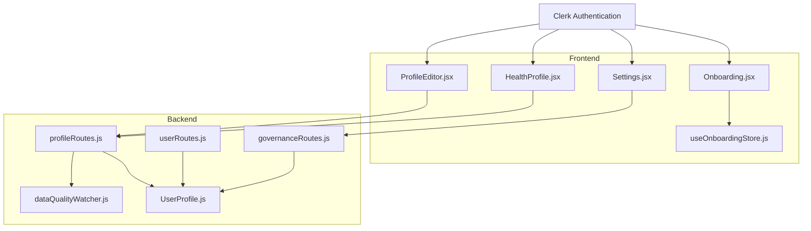
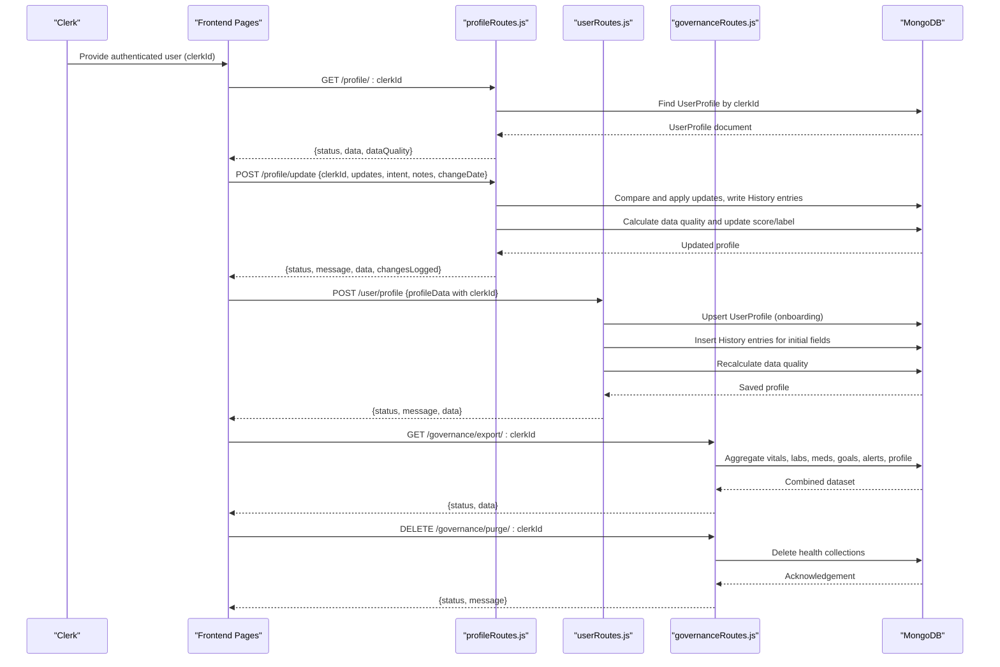
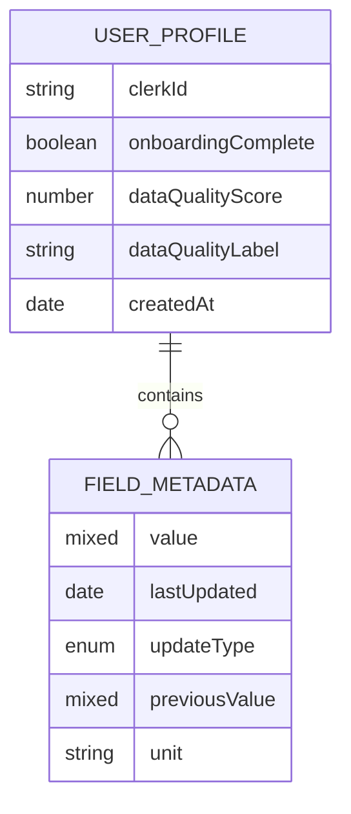
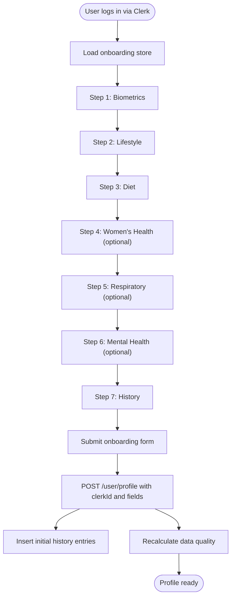
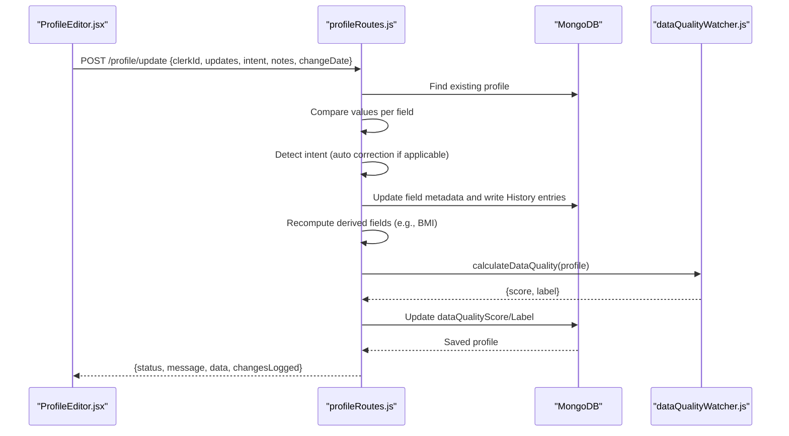
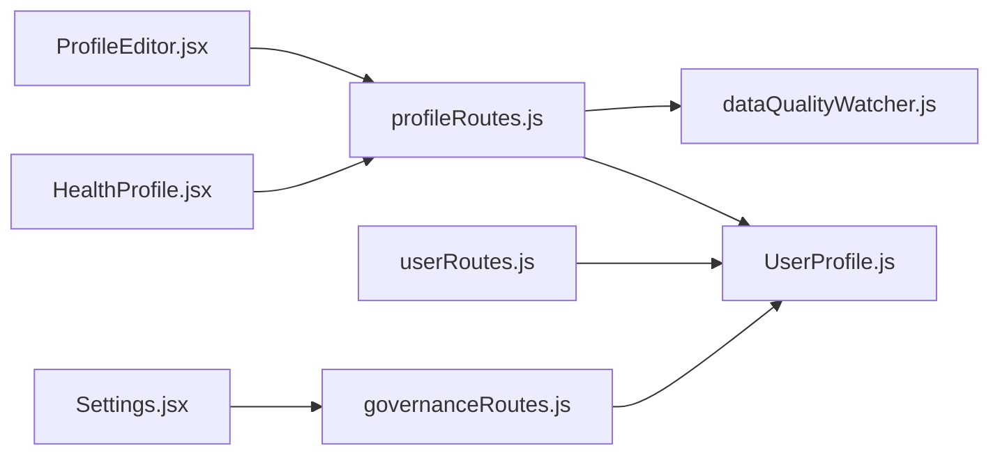

# User Management System

<cite>
**Referenced Files in This Document**
- [UserProfile.js](file://backend/src/models/UserProfile.js)
- [profileRoutes.js](file://backend/src/routes/profileRoutes.js)
- [userRoutes.js](file://backend/src/routes/userRoutes.js)
- [governanceRoutes.js](file://backend/src/routes/governanceRoutes.js)
- [dataQualityWatcher.js](file://backend/src/utils/dataQualityWatcher.js)
- [ProfileEditor.jsx](file://frontend/src/pages/ProfileEditor.jsx)
- [HealthProfile.jsx](file://frontend/src/pages/HealthProfile.jsx)
- [Settings.jsx](file://frontend/src/pages/Settings.jsx)
- [Onboarding.jsx](file://frontend/src/pages/Onboarding.jsx)
- [useOnboardingStore.js](file://frontend/src/store/useOnboardingStore.js)
- [Step1Biometrics.jsx](file://frontend/src/pages/onboarding/Step1Biometrics.jsx)
- [Step2Lifestyle.jsx](file://frontend/src/pages/onboarding/Step2Lifestyle.jsx)
</cite>

## Table of Contents
1. [Introduction](#introduction)
2. [Project Structure](#project-structure)
3. [Core Components](#core-components)
4. [Architecture Overview](#architecture-overview)
5. [Detailed Component Analysis](#detailed-component-analysis)
6. [Dependency Analysis](#dependency-analysis)
7. [Performance Considerations](#performance-considerations)
8. [Troubleshooting Guide](#troubleshooting-guide)
9. [Conclusion](#conclusion)

## Introduction
This document describes VaidyaSetu’s user management system with a focus on the complete user lifecycle: authentication via Clerk, onboarding, profile creation and management, health data collection, preference settings, and data privacy controls. It explains the UserProfile model, registration and update workflows, the profile editing interface, settings management, data validation and quality scoring, security measures, and compliance considerations for healthcare data. It also covers frontend-backend integration, real-time updates, and data governance features such as export and purge.

## Project Structure
The user management system spans frontend and backend components:
- Frontend pages and stores orchestrate Clerk authentication, onboarding, profile editing, and settings.
- Backend routes expose profile, user, and governance endpoints backed by MongoDB models.
- A data quality utility computes profile completeness and freshness scores.

**Diagram sources**
- [Onboarding.jsx:13-101](file://frontend/src/pages/Onboarding.jsx#L13-L101)
- [ProfileEditor.jsx:69-540](file://frontend/src/pages/ProfileEditor.jsx#L69-L540)
- [HealthProfile.jsx:13-281](file://frontend/src/pages/HealthProfile.jsx#L13-L281)
- [Settings.jsx:53-612](file://frontend/src/pages/Settings.jsx#L53-L612)
- [useOnboardingStore.js:4-140](file://frontend/src/store/useOnboardingStore.js#L4-L140)
- [profileRoutes.js:1-367](file://backend/src/routes/profileRoutes.js#L1-L367)
- [userRoutes.js:1-101](file://backend/src/routes/userRoutes.js#L1-L101)
- [governanceRoutes.js:1-71](file://backend/src/routes/governanceRoutes.js#L1-L71)
- [dataQualityWatcher.js:1-87](file://backend/src/utils/dataQualityWatcher.js#L1-L87)
- [UserProfile.js:1-175](file://backend/src/models/UserProfile.js#L1-L175)

**Section sources**
- [Onboarding.jsx:13-101](file://frontend/src/pages/Onboarding.jsx#L13-L101)
- [ProfileEditor.jsx:69-540](file://frontend/src/pages/ProfileEditor.jsx#L69-L540)
- [HealthProfile.jsx:13-281](file://frontend/src/pages/HealthProfile.jsx#L13-L281)
- [Settings.jsx:53-612](file://frontend/src/pages/Settings.jsx#L53-L612)
- [useOnboardingStore.js:4-140](file://frontend/src/store/useOnboardingStore.js#L4-L140)
- [profileRoutes.js:1-367](file://backend/src/routes/profileRoutes.js#L1-L367)
- [userRoutes.js:1-101](file://backend/src/routes/userRoutes.js#L1-L101)
- [governanceRoutes.js:1-71](file://backend/src/routes/governanceRoutes.js#L1-L71)
- [dataQualityWatcher.js:1-87](file://backend/src/utils/dataQualityWatcher.js#L1-L87)
- [UserProfile.js:1-175](file://backend/src/models/UserProfile.js#L1-L175)

## Core Components
- UserProfile model: Nested schema per field with metadata (value, lastUpdated, updateType, previousValue, unit), plus platform settings and expanded screening fields. Includes onboarding completion flag and data quality score/label.
- Profile routes: Fetch profile, update profile with change detection and audit logging, export consolidated health data, purge account data, manage saved doctors, and card metadata persistence.
- User routes: Initial profile save during onboarding and account deletion.
- Governance routes: Export user health data and purge health records.
- Frontend pages: Onboarding wizard, profile editor with intent modal, health profile dashboard, and settings hub.
- Data quality watcher: Computes completeness, freshness, and validity to derive a data quality score and label.

**Section sources**
- [UserProfile.js:15-175](file://backend/src/models/UserProfile.js#L15-L175)
- [profileRoutes.js:8-367](file://backend/src/routes/profileRoutes.js#L8-L367)
- [userRoutes.js:10-101](file://backend/src/routes/userRoutes.js#L10-L101)
- [governanceRoutes.js:10-71](file://backend/src/routes/governanceRoutes.js#L10-L71)
- [dataQualityWatcher.js:6-87](file://backend/src/utils/dataQualityWatcher.js#L6-L87)
- [ProfileEditor.jsx:165-205](file://frontend/src/pages/ProfileEditor.jsx#L165-L205)
- [HealthProfile.jsx:30-47](file://frontend/src/pages/HealthProfile.jsx#L30-L47)
- [Settings.jsx:78-95](file://frontend/src/pages/Settings.jsx#L78-L95)

## Architecture Overview
The system integrates Clerk for authentication and uses Express routes to manage user profiles and health data. The frontend communicates with backend APIs to synchronize profile updates, export data, and manage privacy controls.

**Diagram sources**
- [profileRoutes.js:8-141](file://backend/src/routes/profileRoutes.js#L8-L141)
- [userRoutes.js:10-80](file://backend/src/routes/userRoutes.js#L10-L80)
- [governanceRoutes.js:10-68](file://backend/src/routes/governanceRoutes.js#L10-L68)
- [dataQualityWatcher.js:6-87](file://backend/src/utils/dataQualityWatcher.js#L6-L87)
- [HealthProfile.jsx:30-47](file://frontend/src/pages/HealthProfile.jsx#L30-L47)
- [ProfileEditor.jsx:174-205](file://frontend/src/pages/ProfileEditor.jsx#L174-L205)

## Detailed Component Analysis

### UserProfile Model
The model defines a nested field schema with metadata and organizes user data across biometrics, lifestyle, diet, medical history, expanded screening, platform settings, saved doctors, current location, and card metadata. It includes:
- FieldSchema: value, lastUpdated, updateType (enumeration), previousValue, unit.
- Core demographics and biometrics (name, age, gender, height, weight, BMI, BMI category).
- Lifestyle (activityLevel, sleepHours, stressLevel, isSmoker, alcoholConsumption).
- Diet (dietType, sugarIntake, saltIntake, leafy greens/fruits consumption, junkFoodFrequency).
- Medical (allergies, medicalHistory, otherConditions).
- Onboarding completion flag and data quality score/label.
- Platform settings (language, theme, font size, contrast, animations, units, glucose units, reminders, filters).
- Expanded screening fields for symptoms and conditions.
- Saved doctors array and currentLocation.
- cardMeta map for UI persistence.

**Diagram sources**
- [UserProfile.js:3-13](file://backend/src/models/UserProfile.js#L3-L13)
- [UserProfile.js:15-175](file://backend/src/models/UserProfile.js#L15-L175)

**Section sources**
- [UserProfile.js:3-175](file://backend/src/models/UserProfile.js#L3-L175)

### Registration and Onboarding Workflow
- Clerk authenticates the user and provides the clerkId.
- The onboarding wizard collects biometrics, lifestyle, diet, and medical history in steps, storing data in a transient store until submission.
- On completion, the frontend posts to the backend to create or update the profile with onboardingComplete set and initial field values marked with updateType 'initial'.
- Backend writes history entries for each populated field and recalculates data quality.

**Diagram sources**
- [Onboarding.jsx:13-101](file://frontend/src/pages/Onboarding.jsx#L13-L101)
- [useOnboardingStore.js:4-140](file://frontend/src/store/useOnboardingStore.js#L4-L140)
- [Step1Biometrics.jsx:5-165](file://frontend/src/pages/onboarding/Step1Biometrics.jsx#L5-L165)
- [Step2Lifestyle.jsx:5-127](file://frontend/src/pages/onboarding/Step2Lifestyle.jsx#L5-L127)
- [userRoutes.js:10-80](file://backend/src/routes/userRoutes.js#L10-L80)
- [dataQualityWatcher.js:6-87](file://backend/src/utils/dataQualityWatcher.js#L6-L87)

**Section sources**
- [userRoutes.js:10-80](file://backend/src/routes/userRoutes.js#L10-L80)
- [useOnboardingStore.js:4-140](file://frontend/src/store/useOnboardingStore.js#L4-L140)
- [Onboarding.jsx:13-101](file://frontend/src/pages/Onboarding.jsx#L13-L101)
- [Step1Biometrics.jsx:5-165](file://frontend/src/pages/onboarding/Step1Biometrics.jsx#L5-L165)
- [Step2Lifestyle.jsx:5-127](file://frontend/src/pages/onboarding/Step2Lifestyle.jsx#L5-L127)

### Profile Editing and Change Tracking
- The profile editor loads the current nested profile, flattens values into form state, validates numeric fields, and allows users to select an intent (real change, correction, initial) and optional notes.
- On submit, the frontend sends updates to the backend, which:
  - Compares old vs. new values per field.
  - Detects corrections automatically for significant changes within a short timeframe (e.g., weight).
  - Updates field metadata (lastUpdated, updateType, previousValue, unit).
  - Writes history entries with source 'user' and intent.
  - Recomputes derived fields (e.g., BMI and category) and logs sync-type changes.
  - Recalculates data quality score and label.
  - Saves the profile and returns results.

**Diagram sources**
- [ProfileEditor.jsx:174-205](file://frontend/src/pages/ProfileEditor.jsx#L174-L205)
- [profileRoutes.js:29-141](file://backend/src/routes/profileRoutes.js#L29-L141)
- [dataQualityWatcher.js:6-87](file://backend/src/utils/dataQualityWatcher.js#L6-L87)

**Section sources**
- [ProfileEditor.jsx:156-205](file://frontend/src/pages/ProfileEditor.jsx#L156-L205)
- [profileRoutes.js:29-141](file://backend/src/routes/profileRoutes.js#L29-L141)
- [dataQualityWatcher.js:6-87](file://backend/src/utils/dataQualityWatcher.js#L6-L87)

### Health Profile Dashboard
- Loads the profile and data quality, displays summary cards for biometrics, lifestyle, diet, and medical details, and provides navigation to edit and history views.
- Shows a data quality indicator with score and label.

**Section sources**
- [HealthProfile.jsx:30-186](file://frontend/src/pages/HealthProfile.jsx#L30-L186)

### Settings Management
- Provides a categorized settings hub:
  - Identity & Bio: Edit name, phone, gender, DOB via profile updates.
  - Security & Alerts: Configure alert defaults and thresholds.
  - Preferences: Language, measurement units, glucose scale.
  - Governance: Export data (JSON/PDF) and purge health records.
  - Display & UX: Theme, contrast, motion reduction, voice guidance.
  - Support & Legal: Links to privacy and terms.
- Integrates with backend governance endpoints for export and purge.

**Section sources**
- [Settings.jsx:78-174](file://frontend/src/pages/Settings.jsx#L78-L174)
- [governanceRoutes.js:10-71](file://backend/src/routes/governanceRoutes.js#L10-L71)

### Data Governance: Export and Purge
- Export endpoint aggregates vitals, lab results, medications, goals, alerts, and the user profile into a structured JSON dataset.
- Purge endpoint deletes all health-related records for the user while preserving the Clerk account.

**Section sources**
- [governanceRoutes.js:10-71](file://backend/src/routes/governanceRoutes.js#L10-L71)

### Data Validation and Quality Scoring
- Completeness: Core fields evaluated for presence and non-empty values.
- Freshness: Based on the most recent lastUpdated timestamp across core fields.
- Validity: Awards points for synced data and plausible ranges (e.g., height/weight).
- Output: A score out of 100 with labels (Basic, Good, Excellent) and a descriptive message.

**Section sources**
- [dataQualityWatcher.js:6-87](file://backend/src/utils/dataQualityWatcher.js#L6-L87)

## Dependency Analysis
- Frontend depends on Clerk for authentication and on the backend profile and governance endpoints.
- Backend routes depend on the UserProfile model and the data quality utility.
- Change tracking and derived field updates introduce tight coupling between profile routes and the data quality calculation.

**Diagram sources**
- [ProfileEditor.jsx:69-540](file://frontend/src/pages/ProfileEditor.jsx#L69-L540)
- [HealthProfile.jsx:13-281](file://frontend/src/pages/HealthProfile.jsx#L13-L281)
- [Settings.jsx:53-612](file://frontend/src/pages/Settings.jsx#L53-L612)
- [profileRoutes.js:1-367](file://backend/src/routes/profileRoutes.js#L1-L367)
- [userRoutes.js:1-101](file://backend/src/routes/userRoutes.js#L1-L101)
- [governanceRoutes.js:1-71](file://backend/src/routes/governanceRoutes.js#L1-L71)
- [UserProfile.js:1-175](file://backend/src/models/UserProfile.js#L1-L175)
- [dataQualityWatcher.js:1-87](file://backend/src/utils/dataQualityWatcher.js#L1-L87)

**Section sources**
- [profileRoutes.js:1-367](file://backend/src/routes/profileRoutes.js#L1-L367)
- [userRoutes.js:1-101](file://backend/src/routes/userRoutes.js#L1-L101)
- [governanceRoutes.js:1-71](file://backend/src/routes/governanceRoutes.js#L1-L71)
- [UserProfile.js:1-175](file://backend/src/models/UserProfile.js#L1-L175)
- [dataQualityWatcher.js:1-87](file://backend/src/utils/dataQualityWatcher.js#L1-L87)

## Performance Considerations
- Batch operations: Use Promise.all for concurrent reads/writes in export and onboarding flows to minimize latency.
- Indexing: Ensure MongoDB indexes on clerkId for UserProfile, History, and other health collections to speed up queries.
- Derived field updates: Keep recomputation minimal by checking thresholds before updating BMI and categories.
- Frontend caching: Persist onboarding state locally to avoid repeated network requests during multi-step onboarding.

## Troubleshooting Guide
- Profile not found errors: Verify the incoming clerkId and that the user has completed onboarding.
- Update conflicts: Ensure the intent selection and notes are provided when required; confirm that changeDate is valid if used.
- Export failures: Confirm that all referenced collections exist and that the user has data in them.
- Purge warnings: The purge action removes health records; ensure users understand the irreversible nature of the operation.

**Section sources**
- [profileRoutes.js:8-27](file://backend/src/routes/profileRoutes.js#L8-L27)
- [profileRoutes.js:153-184](file://backend/src/routes/profileRoutes.js#L153-L184)
- [governanceRoutes.js:49-68](file://backend/src/routes/governanceRoutes.js#L49-L68)

## Conclusion
VaidyaSetu’s user management system provides a robust, Clerk-integrated lifecycle covering onboarding, profile maintenance, health data collection, settings, and governance. The nested UserProfile model, combined with explicit change tracking and data quality scoring, ensures transparency and reliability. The frontend-backend integration supports real-time updates, export, and purge operations, enabling users to maintain control over their health data while adhering to healthcare data principles.