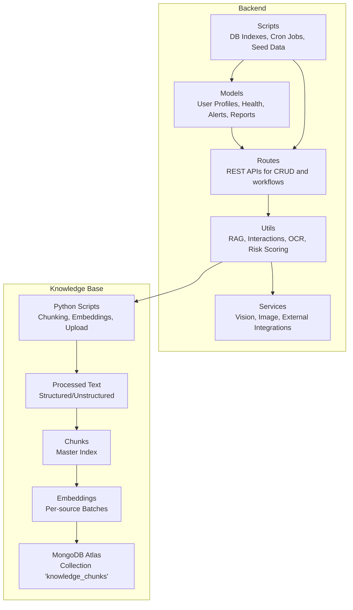
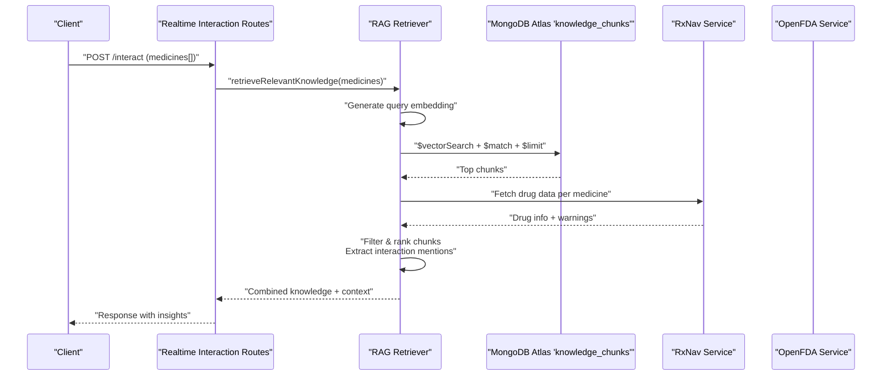
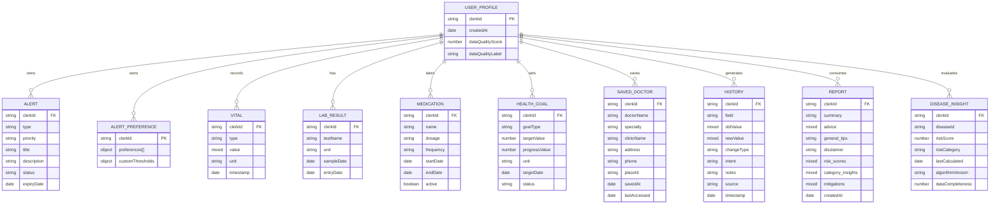
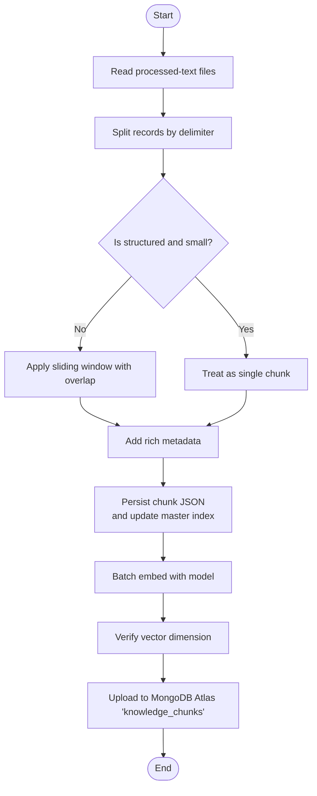
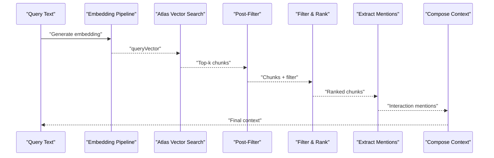
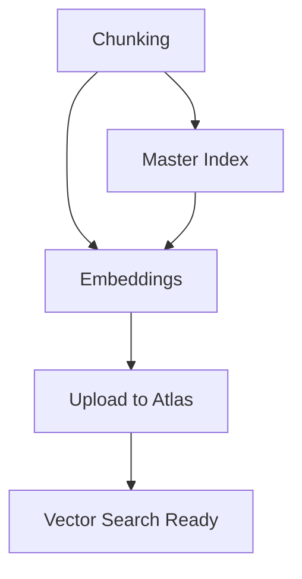
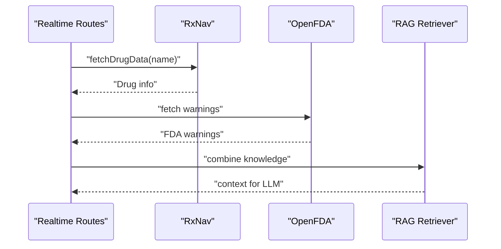
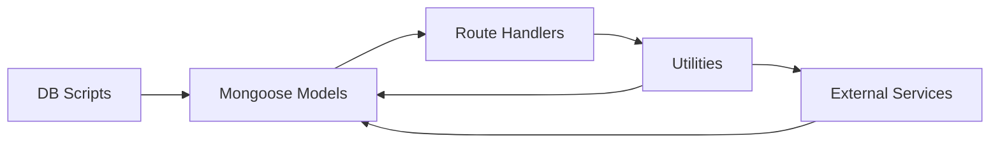

# Data Management

<cite>
**Referenced Files in This Document**
- [UserProfile.js](file://backend/src/models/UserProfile.js)
- [Medication.js](file://backend/src/models/Medication.js)
- [Alert.js](file://backend/src/models/Alert.js)
- [AlertPreference.js](file://backend/src/models/AlertPreference.js)
- [Analytics.js](file://backend/src/models/Analytics.js)
- [History.js](file://backend/src/models/History.js)
- [LabResult.js](file://backend/src/models/LabResult.js)
- [Vital.js](file://backend/src/models/Vital.js)
- [HealthGoal.js](file://backend/src/models/HealthGoal.js)
- [Report.js](file://backend/src/models/Report.js)
- [SavedDoctor.js](file://backend/src/models/SavedDoctor.js)
- [DiseaseInsight.js](file://backend/src/models/DiseaseInsight.js)
- [chunk_text.py](file://backend/knowledge-base/scripts/chunk_text.py)
- [generate_embeddings.py](file://backend/knowledge-base/scripts/generate_embeddings.py)
- [upload_vectors.py](file://backend/knowledge-base/scripts/upload_vectors.py)
- [ragRetriever.js](file://backend/src/utils/ragRetriever.js)
- [realtimeInteractionRoutes.js](file://backend/src/routes/realtimeInteractionRoutes.js)
- [rxnav.js](file://backend/src/utils/rxnav.js)
- [openfda.js](file://backend/src/utils/openfda.js)
- [dbIndexes.js](file://backend/src/scripts/dbIndexes.js)
- [cronJobs.js](file://backend/src/scripts/cronJobs.js)
- [cacheMiddleware.js](file://backend/src/utils/cacheMiddleware.js)
- [dataQualityWatcher.js](file://backend/src/utils/dataQualityWatcher.js)
- [mitigationLibrary.js](file://backend/src/utils/mitigationLibrary.js)
- [prevalenceData.js](file://backend/src/utils/prevalenceData.js)
- [interactionEngine.js](file://backend/src/utils/interactionEngine.js)
- [emergencyScorer.js](file://backend/src/utils/emergencyScorer.js)
- [riskScorer.js](file://backend/src/utils/riskScorer.js)
- [specialistMapping.js](file://backend/src/utils/specialistMapping.js)
- [groqVision.js](file://backend/src/services/groqVision.js)
- [visionOcr.js](file://backend/src/services/visionOcr.js)
- [image.js](file://backend/src/services/image.js)
- [ApiCache.js](file://backend/src/models/ApiCache.js)
- [interactionRoutes.js](file://backend/src/routes/interactionRoutes.js)
- [governanceRoutes.js](file://backend/src/routes/governanceRoutes.js)
- [seed_disease_metadata.js](file://backend/src/scripts/seed_disease_metadata.js)
- [seed_missing_interaction.js](file://backend/src/scripts/seed_missing_interaction.js)
- [seed_drug_mappings.js](file://backend/src/scripts/seed_drug_mappings.js)
- [migrate_profiles.js](file://backend/src/scripts/migrate_profiles.js)
- [DATA_SOURCES.md](file://DATA_SOURCES.md)
- [MANUAL_DATA_DOWNLOAD_GUIDE.md](file://backend/knowledge-base/MANUAL_DATA_DOWNLOAD_GUIDE.md)
- [ATLAS_VECTOR_CONFIG_GUIDE.md](file://backend/knowledge-base/ATLAS_VECTOR_CONFIG_GUIDE.md)
</cite>

## Table of Contents
1. [Introduction](#introduction)
2. [Project Structure](#project-structure)
3. [Core Components](#core-components)
4. [Architecture Overview](#architecture-overview)
5. [Detailed Component Analysis](#detailed-component-analysis)
6. [Dependency Analysis](#dependency-analysis)
7. [Performance Considerations](#performance-considerations)
8. [Troubleshooting Guide](#troubleshooting-guide)
9. [Conclusion](#conclusion)
10. [Appendices](#appendices)

## Introduction
This document provides comprehensive data management documentation for VaidyaSetu. It covers the database schema design for user profiles, health data, medication records, alerts, analytics, and reports; the knowledge base architecture with vector embeddings and semantic search; data processing pipelines for text chunking, embedding generation, and quality assurance; lifecycle management, retention, backup, and compliance; validation rules and business logic constraints; performance optimization; and security and privacy controls. It also includes examples of data transformation workflows and integration with external medical databases.

## Project Structure
VaidyaSetu’s backend is a Node.js application using MongoDB via Mongoose. Data models reside under backend/src/models, while the knowledge base pipeline is implemented in Python under backend/knowledge-base/scripts. Utilities and services support ingestion, retrieval, analytics, and real-time integrations.

**Diagram sources**
- [UserProfile.js:1-175](file://backend/src/models/UserProfile.js#L1-L175)
- [chunk_text.py:1-172](file://backend/knowledge-base/scripts/chunk_text.py#L1-L172)
- [generate_embeddings.py:1-117](file://backend/knowledge-base/scripts/generate_embeddings.py#L1-L117)
- [upload_vectors.py:1-105](file://backend/knowledge-base/scripts/upload_vectors.py#L1-L105)

**Section sources**
- [UserProfile.js:1-175](file://backend/src/models/UserProfile.js#L1-L175)
- [chunk_text.py:1-172](file://backend/knowledge-base/scripts/chunk_text.py#L1-L172)
- [generate_embeddings.py:1-117](file://backend/knowledge-base/scripts/generate_embeddings.py#L1-L117)
- [upload_vectors.py:1-105](file://backend/knowledge-base/scripts/upload_vectors.py#L1-L105)

## Core Components
This section outlines the primary data entities and their roles in the system.

- User Profile: Captures biometrics, lifestyle, diet, medical history, screening questions, settings, saved doctors, and UI persistence.
- Health Entities: Vitals, lab results, medications, health goals, saved doctors, and history of changes.
- Alerts and Preferences: Real-time notifications with priority, status, and user-configurable channels and thresholds.
- Analytics: Event logging for product insights and user actions.
- Reports: Structured summaries with disease-specific advice, risk scores, and mitigations.
- Knowledge Base: Structured ingestion pipeline for medical literature and vectorized storage for semantic search.

Key implementation references:
- [UserProfile schema:15-172](file://backend/src/models/UserProfile.js#L15-L172)
- [Vital schema:3-52](file://backend/src/models/Vital.js#L3-L52)
- [LabResult schema:3-48](file://backend/src/models/LabResult.js#L3-L48)
- [Medication schema:3-43](file://backend/src/models/Medication.js#L3-L43)
- [HealthGoal schema:3-48](file://backend/src/models/HealthGoal.js#L3-L48)
- [SavedDoctor schema:3-30](file://backend/src/models/SavedDoctor.js#L3-L30)
- [History schema:3-41](file://backend/src/models/History.js#L3-L41)
- [Alert schema:3-45](file://backend/src/models/Alert.js#L3-L45)
- [AlertPreference schema:3-41](file://backend/src/models/AlertPreference.js#L3-L41)
- [Analytics schema:3-22](file://backend/src/models/Analytics.js#L3-L22)
- [Report schema:3-47](file://backend/src/models/Report.js#L3-L47)

**Section sources**
- [UserProfile.js:1-175](file://backend/src/models/UserProfile.js#L1-L175)
- [Vital.js:1-55](file://backend/src/models/Vital.js#L1-L55)
- [LabResult.js:1-51](file://backend/src/models/LabResult.js#L1-L51)
- [Medication.js:1-46](file://backend/src/models/Medication.js#L1-L46)
- [HealthGoal.js:1-51](file://backend/src/models/HealthGoal.js#L1-L51)
- [SavedDoctor.js:1-36](file://backend/src/models/SavedDoctor.js#L1-L36)
- [History.js:1-44](file://backend/src/models/History.js#L1-L44)
- [Alert.js:1-48](file://backend/src/models/Alert.js#L1-L48)
- [AlertPreference.js:1-44](file://backend/src/models/AlertPreference.js#L1-L44)
- [Analytics.js:1-25](file://backend/src/models/Analytics.js#L1-L25)
- [Report.js:1-50](file://backend/src/models/Report.js#L1-L50)

## Architecture Overview
The data architecture integrates user-centric health records with a knowledge base powered by vector embeddings. The RAG retriever generates embeddings for queries, performs vector search, post-filters by medicine names, ranks results, extracts interaction mentions, and composes a context for downstream AI processing.

**Diagram sources**
- [ragRetriever.js:156-215](file://backend/src/utils/ragRetriever.js#L156-L215)
- [realtimeInteractionRoutes.js](file://backend/src/routes/realtimeInteractionRoutes.js)
- [rxnav.js](file://backend/src/utils/rxnav.js)
- [openfda.js](file://backend/src/utils/openfda.js)

**Section sources**
- [ragRetriever.js:1-218](file://backend/src/utils/ragRetriever.js#L1-L218)
- [realtimeInteractionRoutes.js](file://backend/src/routes/realtimeInteractionRoutes.js)

## Detailed Component Analysis

### Database Schema Design
- Identity and Access: Users are identified by a platform-specific clerkId with unique constraints across profiles and preferences.
- Field Normalization: Reusable FieldSchema supports mixed values, units, timestamps, and update types for auditability.
- Indexing Strategy: Composite and single-field indexes optimize timeline queries, lookups by user, and categorical filters.
- Mixed Data Types: Models use Mixed types for flexible numeric and structured values (e.g., blood pressure as an object).
- Audit Trail: History captures field-level changes with intent, source, and notes.

**Diagram sources**
- [UserProfile.js:15-172](file://backend/src/models/UserProfile.js#L15-L172)
- [Alert.js:3-45](file://backend/src/models/Alert.js#L3-L45)
- [AlertPreference.js:3-41](file://backend/src/models/AlertPreference.js#L3-L41)
- [Vital.js:3-52](file://backend/src/models/Vital.js#L3-L52)
- [LabResult.js:3-48](file://backend/src/models/LabResult.js#L3-L48)
- [Medication.js:3-43](file://backend/src/models/Medication.js#L3-L43)
- [HealthGoal.js:3-48](file://backend/src/models/HealthGoal.js#L3-L48)
- [SavedDoctor.js:3-30](file://backend/src/models/SavedDoctor.js#L3-L30)
- [History.js:3-41](file://backend/src/models/History.js#L3-L41)
- [Report.js:3-47](file://backend/src/models/Report.js#L3-L47)
- [DiseaseInsight.js:41-81](file://backend/src/models/DiseaseInsight.js#L41-L81)

**Section sources**
- [UserProfile.js:1-175](file://backend/src/models/UserProfile.js#L1-L175)
- [Alert.js:1-48](file://backend/src/models/Alert.js#L1-L48)
- [AlertPreference.js:1-44](file://backend/src/models/AlertPreference.js#L1-L44)
- [Vital.js:1-55](file://backend/src/models/Vital.js#L1-L55)
- [LabResult.js:1-51](file://backend/src/models/LabResult.js#L1-L51)
- [Medication.js:1-46](file://backend/src/models/Medication.js#L1-L46)
- [HealthGoal.js:1-51](file://backend/src/models/HealthGoal.js#L1-L51)
- [SavedDoctor.js:1-36](file://backend/src/models/SavedDoctor.js#L1-L36)
- [History.js:1-44](file://backend/src/models/History.js#L1-L44)
- [Report.js:1-50](file://backend/src/models/Report.js#L1-L50)
- [DiseaseInsight.js:1-89](file://backend/src/models/DiseaseInsight.js#L1-L89)

### Knowledge Base Architecture
- Sources: Structured (DrugBank, IMPPAT) and unstructured (PubMed, WHO, ICMR, AYUSH) processed into normalized text.
- Chunking: Sliding window with overlap for unstructured content; whole records for short structured entries.
- Embeddings: Sentence-transformers model with batch processing and dimension verification.
- Vector Store: MongoDB Atlas collection with vector search index for semantic similarity.

**Diagram sources**
- [chunk_text.py:69-165](file://backend/knowledge-base/scripts/chunk_text.py#L69-L165)
- [generate_embeddings.py:40-113](file://backend/knowledge-base/scripts/generate_embeddings.py#L40-L113)
- [upload_vectors.py:30-96](file://backend/knowledge-base/scripts/upload_vectors.py#L30-L96)

**Section sources**
- [chunk_text.py:1-172](file://backend/knowledge-base/scripts/chunk_text.py#L1-L172)
- [generate_embeddings.py:1-117](file://backend/knowledge-base/scripts/generate_embeddings.py#L1-L117)
- [upload_vectors.py:1-105](file://backend/knowledge-base/scripts/upload_vectors.py#L1-L105)
- [ATLAS_VECTOR_CONFIG_GUIDE.md](file://backend/knowledge-base/ATLAS_VECTOR_CONFIG_GUIDE.md)

### Semantic Search Implementation
- Query Embedding: Dynamically initialized transformer pipeline with caching for repeated queries.
- Vector Search: Aggregation pipeline with vectorSearch, optional post-filter by medicine names, and projection of scores.
- Ranking and Mentions: Threshold-based filtering, mention boosting, and extraction of interaction-related sentences.
- Context Composition: Builds a bounded context combining vector matches, direct clinical conflicts, and mentions.

**Diagram sources**
- [ragRetriever.js:16-85](file://backend/src/utils/ragRetriever.js#L16-L85)

**Section sources**
- [ragRetriever.js:1-218](file://backend/src/utils/ragRetriever.js#L1-L218)

### Data Processing Pipelines
- Text Chunking: Sliding window with overlap; structured records treated as single chunks; metadata enrichment; master index creation.
- Embedding Generation: Batch processing with dimension sanity checks; preserves chunk identity; maintains source folder structure.
- Vector Upload: Iterates embedded files; inserts into Atlas collection with batch sizes; verifies counts.

**Diagram sources**
- [chunk_text.py:125-169](file://backend/knowledge-base/scripts/chunk_text.py#L125-L169)
- [generate_embeddings.py:58-113](file://backend/knowledge-base/scripts/generate_embeddings.py#L58-L113)
- [upload_vectors.py:53-96](file://backend/knowledge-base/scripts/upload_vectors.py#L53-L96)

**Section sources**
- [chunk_text.py:1-172](file://backend/knowledge-base/scripts/chunk_text.py#L1-L172)
- [generate_embeddings.py:1-117](file://backend/knowledge-base/scripts/generate_embeddings.py#L1-L117)
- [upload_vectors.py:1-105](file://backend/knowledge-base/scripts/upload_vectors.py#L1-L105)

### Data Lifecycle Management
- Retention: No explicit retention policies observed in models or scripts; consider adding TTL collections or scheduled cleanup jobs.
- Backup: MongoDB Atlas provides cluster backups; ensure automated snapshots and cross-region replication aligned with compliance.
- Compliance: Data minimization, pseudonymization via clerkId, secure environment variables for credentials, and audit logs in History and Analytics.

Recommendations:
- Define retention periods per entity (e.g., lab results, vitals, history).
- Implement TTL indexes for ephemeral data.
- Enable Atlas encryption at rest and in transit.
- Regularly review and rotate secrets.

**Section sources**
- [History.js:3-41](file://backend/src/models/History.js#L3-L41)
- [Analytics.js:3-22](file://backend/src/models/Analytics.js#L3-L22)
- [dbIndexes.js](file://backend/src/scripts/dbIndexes.js)

### Validation Rules and Business Logic Constraints
- Enumerations: Priority, status, frequency, goal types, vital types, risk categories enforce domain validity.
- Units and Mixed Values: Consistent unit handling across vitals, labs, and medications; mixed types enable flexible representation.
- Update Types: FieldSchema tracks initial, correction, sync, and auto changes for auditability.
- Preferences: Quiet hours, custom thresholds, and channel toggles tailor alerts to user needs.
- Interaction Logic: Pairwise multi-drug search, mention extraction, and direct clinical conflicts from RxNav/OpenFDA.

**Section sources**
- [UserProfile.js:3-13](file://backend/src/models/UserProfile.js#L3-L13)
- [Medication.js:17-21](file://backend/src/models/Medication.js#L17-L21)
- [Alert.js:14-18](file://backend/src/models/Alert.js#L14-L18)
- [AlertPreference.js:14-28](file://backend/src/models/AlertPreference.js#L14-L28)
- [Vital.js:12-22](file://backend/src/models/Vital.js#L12-L22)
- [HealthGoal.js:12-19](file://backend/src/models/HealthGoal.js#L12-L19)
- [DiseaseInsight.js:56-59](file://backend/src/models/DiseaseInsight.js#L56-L59)

### Security, Privacy, and Access Control
- Authentication: Clerk-based user identification with unique clerkId linking all entities.
- Authorization: Routes guard access per clerkId; ensure middleware enforces scope.
- Secrets: MongoDB URI loaded from environment; restrict access to .env and CI/CD secrets.
- Data Handling: OCR and image services process sensitive documents; ensure secure temporary storage and deletion.

**Section sources**
- [UserProfile.js:16-20](file://backend/src/models/UserProfile.js#L16-L20)
- [upload_vectors.py:14-28](file://backend/knowledge-base/scripts/upload_vectors.py#L14-L28)
- [visionOcr.js](file://backend/src/services/visionOcr.js)
- [image.js](file://backend/src/services/image.js)

### Integration with External Medical Databases
- RxNav: Fetches drug data and interactions; used for direct clinical conflicts and warnings.
- OpenFDA: Retrieves FDA label warnings for curated contexts.
- Real-time Orchestration: Routes coordinate retrieval and combine vector and API data.

**Diagram sources**
- [realtimeInteractionRoutes.js](file://backend/src/routes/realtimeInteractionRoutes.js)
- [rxnav.js](file://backend/src/utils/rxnav.js)
- [openfda.js](file://backend/src/utils/openfda.js)
- [ragRetriever.js:113-124](file://backend/src/utils/ragRetriever.js#L113-L124)

**Section sources**
- [realtimeInteractionRoutes.js](file://backend/src/routes/realtimeInteractionRoutes.js)
- [rxnav.js](file://backend/src/utils/rxnav.js)
- [openfda.js](file://backend/src/utils/openfda.js)
- [ragRetriever.js:1-218](file://backend/src/utils/ragRetriever.js#L1-L218)

## Dependency Analysis
The system exhibits layered dependencies: models define schema contracts; routes orchestrate workflows; utils encapsulate reusable logic; services integrate external systems; scripts manage lifecycle tasks.

**Diagram sources**
- [UserProfile.js:1-175](file://backend/src/models/UserProfile.js#L1-L175)
- [ragRetriever.js:1-218](file://backend/src/utils/ragRetriever.js#L1-L218)
- [realtimeInteractionRoutes.js](file://backend/src/routes/realtimeInteractionRoutes.js)

**Section sources**
- [UserProfile.js:1-175](file://backend/src/models/UserProfile.js#L1-L175)
- [ragRetriever.js:1-218](file://backend/src/utils/ragRetriever.js#L1-L218)
- [realtimeInteractionRoutes.js](file://backend/src/routes/realtimeInteractionRoutes.js)

## Performance Considerations
- Vector Search Tuning: Adjust numCandidates and limit in the aggregation pipeline to balance recall and latency.
- Embedding Caching: Maintain an in-memory cache for query embeddings to avoid recomputation.
- Batch Sizes: Optimize chunk embedding and Atlas upload batch sizes for throughput.
- Indexing: Ensure vector index and compound indexes are created and maintained.
- Caching Middleware: Leverage cache middleware for read-heavy endpoints.
- Rate Limiting: Apply rate limiting for external API calls (RxNav, OpenFDA).

[No sources needed since this section provides general guidance]

## Troubleshooting Guide
Common issues and resolutions:
- Missing MONGODB_URI: Ensure environment variable is set and accessible to the uploader script.
- Dimension Mismatch: Verify embedding dimension matches expectations before upload.
- Empty Results: Confirm vector index exists and Atlas cluster is reachable; check fallback logic in retriever.
- Data Quality Gaps: Use data quality watcher utilities to monitor completeness and flag anomalies.
- Cache Invalidation: Clear embedding cache when query text variations increase.

**Section sources**
- [upload_vectors.py:14-28](file://backend/knowledge-base/scripts/upload_vectors.py#L14-L28)
- [generate_embeddings.py:28-31](file://backend/knowledge-base/scripts/generate_embeddings.py#L28-L31)
- [ragRetriever.js:52-72](file://backend/src/utils/ragRetriever.js#L52-L72)
- [dataQualityWatcher.js](file://backend/src/utils/dataQualityWatcher.js)
- [cacheMiddleware.js](file://backend/src/utils/cacheMiddleware.js)

## Conclusion
VaidyaSetu’s data management combines robust user health modeling with a scalable knowledge base pipeline. The schema enforces data integrity and auditability, while the RAG retriever enables precise, context-aware insights. Operational excellence depends on disciplined lifecycle management, strong security practices, and continuous performance tuning.

[No sources needed since this section summarizes without analyzing specific files]

## Appendices

### Data Sources and Guides
- Data Sources: Reference datasets and guidelines for downloading and preparing knowledge base materials.
- Manual Download Guide: Instructions for acquiring and structuring external literature.
- Atlas Vector Config: Guidance for setting up vector search indexes and configurations.

**Section sources**
- [DATA_SOURCES.md](file://DATA_SOURCES.md)
- [MANUAL_DATA_DOWNLOAD_GUIDE.md](file://backend/knowledge-base/MANUAL_DATA_DOWNLOAD_GUIDE.md)
- [ATLAS_VECTOR_CONFIG_GUIDE.md](file://backend/knowledge-base/ATLAS_VECTOR_CONFIG_GUIDE.md)

### Example Workflows
- Multi-Drug Interaction Retrieval:
  - Input: List of medicine names.
  - Steps: Generate embeddings, perform vector search, post-filter by names, rank, extract mentions, compose context, and return combined knowledge.
  - Output: Ranked chunks, interaction mentions, and context for downstream processing.

**Section sources**
- [ragRetriever.js:156-215](file://backend/src/utils/ragRetriever.js#L156-L215)