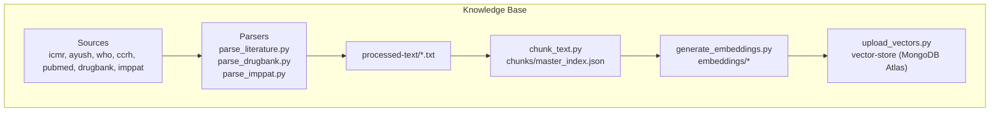
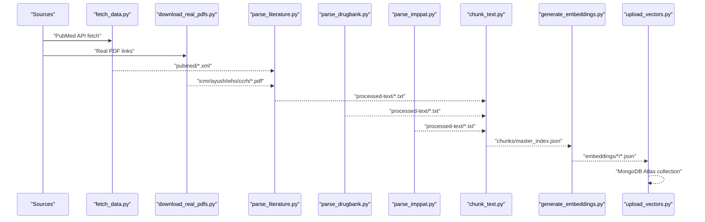
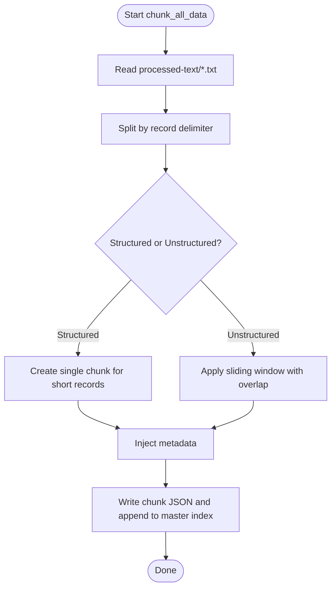
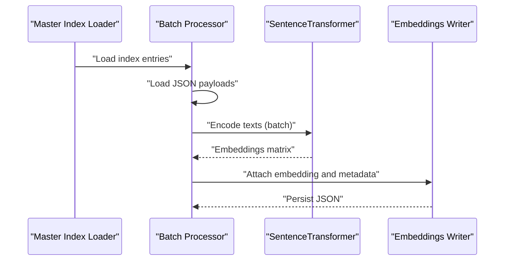
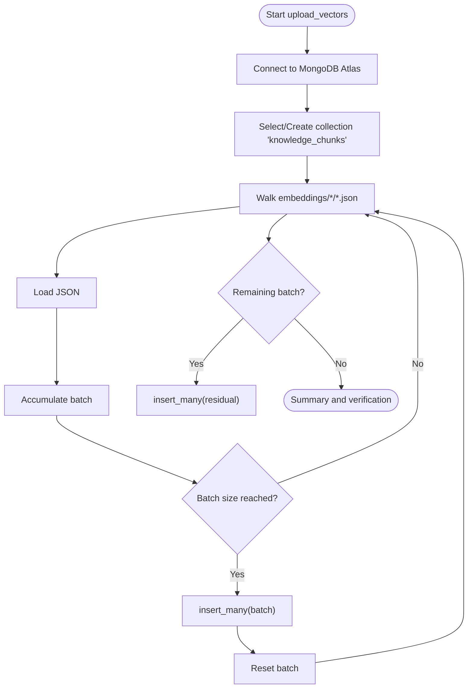
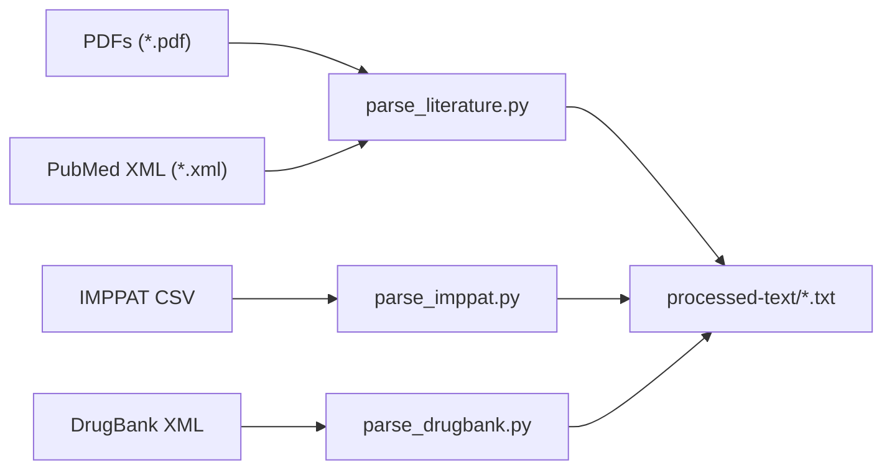
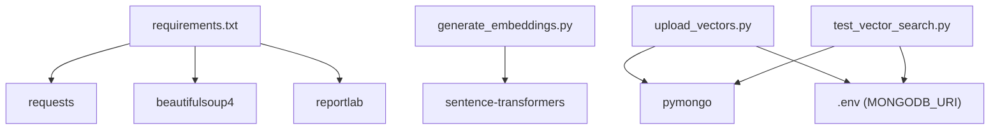

# Data Processing Pipelines

<cite>
**Referenced Files in This Document**
- [chunk_text.py](file://backend/knowledge-base/scripts/chunk_text.py)
- [generate_embeddings.py](file://backend/knowledge-base/scripts/generate_embeddings.py)
- [upload_vectors.py](file://backend/knowledge-base/scripts/upload_vectors.py)
- [parse_literature.py](file://backend/knowledge-base/scripts/parse_literature.py)
- [download_real_pdfs.py](file://backend/knowledge-base/scripts/download_real_pdfs.py)
- [fetch_data.py](file://backend/knowledge-base/scripts/fetch_data.py)
- [parse_drugbank.py](file://backend/knowledge-base/scripts/parse_drugbank.py)
- [parse_imppat.py](file://backend/knowledge-base/scripts/parse_imppat.py)
- [test_vector_search.py](file://backend/knowledge-base/scripts/test_vector_search.py)
- [requirements.txt](file://backend/knowledge-base/scripts/requirements.txt)
- [ATLAS_VECTOR_CONFIG_GUIDE.md](file://backend/knowledge-base/ATLAS_VECTOR_CONFIG_GUIDE.md)
- [MANUAL_DATA_DOWNLOAD_GUIDE.md](file://backend/knowledge-base/MANUAL_DATA_DOWNLOAD_GUIDE.md)
- [drugbank/README.md](file://backend/knowledge-base/drugbank/README.md)
- [imppat/README.md](file://backend/knowledge-base/imppat/README.md)
- [processed-text/literature_processed.txt](file://backend/knowledge-base/processed-text/literature_processed.txt)
- [chunks/master_index.json](file://backend/knowledge-base/chunks/master_index.json)
</cite>

## Table of Contents
1. [Introduction](#introduction)
2. [Project Structure](#project-structure)
3. [Core Components](#core-components)
4. [Architecture Overview](#architecture-overview)
5. [Detailed Component Analysis](#detailed-component-analysis)
6. [Dependency Analysis](#dependency-analysis)
7. [Performance Considerations](#performance-considerations)
8. [Troubleshooting Guide](#troubleshooting-guide)
9. [Conclusion](#conclusion)
10. [Appendices](#appendices)

## Introduction
This document describes VaidyaSetu’s end-to-end data processing pipelines and ETL workflows. It covers:
- Text chunking with sliding windows and metadata injection
- Embedding generation using transformer models
- Vector upload to MongoDB Atlas with batch processing
- Literature parsing for multiple medical sources (PDFs and XML)
- PDF downloading automation and data normalization
- Batch processing architecture, error handling, and retry strategies
- Pipeline orchestration, dependency management, and monitoring
- Requirements, environment setup, and execution workflows
- Examples for large datasets, memory optimization, and parallel strategies
- Data quality validation, transformation rules, and consistency checks

## Project Structure
The knowledge base pipeline is organized under backend/knowledge-base with:
- scripts/: Python ETL scripts implementing each stage
- processed-text/: intermediate normalized text records
- chunks/: chunked JSON records with metadata and optional embeddings
- embeddings/: embedding vectors attached to chunk JSONs
- vector-store/: Atlas collection for vector search
- Source-specific directories: icmr, ayush, who, ccrh, pubmed, drugbank, imppat

**Diagram sources**
- [chunk_text.py:1-172](file://backend/knowledge-base/scripts/chunk_text.py#L1-L172)
- [generate_embeddings.py:1-117](file://backend/knowledge-base/scripts/generate_embeddings.py#L1-L117)
- [upload_vectors.py:1-105](file://backend/knowledge-base/scripts/upload_vectors.py#L1-L105)
- [parse_literature.py:1-118](file://backend/knowledge-base/scripts/parse_literature.py#L1-L118)
- [parse_drugbank.py:1-74](file://backend/knowledge-base/scripts/parse_drugbank.py#L1-L74)
- [parse_imppat.py:1-56](file://backend/knowledge-base/scripts/parse_imppat.py#L1-L56)

**Section sources**
- [chunk_text.py:1-172](file://backend/knowledge-base/scripts/chunk_text.py#L1-L172)
- [generate_embeddings.py:1-117](file://backend/knowledge-base/scripts/generate_embeddings.py#L1-L117)
- [upload_vectors.py:1-105](file://backend/knowledge-base/scripts/upload_vectors.py#L1-L105)
- [parse_literature.py:1-118](file://backend/knowledge-base/scripts/parse_literature.py#L1-L118)
- [parse_drugbank.py:1-74](file://backend/knowledge-base/scripts/parse_drugbank.py#L1-L74)
- [parse_imppat.py:1-56](file://backend/knowledge-base/scripts/parse_imppat.py#L1-L56)

## Core Components
- Data acquisition and normalization
  - fetch_data.py: Downloads open-access PubMed XML and generates synthetic PDFs for guidelines
  - download_real_pdfs.py: Attempts to download real PDFs from trusted sources
  - parse_literature.py: Extracts text from PDFs and parses PubMed XML into unified records
  - parse_drugbank.py: Parses structured XML into readable drug profiles
  - parse_imppat.py: Parses CSV into standardized plant and interaction records
- Text normalization and chunking
  - chunk_text.py: Sliding-window chunking with overlap, metadata injection, and master index generation
- Embedding generation
  - generate_embeddings.py: Batch inference using sentence-transformers, dimension validation, and JSON augmentation
- Vector upload and search
  - upload_vectors.py: Bulk insert into MongoDB Atlas collection
  - test_vector_search.py: Vector similarity search using Atlas aggregation
  - ATLAS_VECTOR_CONFIG_GUIDE.md: Required index configuration

**Section sources**
- [fetch_data.py:1-111](file://backend/knowledge-base/scripts/fetch_data.py#L1-L111)
- [download_real_pdfs.py:1-45](file://backend/knowledge-base/scripts/download_real_pdfs.py#L1-L45)
- [parse_literature.py:1-118](file://backend/knowledge-base/scripts/parse_literature.py#L1-L118)
- [parse_drugbank.py:1-74](file://backend/knowledge-base/scripts/parse_drugbank.py#L1-L74)
- [parse_imppat.py:1-56](file://backend/knowledge-base/scripts/parse_imppat.py#L1-L56)
- [chunk_text.py:1-172](file://backend/knowledge-base/scripts/chunk_text.py#L1-L172)
- [generate_embeddings.py:1-117](file://backend/knowledge-base/scripts/generate_embeddings.py#L1-L117)
- [upload_vectors.py:1-105](file://backend/knowledge-base/scripts/upload_vectors.py#L1-L105)
- [test_vector_search.py:1-79](file://backend/knowledge-base/scripts/test_vector_search.py#L1-L79)
- [ATLAS_VECTOR_CONFIG_GUIDE.md:1-46](file://backend/knowledge-base/ATLAS_VECTOR_CONFIG_GUIDE.md#L1-L46)

## Architecture Overview
The pipeline is a staged ETL process orchestrated by Python scripts. It reads from source directories, normalizes and chunks text, generates embeddings, and uploads vectors to MongoDB Atlas for semantic search.

**Diagram sources**
- [fetch_data.py:1-111](file://backend/knowledge-base/scripts/fetch_data.py#L1-L111)
- [download_real_pdfs.py:1-45](file://backend/knowledge-base/scripts/download_real_pdfs.py#L1-L45)
- [parse_literature.py:1-118](file://backend/knowledge-base/scripts/parse_literature.py#L1-L118)
- [parse_drugbank.py:1-74](file://backend/knowledge-base/scripts/parse_drugbank.py#L1-L74)
- [parse_imppat.py:1-56](file://backend/knowledge-base/scripts/parse_imppat.py#L1-L56)
- [chunk_text.py:1-172](file://backend/knowledge-base/scripts/chunk_text.py#L1-L172)
- [generate_embeddings.py:1-117](file://backend/knowledge-base/scripts/generate_embeddings.py#L1-L117)
- [upload_vectors.py:1-105](file://backend/knowledge-base/scripts/upload_vectors.py#L1-L105)

## Detailed Component Analysis

### Text Chunking Algorithm
Implements a sliding window with overlap to preserve context while managing token budgets. It:
- Reads unified processed-text files
- Splits records by a standard delimiter
- Applies structured-chunking for short structured records and sliding-window chunking for long unstructured text
- Injects rich metadata (source, title, sequence number, content type, language)
- Writes chunk JSONs and updates a master index with file paths

**Diagram sources**
- [chunk_text.py:69-123](file://backend/knowledge-base/scripts/chunk_text.py#L69-L123)
- [chunk_text.py:23-34](file://backend/knowledge-base/scripts/chunk_text.py#L23-L34)
- [chunk_text.py:36-67](file://backend/knowledge-base/scripts/chunk_text.py#L36-L67)

**Section sources**
- [chunk_text.py:1-172](file://backend/knowledge-base/scripts/chunk_text.py#L1-L172)
- [chunks/master_index.json:1-200](file://backend/knowledge-base/chunks/master_index.json#L1-L200)

### Embedding Generation Using Transformer Models
Generates dense vectors using a sentence-transformers model:
- Initializes model and performs a sanity check on vector dimensions
- Loads the master index and iterates in batches
- Loads chunk JSON payloads, extracts texts, runs batch inference, and writes augmented JSONs with embeddings and model metadata

**Diagram sources**
- [generate_embeddings.py:40-117](file://backend/knowledge-base/scripts/generate_embeddings.py#L40-L117)

**Section sources**
- [generate_embeddings.py:1-117](file://backend/knowledge-base/scripts/generate_embeddings.py#L1-L117)

### Vector Upload to MongoDB Atlas
Bulk inserts embedding-ready JSONs into a MongoDB Atlas collection:
- Reads all embedding JSONs recursively from the embeddings directory
- Batches inserts and reports counts
- Validates upload completeness and collection size

**Diagram sources**
- [upload_vectors.py:30-105](file://backend/knowledge-base/scripts/upload_vectors.py#L30-L105)

**Section sources**
- [upload_vectors.py:1-105](file://backend/knowledge-base/scripts/upload_vectors.py#L1-L105)

### Literature Parsing Workflows
- PDF extraction: Iterates over ICMR, AYUSH, WHO, CCRH directories, extracts text per page, cleans artifacts, and writes unified records
- PubMed XML parsing: Reads article titles and abstracts/body, synthesizes paragraphs, and writes unified records
- IMPPAT CSV parsing: Reads standardized columns and synthesizes readable paragraphs
- DrugBank XML parsing: Extracts drug names, mechanisms, and interactions, synthesizes readable paragraphs

**Diagram sources**
- [parse_literature.py:31-118](file://backend/knowledge-base/scripts/parse_literature.py#L31-L118)
- [parse_imppat.py:8-56](file://backend/knowledge-base/scripts/parse_imppat.py#L8-L56)
- [parse_drugbank.py:8-74](file://backend/knowledge-base/scripts/parse_drugbank.py#L8-L74)

**Section sources**
- [parse_literature.py:1-118](file://backend/knowledge-base/scripts/parse_literature.py#L1-L118)
- [parse_imppat.py:1-56](file://backend/knowledge-base/scripts/parse_imppat.py#L1-L56)
- [parse_drugbank.py:1-74](file://backend/knowledge-base/scripts/parse_drugbank.py#L1-L74)
- [processed-text/literature_processed.txt:1-37](file://backend/knowledge-base/processed-text/literature_processed.txt#L1-L37)

### PDF Downloading Automation
Attempts to download trusted PDFs with a user-agent header and streaming to avoid timeouts. Includes explicit failure logging and status code checks.

**Section sources**
- [download_real_pdfs.py:1-45](file://backend/knowledge-base/scripts/download_real_pdfs.py#L1-L45)

### Data Normalization Procedures
Normalization occurs at multiple stages:
- Text cleaning: Removes excessive whitespace, page numbers, and headers/footers
- Unified record format: Adds metadata (Source, Document/Record, Content) for downstream chunking
- Structured-to-text synthesis: Converts structured XML/CSV into readable paragraphs
- Metadata injection: Adds chunk_id, source_database, document_title, sequence number, content_type, language

**Section sources**
- [parse_literature.py:23-29](file://backend/knowledge-base/scripts/parse_literature.py#L23-L29)
- [parse_imppat.py:38-48](file://backend/knowledge-base/scripts/parse_imppat.py#L38-L48)
- [parse_drugbank.py:56-66](file://backend/knowledge-base/scripts/parse_drugbank.py#L56-L66)
- [chunk_text.py:23-34](file://backend/knowledge-base/scripts/chunk_text.py#L23-L34)

### Batch Processing Architecture
- Chunking: Single-pass over processed-text files, writing per-chunk JSONs and a master index
- Embeddings: Batch iteration over master index entries, loading payloads, batching texts, inference, and writing augmented JSONs
- Upload: Recursive walk over embeddings directory, batching insert_many operations

**Section sources**
- [chunk_text.py:125-172](file://backend/knowledge-base/scripts/chunk_text.py#L125-L172)
- [generate_embeddings.py:52-105](file://backend/knowledge-base/scripts/generate_embeddings.py#L52-L105)
- [upload_vectors.py:47-86](file://backend/knowledge-base/scripts/upload_vectors.py#L47-L86)

### Error Handling Strategies and Retry Mechanisms
- Robust file existence checks and graceful skips
- Try/catch around file loads and model inference
- Detailed error messages and counters for failures
- No automatic retries in current scripts; designed for idempotent writes and manual reruns

**Section sources**
- [chunk_text.py:69-76](file://backend/knowledge-base/scripts/chunk_text.py#L69-L76)
- [generate_embeddings.py:73-104](file://backend/knowledge-base/scripts/generate_embeddings.py#L73-L104)
- [upload_vectors.py:78-80](file://backend/knowledge-base/scripts/upload_vectors.py#L78-L80)

### Pipeline Orchestration, Dependency Management, and Monitoring
- Orchestration: Scripts are designed to be run sequentially in documented order
- Dependencies: Python libraries declared in requirements.txt; environment variables for MongoDB connection
- Monitoring: Verbose prints for progress, timing, and summaries; Atlas index configuration required for vector search

**Section sources**
- [requirements.txt:1-4](file://backend/knowledge-base/scripts/requirements.txt#L1-L4)
- [ATLAS_VECTOR_CONFIG_GUIDE.md:1-46](file://backend/knowledge-base/ATLAS_VECTOR_CONFIG_GUIDE.md#L1-L46)
- [generate_embeddings.py:106-114](file://backend/knowledge-base/scripts/generate_embeddings.py#L106-L114)
- [upload_vectors.py:87-102](file://backend/knowledge-base/scripts/upload_vectors.py#L87-L102)

### Requirements Specification and Environment Setup
- Python packages: requests, beautifulsoup4, reportlab
- MongoDB Atlas: Requires MONGODB_URI environment variable; collection and vector index configured externally
- Manual data downloads: IMPPAT and DrugBank require manual acquisition due to licensing and anti-bot measures

**Section sources**
- [requirements.txt:1-4](file://backend/knowledge-base/scripts/requirements.txt#L1-L4)
- [MANUAL_DATA_DOWNLOAD_GUIDE.md:1-70](file://backend/knowledge-base/MANUAL_DATA_DOWNLOAD_GUIDE.md#L1-L70)
- [drugbank/README.md:1-26](file://backend/knowledge-base/drugbank/README.md#L1-L26)
- [imppat/README.md:1-27](file://backend/knowledge-base/imppat/README.md#L1-L27)

### Execution Workflows
- Phase 1: Data acquisition
  - fetch_data.py: Fetches PubMed XML and generates synthetic PDFs
  - download_real_pdfs.py: Attempts to download real PDFs
- Phase 2: Parsing and normalization
  - parse_literature.py, parse_imppat.py, parse_drugbank.py
- Phase 3: Chunking and indexing
  - chunk_text.py
- Phase 4: Embedding generation
  - generate_embeddings.py
- Phase 5: Vector upload
  - upload_vectors.py
- Phase 6: Validation
  - test_vector_search.py

**Section sources**
- [fetch_data.py:107-111](file://backend/knowledge-base/scripts/fetch_data.py#L107-L111)
- [parse_literature.py:115-118](file://backend/knowledge-base/scripts/parse_literature.py#L115-L118)
- [parse_imppat.py:54-56](file://backend/knowledge-base/scripts/parse_imppat.py#L54-L56)
- [parse_drugbank.py:72-74](file://backend/knowledge-base/scripts/parse_drugbank.py#L72-L74)
- [chunk_text.py:170-172](file://backend/knowledge-base/scripts/chunk_text.py#L170-L172)
- [generate_embeddings.py:115-117](file://backend/knowledge-base/scripts/generate_embeddings.py#L115-L117)
- [upload_vectors.py:103-105](file://backend/knowledge-base/scripts/upload_vectors.py#L103-L105)
- [test_vector_search.py:76-79](file://backend/knowledge-base/scripts/test_vector_search.py#L76-L79)

### Examples: Processing Large Datasets
- Chunking: Use sliding window with overlap to manage long documents; adjust CHUNK_SIZE and CHUNK_OVERLAP for token budget
- Embeddings: Increase BATCH_SIZE cautiously; monitor memory usage; ensure model dimension matches index expectations
- Upload: Tune BATCH_SIZE for insert_many; verify final residual batch

**Section sources**
- [chunk_text.py:10-11](file://backend/knowledge-base/scripts/chunk_text.py#L10-L11)
- [generate_embeddings.py:52](file://backend/knowledge-base/scripts/generate_embeddings.py#L52)
- [upload_vectors.py:47](file://backend/knowledge-base/scripts/upload_vectors.py#L47)

### Memory Optimization Techniques
- Streaming downloads and incremental writes
- Batch processing with controlled batch sizes
- Avoid loading entire directories into memory; process iteratively

**Section sources**
- [download_real_pdfs.py:19-28](file://backend/knowledge-base/scripts/download_real_pdfs.py#L19-L28)
- [generate_embeddings.py:59-61](file://backend/knowledge-base/scripts/generate_embeddings.py#L59-L61)
- [upload_vectors.py:54-86](file://backend/knowledge-base/scripts/upload_vectors.py#L54-L86)

### Parallel Processing Strategies
- Multi-process workers can be added around independent tasks (e.g., parallel PDF parsing or embedding batches) with careful file locking and shared storage
- Current scripts are single-threaded; parallelism can be introduced at the batch level or by splitting input sets

[No sources needed since this section provides general guidance]

### Data Quality Validation, Transformation Rules, and Consistency Checks
- Dimension validation: Embedding dimension checked against expected value before proceeding
- Index completeness: Master index tracks chunk_id, source, title, sequence, and filepath
- Atlas index alignment: Vector index fields and similarity metric must match stored embedding fields
- Record integrity: Structured parsers validate presence of required fields and synthesize readable content

**Section sources**
- [generate_embeddings.py:28-30](file://backend/knowledge-base/scripts/generate_embeddings.py#L28-L30)
- [chunks/master_index.json:1-200](file://backend/knowledge-base/chunks/master_index.json#L1-L200)
- [ATLAS_VECTOR_CONFIG_GUIDE.md:21-40](file://backend/knowledge-base/ATLAS_VECTOR_CONFIG_GUIDE.md#L21-L40)
- [parse_imppat.py:38-48](file://backend/knowledge-base/scripts/parse_imppat.py#L38-L48)
- [parse_drugbank.py:56-66](file://backend/knowledge-base/scripts/parse_drugbank.py#L56-L66)

## Dependency Analysis
External dependencies and integration points:
- requests: HTTP fetching for PubMed and PDF downloads
- beautifulsoup4: XML/HTML parsing
- reportlab: PDF generation for synthetic documents
- sentence-transformers: Embedding model
- pymongo: MongoDB Atlas connectivity
- python-dotenv: Environment variable loading

**Diagram sources**
- [requirements.txt:1-4](file://backend/knowledge-base/scripts/requirements.txt#L1-L4)
- [generate_embeddings.py:4](file://backend/knowledge-base/scripts/generate_embeddings.py#L4)
- [upload_vectors.py:4](file://backend/knowledge-base/scripts/upload_vectors.py#L4)
- [test_vector_search.py:4](file://backend/knowledge-base/scripts/test_vector_search.py#L4)

**Section sources**
- [requirements.txt:1-4](file://backend/knowledge-base/scripts/requirements.txt#L1-L4)
- [generate_embeddings.py:1-117](file://backend/knowledge-base/scripts/generate_embeddings.py#L1-L117)
- [upload_vectors.py:1-105](file://backend/knowledge-base/scripts/upload_vectors.py#L1-L105)
- [test_vector_search.py:1-79](file://backend/knowledge-base/scripts/test_vector_search.py#L1-L79)

## Performance Considerations
- Optimize batch sizes for embedding and upload to balance throughput and memory footprint
- Use streaming for large downloads and incremental writes
- Ensure vector index similarity metric and dimensions align with model output
- Monitor Atlas write performance and index provisioning time

[No sources needed since this section provides general guidance]

## Troubleshooting Guide
- Missing MONGODB_URI: Ensure environment variable is set and accessible to upload/test scripts
- Atlas index not configured: Follow ATLAS_VECTOR_CONFIG_GUIDE to create collection and vector index
- Empty or missing chunks: Verify chunk_text.py ran after parsers; confirm master index exists
- Embedding dimension mismatch: Confirm model outputs 384-dimension vectors
- Permission errors on upload: Check Atlas credentials and cluster permissions

**Section sources**
- [upload_vectors.py:14-28](file://backend/knowledge-base/scripts/upload_vectors.py#L14-L28)
- [ATLAS_VECTOR_CONFIG_GUIDE.md:1-46](file://backend/knowledge-base/ATLAS_VECTOR_CONFIG_GUIDE.md#L1-L46)
- [generate_embeddings.py:28-30](file://backend/knowledge-base/scripts/generate_embeddings.py#L28-L30)

## Conclusion
The VaidyaSetu knowledge base pipeline provides a robust, modular ETL workflow spanning data acquisition, normalization, chunking, embedding, and vector upload. By following the documented order, environment setup, and Atlas configuration, teams can reliably process large volumes of heterogeneous medical sources and power semantic search capabilities.

[No sources needed since this section summarizes without analyzing specific files]

## Appendices

### Appendix A: Vector Search Validation
Use the test script to validate vector search after uploading vectors and configuring the Atlas index.

**Section sources**
- [test_vector_search.py:18-79](file://backend/knowledge-base/scripts/test_vector_search.py#L18-L79)
- [ATLAS_VECTOR_CONFIG_GUIDE.md:13-46](file://backend/knowledge-base/ATLAS_VECTOR_CONFIG_GUIDE.md#L13-L46)