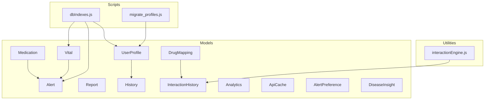
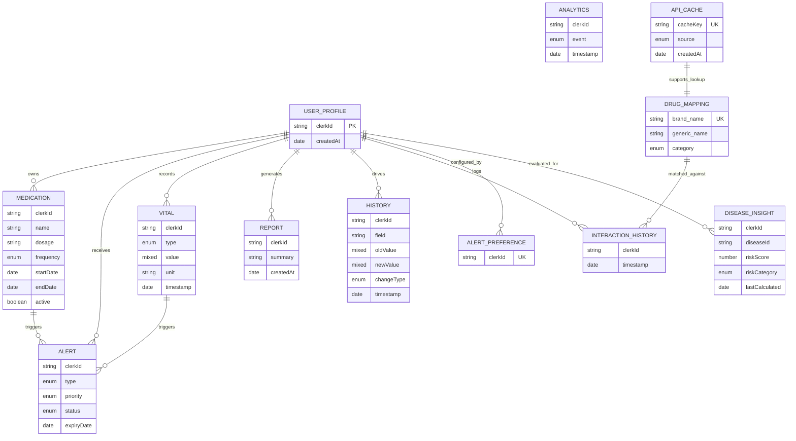
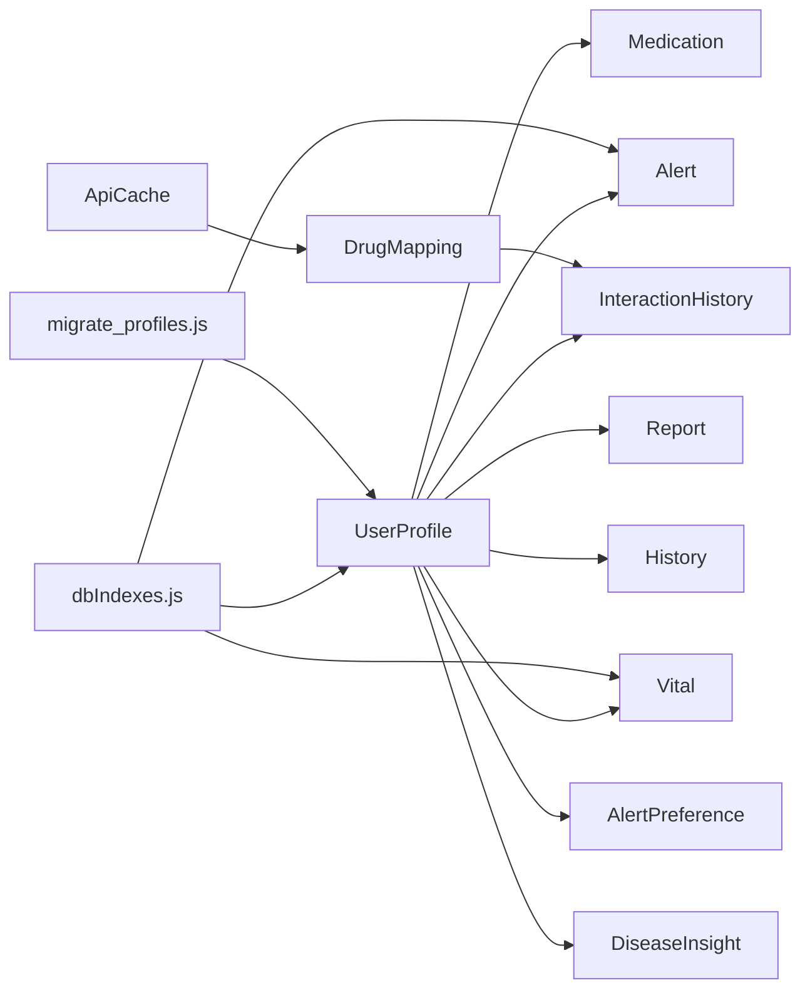

# Database Schema Design

<cite>
**Referenced Files in This Document**
- [UserProfile.js](file://backend/src/models/UserProfile.js)
- [Medication.js](file://backend/src/models/Medication.js)
- [Alert.js](file://backend/src/models/Alert.js)
- [Vital.js](file://backend/src/models/Vital.js)
- [Report.js](file://backend/src/models/Report.js)
- [History.js](file://backend/src/models/History.js)
- [InteractionHistory.js](file://backend/src/models/InteractionHistory.js)
- [DrugMapping.js](file://backend/src/models/DrugMapping.js)
- [Analytics.js](file://backend/src/models/Analytics.js)
- [ApiCache.js](file://backend/src/models/ApiCache.js)
- [AlertPreference.js](file://backend/src/models/AlertPreference.js)
- [DiseaseInsight.js](file://backend/src/models/DiseaseInsight.js)
- [dbIndexes.js](file://backend/src/scripts/dbIndexes.js)
- [migrate_profiles.js](file://backend/src/scripts/migrate_profiles.js)
- [interactionEngine.js](file://backend/src/utils/interactionEngine.js)
</cite>

## Table of Contents
1. [Introduction](#introduction)
2. [Project Structure](#project-structure)
3. [Core Components](#core-components)
4. [Architecture Overview](#architecture-overview)
5. [Detailed Component Analysis](#detailed-component-analysis)
6. [Dependency Analysis](#dependency-analysis)
7. [Performance Considerations](#performance-considerations)
8. [Troubleshooting Guide](#troubleshooting-guide)
9. [Conclusion](#conclusion)
10. [Appendices](#appendices)

## Introduction
This document provides comprehensive database schema documentation for VaidyaSetu’s MongoDB implementation. It covers entity definitions, field-level specifications, validation rules, indexing strategies, and query optimization patterns for the following models: UserProfile, Medication, Alert, Vital, Report, History, InteractionHistory, DrugMapping, Analytics, and ApiCache. It also outlines schema evolution practices, migration procedures, and operational guidance for maintaining data integrity and performance.

## Project Structure
The database layer is implemented using Mongoose ODM models under backend/src/models. Supporting scripts manage indexing and migrations. Utility modules encapsulate domain logic such as drug interaction matching.

**Diagram sources**
- [UserProfile.js:1-175](file://backend/src/models/UserProfile.js#L1-L175)
- [Medication.js:1-46](file://backend/src/models/Medication.js#L1-L46)
- [Alert.js:1-48](file://backend/src/models/Alert.js#L1-L48)
- [Vital.js:1-55](file://backend/src/models/Vital.js#L1-L55)
- [Report.js:1-50](file://backend/src/models/Report.js#L1-L50)
- [History.js:1-44](file://backend/src/models/History.js#L1-L44)
- [InteractionHistory.js:1-28](file://backend/src/models/InteractionHistory.js#L1-L28)
- [DrugMapping.js:1-37](file://backend/src/models/DrugMapping.js#L1-L37)
- [Analytics.js:1-25](file://backend/src/models/Analytics.js#L1-L25)
- [ApiCache.js:1-40](file://backend/src/models/ApiCache.js#L1-L40)
- [AlertPreference.js:1-44](file://backend/src/models/AlertPreference.js#L1-L44)
- [DiseaseInsight.js:1-89](file://backend/src/models/DiseaseInsight.js#L1-L89)
- [dbIndexes.js:1-34](file://backend/src/scripts/dbIndexes.js#L1-L34)
- [migrate_profiles.js:1-77](file://backend/src/scripts/migrate_profiles.js#L1-L77)
- [interactionEngine.js:1-71](file://backend/src/utils/interactionEngine.js#L1-L71)

**Section sources**
- [UserProfile.js:1-175](file://backend/src/models/UserProfile.js#L1-L175)
- [Medication.js:1-46](file://backend/src/models/Medication.js#L1-L46)
- [Alert.js:1-48](file://backend/src/models/Alert.js#L1-L48)
- [Vital.js:1-55](file://backend/src/models/Vital.js#L1-L55)
- [Report.js:1-50](file://backend/src/models/Report.js#L1-L50)
- [History.js:1-44](file://backend/src/models/History.js#L1-L44)
- [InteractionHistory.js:1-28](file://backend/src/models/InteractionHistory.js#L1-L28)
- [DrugMapping.js:1-37](file://backend/src/models/DrugMapping.js#L1-L37)
- [Analytics.js:1-25](file://backend/src/models/Analytics.js#L1-L25)
- [ApiCache.js:1-40](file://backend/src/models/ApiCache.js#L1-L40)
- [AlertPreference.js:1-44](file://backend/src/models/AlertPreference.js#L1-L44)
- [DiseaseInsight.js:1-89](file://backend/src/models/DiseaseInsight.js#L1-L89)
- [dbIndexes.js:1-34](file://backend/src/scripts/dbIndexes.js#L1-L34)
- [migrate_profiles.js:1-77](file://backend/src/scripts/migrate_profiles.js#L1-L77)
- [interactionEngine.js:1-71](file://backend/src/utils/interactionEngine.js#L1-L71)

## Core Components
This section summarizes each model’s purpose, key fields, validation rules, and indexes.

- UserProfile
  - Purpose: Stores user biographical, lifestyle, dietary, medical, and platform settings data with a normalized “Field” structure for each attribute.
  - Key fields: clerkId (unique), name, age, gender, height, weight, bmi, bmiCategory, activityLevel, sleepHours, stressLevel, isSmoker, alcoholConsumption, dietType, sugarIntake, saltIntake, eatsLeafyGreens, eatsFruits, junkFoodFrequency, allergies, medicalHistory, otherConditions, onboardingComplete, dataQualityScore, dataQualityLabel, createdAt, settings (nested), emergency symptoms, thyroid/metabolic indicators, women’s health indicators, respiratory/environmental factors, mental health indicators, kidney/liver indicators, waistCircumference, familyHistoryDiabetes, ironSupplementation, occupationalDustExposure, savedDoctors, currentLocation, cardMeta.
  - Validation: Required fields per “Field” schema; enums for categorical fields; defaults for booleans and units.
  - Indexes: None defined in schema; dbIndexes script creates a unique index on clerkId.

- Medication
  - Purpose: Tracks prescribed and self-entered medications with scheduling and adherence metrics.
  - Key fields: clerkId (indexed), name, dosage, frequency (enum), timings, startDate, endDate, active, lastTaken, adherence (nested totals).
  - Validation: Required name/dosage/frequency; enum for frequency; defaults for active/adherence.
  - Indexes: clerkId indexed; timestamps enabled.

- Alert
  - Purpose: Stores user-facing notifications with priority, status, and optional expiry.
  - Key fields: clerkId (indexed), type (indexed), priority (enum, indexed), title, description, status (enum, indexed), actionUrl, actionText, expiryDate.
  - Validation: Required type/title/description; enums for priority/status.
  - Indexes: clerkId, type, priority, status indexed; createdAt indexed for expiry processing.

- Vital
  - Purpose: Captures patient vital signs and measurements with flexible value typing and meal context.
  - Key fields: clerkId (indexed), type (enum, indexed), value (mixed), unit, timestamp (indexed), source (enum), notes, mealContext (enum).
  - Validation: Required type/value/unit; enums for type/source/mealContext.
  - Indexes: clerkId, type, timestamp indexed; timestamps enabled.

- Report
  - Purpose: Aggregated health reports with dynamic advice maps and risk scores.
  - Key fields: clerkId, summary, advice (mixed map), general_tips, disclaimer, risk_scores (mixed map), category_insights (mixed map), mitigations (mixed map), createdAt.
  - Validation: Required summary/general_tips/disclaimer; mixed maps default to empty.
  - Indexes: None defined in schema.

- History
  - Purpose: Audit trail of field-level changes with intent, notes, and source attribution.
  - Key fields: clerkId (indexed), field, oldValue, newValue, changeType (enum), intent, notes, source (enum), unit, timestamp.
  - Validation: Required field/changeType; enums for changeType/source.
  - Indexes: compound (clerkId, timestamp desc) for timeline queries.

- InteractionHistory
  - Purpose: Records user inputs, matched medicines, detected interactions, and AI explanations.
  - Key fields: clerkId, inputMedicines, confirmedMedicines, foundInteractions (array of objects), timestamp.
  - Validation: None explicit; array fields for lists.
  - Indexes: None defined in schema.

- DrugMapping
  - Purpose: Maps brand names and aliases to generic names with categorization.
  - Key fields: brand_name (unique, indexed), brand_aliases (indexed array), generic_name (indexed), strength, combination_drug, components, manufacturer, category (enum).
  - Validation: Required brand_name/generic_name; unique constraint on brand_name; text index on brand_name/brand_aliases/generic_name.
  - Indexes: unique brand_name; text index; generic_name indexed; timestamps enabled.

- Analytics
  - Purpose: Event logging for product analytics and engagement tracking.
  - Key fields: clerkId, event (enum), diseaseId, metadata (mixed), timestamp.
  - Validation: Required event; enums for event types.
  - Indexes: None defined in schema.

- ApiCache
  - Purpose: Caches external API responses with TTL-based automatic cleanup.
  - Key fields: cacheKey (unique, indexed), source (enum), data (mixed), createdAt (TTL 24h).
  - Validation: Required cacheKey/source/data; enum for source.
  - Indexes: unique cacheKey; TTL index on createdAt.

- AlertPreference
  - Purpose: User preferences for alert channels and thresholds.
  - Key fields: clerkId (unique, indexed), preferences (array of objects with alertType and channel toggles), quietHours (enabled/start/end), customThresholds (blood pressure, glucose, heart rate, oxygen).
  - Validation: Required alertType; enums for alertType; defaults for booleans/time.
  - Indexes: unique clerkId; timestamps enabled.

- DiseaseInsight
  - Purpose: Risk scoring and mitigation insights per disease with factor breakdowns.
  - Key fields: clerkId (indexed), diseaseId (indexed), riskScore, riskCategory (enum), lastCalculated, algorithmVersion, factorBreakdown/mitigationSteps (arrays), dataCompleteness, reviewedAt, rawInputData.
  - Validation: Required riskScore/riskCategory; enums for categories; arrays for structured data.
  - Indexes: unique (clerkId, diseaseId); lastCalculated desc.

**Section sources**
- [UserProfile.js:1-175](file://backend/src/models/UserProfile.js#L1-L175)
- [Medication.js:1-46](file://backend/src/models/Medication.js#L1-L46)
- [Alert.js:1-48](file://backend/src/models/Alert.js#L1-L48)
- [Vital.js:1-55](file://backend/src/models/Vital.js#L1-L55)
- [Report.js:1-50](file://backend/src/models/Report.js#L1-L50)
- [History.js:1-44](file://backend/src/models/History.js#L1-L44)
- [InteractionHistory.js:1-28](file://backend/src/models/InteractionHistory.js#L1-L28)
- [DrugMapping.js:1-37](file://backend/src/models/DrugMapping.js#L1-L37)
- [Analytics.js:1-25](file://backend/src/models/Analytics.js#L1-L25)
- [ApiCache.js:1-40](file://backend/src/models/ApiCache.js#L1-L40)
- [AlertPreference.js:1-44](file://backend/src/models/AlertPreference.js#L1-L44)
- [DiseaseInsight.js:1-89](file://backend/src/models/DiseaseInsight.js#L1-L89)

## Architecture Overview
The schema supports a user-centric health data ecosystem with clear separation of concerns:
- User identity and profile data (UserProfile)
- Clinical events and reminders (Medication, Alert)
- Real-time and historical vitals (Vital)
- Aggregate insights and reports (Report, DiseaseInsight)
- Audit and change tracking (History)
- Safety checks and interaction logs (InteractionHistory, DrugMapping)
- Product analytics and caching (Analytics, ApiCache)
- Personalized alert preferences (AlertPreference)

**Diagram sources**
- [UserProfile.js:1-175](file://backend/src/models/UserProfile.js#L1-L175)
- [Medication.js:1-46](file://backend/src/models/Medication.js#L1-L46)
- [Alert.js:1-48](file://backend/src/models/Alert.js#L1-L48)
- [Vital.js:1-55](file://backend/src/models/Vital.js#L1-L55)
- [Report.js:1-50](file://backend/src/models/Report.js#L1-L50)
- [History.js:1-44](file://backend/src/models/History.js#L1-L44)
- [InteractionHistory.js:1-28](file://backend/src/models/InteractionHistory.js#L1-L28)
- [DrugMapping.js:1-37](file://backend/src/models/DrugMapping.js#L1-L37)
- [Analytics.js:1-25](file://backend/src/models/Analytics.js#L1-L25)
- [ApiCache.js:1-40](file://backend/src/models/ApiCache.js#L1-L40)
- [AlertPreference.js:1-44](file://backend/src/models/AlertPreference.js#L1-L44)
- [DiseaseInsight.js:1-89](file://backend/src/models/DiseaseInsight.js#L1-L89)

## Detailed Component Analysis

### UserProfile
- Structure: Nested “Field” schema for each attribute with value, lastUpdated, updateType, previousValue, and unit.
- Business constraints:
  - onboardingComplete defaults to true.
  - dataQualityScore and dataQualityLabel track profile completeness.
  - settings map controls UI and measurement preferences.
- Indexing: Unique index on clerkId enforced by dbIndexes script.

**Section sources**
- [UserProfile.js:1-175](file://backend/src/models/UserProfile.js#L1-L175)
- [dbIndexes.js:24-25](file://backend/src/scripts/dbIndexes.js#L24-L25)

### Medication
- Structure: Medication entries with scheduling (timings), adherence counters, and lifecycle dates.
- Business constraints:
  - frequency enum restricts intake patterns.
  - active flag enables/disables records.
- Indexing: clerkId indexed; timestamps enabled.

**Section sources**
- [Medication.js:1-46](file://backend/src/models/Medication.js#L1-L46)

### Alert
- Structure: Alert records with priority and status, optional action links, and expiry date.
- Business constraints:
  - priority and status enums standardize triage.
  - status defaults to unread.
- Indexing: clerkId, type, priority, status indexed; createdAt indexed for expiry processing.

**Section sources**
- [Alert.js:1-48](file://backend/src/models/Alert.js#L1-L48)
- [dbIndexes.js:17-19](file://backend/src/scripts/dbIndexes.js#L17-L19)

### Vital
- Structure: Mixed-value schema supporting scalars and structured objects (e.g., blood pressure).
- Business constraints:
  - type enum defines supported vitals.
  - mealContext and source define provenance.
- Indexing: clerkId, type, timestamp indexed; timestamps enabled.

**Section sources**
- [Vital.js:1-55](file://backend/src/models/Vital.js#L1-L55)
- [dbIndexes.js:21-22](file://backend/src/scripts/dbIndexes.js#L21-L22)

### Report
- Structure: Dynamic maps for advice, risk scores, and insights; flattened maps in serialization.
- Business constraints: Required summary, general_tips, disclaimer; mixed maps default to empty.

**Section sources**
- [Report.js:1-50](file://backend/src/models/Report.js#L1-L50)

### History
- Structure: Timeline of field-level changes with source and intent.
- Business constraints:
  - changeType enum captures update semantics.
  - source enum tracks origin (user/system/ai/google fit).
- Indexing: compound (clerkId, timestamp desc) optimized for timelines.

**Section sources**
- [History.js:1-44](file://backend/src/models/History.js#L1-L44)

### InteractionHistory
- Structure: Logs user inputs, matched medicines, and detected interactions with AI explanations.
- Business constraints: None explicit; array fields capture lists.

**Section sources**
- [InteractionHistory.js:1-28](file://backend/src/models/InteractionHistory.js#L1-L28)

### DrugMapping
- Structure: Brand-to-generic mapping with category and component details.
- Business constraints:
  - brand_name unique and indexed.
  - category enum restricts classification.
- Indexing: unique brand_name; text index on brand_name/brand_aliases/generic_name; generic_name indexed; timestamps enabled.

**Section sources**
- [DrugMapping.js:1-37](file://backend/src/models/DrugMapping.js#L1-L37)

### Analytics
- Structure: Event log with metadata and timestamp.
- Business constraints: event enum restricts allowed events.

**Section sources**
- [Analytics.js:1-25](file://backend/src/models/Analytics.js#L1-L25)

### ApiCache
- Structure: Normalized cache key, source, and payload with TTL.
- Business constraints:
  - cacheKey unique and indexed.
  - createdAt TTL set to 24 hours.

**Section sources**
- [ApiCache.js:1-40](file://backend/src/models/ApiCache.js#L1-L40)

### AlertPreference
- Structure: Preferences per alert type with channel toggles and quiet hours/thresholds.
- Business constraints:
  - alertType enum restricts supported alerts.
  - quietHours enforce scheduling windows.
- Indexing: unique clerkId; timestamps enabled.

**Section sources**
- [AlertPreference.js:1-44](file://backend/src/models/AlertPreference.js#L1-L44)

### DiseaseInsight
- Structure: Risk scoring, factor breakdowns, protective factors, missing data factors, and mitigation steps.
- Business constraints:
  - riskCategory enum standardizes risk levels.
  - unique (clerkId, diseaseId) prevents duplicates.
- Indexing: unique (clerkId, diseaseId); lastCalculated desc.

**Section sources**
- [DiseaseInsight.js:1-89](file://backend/src/models/DiseaseInsight.js#L1-L89)

## Dependency Analysis
- Identity and ownership:
  - UserProfile is the root identity entity; most collections are scoped by clerkId.
- Derived relationships:
  - Alerts can be triggered by Medication and Vital thresholds.
  - Reports aggregate from multiple sources (Vitals, Medications, Insights).
  - InteractionHistory depends on DrugMapping for name normalization.
  - ApiCache supports lookup stability for external integrations.
- Operational dependencies:
  - dbIndexes script enforces compound indexes for performance.
  - migrate_profiles script evolves legacy UserProfile fields to normalized “Field” schema and seeds History.

**Diagram sources**
- [dbIndexes.js:1-34](file://backend/src/scripts/dbIndexes.js#L1-L34)
- [migrate_profiles.js:1-77](file://backend/src/scripts/migrate_profiles.js#L1-L77)
- [UserProfile.js:1-175](file://backend/src/models/UserProfile.js#L1-L175)
- [Medication.js:1-46](file://backend/src/models/Medication.js#L1-L46)
- [Alert.js:1-48](file://backend/src/models/Alert.js#L1-L48)
- [Vital.js:1-55](file://backend/src/models/Vital.js#L1-L55)
- [Report.js:1-50](file://backend/src/models/Report.js#L1-L50)
- [History.js:1-44](file://backend/src/models/History.js#L1-L44)
- [InteractionHistory.js:1-28](file://backend/src/models/InteractionHistory.js#L1-L28)
- [DrugMapping.js:1-37](file://backend/src/models/DrugMapping.js#L1-L37)
- [ApiCache.js:1-40](file://backend/src/models/ApiCache.js#L1-L40)
- [AlertPreference.js:1-44](file://backend/src/models/AlertPreference.js#L1-L44)
- [DiseaseInsight.js:1-89](file://backend/src/models/DiseaseInsight.js#L1-L89)

**Section sources**
- [dbIndexes.js:1-34](file://backend/src/scripts/dbIndexes.js#L1-L34)
- [migrate_profiles.js:1-77](file://backend/src/scripts/migrate_profiles.js#L1-L77)

## Performance Considerations
- Indexing strategy
  - Compound indexes:
    - Alert: (clerkId, status) and createdAt desc for expiry processing.
    - Vital: (clerkId, timestamp desc) for recent readings.
    - UserProfile: unique (clerkId) for identity lookups.
  - Single-field indexes:
    - Alert.type, Alert.priority, Alert.status.
    - Vital.type, Vital.timestamp.
    - Medication.clerkId.
    - DrugMapping.brand_name (unique), generic_name, brand_aliases.
    - ApiCache.cacheKey (unique).
    - History: (clerkId, timestamp desc) already defined.
- TTL collections
  - ApiCache uses createdAt TTL to auto-expire stale entries.
- Query patterns
  - Timeline queries: sort by timestamp desc on Vitals and History.
  - User-scoped reads/writes: filter by clerkId.
  - Range scans: leverage indexes on type and status for Alerts.
- Aggregation
  - Use pipeline stages to group by type and compute rolling averages for vitals.
  - Join-like behavior: pre-normalize identifiers (e.g., DrugMapping) to minimize cross-collection joins.

**Section sources**
- [dbIndexes.js:1-34](file://backend/src/scripts/dbIndexes.js#L1-L34)
- [Alert.js:1-48](file://backend/src/models/Alert.js#L1-L48)
- [Vital.js:1-55](file://backend/src/models/Vital.js#L1-L55)
- [History.js:1-44](file://backend/src/models/History.js#L1-L44)
- [DrugMapping.js:1-37](file://backend/src/models/DrugMapping.js#L1-L37)
- [ApiCache.js:1-40](file://backend/src/models/ApiCache.js#L1-L40)

## Troubleshooting Guide
- Duplicate key errors on brand_name in DrugMapping
  - Cause: Attempting to insert non-unique brand_name.
  - Resolution: Ensure uniqueness or deduplicate prior to insert.
- Missing indexes causing slow queries
  - Symptom: Slow timeline or user-scoped lookups.
  - Resolution: Run dbIndexes script to create compound indexes.
- Stale API cache entries
  - Symptom: Outdated interaction or drug info.
  - Resolution: Rely on TTL (24h) or re-run cache population logic.
- Legacy UserProfile field format
  - Symptom: Numeric or scalar values instead of normalized “Field” objects.
  - Resolution: Run migrate_profiles script to normalize and populate History.

**Section sources**
- [DrugMapping.js:1-37](file://backend/src/models/DrugMapping.js#L1-L37)
- [dbIndexes.js:1-34](file://backend/src/scripts/dbIndexes.js#L1-L34)
- [ApiCache.js:1-40](file://backend/src/models/ApiCache.js#L1-L40)
- [migrate_profiles.js:1-77](file://backend/src/scripts/migrate_profiles.js#L1-L77)

## Conclusion
The VaidyaSetu MongoDB schema is designed around a user-centric model with strong indexing and clear separation of concerns. Compound indexes optimize common queries, while TTL and normalization improve reliability and performance. Migrations and scripts ensure schema evolution without downtime. Adhering to the outlined constraints and indexing strategies will maintain data integrity and scalability.

## Appendices

### Sample Data Structures
- UserProfile
  - Fields follow a normalized “Field” pattern with value, lastUpdated, updateType, previousValue, unit.
  - Example: { clerkId: "...", name: { value: "John Doe", lastUpdated: "...", updateType: "initial", previousValue: null, unit: "" }, settings: { language: "English", theme: "dark", ... } }
- Medication
  - Example: { clerkId: "...", name: "Paracetamol", dosage: "500mg", frequency: "daily", timings: ["09:00"], startDate: "...", endDate: "...", active: true, adherence: { totalDoses: 0, takenDoses: 0 } }
- Alert
  - Example: { clerkId: "...", type: "vital_out_of_range", priority: "high", status: "unread", title: "Blood Pressure High", description: "...", expiryDate: "..." }
- Vital
  - Example: { clerkId: "...", type: "blood_pressure", value: { systolic: 120, diastolic: 80 }, unit: "mmHg", timestamp: "...", source: "manual", mealContext: "fasting" }
- Report
  - Example: { clerkId: "...", summary: "...", advice: {}, general_tips: "...", disclaimer: "...", risk_scores: {}, category_insights: {}, mitigations: {} }
- History
  - Example: { clerkId: "...", field: "weight", oldValue: null, newValue: 70, changeType: "initial", source: "user", unit: "kg", timestamp: "..." }
- InteractionHistory
  - Example: { clerkId: "...", inputMedicines: ["Aspirin", "Turmeric"], confirmedMedicines: ["Aspirin", "Curcumin"], foundInteractions: [{ severity: "moderate", effect: "...", mechanism: "...", recommendation: "...", source: "AI", ai_explanation: "..." }], timestamp: "..." }
- DrugMapping
  - Example: { brand_name: "Crocin", brand_aliases: ["Paracetamol", "Panadol"], generic_name: "Paracetamol", strength: "500mg", combination_drug: false, manufacturer: "Johnson & Johnson", category: "Allopathy" }
- Analytics
  - Example: { clerkId: "...", event: "card_expand", diseaseId: "hypertension", metadata: {}, timestamp: "..." }
- ApiCache
  - Example: { cacheKey: "rxnav_paracetamol", source: "rxnav", data: { ... }, createdAt: "..." }
- AlertPreference
  - Example: { clerkId: "...", preferences: [{ alertType: "vital_out_of_range", pushEnabled: true, emailEnabled: false, inAppEnabled: true }], quietHours: { enabled: true, start: "22:00", end: "07:00" }, customThresholds: { systolicBP: { low: 90, high: 140 }, diastolicBP: { low: 60, high: 90 } } }
- DiseaseInsight
  - Example: { clerkId: "...", diseaseId: "diabetes", riskScore: 75, riskCategory: "Moderate", lastCalculated: "...", algorithmVersion: "1.0.0", factorBreakdown: [...], mitigationSteps: [...], dataCompleteness: 85, reviewedAt: "...", rawInputData: {} }

### Schema Evolution Practices
- Add new fields with defaults to preserve backward compatibility.
- Introduce compound indexes via dbIndexes script for new query patterns.
- Use migrations (e.g., migrate_profiles) to transform legacy structures into normalized forms.
- Maintain unique constraints on identity fields (e.g., UserProfile.clerkId, DrugMapping.brand_name).

**Section sources**
- [migrate_profiles.js:1-77](file://backend/src/scripts/migrate_profiles.js#L1-L77)
- [dbIndexes.js:1-34](file://backend/src/scripts/dbIndexes.js#L1-L34)

### Migration Procedures
- Pre-migration
  - Back up collections.
  - Verify indexes and constraints.
- Run migration
  - Execute migrate_profiles to normalize UserProfile fields and seed History entries.
- Post-migration
  - Validate migrated documents and confirm History entries.
  - Re-index if necessary and update application logic to use normalized fields.

**Section sources**
- [migrate_profiles.js:1-77](file://backend/src/scripts/migrate_profiles.js#L1-L77)

### Data Access Patterns and Aggregation Pipelines
- Timeline retrieval
  - Sort by timestamp desc on Vitals and History using existing indexes.
- User-scoped queries
  - Filter by clerkId for all collections.
- Interaction detection
  - Match inputs against DrugMapping text index; then check against interactions dataset.
- Reporting
  - Build Report from aggregated Vitals, Medications, and DiseaseInsight data.

**Section sources**
- [Vital.js:1-55](file://backend/src/models/Vital.js#L1-L55)
- [History.js:1-44](file://backend/src/models/History.js#L1-L44)
- [DrugMapping.js:1-37](file://backend/src/models/DrugMapping.js#L1-L37)
- [interactionEngine.js:1-71](file://backend/src/utils/interactionEngine.js#L1-L71)

### Complex Queries and Reporting Scenarios
- Top-risk diseases per user
  - Use DiseaseInsight with unique (clerkId, diseaseId) and sort by riskScore.
- Recent vitals trend
  - Filter by clerkId and timestamp window; group by type and compute averages.
- Alert triage
  - Filter by clerkId and status/priority; paginate and sort by createdAt desc.
- Interaction safety check
  - Match user inputs to DrugMapping text index; intersect with interactions dataset; surface severity and recommendations.

**Section sources**
- [DiseaseInsight.js:1-89](file://backend/src/models/DiseaseInsight.js#L1-L89)
- [Vital.js:1-55](file://backend/src/models/Vital.js#L1-L55)
- [Alert.js:1-48](file://backend/src/models/Alert.js#L1-L48)
- [DrugMapping.js:1-37](file://backend/src/models/DrugMapping.js#L1-L37)
- [interactionEngine.js:1-71](file://backend/src/utils/interactionEngine.js#L1-L71)