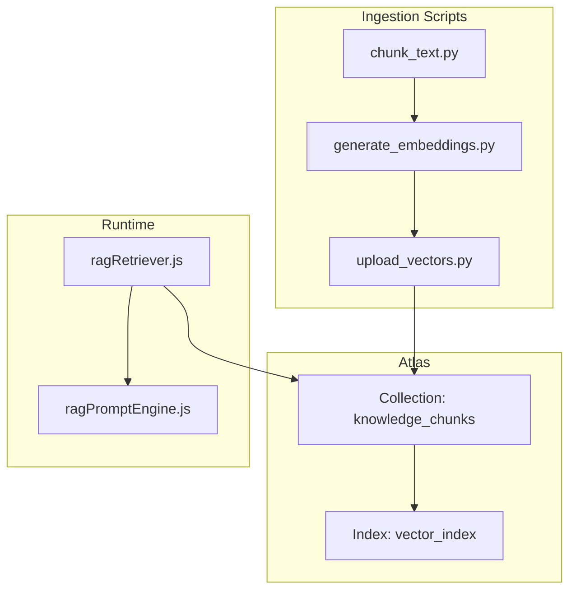
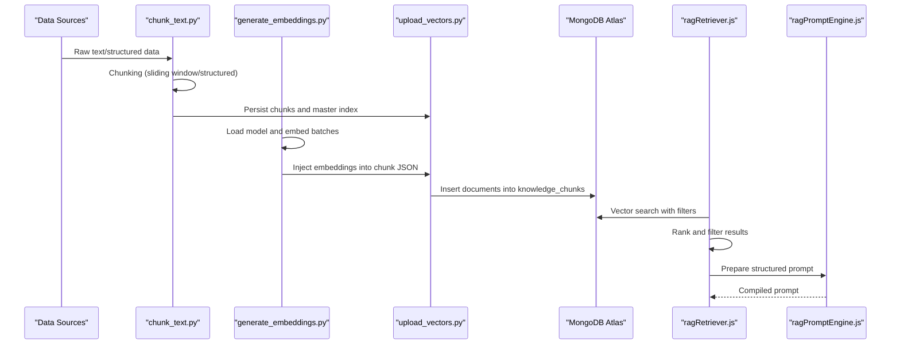
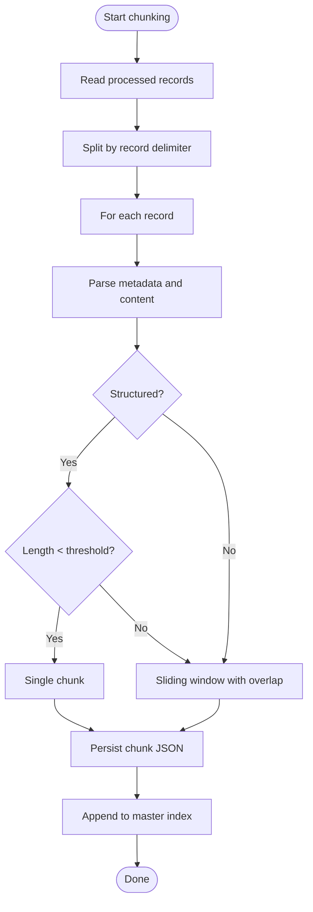
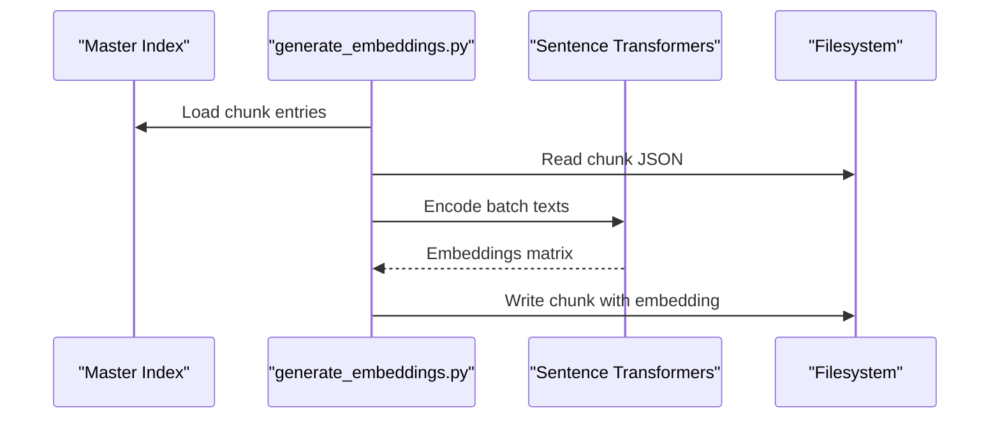
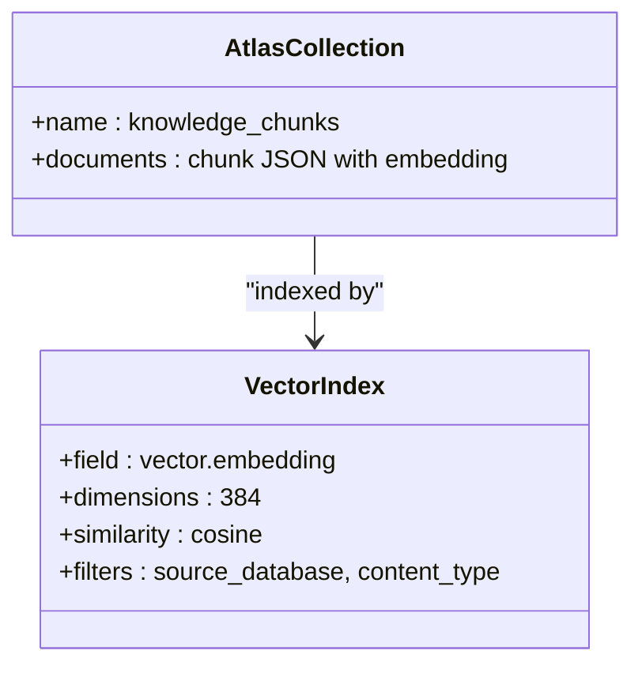
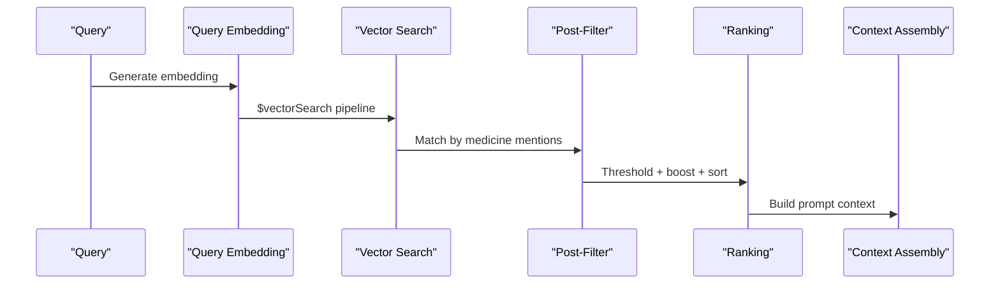
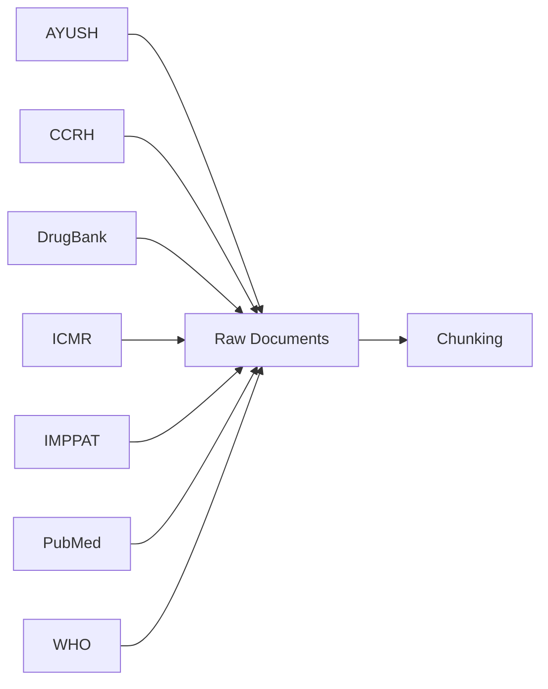
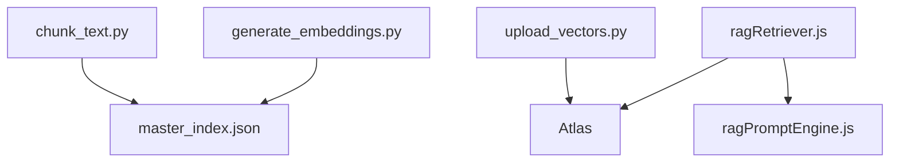

# Knowledge Base Management

<cite>
**Referenced Files in This Document**
- [ATLAS_VECTOR_CONFIG_GUIDE.md](file://backend/knowledge-base/ATLAS_VECTOR_CONFIG_GUIDE.md)
- [MANUAL_DATA_DOWNLOAD_GUIDE.md](file://backend/knowledge-base/MANUAL_DATA_DOWNLOAD_GUIDE.md)
- [DATA_SOURCES.md](file://DATA_SOURCES.md)
- [chunk_text.py](file://backend/knowledge-base/scripts/chunk_text.py)
- [generate_embeddings.py](file://backend/knowledge-base/scripts/generate_embeddings.py)
- [upload_vectors.py](file://backend/knowledge-base/scripts/upload_vectors.py)
- [test_vector_search.py](file://backend/knowledge-base/scripts/test_vector_search.py)
- [master_index.json](file://backend/knowledge-base/chunks/master_index.json)
- [ragRetriever.js](file://backend/src/utils/ragRetriever.js)
- [ragPromptEngine.js](file://backend/src/utils/ragPromptEngine.js)
- [README.md](file://README.md)
</cite>

## Table of Contents
1. [Introduction](#introduction)
2. [Project Structure](#project-structure)
3. [Core Components](#core-components)
4. [Architecture Overview](#architecture-overview)
5. [Detailed Component Analysis](#detailed-component-analysis)
6. [Dependency Analysis](#dependency-analysis)
7. [Performance Considerations](#performance-considerations)
8. [Troubleshooting Guide](#troubleshooting-guide)
9. [Conclusion](#conclusion)
10. [Appendices](#appendices)

## Introduction
This document describes the knowledge base management system powering VaidyaSetu’s AI-driven medical insights. It covers the ingestion pipeline from multiple medical literature sources, chunking and preprocessing, embedding generation, vector storage in MongoDB Atlas Vector Search, and retrieval with semantic similarity. It also provides configuration guidance, performance tuning tips, and operational practices for data freshness and quality assurance.

## Project Structure
The knowledge base spans two major areas:
- Data preparation and ingestion scripts under backend/knowledge-base/scripts
- Runtime retrieval and augmentation logic under backend/src/utils

Key ingestion stages:
- Chunking: Sliding window with overlap for unstructured content; whole-document chunks for structured content
- Embedding generation: Sentence transformers model with fixed dimensionality
- Vector upload: Batch insertion into MongoDB Atlas
- Retrieval: Vector search with optional post-filtering and ranking

**Diagram sources**
- [chunk_text.py:1-172](file://backend/knowledge-base/scripts/chunk_text.py#L1-L172)
- [generate_embeddings.py:1-117](file://backend/knowledge-base/scripts/generate_embeddings.py#L1-L117)
- [upload_vectors.py:1-105](file://backend/knowledge-base/scripts/upload_vectors.py#L1-L105)
- [ATLAS_VECTOR_CONFIG_GUIDE.md:1-46](file://backend/knowledge-base/ATLAS_VECTOR_CONFIG_GUIDE.md#L1-L46)
- [ragRetriever.js:1-218](file://backend/src/utils/ragRetriever.js#L1-L218)
- [ragPromptEngine.js:1-88](file://backend/src/utils/ragPromptEngine.js#L1-L88)

**Section sources**
- [README.md:1-31](file://README.md#L1-L31)
- [DATA_SOURCES.md:1-23](file://DATA_SOURCES.md#L1-L23)

## Core Components
- Chunking pipeline: Sliding window with configurable size and overlap; structured records treated as single chunks; unstructured documents split into overlapping segments.
- Embedding generation: Sentence transformer model with cosine similarity index; batch processing with dimension validation.
- Vector storage: MongoDB Atlas collection with a vector index supporting filter fields for source and content type.
- Retrieval engine: Vector search with candidate expansion and limit, optional post-filtering by medicine mentions, and relevance ranking.
- Prompt engineering: Structured system instructions and dynamic user prompt assembly for downstream LLM evaluation.

**Section sources**
- [chunk_text.py:36-124](file://backend/knowledge-base/scripts/chunk_text.py#L36-L124)
- [generate_embeddings.py:18-31](file://backend/knowledge-base/scripts/generate_embeddings.py#L18-L31)
- [generate_embeddings.py:52-113](file://backend/knowledge-base/scripts/generate_embeddings.py#L52-L113)
- [ATLAS_VECTOR_CONFIG_GUIDE.md:13-41](file://backend/knowledge-base/ATLAS_VECTOR_CONFIG_GUIDE.md#L13-L41)
- [ragRetriever.js:25-72](file://backend/src/utils/ragRetriever.js#L25-L72)
- [ragPromptEngine.js:7-51](file://backend/src/utils/ragPromptEngine.js#L7-L51)

## Architecture Overview
End-to-end ingestion and retrieval architecture:

**Diagram sources**
- [chunk_text.py:125-172](file://backend/knowledge-base/scripts/chunk_text.py#L125-L172)
- [generate_embeddings.py:40-117](file://backend/knowledge-base/scripts/generate_embeddings.py#L40-L117)
- [upload_vectors.py:30-105](file://backend/knowledge-base/scripts/upload_vectors.py#L30-L105)
- [ATLAS_VECTOR_CONFIG_GUIDE.md:13-41](file://backend/knowledge-base/ATLAS_VECTOR_CONFIG_GUIDE.md#L13-L41)
- [ragRetriever.js:156-218](file://backend/src/utils/ragRetriever.js#L156-L218)
- [ragPromptEngine.js:56-82](file://backend/src/utils/ragPromptEngine.js#L56-L82)

## Detailed Component Analysis

### Chunking and Preprocessing Pipeline
- Sliding window chunking with overlap ensures continuity across boundaries; word boundary adjustments prevent mid-word splits.
- Structured content (e.g., IMPPAT/DrugBank) is chunked as a single unit when length allows; otherwise split into overlapping segments.
- Rich metadata is attached per chunk: identifiers, source, document title, sequence number, content type, language, and text body.
- Master index tracks chunk identity, source, title, sequence, and file path for later embedding and upload.

**Diagram sources**
- [chunk_text.py:69-124](file://backend/knowledge-base/scripts/chunk_text.py#L69-L124)
- [chunk_text.py:125-172](file://backend/knowledge-base/scripts/chunk_text.py#L125-L172)

**Section sources**
- [chunk_text.py:36-67](file://backend/knowledge-base/scripts/chunk_text.py#L36-L67)
- [chunk_text.py:116-124](file://backend/knowledge-base/scripts/chunk_text.py#L116-L124)
- [chunk_text.py:125-172](file://backend/knowledge-base/scripts/chunk_text.py#L125-L172)
- [master_index.json:1-20](file://backend/knowledge-base/chunks/master_index.json#L1-L20)

### Embedding Generation Workflow
- Model initialization uses a sentence-transformers model configured for 384-dimensional vectors.
- Sanity check validates dimensionality before proceeding.
- Batch processing iterates through the master index, loads chunk payloads, encodes texts, attaches embeddings and model metadata, and writes to embeddings directories mirroring the chunk structure.

**Diagram sources**
- [generate_embeddings.py:32-113](file://backend/knowledge-base/scripts/generate_embeddings.py#L32-L113)

**Section sources**
- [generate_embeddings.py:18-31](file://backend/knowledge-base/scripts/generate_embeddings.py#L18-L31)
- [generate_embeddings.py:52-113](file://backend/knowledge-base/scripts/generate_embeddings.py#L52-L113)

### Vector Storage and Atlas Index
- Collection: knowledge_chunks
- Index: vector_index with:
  - Vector field: embedding (384 dimensions, cosine similarity)
  - Filter fields: source_database, content_type
- Upload script creates the collection if missing and inserts documents in batches, verifying counts afterward.

**Diagram sources**
- [ATLAS_VECTOR_CONFIG_GUIDE.md:19-41](file://backend/knowledge-base/ATLAS_VECTOR_CONFIG_GUIDE.md#L19-L41)
- [upload_vectors.py:30-105](file://backend/knowledge-base/scripts/upload_vectors.py#L30-L105)

**Section sources**
- [ATLAS_VECTOR_CONFIG_GUIDE.md:13-41](file://backend/knowledge-base/ATLAS_VECTOR_CONFIG_GUIDE.md#L13-L41)
- [upload_vectors.py:30-105](file://backend/knowledge-base/scripts/upload_vectors.py#L30-L105)

### Retrieval Mechanisms and Ranking
- Query embedding generation uses a transformers pipeline with mean pooling and normalization.
- Vector search pipeline:
  - $vectorSearch with index, path, queryVector, numCandidates, limit
  - Optional post-filter by medicine mentions in text
  - Final projection and limit
- Ranking:
  - Score threshold filtering
  - Mention boost for drugs in the query
  - Sorting by boosted score
- Interaction mention extraction identifies sentences containing interaction-related keywords or drug names.
- Context assembly for LLM augments vector results with clinical data and interaction mentions.

**Diagram sources**
- [ragRetriever.js:16-23](file://backend/src/utils/ragRetriever.js#L16-L23)
- [ragRetriever.js:25-72](file://backend/src/utils/ragRetriever.js#L25-L72)
- [ragRetriever.js:74-85](file://backend/src/utils/ragRetriever.js#L74-L85)
- [ragRetriever.js:87-111](file://backend/src/utils/ragRetriever.js#L87-L111)
- [ragRetriever.js:126-151](file://backend/src/utils/ragRetriever.js#L126-L151)

**Section sources**
- [ragRetriever.js:16-23](file://backend/src/utils/ragRetriever.js#L16-L23)
- [ragRetriever.js:25-72](file://backend/src/utils/ragRetriever.js#L25-L72)
- [ragRetriever.js:74-85](file://backend/src/utils/ragRetriever.js#L74-L85)
- [ragRetriever.js:87-111](file://backend/src/utils/ragRetriever.js#L87-L111)
- [ragPromptEngine.js:56-82](file://backend/src/utils/ragPromptEngine.js#L56-L82)

### Multi-Source Medical Literature Integration
- Supported sources include AYUSH, CCRH, DrugBank, ICMR, IMPPAT, PubMed, and WHO.
- Manual download procedures are documented for each source to handle site restrictions and licensing.
- Data sources reference list consolidates bookmarks for research and integration.

**Diagram sources**
- [MANUAL_DATA_DOWNLOAD_GUIDE.md:5-70](file://backend/knowledge-base/MANUAL_DATA_DOWNLOAD_GUIDE.md#L5-L70)
- [DATA_SOURCES.md:5-23](file://DATA_SOURCES.md#L5-L23)

**Section sources**
- [MANUAL_DATA_DOWNLOAD_GUIDE.md:5-70](file://backend/knowledge-base/MANUAL_DATA_DOWNLOAD_GUIDE.md#L5-L70)
- [DATA_SOURCES.md:5-23](file://DATA_SOURCES.md#L5-L23)

## Dependency Analysis
- Ingestion pipeline dependencies:
  - chunk_text.py depends on processed-text inputs and writes to chunks and master_index.json
  - generate_embeddings.py depends on master_index.json and outputs embeddings mirrored by source
  - upload_vectors.py depends on embeddings and Atlas credentials
- Runtime retrieval depends on:
  - Atlas collection and index
  - Local embedding pipeline for query vectors
  - Prompt engine for structured output

**Diagram sources**
- [chunk_text.py:125-172](file://backend/knowledge-base/scripts/chunk_text.py#L125-L172)
- [generate_embeddings.py:32-113](file://backend/knowledge-base/scripts/generate_embeddings.py#L32-L113)
- [upload_vectors.py:30-105](file://backend/knowledge-base/scripts/upload_vectors.py#L30-L105)
- [ragRetriever.js:156-218](file://backend/src/utils/ragRetriever.js#L156-L218)
- [ragPromptEngine.js:56-82](file://backend/src/utils/ragPromptEngine.js#L56-L82)

**Section sources**
- [master_index.json:1-20](file://backend/knowledge-base/chunks/master_index.json#L1-L20)
- [upload_vectors.py:14-28](file://backend/knowledge-base/scripts/upload_vectors.py#L14-L28)
- [ragRetriever.js:25-72](file://backend/src/utils/ragRetriever.js#L25-L72)

## Performance Considerations
- Vector search tuning:
  - Adjust numCandidates and limit to balance recall and latency
  - Use filter fields (source_database, content_type) to narrow scope
- Embedding model:
  - 384-dimensional vectors with cosine similarity are efficient for retrieval speed
  - Ensure consistent model and dimensionality across ingestion and runtime
- Batch sizes:
  - Embedding and upload scripts use batch sizes to optimize throughput
- Index activation:
  - Allow time for Atlas index provisioning before querying

[No sources needed since this section provides general guidance]

## Troubleshooting Guide
- Atlas configuration:
  - Verify collection name and index name match the guide
  - Confirm index status transitions from Building to Active
- Environment:
  - Ensure MONGODB_URI is set and accessible
- Query validation:
  - Confirm embedding dimension matches index configuration
  - Test vector search with a known query to validate pipeline
- Data freshness:
  - Re-run chunking, embedding, and upload after updating source data
- Quality checks:
  - Review master index completeness and chunk file presence
  - Inspect embedding injection and Atlas document counts

**Section sources**
- [ATLAS_VECTOR_CONFIG_GUIDE.md:13-46](file://backend/knowledge-base/ATLAS_VECTOR_CONFIG_GUIDE.md#L13-L46)
- [upload_vectors.py:14-28](file://backend/knowledge-base/scripts/upload_vectors.py#L14-L28)
- [test_vector_search.py:18-79](file://backend/knowledge-base/scripts/test_vector_search.py#L18-L79)
- [master_index.json:1-20](file://backend/knowledge-base/chunks/master_index.json#L1-L20)

## Conclusion
The VaidyaSetu knowledge base integrates diverse medical sources through a robust ingestion pipeline, generates dense semantic embeddings, and stores them in MongoDB Atlas with a vector index optimized for cosine similarity. The runtime retrieval system leverages vector search with post-filtering and ranking to deliver relevant, source-annotated knowledge for downstream AI assistance.

[No sources needed since this section summarizes without analyzing specific files]

## Appendices

### Configuration Guides
- Atlas Vector Search setup:
  - Create collection named knowledge_chunks
  - Create index named vector_index with vector path embedding (384 dimensions, cosine), plus filter fields source_database and content_type
- Embedding model selection:
  - Use a sentence-transformers model producing 384-dimensional vectors with cosine similarity
- Performance tuning:
  - Tune numCandidates and limit in vector search
  - Apply filter fields to reduce search space
  - Monitor Atlas index provisioning status

**Section sources**
- [ATLAS_VECTOR_CONFIG_GUIDE.md:7-46](file://backend/knowledge-base/ATLAS_VECTOR_CONFIG_GUIDE.md#L7-L46)
- [generate_embeddings.py:18-31](file://backend/knowledge-base/scripts/generate_embeddings.py#L18-L31)
- [ragRetriever.js:36-72](file://backend/src/utils/ragRetriever.js#L36-L72)

### Examples: Queries, Scoring, and Ranking
- Example query: “What phytochemicals are found in Ashwagandha and what are its uses?”
- Similarity scoring:
  - Atlas returns a vectorSearchScore; retrieval applies a threshold and optional mention boost
- Relevance ranking:
  - Results sorted by boosted score; top N presented to prompt engine

**Section sources**
- [test_vector_search.py:77-79](file://backend/knowledge-base/scripts/test_vector_search.py#L77-L79)
- [ragRetriever.js:74-85](file://backend/src/utils/ragRetriever.js#L74-L85)
- [ragRetriever.js:126-151](file://backend/src/utils/ragRetriever.js#L126-L151)

### Data Freshness and Quality Assurance
- Freshness:
  - Periodically re-download source data and re-run ingestion scripts
- Quality:
  - Validate embedding dimension and sanity checks
  - Confirm Atlas upload counts match processed chunks
  - Review master index entries and chunk file presence

**Section sources**
- [MANUAL_DATA_DOWNLOAD_GUIDE.md:63-70](file://backend/knowledge-base/MANUAL_DATA_DOWNLOAD_GUIDE.md#L63-L70)
- [generate_embeddings.py:18-31](file://backend/knowledge-base/scripts/generate_embeddings.py#L18-L31)
- [upload_vectors.py:90-102](file://backend/knowledge-base/scripts/upload_vectors.py#L90-L102)
- [master_index.json:1-20](file://backend/knowledge-base/chunks/master_index.json#L1-L20)