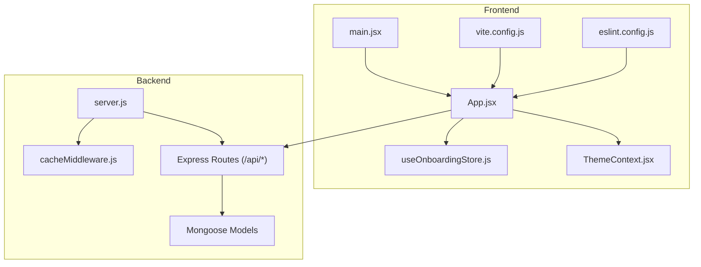
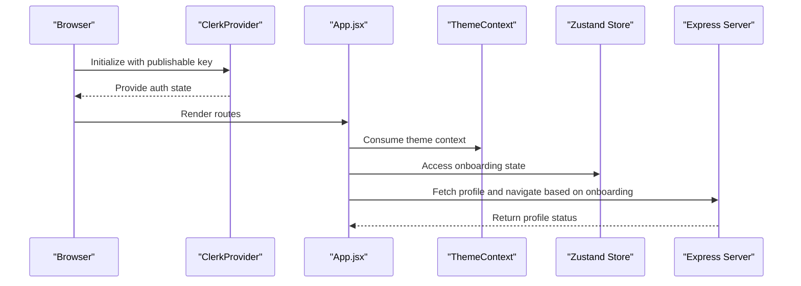
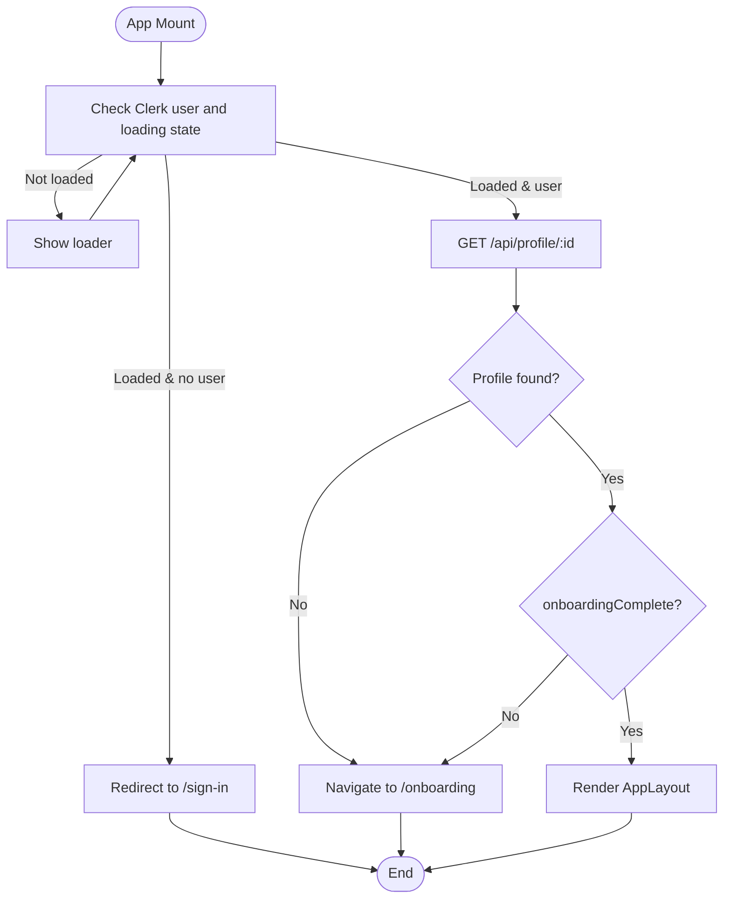
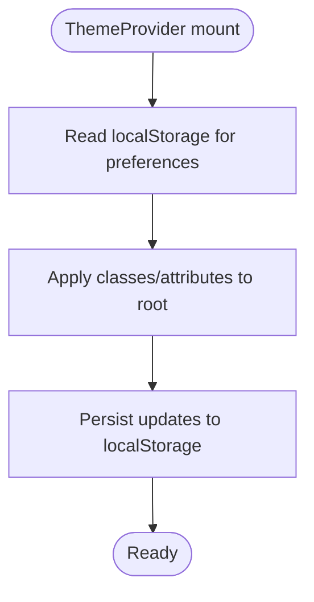
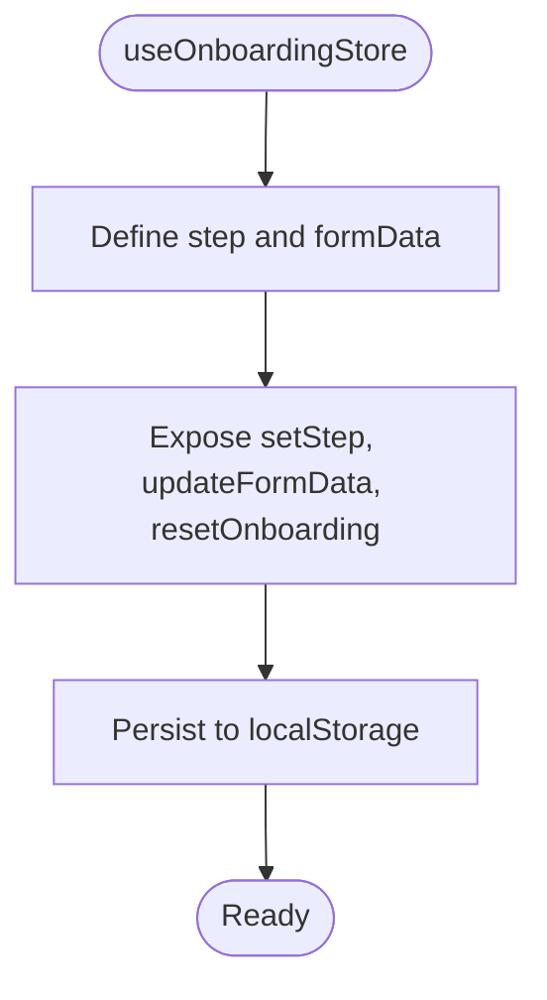
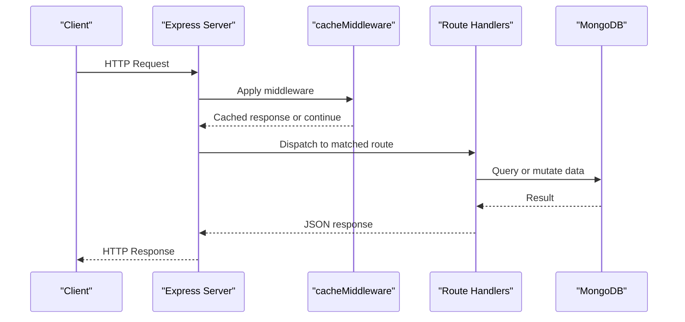
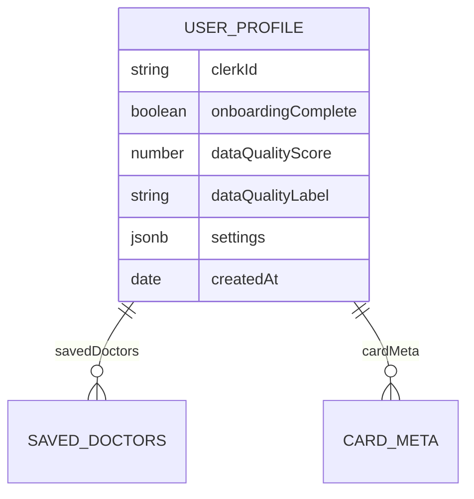
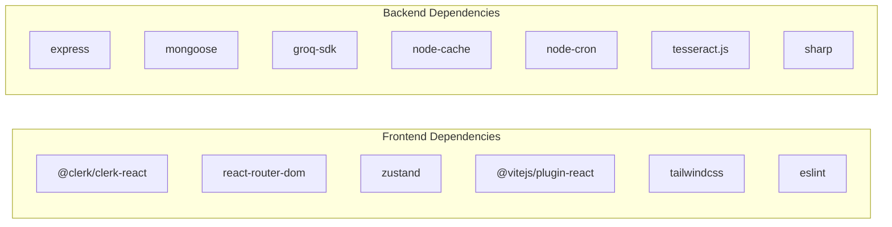

# Development Guidelines

<cite>
**Referenced Files in This Document**
- [README.md](file://README.md)
- [frontend/package.json](file://frontend/package.json)
- [frontend/eslint.config.js](file://frontend/eslint.config.js)
- [frontend/vite.config.js](file://frontend/vite.config.js)
- [frontend/src/main.jsx](file://frontend/src/main.jsx)
- [frontend/src/App.jsx](file://frontend/src/App.jsx)
- [frontend/src/context/ThemeContext.jsx](file://frontend/src/context/ThemeContext.jsx)
- [frontend/src/store/useOnboardingStore.js](file://frontend/src/store/useOnboardingStore.js)
- [backend/package.json](file://backend/package.json)
- [backend/server.js](file://backend/server.js)
- [backend/src/utils/cacheMiddleware.js](file://backend/src/utils/cacheMiddleware.js)
- [backend/src/models/UserProfile.js](file://backend/src/models/UserProfile.js)
</cite>

## Table of Contents
1. [Introduction](#introduction)
2. [Project Structure](#project-structure)
3. [Core Components](#core-components)
4. [Architecture Overview](#architecture-overview)
5. [Detailed Component Analysis](#detailed-component-analysis)
6. [Dependency Analysis](#dependency-analysis)
7. [Performance Considerations](#performance-considerations)
8. [Troubleshooting Guide](#troubleshooting-guide)
9. [Contribution Workflow](#contribution-workflow)
10. [Code Style and Tooling](#code-style-and-tooling)
11. [Debugging Techniques](#debugging-techniques)
12. [Security Best Practices](#security-best-practices)
13. [Conclusion](#conclusion)

## Introduction
This document provides comprehensive development guidelines for contributors working on VaidyaSetu. It covers code organization standards, component architecture patterns, state management conventions, ESLint and Prettier configurations, and contribution workflows. The goal is to ensure consistent, maintainable, and secure development across both the frontend and backend.

## Project Structure
VaidyaSetu follows a split monorepo-like layout with a frontend built with React and Vite, and a backend powered by Node.js and Express. The frontend uses Clerk for authentication, Zustand for lightweight state, and Tailwind CSS for styling. The backend organizes routes, services, models, and utilities under src, with middleware and scripts supporting runtime behavior.

**Diagram sources**
- [frontend/src/main.jsx:1-26](file://frontend/src/main.jsx#L1-L26)
- [frontend/src/App.jsx:1-166](file://frontend/src/App.jsx#L1-L166)
- [frontend/src/context/ThemeContext.jsx:1-55](file://frontend/src/context/ThemeContext.jsx#L1-L55)
- [frontend/src/store/useOnboardingStore.js:1-140](file://frontend/src/store/useOnboardingStore.js#L1-L140)
- [frontend/vite.config.js:1-12](file://frontend/vite.config.js#L1-L12)
- [frontend/eslint.config.js:1-30](file://frontend/eslint.config.js#L1-L30)
- [backend/server.js:1-94](file://backend/server.js#L1-L94)
- [backend/src/utils/cacheMiddleware.js:1-43](file://backend/src/utils/cacheMiddleware.js#L1-L43)
- [backend/src/models/UserProfile.js:1-175](file://backend/src/models/UserProfile.js#L1-L175)

**Section sources**
- [README.md:1-31](file://README.md#L1-L31)
- [frontend/package.json:1-46](file://frontend/package.json#L1-L46)
- [backend/package.json:1-37](file://backend/package.json#L1-L37)

## Core Components
- Frontend bootstrap and provider setup: Clerk provider initialization and strict mode wrapping.
- App shell and routing: Protected routes, sidebar, main content area, and page-level routes.
- Theme context: Centralized theme, font size, contrast, and motion preferences persisted to localStorage.
- Onboarding store: Multi-step onboarding form state persisted via Zustand.
- Backend server: Modular route registration, CORS, JSON parsing, MongoDB connection, health endpoint, and background services.

**Section sources**
- [frontend/src/main.jsx:1-26](file://frontend/src/main.jsx#L1-L26)
- [frontend/src/App.jsx:1-166](file://frontend/src/App.jsx#L1-L166)
- [frontend/src/context/ThemeContext.jsx:1-55](file://frontend/src/context/ThemeContext.jsx#L1-L55)
- [frontend/src/store/useOnboardingStore.js:1-140](file://frontend/src/store/useOnboardingStore.js#L1-L140)
- [backend/server.js:1-94](file://backend/server.js#L1-L94)

## Architecture Overview
The frontend initializes Clerk, renders protected routes, and integrates theme and onboarding stores. The backend exposes modular REST endpoints under /api, connects to MongoDB, and runs background services.

**Diagram sources**
- [frontend/src/main.jsx:1-26](file://frontend/src/main.jsx#L1-L26)
- [frontend/src/App.jsx:1-166](file://frontend/src/App.jsx#L1-L166)
- [frontend/src/context/ThemeContext.jsx:1-55](file://frontend/src/context/ThemeContext.jsx#L1-L55)
- [frontend/src/store/useOnboardingStore.js:1-140](file://frontend/src/store/useOnboardingStore.js#L1-L140)
- [backend/server.js:1-94](file://backend/server.js#L1-L94)

## Detailed Component Analysis

### Frontend Authentication and Routing
- Clerk provider wraps the app and enforces sign-in/sign-up URLs.
- ProtectedRoute redirects unauthenticated users to the sign-in page.
- AppLayout checks user profile status and navigates to onboarding if incomplete.

**Diagram sources**
- [frontend/src/App.jsx:34-83](file://frontend/src/App.jsx#L34-L83)

**Section sources**
- [frontend/src/App.jsx:1-166](file://frontend/src/App.jsx#L1-L166)
- [frontend/src/main.jsx:1-26](file://frontend/src/main.jsx#L1-L26)

### Theme Context and Accessibility
- ThemeContext persists theme, font size, high contrast, and reduced motion preferences to localStorage.
- Applies CSS classes and attributes to the root element for global styling and accessibility.

**Diagram sources**
- [frontend/src/context/ThemeContext.jsx:1-55](file://frontend/src/context/ThemeContext.jsx#L1-L55)

**Section sources**
- [frontend/src/context/ThemeContext.jsx:1-55](file://frontend/src/context/ThemeContext.jsx#L1-L55)

### Onboarding State Management
- Zustand store manages multi-step onboarding form data with persistence.
- Provides setters for step navigation and partial updates to formData.

**Diagram sources**
- [frontend/src/store/useOnboardingStore.js:1-140](file://frontend/src/store/useOnboardingStore.js#L1-L140)

**Section sources**
- [frontend/src/store/useOnboardingStore.js:1-140](file://frontend/src/store/useOnboardingStore.js#L1-L140)

### Backend Server and Middleware
- Express server configures CORS and JSON parsing, connects to MongoDB, registers modular routes, and starts background services.
- cacheMiddleware provides aggressive caching for GET endpoints returning success payloads.

**Diagram sources**
- [backend/server.js:1-94](file://backend/server.js#L1-L94)
- [backend/src/utils/cacheMiddleware.js:1-43](file://backend/src/utils/cacheMiddleware.js#L1-L43)

**Section sources**
- [backend/server.js:1-94](file://backend/server.js#L1-L94)
- [backend/src/utils/cacheMiddleware.js:1-43](file://backend/src/utils/cacheMiddleware.js#L1-L43)

### Mongoose Model: UserProfile
- Centralized user profile schema with typed fields, metadata, settings, and expanded screening indicators.
- Supports structured updates with timestamps and update types.

**Diagram sources**
- [backend/src/models/UserProfile.js:1-175](file://backend/src/models/UserProfile.js#L1-L175)

**Section sources**
- [backend/src/models/UserProfile.js:1-175](file://backend/src/models/UserProfile.js#L1-L175)

## Dependency Analysis
- Frontend dependencies include Clerk, React Router, Three.js ecosystem, Recharts, and Zustand. Dev dependencies include Vite, Tailwind, and ESLint.
- Backend dependencies include Express, Mongoose, Groq SDK, Tesseract, Sharp, and rate limiting. Dev dependencies include Jest and Supertest.

**Diagram sources**
- [frontend/package.json:1-46](file://frontend/package.json#L1-L46)
- [backend/package.json:1-37](file://backend/package.json#L1-L37)

**Section sources**
- [frontend/package.json:1-46](file://frontend/package.json#L1-L46)
- [backend/package.json:1-37](file://backend/package.json#L1-L37)

## Performance Considerations
- Prefer caching for idempotent GET endpoints using the provided cache middleware to reduce database load and latency.
- Use background services (cron jobs and reminder service) judiciously to avoid blocking the event loop.
- Lazy-load heavy components (e.g., 3D scenes) and defer non-critical computations to improve initial render performance.
- Minimize unnecessary re-renders by structuring state granularly (e.g., separate theme and onboarding state).

[No sources needed since this section provides general guidance]

## Troubleshooting Guide
- Authentication issues: Verify Clerk publishable key is present and environment variables are configured. Check redirect URIs and authorized origins for Google OAuth.
- Backend connectivity: Confirm MongoDB URI and network reachability. Review server logs for connection errors.
- Caching anomalies: Ensure GET endpoints return a success payload with a stable shape for cache keys. Clear cache if stale data is suspected.
- Build-time errors: Validate Vite and Tailwind configurations. Confirm plugin order and module resolution.

**Section sources**
- [frontend/src/main.jsx:7-11](file://frontend/src/main.jsx#L7-L11)
- [backend/server.js:40-43](file://backend/server.js#L40-L43)
- [backend/src/utils/cacheMiddleware.js:10-36](file://backend/src/utils/cacheMiddleware.js#L10-L36)

## Contribution Workflow
- Branching: Create feature branches from develop or main as per team convention.
- Commits: Write clear, concise commit messages describing changes and rationale.
- Pull Requests: Open PRs with a detailed description, links to related issues, and testing notes.
- Code Review: Expect feedback on style, performance, security, and maintainability. Address comments promptly.
- Testing: Add unit/integration tests where applicable. Run lint and build locally before pushing.

[No sources needed since this section doesn't analyze specific files]

## Code Style and Tooling
- ESLint configuration:
  - Recommended rules extended for React and JSX.
  - React Hooks and React Refresh plugins included.
  - Global browser globals enabled.
  - Unused variable rule allows uppercase prefixes.
- Prettier: Configure Prettier via editor integrations or a shared config file. Align with project’s stylistic choices.
- Formatting commands:
  - Frontend: npm run lint to run ESLint; use IDE auto-fix where supported.
  - Backend: Use ESLint and Prettier consistently across JS/TS files.

**Section sources**
- [frontend/eslint.config.js:1-30](file://frontend/eslint.config.js#L1-L30)
- [frontend/package.json:6-10](file://frontend/package.json#L6-L10)

## Debugging Techniques
- Frontend:
  - Use React DevTools to inspect component props and state.
  - Enable strict mode warnings and Suspense boundaries to surface issues early.
  - Inspect localStorage for theme and onboarding persistence.
- Backend:
  - Log cache hits and misses to diagnose performance and correctness.
  - Use curl or Postman to test endpoints independently.
  - Monitor MongoDB connectivity and query performance.

**Section sources**
- [frontend/src/context/ThemeContext.jsx:26-30](file://frontend/src/context/ThemeContext.jsx#L26-L30)
- [frontend/src/store/useOnboardingStore.js:133-136](file://frontend/src/store/useOnboardingStore.js#L133-L136)
- [backend/src/utils/cacheMiddleware.js:20-32](file://backend/src/utils/cacheMiddleware.js#L20-L32)

## Security Best Practices
- Environment variables: Store secrets in .env files and avoid committing them. Validate presence of required keys at startup.
- Authentication: Enforce protected routes and validate user sessions before rendering sensitive pages.
- Input sanitization: Sanitize and validate inputs on the backend; avoid client-side only validation.
- Rate limiting: Use rate-limiting middleware to protect public endpoints.
- CORS: Keep CORS policy minimal and specific to trusted origins.

**Section sources**
- [frontend/src/main.jsx:9-11](file://frontend/src/main.jsx#L9-L11)
- [backend/server.js:36-38](file://backend/server.js#L36-L38)

## Conclusion
By adhering to these guidelines—consistent code organization, clear component patterns, disciplined state management, and robust tooling—you will help maintain a high-quality, scalable, and secure VaidyaSetu platform. Follow the contribution workflow, prioritize performance and security, and leverage the provided debugging techniques to resolve issues quickly.