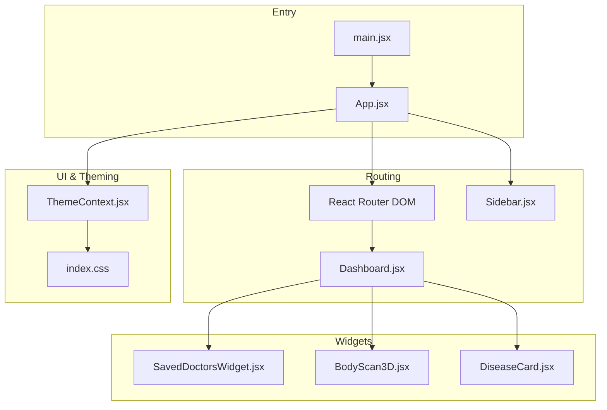
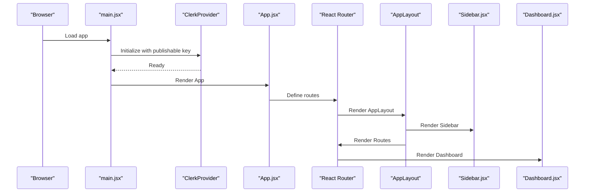
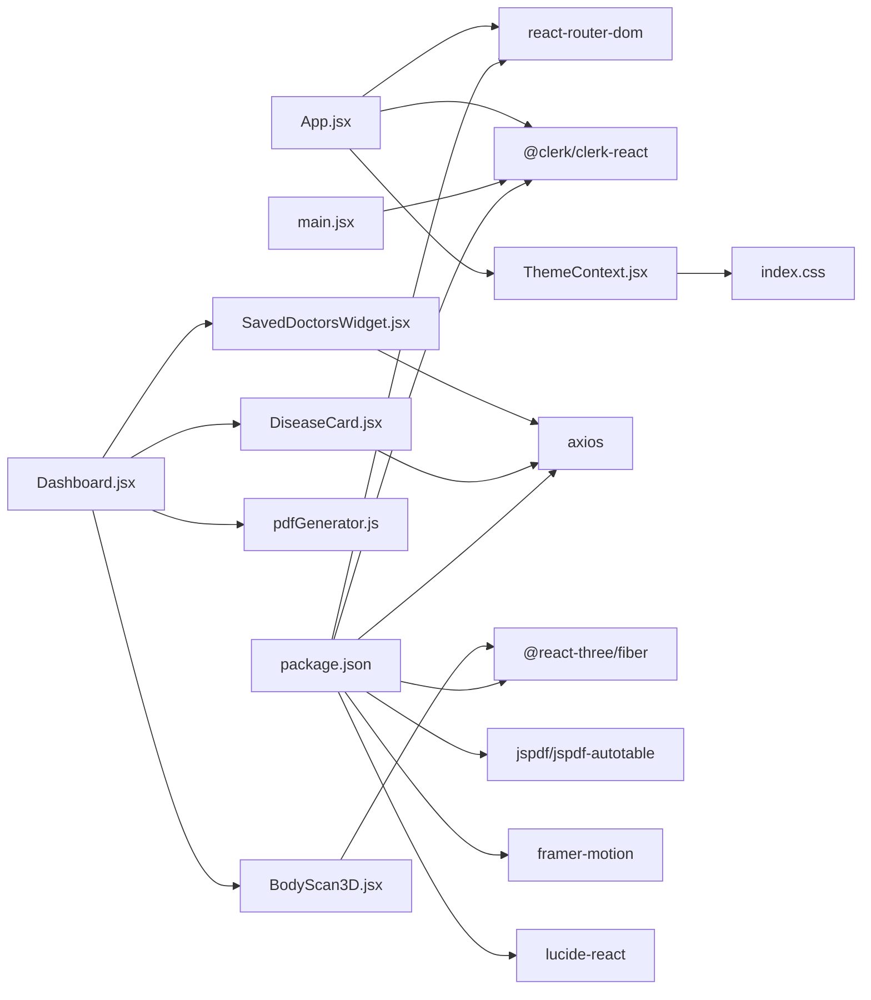

# Dashboard and Navigation

<cite>
**Referenced Files in This Document**
- [App.jsx](file://frontend/src/App.jsx)
- [main.jsx](file://frontend/src/main.jsx)
- [Sidebar.jsx](file://frontend/src/components/Sidebar.jsx)
- [Dashboard.jsx](file://frontend/src/pages/Dashboard.jsx)
- [ThemeContext.jsx](file://frontend/src/context/ThemeContext.jsx)
- [index.css](file://frontend/src/index.css)
- [SavedDoctorsWidget.jsx](file://frontend/src/components/dashboard/SavedDoctorsWidget.jsx)
- [BodyScan3D.jsx](file://frontend/src/components/BodyScan3D.jsx)
- [DiseaseCard.jsx](file://frontend/src/components/disease-cards/DiseaseCard.jsx)
- [pdfGenerator.js](file://frontend/src/utils/pdfGenerator.js)
- [package.json](file://frontend/package.json)
- [vite.config.js](file://frontend/vite.config.js)
</cite>

## Table of Contents
1. [Introduction](#introduction)
2. [Project Structure](#project-structure)
3. [Core Components](#core-components)
4. [Architecture Overview](#architecture-overview)
5. [Detailed Component Analysis](#detailed-component-analysis)
6. [Dependency Analysis](#dependency-analysis)
7. [Performance Considerations](#performance-considerations)
8. [Accessibility and UX](#accessibility-and-ux)
9. [Troubleshooting Guide](#troubleshooting-guide)
10. [Conclusion](#conclusion)
11. [Appendices](#appendices)

## Introduction
This document explains VaidyaSetu’s dashboard and navigation system. It covers the main dashboard layout, widget organization, responsive design, sidebar navigation, routing integration, theme context for dark/light mode, and practical guidance for customization and accessibility.

## Project Structure
The frontend is a React + Vite application with:
- Routing via React Router DOM
- Authentication via Clerk
- Theming via a custom ThemeContext
- Styling via Tailwind CSS and a global stylesheet
- Dashboard pages and reusable components under src/

**Diagram sources**
- [main.jsx:13-25](file://frontend/src/main.jsx#L13-L25)
- [App.jsx:143-166](file://frontend/src/App.jsx#L143-L166)
- [Sidebar.jsx:19-139](file://frontend/src/components/Sidebar.jsx#L19-L139)
- [Dashboard.jsx:14-347](file://frontend/src/pages/Dashboard.jsx#L14-L347)
- [ThemeContext.jsx:5-55](file://frontend/src/context/ThemeContext.jsx#L5-L55)
- [index.css:1-138](file://frontend/src/index.css#L1-L138)
- [SavedDoctorsWidget.jsx:6-163](file://frontend/src/components/dashboard/SavedDoctorsWidget.jsx#L6-L163)
- [BodyScan3D.jsx:197-264](file://frontend/src/components/BodyScan3D.jsx#L197-L264)
- [DiseaseCard.jsx:16-399](file://frontend/src/components/disease-cards/DiseaseCard.jsx#L16-L399)

**Section sources**
- [main.jsx:1-26](file://frontend/src/main.jsx#L1-L26)
- [App.jsx:1-166](file://frontend/src/App.jsx#L1-L166)
- [package.json:12-31](file://frontend/package.json#L12-L31)
- [vite.config.js:1-12](file://frontend/vite.config.js#L1-L12)

## Core Components
- App shell and routing: Orchestrates protected routes, onboarding redirection, and the main layout with sidebar and content area.
- Sidebar: Navigation drawer with responsive behavior, Clerk integration, and unread alerts indicator.
- Dashboard: Main page with hero, risk cards, side widgets, and export functionality.
- ThemeContext: Provides theme, font size, high contrast, and reduced motion preferences with persistence.
- Widgets: SavedDoctorsWidget, BodyScan3D, and DiseaseCard (used by the dashboard).

**Section sources**
- [App.jsx:47-135](file://frontend/src/App.jsx#L47-L135)
- [Sidebar.jsx:19-139](file://frontend/src/components/Sidebar.jsx#L19-L139)
- [Dashboard.jsx:14-347](file://frontend/src/pages/Dashboard.jsx#L14-L347)
- [ThemeContext.jsx:5-55](file://frontend/src/context/ThemeContext.jsx#L5-L55)
- [SavedDoctorsWidget.jsx:6-163](file://frontend/src/components/dashboard/SavedDoctorsWidget.jsx#L6-L163)
- [BodyScan3D.jsx:197-264](file://frontend/src/components/BodyScan3D.jsx#L197-L264)
- [DiseaseCard.jsx:16-399](file://frontend/src/components/disease-cards/DiseaseCard.jsx#L16-L399)

## Architecture Overview
The app initializes Clerk, wraps the app in ThemeProvider, and renders a responsive layout with a fixed theme toggle button, a sidebar, and a content area. Routes render page components, and the dashboard composes multiple widgets.

**Diagram sources**
- [main.jsx:13-25](file://frontend/src/main.jsx#L13-L25)
- [App.jsx:143-166](file://frontend/src/App.jsx#L143-L166)
- [Sidebar.jsx:19-139](file://frontend/src/components/Sidebar.jsx#L19-L139)
- [Dashboard.jsx:14-347](file://frontend/src/pages/Dashboard.jsx#L14-L347)

## Detailed Component Analysis

### Dashboard Layout and Widgets
The dashboard organizes content into:
- Header: Title, date, and export action
- Main column: AI diagnostic summary and predictive risk vectors (DiseaseCard grid)
- Sidebar column: Body measurements, allergies, active medicines, 3D body scan, saved doctors widget, and disclaimer

Responsive behavior:
- Uses CSS grid with lg:col-span to switch from stacked to side-by-side layout on larger screens
- Sidebar is sticky on mobile/desktop variants

State and effects:
- Loads reports, vitals, profile, and medications concurrently
- Auto-generates report if missing
- Periodically refreshes data and listens to window events for health updates

Integration points:
- PDF export via a utility that generates a comprehensive report
- 3D visualization powered by @react-three/fiber and custom shaders
- Widget-driven organization allows easy addition of new widgets

**Section sources**
- [Dashboard.jsx:14-347](file://frontend/src/pages/Dashboard.jsx#L14-L347)
- [pdfGenerator.js:76-185](file://frontend/src/utils/pdfGenerator.js#L76-L185)
- [BodyScan3D.jsx:197-264](file://frontend/src/components/BodyScan3D.jsx#L197-L264)
- [SavedDoctorsWidget.jsx:6-163](file://frontend/src/components/dashboard/SavedDoctorsWidget.jsx#L6-L163)
- [DiseaseCard.jsx:16-399](file://frontend/src/components/disease-cards/DiseaseCard.jsx#L16-L399)

### Sidebar Navigation
Responsiveness:
- Mobile header with auth controls; desktop vertical stack with horizontal overflow hidden on small widths
- Sticky positioning and full-height layout on desktop

Navigation items:
- Home, Safety Bridge, My Vitals, My Medicines, Alerts, Profile, Settings
- Active link highlighting via NavLink and isActive
- Unread alerts counter for the Alerts item

Integration:
- Clerk UserButton and SignInButton for auth
- ThemeContext for theme-aware rendering
- Axios polling for unread count

**Section sources**
- [Sidebar.jsx:19-139](file://frontend/src/components/Sidebar.jsx#L19-L139)

### Theme Context System
Capabilities:
- Switch between dark and light themes
- Persist theme, font size, high contrast, and reduced motion preferences in localStorage
- Apply CSS classes to documentElement for global effect
- Expose toggle functions and setters to consumers

Usage:
- AppLayout renders a floating theme toggle button bound to the theme context
- index.css defines overrides for light mode and transitions

**Section sources**
- [ThemeContext.jsx:5-55](file://frontend/src/context/ThemeContext.jsx#L5-L55)
- [App.jsx:96-109](file://frontend/src/App.jsx#L96-L109)
- [index.css:69-138](file://frontend/src/index.css#L69-L138)

### Routing and Protected Access
- ProtectedRoute redirects unauthenticated users to sign-in
- AppLayout checks user profile and redirects to onboarding if needed
- Routes include dashboard, vitals, alerts, settings, and others

**Section sources**
- [App.jsx:34-83](file://frontend/src/App.jsx#L34-L83)
- [App.jsx:114-129](file://frontend/src/App.jsx#L114-L129)

### Widget Composition Patterns
- SavedDoctorsWidget: Groups by specialty, supports editing notes, external actions, and removal
- BodyScan3D: 3D visualization with animated materials and HUD overlay
- DiseaseCard: Collapsible card with detailed breakdown, missing data collection, mitigation steps, and feedback

These components demonstrate:
- Props-driven composition
- Local state management per widget
- Integration with backend APIs
- Accessibility-friendly interactions

**Section sources**
- [SavedDoctorsWidget.jsx:6-163](file://frontend/src/components/dashboard/SavedDoctorsWidget.jsx#L6-L163)
- [BodyScan3D.jsx:197-264](file://frontend/src/components/BodyScan3D.jsx#L197-L264)
- [DiseaseCard.jsx:16-399](file://frontend/src/components/disease-cards/DiseaseCard.jsx#L16-L399)

## Dependency Analysis
External libraries and integrations:
- Clerk for authentication
- React Router DOM for routing
- Framer Motion for animations
- Three.js and @react-three/fiber for 3D visualization
- jsPDF and jspdf-autotable for PDF generation
- Lucide icons for UI

Build and tooling:
- Vite with React and Tailwind CSS plugins

**Diagram sources**
- [App.jsx:1-166](file://frontend/src/App.jsx#L1-L166)
- [Dashboard.jsx:1-347](file://frontend/src/pages/Dashboard.jsx#L1-L347)
- [SavedDoctorsWidget.jsx:1-163](file://frontend/src/components/dashboard/SavedDoctorsWidget.jsx#L1-L163)
- [BodyScan3D.jsx:1-264](file://frontend/src/components/BodyScan3D.jsx#L1-L264)
- [DiseaseCard.jsx:1-399](file://frontend/src/components/disease-cards/DiseaseCard.jsx#L1-L399)
- [pdfGenerator.js:1-366](file://frontend/src/utils/pdfGenerator.js#L1-L366)
- [ThemeContext.jsx:1-55](file://frontend/src/context/ThemeContext.jsx#L1-L55)
- [index.css:1-138](file://frontend/src/index.css#L1-L138)
- [main.jsx:1-26](file://frontend/src/main.jsx#L1-L26)
- [package.json:12-31](file://frontend/package.json#L12-L31)

**Section sources**
- [package.json:12-31](file://frontend/package.json#L12-L31)
- [vite.config.js:1-12](file://frontend/vite.config.js#L1-L12)

## Performance Considerations
- Concurrent data fetching reduces total load time
- Debounced or periodic polling for unread counts prevents excessive requests
- 3D rendering uses efficient materials and additive blending; consider lowering DPR on lower-end devices
- Animations leverage Framer Motion; reduced motion preference is respected via ThemeContext
- PDF generation is client-side; large datasets may benefit from pagination or streaming

[No sources needed since this section provides general guidance]

## Accessibility and UX
Keyboard navigation and screen reader support:
- Sidebar links use NavLink and standard anchor semantics; ensure focus indicators are visible
- Buttons and interactive elements use semantic roles and appropriate ARIA attributes where applicable
- ThemeContext toggles improve readability and reduce motion sensitivity

Focus management:
- Ensure focus moves appropriately after modal opens/closes (e.g., Clerk modals)
- Keep tab order logical around the sidebar and content areas

Color and contrast:
- ThemeContext toggles high contrast mode; index.css provides overrides for light mode
- Prefer semantic color classes and avoid hard-coded colors in components

Labels and titles:
- Use descriptive labels for buttons and links (already present in Sidebar)
- Provide titles for floating theme toggle and export buttons

**Section sources**
- [Sidebar.jsx:82-102](file://frontend/src/components/Sidebar.jsx#L82-L102)
- [ThemeContext.jsx:11-30](file://frontend/src/context/ThemeContext.jsx#L11-L30)
- [index.css:69-138](file://frontend/src/index.css#L69-L138)

## Troubleshooting Guide
Common issues and resolutions:
- Missing Clerk publishable key: The app throws an error early if the key is absent
- Protected route failures: ProtectedRoute redirects unauthenticated users to sign-in
- Sidebar unread count polling: Axios errors are caught and logged; ensure API endpoint availability
- Dashboard data loading: Concurrent requests are wrapped; network errors are handled gracefully
- PDF export: Errors are logged; verify report/profile/medications data availability

**Section sources**
- [main.jsx:9-11](file://frontend/src/main.jsx#L9-L11)
- [App.jsx:34-44](file://frontend/src/App.jsx#L34-L44)
- [Sidebar.jsx:25-41](file://frontend/src/components/Sidebar.jsx#L25-L41)
- [Dashboard.jsx:65-102](file://frontend/src/pages/Dashboard.jsx#L65-L102)
- [pdfGenerator.js:146-159](file://frontend/src/utils/pdfGenerator.js#L146-L159)

## Conclusion
VaidyaSetu’s dashboard and navigation system combine a responsive layout, robust routing, and a flexible theming system. The sidebar integrates authentication and navigation, while the dashboard composes modular widgets for rich health insights. The ThemeContext enables dark/light mode and accessibility preferences, and the routing ensures secure, guided user flows.

[No sources needed since this section summarizes without analyzing specific files]

## Appendices

### Customization Playbook

- Customize navigation items
  - Modify the navItems array in the Sidebar component to add, remove, or reorder items
  - Ensure each item has a unique to path, a Lucide icon, and a label
  - Use isActive styling to reflect selected state

  **Section sources**
  - [Sidebar.jsx:43-51](file://frontend/src/components/Sidebar.jsx#L43-L51)

- Add a new dashboard widget
  - Create a new component under src/components/dashboard or a related folder
  - Accept props for data and callbacks (e.g., onRefresh, onRemove)
  - Integrate into the Dashboard grid layout in the main column or sidebar
  - Respect theme classes and responsive breakpoints

  **Section sources**
  - [Dashboard.jsx:201-324](file://frontend/src/pages/Dashboard.jsx#L201-L324)
  - [SavedDoctorsWidget.jsx:6-163](file://frontend/src/components/dashboard/SavedDoctorsWidget.jsx#L6-L163)

- Implement theme-aware components
  - Consume useTheme to read theme, fontSize, highContrast, reducedMotion
  - Apply conditional classes and data attributes in index.css
  - Persist user preferences in localStorage via ThemeProvider

  **Section sources**
  - [ThemeContext.jsx:5-55](file://frontend/src/context/ThemeContext.jsx#L5-L55)
  - [index.css:11-30](file://frontend/src/index.css#L11-L30)

- Integrate with React Router
  - Wrap routes with ProtectedRoute for authenticated access
  - Use AppLayout to centralize sidebar and main content
  - Add new routes in App.jsx Routes and ensure proper nesting

  **Section sources**
  - [App.jsx:34-135](file://frontend/src/App.jsx#L34-L135)

- Accessibility enhancements
  - Provide aria-labels and titles for interactive elements
  - Maintain focus order and manage focus traps in modals
  - Respect reduced motion and high contrast preferences

  **Section sources**
  - [ThemeContext.jsx:11-30](file://frontend/src/context/ThemeContext.jsx#L11-L30)
  - [Sidebar.jsx:82-102](file://frontend/src/components/Sidebar.jsx#L82-L102)