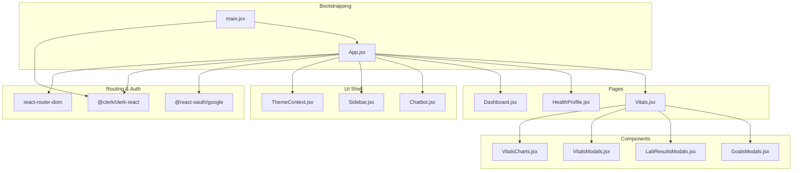
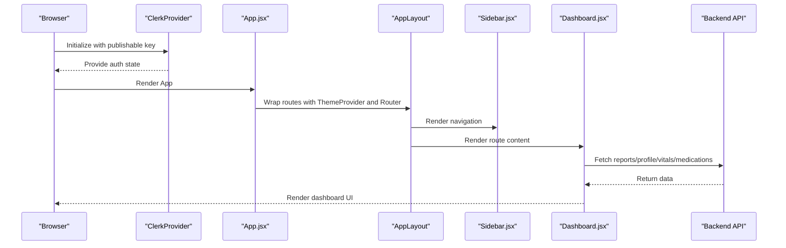
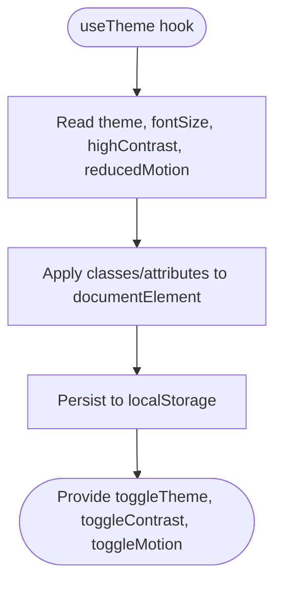
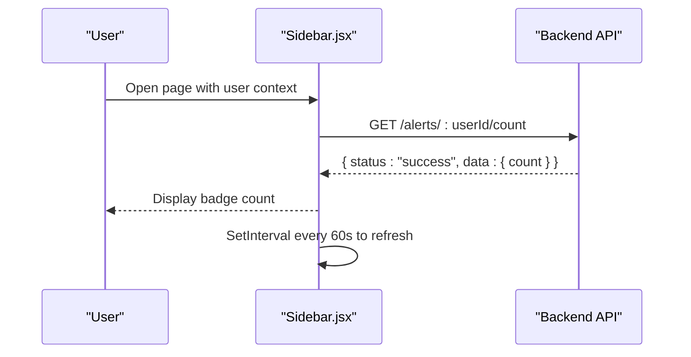
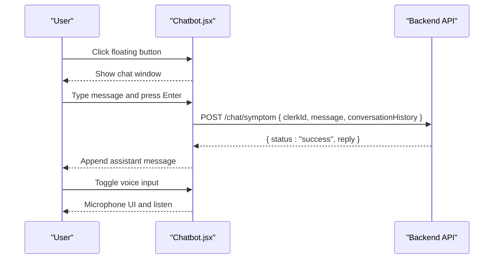
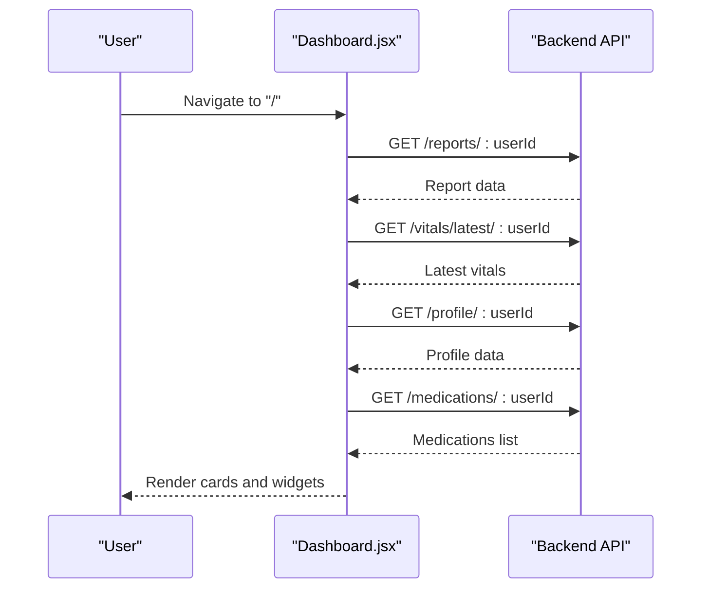
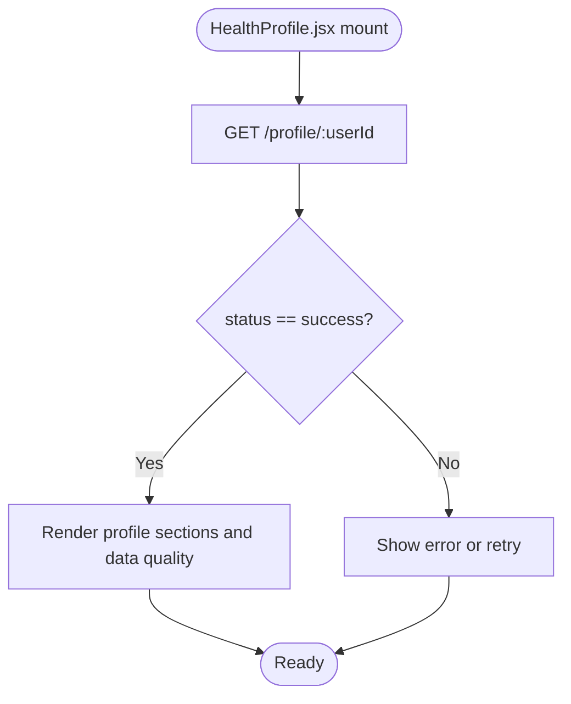
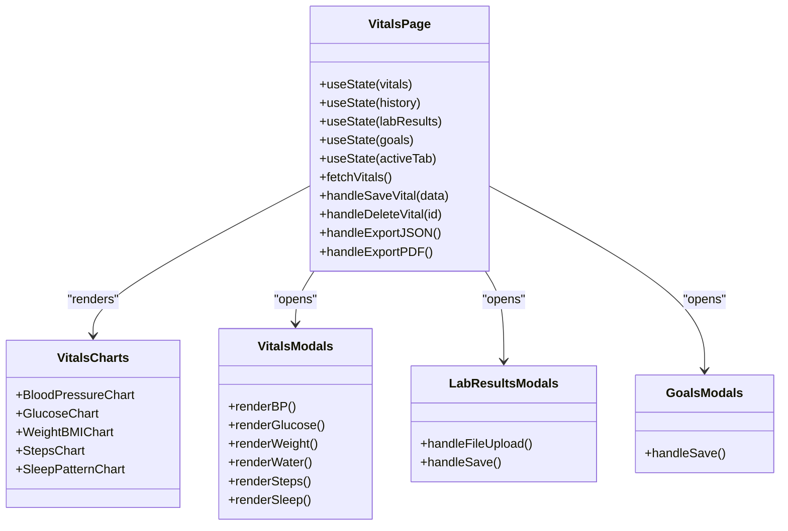
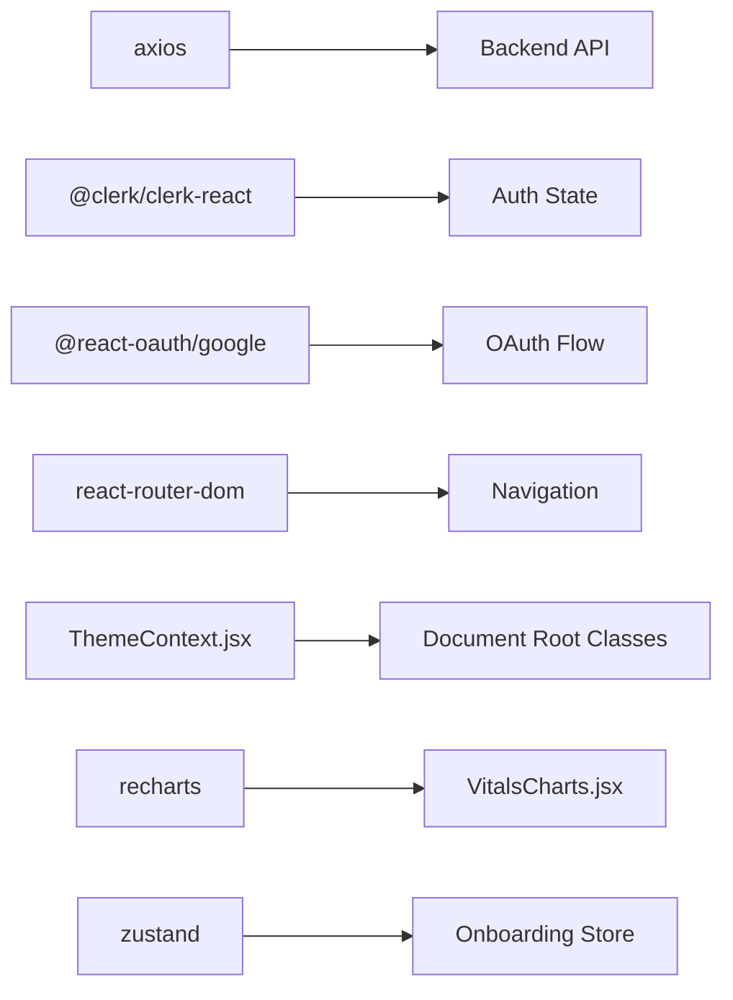

# Frontend Components

<cite>
**Referenced Files in This Document**
- [App.jsx](file://frontend/src/App.jsx)
- [main.jsx](file://frontend/src/main.jsx)
- [ThemeContext.jsx](file://frontend/src/context/ThemeContext.jsx)
- [Sidebar.jsx](file://frontend/src/components/Sidebar.jsx)
- [Chatbot.jsx](file://frontend/src/components/Chatbot.jsx)
- [Dashboard.jsx](file://frontend/src/pages/Dashboard.jsx)
- [HealthProfile.jsx](file://frontend/src/pages/HealthProfile.jsx)
- [Vitals.jsx](file://frontend/src/pages/Vitals.jsx)
- [VitalsCharts.jsx](file://frontend/src/components/VitalsCharts.jsx)
- [VitalsModals.jsx](file://frontend/src/components/VitalsModals.jsx)
- [LabResultsModals.jsx](file://frontend/src/components/LabResultsModals.jsx)
- [GoalsModals.jsx](file://frontend/src/components/GoalsModals.jsx)
- [package.json](file://frontend/package.json)
</cite>

## Table of Contents
1. [Introduction](#introduction)
2. [Project Structure](#project-structure)
3. [Core Components](#core-components)
4. [Architecture Overview](#architecture-overview)
5. [Detailed Component Analysis](#detailed-component-analysis)
6. [Dependency Analysis](#dependency-analysis)
7. [Performance Considerations](#performance-considerations)
8. [Troubleshooting Guide](#troubleshooting-guide)
9. [Conclusion](#conclusion)
10. [Appendices](#appendices)

## Introduction
This document describes the VaidyaSetu React frontend components and their integration with backend APIs. It covers the dashboard interface, navigation system, health profile management, medication display, vitals monitoring, alert system, and AI chat interface. It also documents the theme context, store management patterns, responsive design, accessibility, and cross-browser compatibility considerations. Guidance is included for component composition, customization, and performance optimization.

## Project Structure
The frontend is a Vite-based React application bootstrapped with Clerk for authentication and Google OAuth. Routing is handled by react-router-dom. Styling leverages Tailwind CSS utilities and a global theme context. Key areas:
- Authentication and routing: App shell, protected routes, and Clerk provider initialization
- Navigation: Sidebar with dynamic unread counts and Clerk user controls
- Pages: Dashboard, Health Profile, Vitals, Alerts, Settings, and others
- Components: Chatbot, charts, modals for vitals, labs, and goals
- Context: Theme provider for theme, font size, contrast, and motion preferences
- Store: Zustand-based onboarding store (referenced)

**Diagram sources**
- [main.jsx:1-26](file://frontend/src/main.jsx#L1-L26)
- [App.jsx:143-166](file://frontend/src/App.jsx#L143-L166)
- [ThemeContext.jsx:5-46](file://frontend/src/context/ThemeContext.jsx#L5-L46)
- [Sidebar.jsx:19-139](file://frontend/src/components/Sidebar.jsx#L19-L139)
- [Chatbot.jsx:8-202](file://frontend/src/components/Chatbot.jsx#L8-L202)
- [Dashboard.jsx:14-347](file://frontend/src/pages/Dashboard.jsx#L14-L347)
- [HealthProfile.jsx:13-281](file://frontend/src/pages/HealthProfile.jsx#L13-L281)
- [Vitals.jsx:77-850](file://frontend/src/pages/Vitals.jsx#L77-L850)
- [VitalsCharts.jsx:1-169](file://frontend/src/components/VitalsCharts.jsx#L1-L169)
- [VitalsModals.jsx:38-252](file://frontend/src/components/VitalsModals.jsx#L38-L252)
- [LabResultsModals.jsx:11-219](file://frontend/src/components/LabResultsModals.jsx#L11-L219)
- [GoalsModals.jsx:11-141](file://frontend/src/components/GoalsModals.jsx#L11-L141)

**Section sources**
- [main.jsx:1-26](file://frontend/src/main.jsx#L1-L26)
- [App.jsx:143-166](file://frontend/src/App.jsx#L143-L166)
- [package.json:12-31](file://frontend/package.json#L12-L31)

## Core Components
- ThemeContext: Centralized theme, font size, contrast, and motion preferences persisted to localStorage and applied to the document root.
- Sidebar: Navigation with Lucide icons, Clerk user integration, and live alert count polling.
- Chatbot: Floating AI assistant with voice input support and conversation history.
- Dashboard: Health ecosystem overview, predictive risk vectors, body scan visualization, and action widgets.
- HealthProfile: Comprehensive health profile display with data quality indicator and update actions.
- Vitals: Multi-tab vitals monitoring, charts, modals for vitals/lab/goals, export capabilities, and goal progress.
- Charts and Modals: Recharts-based vitals charts and reusable modals for vitals, lab results, and goals.

**Section sources**
- [ThemeContext.jsx:1-55](file://frontend/src/context/ThemeContext.jsx#L1-L55)
- [Sidebar.jsx:19-139](file://frontend/src/components/Sidebar.jsx#L19-L139)
- [Chatbot.jsx:8-202](file://frontend/src/components/Chatbot.jsx#L8-L202)
- [Dashboard.jsx:14-347](file://frontend/src/pages/Dashboard.jsx#L14-L347)
- [HealthProfile.jsx:13-281](file://frontend/src/pages/HealthProfile.jsx#L13-L281)
- [Vitals.jsx:77-850](file://frontend/src/pages/Vitals.jsx#L77-L850)
- [VitalsCharts.jsx:1-169](file://frontend/src/components/VitalsCharts.jsx#L1-L169)
- [VitalsModals.jsx:38-252](file://frontend/src/components/VitalsModals.jsx#L38-L252)
- [LabResultsModals.jsx:11-219](file://frontend/src/components/LabResultsModals.jsx#L11-L219)
- [GoalsModals.jsx:11-141](file://frontend/src/components/GoalsModals.jsx#L11-L141)

## Architecture Overview
The app initializes Clerk and Google OAuth providers, sets up protected routes, and mounts the main AppLayout. The AppLayout renders the sidebar, main content area, disclaimer banner, and chatbot. Pages orchestrate data fetching from the backend API and pass props to child components. Charts and modals encapsulate presentation and input logic.

**Diagram sources**
- [main.jsx:13-25](file://frontend/src/main.jsx#L13-L25)
- [App.jsx:143-166](file://frontend/src/App.jsx#L143-L166)
- [Sidebar.jsx:19-139](file://frontend/src/components/Sidebar.jsx#L19-L139)
- [Dashboard.jsx:65-102](file://frontend/src/pages/Dashboard.jsx#L65-L102)

## Detailed Component Analysis

### Theme Context
- Responsibilities: Manage theme (dark/light), font size, high contrast, reduced motion; persist to localStorage; apply to document root; expose toggle functions.
- State management: useState for theme, font size, contrast, motion; useEffect applies classes and attributes; localStorage sync.
- Integration: Used by AppLayout for floating theme toggle and by charts for theme-aware rendering.

**Diagram sources**
- [ThemeContext.jsx:5-46](file://frontend/src/context/ThemeContext.jsx#L5-L46)

**Section sources**
- [ThemeContext.jsx:1-55](file://frontend/src/context/ThemeContext.jsx#L1-L55)

### Sidebar Navigation
- Responsibilities: Navigation links, mobile/desktop layouts, Clerk user button, unread alerts count via polling.
- State management: Local unread count; effect fetches count periodically while user exists.
- Integration: Uses Clerk hooks, axios for alerts endpoint, Lucide icons, and Tailwind for responsive layout.

**Diagram sources**
- [Sidebar.jsx:25-41](file://frontend/src/components/Sidebar.jsx#L25-L41)

**Section sources**
- [Sidebar.jsx:19-139](file://frontend/src/components/Sidebar.jsx#L19-L139)

### AI Chat Interface
- Responsibilities: Floating chat window, message history, send/receive, voice input (browser speech), loading states, and error messaging.
- State management: isOpen, messages, input, loading, listening; refs for scroll-to-bottom.
- Integration: Posts to /chat/symptom with conversation history; uses Clerk user id; supports Enter key submission.

**Diagram sources**
- [Chatbot.jsx:29-56](file://frontend/src/components/Chatbot.jsx#L29-L56)
- [Chatbot.jsx:65-99](file://frontend/src/components/Chatbot.jsx#L65-L99)

**Section sources**
- [Chatbot.jsx:8-202](file://frontend/src/components/Chatbot.jsx#L8-L202)

### Dashboard Interface
- Responsibilities: Load health report, latest vitals, profile, and medications; display predictive risk cards; export dashboard; toast notifications; trigger analytics events.
- State management: report, vitals, profile, medications, loading, generating, syncing, error, feedback status, expanded disease id, toast, auto-generated flag.
- Integration: Fetches from /reports/:userId, /vitals/latest/:userId, /profile/:userId, /medications/:userId; generates PDF; integrates with analytics endpoints.

**Diagram sources**
- [Dashboard.jsx:65-102](file://frontend/src/pages/Dashboard.jsx#L65-L102)

**Section sources**
- [Dashboard.jsx:14-347](file://frontend/src/pages/Dashboard.jsx#L14-L347)

### Health Profile Management
- Responsibilities: Display profile summary, data quality score, biometrics, lifestyle, diet, allergies, and conditions; provide edit and history links.
- State management: profile, data quality, loading, error, toast message passed via router state.
- Integration: Fetches from /profile/:userId; calculates relative time; renders SVG data quality indicator.

**Diagram sources**
- [HealthProfile.jsx:30-47](file://frontend/src/pages/HealthProfile.jsx#L30-L47)

**Section sources**
- [HealthProfile.jsx:13-281](file://frontend/src/pages/HealthProfile.jsx#L13-L281)

### Vitals Monitoring
- Responsibilities: Multi-tab vitals overview, trend charts, lab results, goals, quick entry bar, export to JSON/PDF, delete readings.
- State management: vitals map, report, history, lab results, goals, active tab, modal states, saving/loading flags.
- Integration: Charts powered by Recharts; modals encapsulate form logic; exports via pdf generator; goal progress computed from latest vitals.

**Diagram sources**
- [Vitals.jsx:77-850](file://frontend/src/pages/Vitals.jsx#L77-L850)
- [VitalsCharts.jsx:31-169](file://frontend/src/components/VitalsCharts.jsx#L31-L169)
- [VitalsModals.jsx:38-252](file://frontend/src/components/VitalsModals.jsx#L38-L252)
- [LabResultsModals.jsx:11-219](file://frontend/src/components/LabResultsModals.jsx#L11-L219)
- [GoalsModals.jsx:11-141](file://frontend/src/components/GoalsModals.jsx#L11-L141)

**Section sources**
- [Vitals.jsx:77-850](file://frontend/src/pages/Vitals.jsx#L77-L850)
- [VitalsCharts.jsx:1-169](file://frontend/src/components/VitalsCharts.jsx#L1-L169)
- [VitalsModals.jsx:38-252](file://frontend/src/components/VitalsModals.jsx#L38-L252)
- [LabResultsModals.jsx:11-219](file://frontend/src/components/LabResultsModals.jsx#L11-L219)
- [GoalsModals.jsx:11-141](file://frontend/src/components/GoalsModals.jsx#L11-L141)

### Alert System
- Responsibilities: Unread alert count badge in sidebar; periodic polling; navigation to alerts page.
- State management: unreadCount; effect runs while user exists; interval cleared on unmount.
- Integration: GET /alerts/:userId/count; updates badge dynamically.

**Section sources**
- [Sidebar.jsx:25-41](file://frontend/src/components/Sidebar.jsx#L25-L41)

### AI Chat Integration Details
- Voice input: Uses Web Speech API; handles unsupported browsers and permission errors.
- Conversation history: Sends messages excluding the initial greeting to reduce token usage.
- Error handling: Displays friendly error message on network failure.

**Section sources**
- [Chatbot.jsx:65-99](file://frontend/src/components/Chatbot.jsx#L65-L99)
- [Chatbot.jsx:39-55](file://frontend/src/components/Chatbot.jsx#L39-L55)

### Store Management System
- Zustand store: Onboarding store referenced in the store directory; suitable for lightweight UI state not requiring backend synchronization.
- Pattern: Define store with selectors and actions; consume via hooks in components.

**Section sources**
- [Dashboard.jsx:108-126](file://frontend/src/pages/Dashboard.jsx#L108-L126)
- [package.json:30](file://frontend/package.json#L30)

## Dependency Analysis
External libraries and integrations:
- Authentication: @clerk/clerk-react, @react-oauth/google
- Routing: react-router-dom
- UI Icons: lucide-react
- Charts: recharts
- PDF Generation: jspdf, jspdf-autotable
- 3D Visualization: @react-three/fiber, @react-three/drei, three
- State: zustand
- Motion: framer-motion
- Search: fuse.js
- Lottie: lottie-react
- HTTP: axios

**Diagram sources**
- [package.json:12-31](file://frontend/package.json#L12-L31)
- [ThemeContext.jsx:5-46](file://frontend/src/context/ThemeContext.jsx#L5-L46)
- [VitalsCharts.jsx:1-8](file://frontend/src/components/VitalsCharts.jsx#L1-L8)

**Section sources**
- [package.json:12-31](file://frontend/package.json#L12-L31)

## Performance Considerations
- Parallel data fetching: Use Promise.all to minimize round trips on dashboard and vitals pages.
- Memoization: Consider useMemo/useCallback for derived values in charts and modals to avoid unnecessary re-renders.
- Lazy loading: Defer heavy 3D scans until needed; lazy-load modals and charts.
- Chart optimization: Use ResponsiveContainer and minimal tooltip updates; avoid excessive chart updates per keystroke.
- Network efficiency: Debounce or throttle frequent polling; cache small payloads in memory.
- Rendering: Prefer virtualized lists for long histories; keep modal content lazy-mounted.

## Troubleshooting Guide
- Authentication issues:
  - Missing publishable key throws during bootstrapping; ensure environment variable is set.
  - Protected routes redirect unauthenticated users to sign-in.
- Chatbot voice input:
  - Unsupported browsers show an alert; ensure microphone permissions are granted.
- Sidebar alert count:
  - Network failures are logged; badge remains stale until next poll cycle.
- Vitals modals:
  - Saving requires numeric values; invalid entries produce alerts.
  - Lab result upload accepts PDFs up to 10MB; errors logged to console.
- PDF generation:
  - Dashboard and vitals exports require sufficient data; empty states show warnings.

**Section sources**
- [main.jsx:9-11](file://frontend/src/main.jsx#L9-L11)
- [Chatbot.jsx:66-92](file://frontend/src/components/Chatbot.jsx#L66-L92)
- [Sidebar.jsx:33-36](file://frontend/src/components/Sidebar.jsx#L33-L36)
- [VitalsModals.jsx:48-56](file://frontend/src/components/VitalsModals.jsx#L48-L56)
- [LabResultsModals.jsx:34-44](file://frontend/src/components/LabResultsModals.jsx#L34-L44)

## Conclusion
VaidyaSetu’s frontend composes a cohesive health monitoring experience with robust navigation, theme-aware UI, and integrated AI assistance. The architecture emphasizes modular components, centralized theme management, and efficient data fetching. By following the recommended patterns and best practices, teams can extend functionality while maintaining responsiveness, accessibility, and performance.

## Appendices

### Responsive Design Considerations
- Mobile-first layout with responsive breakpoints for sidebar stacking and grid adjustments.
- Scrollable quick-entry bars and modals with constrained heights.
- Adaptive typography via theme font size settings.

### Accessibility Compliance
- High contrast toggle and reduced motion preferences applied globally.
- Semantic markup and focus management in modals and forms.
- ARIA-friendly labels and roles for charts and interactive elements.

### Cross-Browser Compatibility
- Voice input relies on Web Speech API; provide fallbacks and user guidance.
- Recharts and Three.js components tested across modern browsers; ensure polyfills if targeting legacy environments.

### Usage Examples and Customization
- Theme customization: Adjust theme, font size, contrast, and motion via ThemeContext.
- Component composition: Pass Clerk user id to pages and modals for backend integration.
- Extending charts: Add new chart components following existing Recharts patterns.
- Modals: Reuse modal wrappers and form patterns for consistent UX.

### Best Practices
- Keep state local when appropriate; use zustand for UI-centric state.
- Centralize API URLs and error handling.
- Use controlled components for forms; validate early and often.
- Optimize rendering with memoization and virtualization for large datasets.