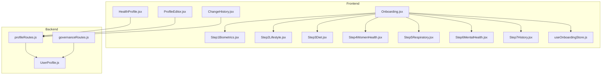
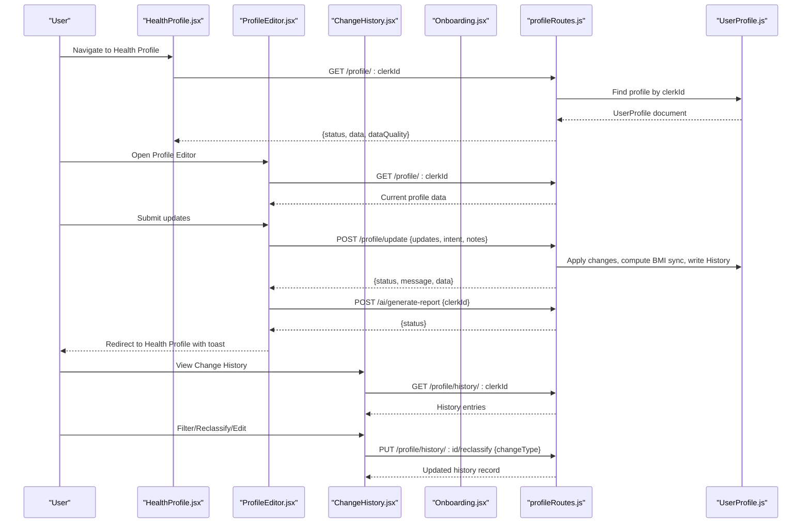
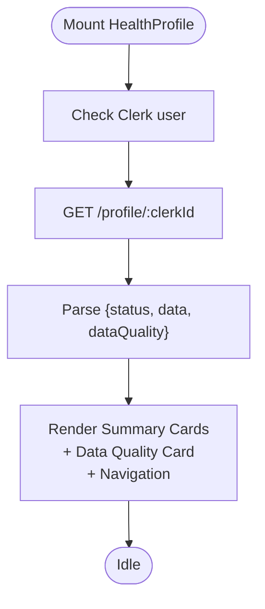
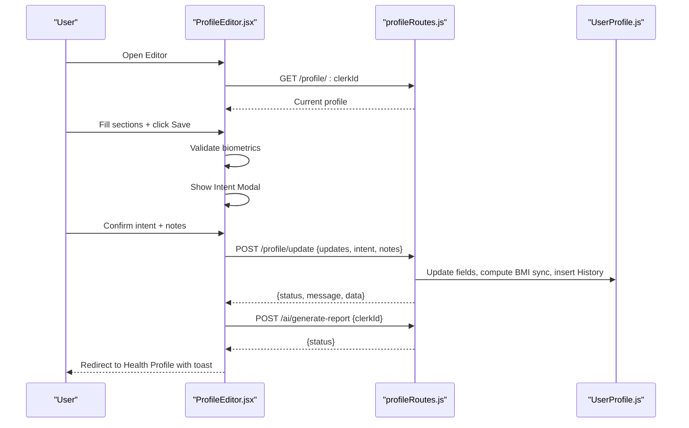
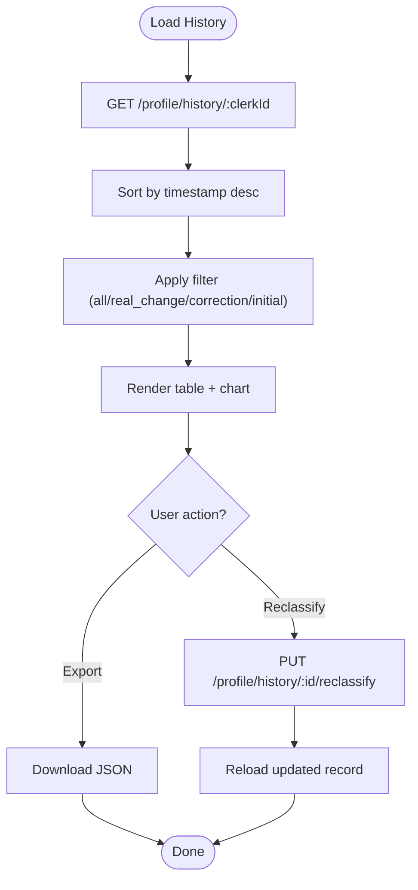
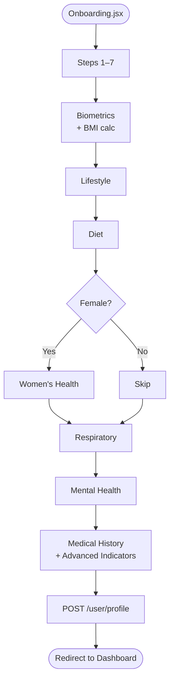
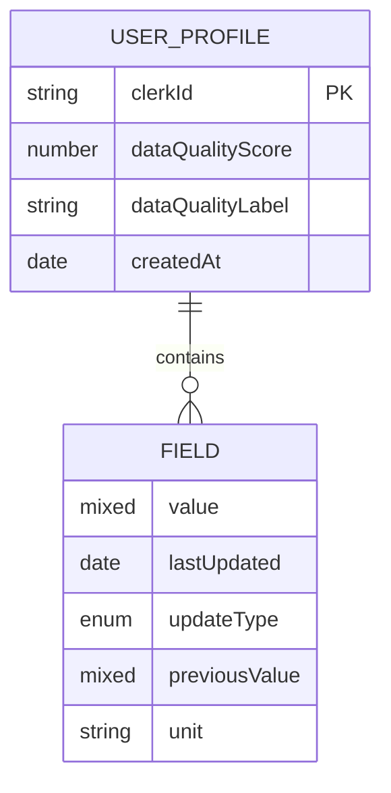
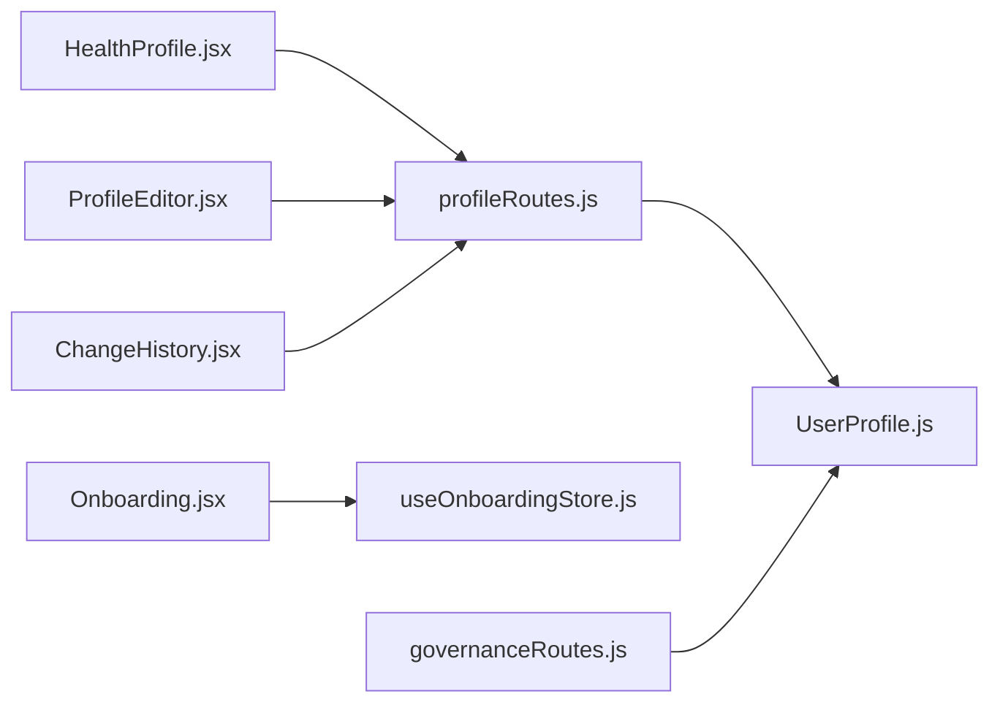

# Health Profile Management

<cite>
**Referenced Files in This Document**
- [HealthProfile.jsx](file://frontend/src/pages/HealthProfile.jsx)
- [ProfileEditor.jsx](file://frontend/src/pages/ProfileEditor.jsx)
- [ChangeHistory.jsx](file://frontend/src/pages/ChangeHistory.jsx)
- [Onboarding.jsx](file://frontend/src/pages/Onboarding.jsx)
- [Step1Biometrics.jsx](file://frontend/src/pages/onboarding/Step1Biometrics.jsx)
- [Step2Lifestyle.jsx](file://frontend/src/pages/onboarding/Step2Lifestyle.jsx)
- [Step3Diet.jsx](file://frontend/src/pages/onboarding/Step3Diet.jsx)
- [Step4WomenHealth.jsx](file://frontend/src/pages/onboarding/Step4WomenHealth.jsx)
- [Step5Respiratory.jsx](file://frontend/src/pages/onboarding/Step5Respiratory.jsx)
- [Step6MentalHealth.jsx](file://frontend/src/pages/onboarding/Step6MentalHealth.jsx)
- [Step7History.jsx](file://frontend/src/pages/onboarding/Step7History.jsx)
- [useOnboardingStore.js](file://frontend/src/store/useOnboardingStore.js)
- [profileRoutes.js](file://backend/src/routes/profileRoutes.js)
- [UserProfile.js](file://backend/src/models/UserProfile.js)
- [governanceRoutes.js](file://backend/src/routes/governanceRoutes.js)
</cite>

## Table of Contents
1. [Introduction](#introduction)
2. [Project Structure](#project-structure)
3. [Core Components](#core-components)
4. [Architecture Overview](#architecture-overview)
5. [Detailed Component Analysis](#detailed-component-analysis)
6. [Dependency Analysis](#dependency-analysis)
7. [Performance Considerations](#performance-considerations)
8. [Troubleshooting Guide](#troubleshooting-guide)
9. [Conclusion](#conclusion)

## Introduction
This document describes the health profile management system, covering:
- HealthProfile page for visualizing user health data, progress tracking, and summary statistics
- ProfileEditor for editing personal information, health metrics, and preferences
- ChangeHistory interface for viewing activity logs and data modifications
- Onboarding flow components for biometrics, lifestyle, diet, women’s health, respiratory health, mental health, and medical history collection
It also explains form validation patterns, data persistence, user experience flows, backend integration, progressive disclosure techniques, accessibility compliance, and responsive form layouts.

## Project Structure
The health profile management spans frontend pages and stores, and backend routes and models:
- Frontend pages: HealthProfile, ProfileEditor, ChangeHistory, Onboarding and its steps
- Frontend store: useOnboardingStore for onboarding state persistence
- Backend routes: profileRoutes for profile CRUD and history, governanceRoutes for export
- Backend model: UserProfile for structured health data

**Diagram sources**
- [HealthProfile.jsx:13-281](file://frontend/src/pages/HealthProfile.jsx#L13-L281)
- [ProfileEditor.jsx:69-540](file://frontend/src/pages/ProfileEditor.jsx#L69-L540)
- [ChangeHistory.jsx:16-260](file://frontend/src/pages/ChangeHistory.jsx#L16-L260)
- [Onboarding.jsx:13-39](file://frontend/src/pages/Onboarding.jsx#L13-L39)
- [Step1Biometrics.jsx:5-165](file://frontend/src/pages/onboarding/Step1Biometrics.jsx#L5-L165)
- [Step2Lifestyle.jsx:5-127](file://frontend/src/pages/onboarding/Step2Lifestyle.jsx#L5-L127)
- [Step3Diet.jsx:5-132](file://frontend/src/pages/onboarding/Step3Diet.jsx#L5-L132)
- [Step4WomenHealth.jsx:5-81](file://frontend/src/pages/onboarding/Step4WomenHealth.jsx#L5-L81)
- [Step5Respiratory.jsx:5-59](file://frontend/src/pages/onboarding/Step5Respiratory.jsx#L5-L59)
- [Step6MentalHealth.jsx:5-57](file://frontend/src/pages/onboarding/Step6MentalHealth.jsx#L5-L57)
- [Step7History.jsx:36-267](file://frontend/src/pages/onboarding/Step7History.jsx#L36-L267)
- [useOnboardingStore.js:4-140](file://frontend/src/store/useOnboardingStore.js#L4-L140)
- [profileRoutes.js:8-367](file://backend/src/routes/profileRoutes.js#L8-L367)
- [governanceRoutes.js:10-48](file://backend/src/routes/governanceRoutes.js#L10-L48)
- [UserProfile.js:15-175](file://backend/src/models/UserProfile.js#L15-L175)

**Section sources**
- [HealthProfile.jsx:13-281](file://frontend/src/pages/HealthProfile.jsx#L13-L281)
- [ProfileEditor.jsx:69-540](file://frontend/src/pages/ProfileEditor.jsx#L69-L540)
- [ChangeHistory.jsx:16-260](file://frontend/src/pages/ChangeHistory.jsx#L16-L260)
- [Onboarding.jsx:13-39](file://frontend/src/pages/Onboarding.jsx#L13-L39)
- [profileRoutes.js:8-367](file://backend/src/routes/profileRoutes.js#L8-L367)
- [UserProfile.js:15-175](file://backend/src/models/UserProfile.js#L15-L175)

## Core Components
- HealthProfile: Fetches and renders user health profile, displays data quality score, and summarizes biometrics, lifestyle, diet, and medical history.
- ProfileEditor: Provides a multi-section form to edit biometrics, lifestyle, diet, and medical history with validation and intent classification for audit logging.
- ChangeHistory: Lists modification history with filtering, charting weight trends, and reclassification support.
- Onboarding: Progressive onboarding with 7 steps covering biometrics, lifestyle, diet, women’s health, respiratory, mental health, and medical history; powered by a persisted Zustand store.

**Section sources**
- [HealthProfile.jsx:13-281](file://frontend/src/pages/HealthProfile.jsx#L13-L281)
- [ProfileEditor.jsx:69-540](file://frontend/src/pages/ProfileEditor.jsx#L69-L540)
- [ChangeHistory.jsx:16-260](file://frontend/src/pages/ChangeHistory.jsx#L16-L260)
- [Onboarding.jsx:13-39](file://frontend/src/pages/Onboarding.jsx#L13-L39)
- [useOnboardingStore.js:4-140](file://frontend/src/store/useOnboardingStore.js#L4-L140)

## Architecture Overview
The frontend components communicate with backend routes via Axios. The backend uses Mongoose models to persist health data and maintain change history.

**Diagram sources**
- [HealthProfile.jsx:30-47](file://frontend/src/pages/HealthProfile.jsx#L30-L47)
- [ProfileEditor.jsx:101-143](file://frontend/src/pages/ProfileEditor.jsx#L101-L143)
- [ProfileEditor.jsx:174-205](file://frontend/src/pages/ProfileEditor.jsx#L174-L205)
- [ChangeHistory.jsx:24-35](file://frontend/src/pages/ChangeHistory.jsx#L24-L35)
- [ChangeHistory.jsx:47-61](file://frontend/src/pages/ChangeHistory.jsx#L47-L61)
- [profileRoutes.js:8-27](file://backend/src/routes/profileRoutes.js#L8-L27)
- [profileRoutes.js:29-141](file://backend/src/routes/profileRoutes.js#L29-L141)
- [profileRoutes.js:143-184](file://backend/src/routes/profileRoutes.js#L143-L184)
- [UserProfile.js:15-175](file://backend/src/models/UserProfile.js#L15-L175)

## Detailed Component Analysis

### HealthProfile Page
- Fetches profile and data quality from backend on mount.
- Renders summary cards for biometrics, lifestyle, diet, and medical history with last-updated timestamps.
- Provides quick navigation to history and editor.
- Displays a data quality score with a circular indicator and label.

**Diagram sources**
- [HealthProfile.jsx:30-47](file://frontend/src/pages/HealthProfile.jsx#L30-L47)
- [HealthProfile.jsx:189-277](file://frontend/src/pages/HealthProfile.jsx#L189-L277)

**Section sources**
- [HealthProfile.jsx:13-281](file://frontend/src/pages/HealthProfile.jsx#L13-L281)

### ProfileEditor Component
- Loads initial profile data and flattens nested fields into form state.
- Multi-section form with progressive disclosure (expanded by default).
- Validation for numeric biometrics (age, height, weight).
- Intent modal to classify updates: correction, baseline shift, initial.
- Saves only changed fields, computes derived BMI, writes history entries, and triggers AI report generation.

**Diagram sources**
- [ProfileEditor.jsx:101-143](file://frontend/src/pages/ProfileEditor.jsx#L101-L143)
- [ProfileEditor.jsx:156-163](file://frontend/src/pages/ProfileEditor.jsx#L156-L163)
- [ProfileEditor.jsx:174-205](file://frontend/src/pages/ProfileEditor.jsx#L174-L205)
- [profileRoutes.js:29-141](file://backend/src/routes/profileRoutes.js#L29-L141)

**Section sources**
- [ProfileEditor.jsx:69-540](file://frontend/src/pages/ProfileEditor.jsx#L69-L540)
- [profileRoutes.js:29-141](file://backend/src/routes/profileRoutes.js#L29-L141)
- [UserProfile.js:3-13](file://backend/src/models/UserProfile.js#L3-L13)

### ChangeHistory Interface
- Loads history entries sorted by newest first.
- Filters by change type (all, real_change, correction, initial).
- Charts weight over time distinguishing real changes and corrections.
- Allows reclassification of history entries and exports log.

**Diagram sources**
- [ChangeHistory.jsx:24-35](file://frontend/src/pages/ChangeHistory.jsx#L24-L35)
- [ChangeHistory.jsx:63-68](file://frontend/src/pages/ChangeHistory.jsx#L63-L68)
- [ChangeHistory.jsx:47-61](file://frontend/src/pages/ChangeHistory.jsx#L47-L61)
- [profileRoutes.js:143-184](file://backend/src/routes/profileRoutes.js#L143-L184)

**Section sources**
- [ChangeHistory.jsx:16-260](file://frontend/src/pages/ChangeHistory.jsx#L16-L260)
- [profileRoutes.js:143-184](file://backend/src/routes/profileRoutes.js#L143-L184)

### Onboarding Flow Components
- Step1Biometrics: Collects identity, age, gender, height, weight; auto-calculates BMI and category.
- Step2Lifestyle: Activity level, sleep, stress, smoking, alcohol.
- Step3Diet: Diet type, sugar/salt intake, junk food frequency, leafy greens/fruits.
- Step4WomenHealth: Gender-specific screening; skipped if not female.
- Step5Respiratory: Environmental and respiratory symptoms.
- Step6MentalHealth: PHQ-2/GAD-2 screening questions.
- Step7History: Advanced thyroid/kidney/liver indicators, allergies (creatable), medical history (multi-select), final submission to create profile.

**Diagram sources**
- [Onboarding.jsx:13-39](file://frontend/src/pages/Onboarding.jsx#L13-L39)
- [Step1Biometrics.jsx:8-42](file://frontend/src/pages/onboarding/Step1Biometrics.jsx#L8-L42)
- [Step4WomenHealth.jsx:12-33](file://frontend/src/pages/onboarding/Step4WomenHealth.jsx#L12-L33)
- [Step7History.jsx:59-84](file://frontend/src/pages/onboarding/Step7History.jsx#L59-L84)

**Section sources**
- [Onboarding.jsx:13-39](file://frontend/src/pages/Onboarding.jsx#L13-L39)
- [Step1Biometrics.jsx:5-165](file://frontend/src/pages/onboarding/Step1Biometrics.jsx#L5-L165)
- [Step2Lifestyle.jsx:5-127](file://frontend/src/pages/onboarding/Step2Lifestyle.jsx#L5-L127)
- [Step3Diet.jsx:5-132](file://frontend/src/pages/onboarding/Step3Diet.jsx#L5-L132)
- [Step4WomenHealth.jsx:5-81](file://frontend/src/pages/onboarding/Step4WomenHealth.jsx#L5-L81)
- [Step5Respiratory.jsx:5-59](file://frontend/src/pages/onboarding/Step5Respiratory.jsx#L5-L59)
- [Step6MentalHealth.jsx:5-57](file://frontend/src/pages/onboarding/Step6MentalHealth.jsx#L5-L57)
- [Step7History.jsx:36-267](file://frontend/src/pages/onboarding/Step7History.jsx#L36-L267)
- [useOnboardingStore.js:4-140](file://frontend/src/store/useOnboardingStore.js#L4-L140)

### Data Models and Persistence
- UserProfile schema defines a uniform FieldSchema with value, lastUpdated, updateType, previousValue, and unit.
- Stores biometrics, lifestyle, diet, medical history, expanded screening fields, and platform settings.
- profileRoutes handles profile retrieval, updates with change detection, BMI synchronization, history insertion, and export.

**Diagram sources**
- [UserProfile.js:15-175](file://backend/src/models/UserProfile.js#L15-L175)

**Section sources**
- [UserProfile.js:3-13](file://backend/src/models/UserProfile.js#L3-L13)
- [UserProfile.js:15-175](file://backend/src/models/UserProfile.js#L15-L175)
- [profileRoutes.js:8-27](file://backend/src/routes/profileRoutes.js#L8-L27)
- [profileRoutes.js:29-141](file://backend/src/routes/profileRoutes.js#L29-L141)

## Dependency Analysis
- Frontend pages depend on Clerk for user context and Axios for API calls.
- ProfileEditor depends on react-select/creatable for multi-select/allergies.
- Onboarding uses a Zustand store for cross-step state persistence.
- Backend routes depend on Mongoose models and the dataQuality watcher utility.

**Diagram sources**
- [HealthProfile.jsx:1-11](file://frontend/src/pages/HealthProfile.jsx#L1-L11)
- [ProfileEditor.jsx:1-13](file://frontend/src/pages/ProfileEditor.jsx#L1-L13)
- [ChangeHistory.jsx:1-14](file://frontend/src/pages/ChangeHistory.jsx#L1-L14)
- [Onboarding.jsx:1-12](file://frontend/src/pages/Onboarding.jsx#L1-L12)
- [useOnboardingStore.js:1-2](file://frontend/src/store/useOnboardingStore.js#L1-L2)
- [profileRoutes.js:1-6](file://backend/src/routes/profileRoutes.js#L1-L6)
- [governanceRoutes.js:1-8](file://backend/src/routes/governanceRoutes.js#L1-L8)
- [UserProfile.js:1-3](file://backend/src/models/UserProfile.js#L1-L3)

**Section sources**
- [HealthProfile.jsx:1-11](file://frontend/src/pages/HealthProfile.jsx#L1-L11)
- [ProfileEditor.jsx:1-13](file://frontend/src/pages/ProfileEditor.jsx#L1-L13)
- [ChangeHistory.jsx:1-14](file://frontend/src/pages/ChangeHistory.jsx#L1-L14)
- [Onboarding.jsx:1-12](file://frontend/src/pages/Onboarding.jsx#L1-L12)
- [useOnboardingStore.js:1-2](file://frontend/src/store/useOnboardingStore.js#L1-L2)
- [profileRoutes.js:1-6](file://backend/src/routes/profileRoutes.js#L1-L6)
- [governanceRoutes.js:1-8](file://backend/src/routes/governanceRoutes.js#L1-L8)
- [UserProfile.js:1-3](file://backend/src/models/UserProfile.js#L1-L3)

## Performance Considerations
- Use optimistic updates in forms where appropriate to reduce perceived latency.
- Debounce chart rendering and heavy computations (e.g., BMI recalculation) to avoid unnecessary re-renders.
- Paginate or limit history lists for large datasets.
- Cache frequently accessed profile data client-side to minimize redundant requests.
- Lazy-load optional components (e.g., charts) until visible.

## Troubleshooting Guide
- Profile loading errors: Verify API URL environment variable and network connectivity; confirm Clerk user context is present.
- Update failures: Check intent modal selection and ensure required numeric fields are valid; review backend error messages for invalid change types or missing fields.
- History reclassification errors: Ensure changeType is one of the allowed values; confirm record exists.
- Export issues: Validate JSON serialization and browser download permissions.

**Section sources**
- [HealthProfile.jsx:41-44](file://frontend/src/pages/HealthProfile.jsx#L41-L44)
- [ProfileEditor.jsx:156-163](file://frontend/src/pages/ProfileEditor.jsx#L156-L163)
- [ProfileEditor.jsx:199-201](file://frontend/src/pages/ProfileEditor.jsx#L199-L201)
- [ChangeHistory.jsx:154-184](file://frontend/src/pages/ChangeHistory.jsx#L154-L184)
- [ChangeHistory.jsx:54-56](file://frontend/src/pages/ChangeHistory.jsx#L54-L56)

## Conclusion
The health profile management system integrates a responsive frontend with a robust backend to deliver a seamless user experience for health data visualization, editing, and auditing. Progressive disclosure, validation, and intent classification ensure accurate and meaningful updates, while structured models and routes support reliable persistence and reporting.