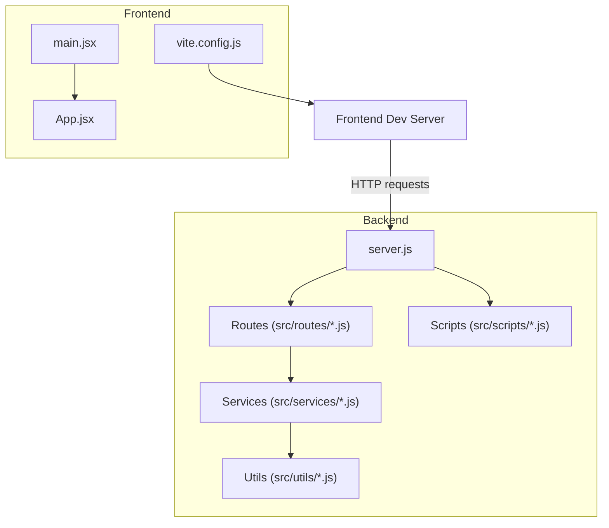
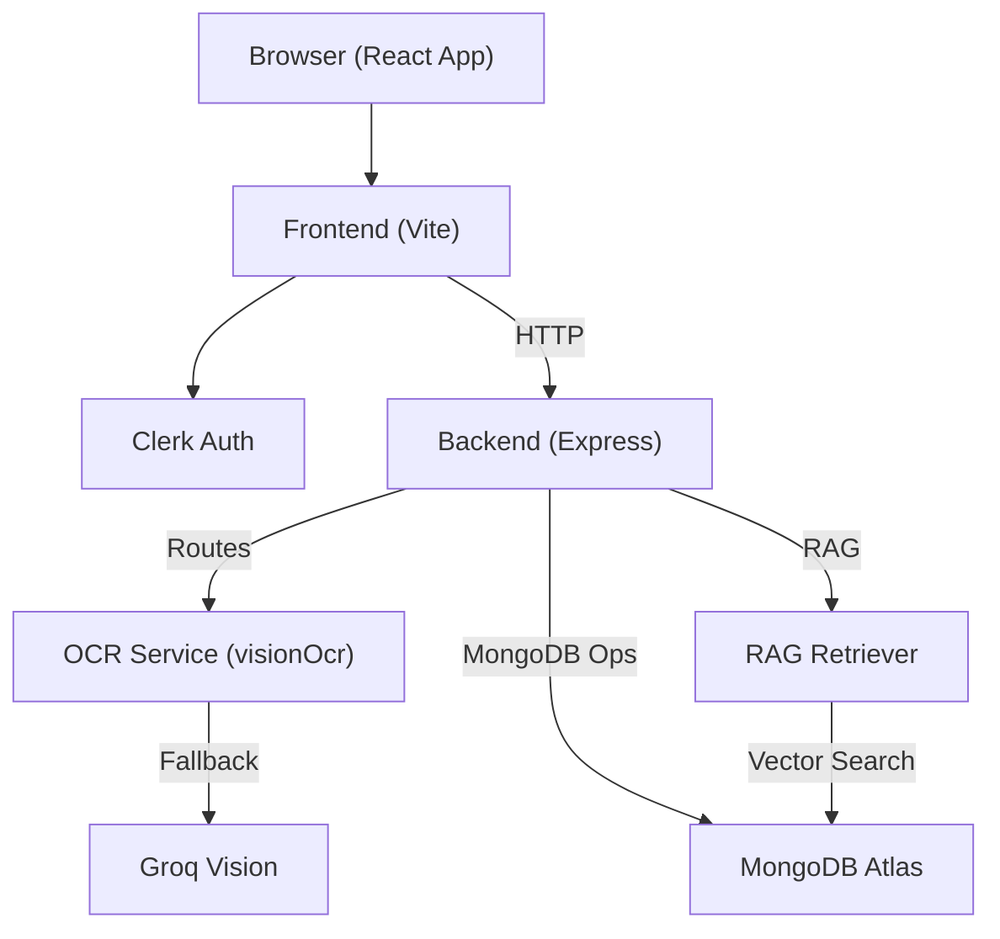
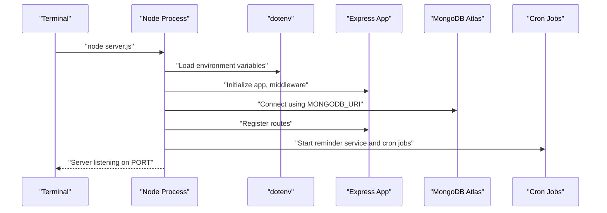
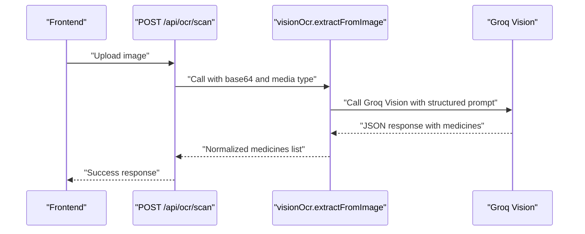
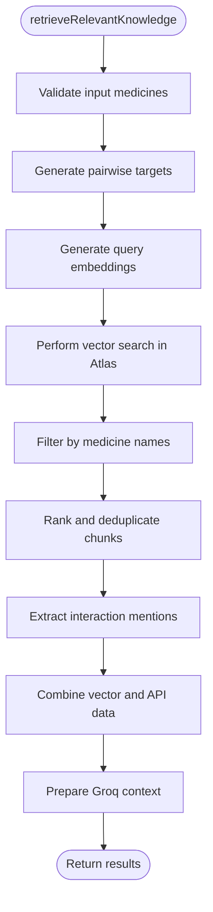
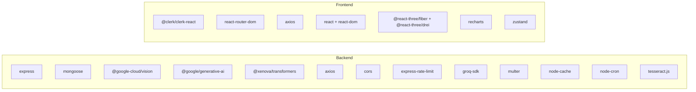

# Getting Started

<cite>
**Referenced Files in This Document**
- [README.md](file://README.md)
- [backend/package.json](file://backend/package.json)
- [frontend/package.json](file://frontend/package.json)
- [backend/server.js](file://backend/server.js)
- [frontend/vite.config.js](file://frontend/vite.config.js)
- [backend/src/services/groqVision.js](file://backend/src/services/groqVision.js)
- [backend/src/services/visionOcr.js](file://backend/src/services/visionOcr.js)
- [backend/src/utils/ragRetriever.js](file://backend/src/utils/ragRetriever.js)
- [backend/src/scripts/cronJobs.js](file://backend/src/scripts/cronJobs.js)
- [frontend/src/main.jsx](file://frontend/src/main.jsx)
- [frontend/src/App.jsx](file://frontend/src/App.jsx)
- [backend/src/routes/ocrRoutes.js](file://backend/src/routes/ocrRoutes.js)
- [.gitignore](file://.gitignore)
- [backend/knowledge-base/ATLAS_VECTOR_CONFIG_GUIDE.md](file://backend/knowledge-base/ATLAS_VECTOR_CONFIG_GUIDE.md)
- [backend/knowledge-base/MANUAL_DATA_DOWNLOAD_GUIDE.md](file://backend/knowledge-base/MANUAL_DATA_DOWNLOAD_GUIDE.md)
</cite>

## Table of Contents
1. [Introduction](#introduction)
2. [Prerequisites](#prerequisites)
3. [Project Structure](#project-structure)
4. [Environment Variables and Secrets](#environment-variables-and-secrets)
5. [Installation and Setup](#installation-and-setup)
6. [Database Configuration with MongoDB Atlas](#database-configuration-with-mongodb-atlas)
7. [External Services API Keys](#external-services-api-keys)
8. [Development Workflow](#development-workflow)
9. [Verification and First Run](#verification-and-first-run)
10. [Architecture Overview](#architecture-overview)
11. [Detailed Component Analysis](#detailed-component-analysis)
12. [Dependency Analysis](#dependency-analysis)
13. [Performance Considerations](#performance-considerations)
14. [Troubleshooting Guide](#troubleshooting-guide)
15. [Conclusion](#conclusion)

## Introduction
This guide helps you install and run VaidyaSetu locally for development. It covers prerequisites, environment setup, database configuration, API keys, and development workflow. The project consists of a Node.js/Express backend and a React/Vite frontend, integrated with MongoDB Atlas and external AI services.

## Prerequisites
- Basic understanding of:
  - JavaScript and Node.js
  - React and modern frontends
  - RESTful APIs
  - MongoDB basics (collections, indexes, connections)
- Tools installed:
  - Node.js and npm
  - Git
  - A modern browser
  - Text editor or IDE

## Project Structure
VaidyaSetu is organized into:
- backend: Express server, routes, services, utilities, and data processing scripts
- frontend: React application bootstrapped with Vite
- knowledge-base: Data sources and guides for building the RAG knowledge base
- Top-level docs and guides for setup and data downloads

**Diagram sources**
- [backend/server.js:1-94](file://backend/server.js#L1-L94)
- [frontend/vite.config.js:1-12](file://frontend/vite.config.js#L1-L12)
- [frontend/src/main.jsx:1-26](file://frontend/src/main.jsx#L1-L26)
- [frontend/src/App.jsx:1-166](file://frontend/src/App.jsx#L1-L166)

**Section sources**
- [backend/server.js:1-94](file://backend/server.js#L1-L94)
- [frontend/vite.config.js:1-12](file://frontend/vite.config.js#L1-L12)
- [frontend/src/main.jsx:1-26](file://frontend/src/main.jsx#L1-L26)
- [frontend/src/App.jsx:1-166](file://frontend/src/App.jsx#L1-L166)

## Environment Variables and Secrets
Create a backend environment file to configure secrets and service endpoints. The backend loads environment variables via dotenv and uses them for:
- MongoDB Atlas connection
- Groq API key for vision fallback
- Clerk publishable key for frontend authentication

- Backend environment variables:
  - MONGODB_URI: MongoDB Atlas connection string
  - GROQ_API_KEY: API key for Groq Vision fallback
  - PORT: optional backend port override

- Frontend environment variables:
  - VITE_API_URL: backend API base URL (default included in app)
  - VITE_CLERK_PUBLISHABLE_KEY: Clerk publishable key

Notes:
- The repository’s .gitignore excludes .env and .env.local to prevent secrets from being committed.
- The frontend expects VITE_CLERK_PUBLISHABLE_KEY to be present; otherwise, it throws an error during initialization.

**Section sources**
- [.gitignore:1-6](file://.gitignore#L1-L6)
- [backend/server.js:1-94](file://backend/server.js#L1-L94)
- [backend/src/services/groqVision.js:1-67](file://backend/src/services/groqVision.js#L1-L67)
- [frontend/src/main.jsx:1-26](file://frontend/src/main.jsx#L1-L26)
- [frontend/src/App.jsx:32-32](file://frontend/src/App.jsx#L32-L32)

## Installation and Setup
Follow these steps to install and run the project locally.

1) Clone the repository and navigate to the project root.
2) Install backend dependencies:
   - From the repository root, run:
     - cd backend
     - npm install
3) Install frontend dependencies:
   - From the repository root, run:
     - cd frontend
     - npm install
4) Configure environment variables:
   - Create backend/.env with required variables (see Environment Variables and Secrets).
   - Create frontend/.env with VITE_CLERK_PUBLISHABLE_KEY and optionally VITE_API_URL.
5) Start the backend:
   - From the backend directory, run:
     - node server.js
   - The server listens on the configured port (default 5000) and logs health status.
6) Start the frontend:
   - From the frontend directory, run:
     - npm run dev
   - The Vite dev server starts and opens the app in your browser.

Verification:
- Backend health endpoint: GET http://localhost:5000/api/health
- Frontend: visit http://localhost:5173 and sign in via Clerk

**Section sources**
- [README.md:16-28](file://README.md#L16-L28)
- [backend/package.json:1-37](file://backend/package.json#L1-L37)
- [frontend/package.json:1-46](file://frontend/package.json#L1-L46)
- [backend/server.js:34-79](file://backend/server.js#L34-L79)
- [frontend/vite.config.js:1-12](file://frontend/vite.config.js#L1-L12)

## Database Configuration with MongoDB Atlas
VaidyaSetu uses MongoDB Atlas for data persistence and vector search. Follow the official guide to set up the vector index before running queries.

Steps:
1) Create the collection:
   - In MongoDB Atlas, under the vaidyasetu database, create a collection named knowledge_chunks.
2) Configure the vector index:
   - In the Atlas Search dashboard, create a search index named vector_index.
   - Use the provided JSON mapping for vector and filter fields.
3) Wait for activation:
   - Atlas provisioning takes 5–15 minutes. The index must show Active before queries succeed.

After the index is active, the backend connects to MongoDB using the MONGODB_URI from environment variables and the RAG retriever performs vector searches against the knowledge_chunks collection.

**Section sources**
- [backend/knowledge-base/ATLAS_VECTOR_CONFIG_GUIDE.md:1-46](file://backend/knowledge-base/ATLAS_VECTOR_CONFIG_GUIDE.md#L1-L46)
- [backend/server.js:40-43](file://backend/server.js#L40-L43)
- [backend/src/utils/ragRetriever.js:25-72](file://backend/src/utils/ragRetriever.js#L25-L72)

## External Services API Keys
Configure API keys for external services used by the backend.

- Groq Vision fallback:
  - Obtain a GROQ_API_KEY and set it in backend/.env.
  - The vision service uses this key to call the Groq API for image-based medicine extraction.

- Google Cloud (manual configuration required):
  - Enable Fitness API and Cloud Vision API.
  - Create OAuth 2.0 Web Application credentials.
  - Add http://localhost:5173 to Authorized origins and redirects.
  - Copy the Client ID and Secret into backend/.env as indicated in the repository’s README.

Note: The frontend also expects VITE_CLERK_PUBLISHABLE_KEY for authentication.

**Section sources**
- [backend/src/services/groqVision.js:1-67](file://backend/src/services/groqVision.js#L1-L67)
- [README.md:8-14](file://README.md#L8-L14)
- [frontend/src/main.jsx:7-11](file://frontend/src/main.jsx#L7-L11)

## Development Workflow
- Hot reload:
  - Frontend: Vite dev server automatically reloads on file changes.
  - Backend: The server runs with node server.js; restart it after changing server-side code.
- Debugging:
  - Backend: Use console logs and attach a Node debugger to the server process.
  - Frontend: Use browser developer tools and React DevTools.
- API testing:
  - Use curl or Postman to hit backend endpoints (e.g., /api/health, /api/ocr/scan).
- Cron jobs:
  - Background tasks are scheduled on startup. Review cronJobs.js to understand scheduled tasks.

**Section sources**
- [frontend/vite.config.js:1-12](file://frontend/vite.config.js#L1-L12)
- [backend/server.js:77-83](file://backend/server.js#L77-L83)
- [backend/src/scripts/cronJobs.js:12-66](file://backend/src/scripts/cronJobs.js#L12-L66)

## Verification and First Run
After completing setup:

1) Confirm backend:
   - Ensure MongoDB Atlas is reachable and the vector index is Active.
   - Start the backend and verify logs indicate successful MongoDB connection and route registration.
   - Call GET /api/health and confirm db_status is connected.

2) Confirm frontend:
   - Start the frontend dev server.
   - Open http://localhost:5173 and sign in via Clerk using the publishable key.
   - The app should navigate to onboarding if no profile exists.

3) OCR pipeline:
   - Upload a prescription image via the OCR route (/api/ocr/scan) to test vision extraction.
   - Normalize extracted medicine names via /api/ocr/normalize.

4) RAG retrieval:
   - Trigger a knowledge retrieval operation to validate vector search and context preparation.

Common checks:
- Environment variables present in both backend and frontend.
- Clerk publishable key configured; otherwise, the frontend throws an error during initialization.
- MongoDB connection string valid and network accessible.

**Section sources**
- [backend/server.js:68-75](file://backend/server.js#L68-L75)
- [frontend/src/App.jsx:68-82](file://frontend/src/App.jsx#L68-L82)
- [backend/src/routes/ocrRoutes.js:19-49](file://backend/src/routes/ocrRoutes.js#L19-L49)
- [backend/src/utils/ragRetriever.js:156-215](file://backend/src/utils/ragRetriever.js#L156-L215)

## Architecture Overview
The system comprises a React frontend and an Express backend. The backend exposes REST endpoints, integrates with MongoDB Atlas for persistence and vector search, and orchestrates AI services for OCR and RAG.

**Diagram sources**
- [frontend/src/App.jsx:1-166](file://frontend/src/App.jsx#L1-L166)
- [backend/src/services/visionOcr.js:1-25](file://backend/src/services/visionOcr.js#L1-L25)
- [backend/src/services/groqVision.js:1-67](file://backend/src/services/groqVision.js#L1-L67)
- [backend/src/utils/ragRetriever.js:1-218](file://backend/src/utils/ragRetriever.js#L1-L218)
- [backend/server.js:1-94](file://backend/server.js#L1-L94)

## Detailed Component Analysis

### Backend Server Initialization
The server initializes middleware, connects to MongoDB, registers routes, and starts background services.

**Diagram sources**
- [backend/server.js:1-94](file://backend/server.js#L1-L94)
- [backend/src/scripts/cronJobs.js:12-66](file://backend/src/scripts/cronJobs.js#L12-L66)

**Section sources**
- [backend/server.js:1-94](file://backend/server.js#L1-L94)
- [backend/src/scripts/cronJobs.js:12-66](file://backend/src/scripts/cronJobs.js#L12-L66)

### OCR Pipeline Flow
The OCR route accepts an image, converts it to base64, and passes it to the vision service wrapper, which attempts Groq Vision fallback.

**Diagram sources**
- [backend/src/routes/ocrRoutes.js:19-49](file://backend/src/routes/ocrRoutes.js#L19-L49)
- [backend/src/services/visionOcr.js:7-22](file://backend/src/services/visionOcr.js#L7-L22)
- [backend/src/services/groqVision.js:11-64](file://backend/src/services/groqVision.js#L11-L64)

**Section sources**
- [backend/src/routes/ocrRoutes.js:1-73](file://backend/src/routes/ocrRoutes.js#L1-L73)
- [backend/src/services/visionOcr.js:1-25](file://backend/src/services/visionOcr.js#L1-L25)
- [backend/src/services/groqVision.js:1-67](file://backend/src/services/groqVision.js#L1-L67)

### RAG Retrieval Algorithm
The RAG retriever generates embeddings for queries, performs vector search, filters and ranks results, and prepares a context for downstream AI processing.

**Diagram sources**
- [backend/src/utils/ragRetriever.js:156-215](file://backend/src/utils/ragRetriever.js#L156-L215)

**Section sources**
- [backend/src/utils/ragRetriever.js:1-218](file://backend/src/utils/ragRetriever.js#L1-L218)

## Dependency Analysis
Backend dependencies include Express, Mongoose, CORS, rate limiting, OCR libraries, Groq SDK, and AI transformers. Frontend dependencies include Clerk, React Router, Three.js, Recharts, and Vite tooling.

**Diagram sources**
- [backend/package.json:13-31](file://backend/package.json#L13-L31)
- [frontend/package.json:12-31](file://frontend/package.json#L12-L31)

**Section sources**
- [backend/package.json:1-37](file://backend/package.json#L1-L37)
- [frontend/package.json:1-46](file://frontend/package.json#L1-L46)

## Performance Considerations
- Vector search candidates and limits are tuned to balance recall and latency; adjust numCandidates and limit in the vector search pipeline as needed.
- Embedding caching reduces repeated computation for identical queries.
- Cron jobs handle cleanup and maintenance; schedule them according to workload.
- Use the Vite dev server for fast iteration; avoid heavy bundling during development.

## Troubleshooting Guide
- Missing Clerk publishable key:
  - Symptom: Frontend throws an error during initialization.
  - Fix: Set VITE_CLERK_PUBLISHABLE_KEY in frontend/.env.

- MongoDB connection failures:
  - Symptom: Backend logs a connection error.
  - Fix: Verify MONGODB_URI and network access; ensure the Atlas cluster is reachable.

- OCR extraction errors:
  - Symptom: OCR route returns an error.
  - Fix: Ensure GROQ_API_KEY is set; verify image format and size limits.

- Vector index not active:
  - Symptom: Vector search fails or returns empty results.
  - Fix: Follow the Atlas vector index guide to create and activate the index.

- Cron job errors:
  - Symptom: Logs show cron worker errors.
  - Fix: Review cronJobs.js and permissions for file cleanup and alert expiry.

- Google OAuth setup:
  - Symptom: OAuth flows fail locally.
  - Fix: Enable APIs, create OAuth credentials, and add localhost origins/redirects as documented.

**Section sources**
- [frontend/src/main.jsx:9-11](file://frontend/src/main.jsx#L9-L11)
- [backend/server.js:40-43](file://backend/server.js#L40-L43)
- [backend/src/services/groqVision.js:12-14](file://backend/src/services/groqVision.js#L12-L14)
- [backend/knowledge-base/ATLAS_VECTOR_CONFIG_GUIDE.md:43-46](file://backend/knowledge-base/ATLAS_VECTOR_CONFIG_GUIDE.md#L43-L46)
- [backend/src/scripts/cronJobs.js:24-38](file://backend/src/scripts/cronJobs.js#L24-L38)
- [README.md:8-14](file://README.md#L8-L14)

## Conclusion
You now have the essentials to install, configure, and run VaidyaSetu locally. Use the backend and frontend commands to start both servers, configure environment variables, and connect to MongoDB Atlas. Test the OCR and RAG pipelines, and refer to the troubleshooting section for common issues. For deeper exploration, review the architecture and component diagrams to understand how the system integrates AI services and data stores.