# Core Features

<cite>
**Referenced Files in This Document**
- [README.md](file://README.md)
- [VAIDYASETU_IMPLEMENTATION_PLAN.md](file://VAIDYASETU_IMPLEMENTATION_PLAN.md)
- [API_DOCS.md](file://API_DOCS.md)
- [backend/package.json](file://backend/package.json)
- [frontend/package.json](file://frontend/package.json)
- [backend/server.js](file://backend/server.js)
- [backend/src/data/interactions.json](file://backend/src/data/interactions.json)
- [backend/src/utils/interactionEngine.js](file://backend/src/utils/interactionEngine.js)
- [backend/src/utils/riskScorer.js](file://backend/src/utils/riskScorer.js)
- [backend/src/services/aiService.js](file://backend/src/services/aiService.js)
- [backend/src/routes/ragRoutes.js](file://backend/src/routes/ragRoutes.js)
- [backend/src/routes/interactionRoutes.js](file://backend/src/routes/interactionRoutes.js)
- [backend/src/routes/realtimeInteractionRoutes.js](file://backend/src/routes/realtimeInteractionRoutes.js)
- [backend/src/routes/vitalsRoutes.js](file://backend/src/routes/vitalsRoutes.js)
- [backend/src/routes/alertRoutes.js](file://backend/src/routes/alertRoutes.js)
- [backend/src/routes/medicationRoutes.js](file://backend/src/routes/medicationRoutes.js)
- [backend/src/routes/chatRoutes.js](file://backend/src/routes/chatRoutes.js)
- [backend/src/routes/ocrRoutes.js](file://backend/src/routes/ocrRoutes.js)
- [backend/src/routes/governanceRoutes.js](file://backend/src/routes/governanceRoutes.js)
- [backend/src/models/Medication.js](file://backend/src/models/Medication.js)
- [backend/src/models/Vital.js](file://backend/src/models/Vital.js)
- [backend/src/models/Alert.js](file://backend/src/models/Alert.js)
- [backend/src/models/AlertPreference.js](file://backend/src/models/AlertPreference.js)
- [backend/src/models/History.js](file://backend/src/models/History.js)
- [backend/src/models/InteractionHistory.js](file://backend/src/models/InteractionHistory.js)
- [backend/src/services/reminderService.js](file://backend/src/services/reminderService.js)
- [backend/src/utils/ragRetriever.js](file://backend/src/utils/ragRetriever.js)
- [backend/src/utils/ragPromptEngine.js](file://backend/src/utils/ragPromptEngine.js)
- [backend/reference_data/IMPPAT_Herb_Drug_Interactions.csv](file://backend/reference_data/IMPPAT_Herb_Drug_Interactions.csv)
- [backend/reference_data/ICMR_Diabetes_Guidelines.txt](file://backend/reference_data/ICMR_Diabetes_Guidelines.txt)
- [backend/reference_data/ICMR_Anemia_Guidelines.txt](file://backend/reference_data/ICMR_Anemia_Guidelines.txt)
- [backend/reference_data/AYUSH_Herb_Nomenclature.txt](file://backend/reference_data/AYUSH_Herb_Nomenclature.txt)
- [backend/reference_data/CCRH_Homeopathy_Indications.txt](file://backend/reference_data/CCRH_Homeopathy_Indications.txt)
- [backend/knowledge-base/chunks/drugbank/1bd06522-d91a-4b06-8beb-441a2720371b.json](file://backend/knowledge-base/chunks/drugbank/1bd06522-d91a-4b06-8beb-441a2720371b.json)
- [backend/knowledge-base/chunks/icmr/0009e868-b77f-4756-80d0-c3f7eb0093ac.json](file://backend/knowledge-base/chunks/icmr/0009e868-b77f-4756-80d0-c3f7eb0093ac.json)
- [backend/knowledge-base/chunks/ccrh/191e2d32-75e6-48bb-bfc2-786563f83bdd.json](file://backend/knowledge-base/chunks/ccrh/191e2d32-75e6-48bb-bfc2-786563f83bdd.json)
- [backend/knowledge-base/chunks/ayush/e49899e5-1823-431a-8a77-377a17721485.json](file://backend/knowledge-base/chunks/ayush/e49899e5-1823-431a-8a77-377a17721485.json)
</cite>

## Table of Contents
1. [Introduction](#introduction)
2. [Project Structure](#project-structure)
3. [Core Components](#core-components)
4. [Architecture Overview](#architecture-overview)
5. [Detailed Component Analysis](#detailed-component-analysis)
6. [Dependency Analysis](#dependency-analysis)
7. [Performance Considerations](#performance-considerations)
8. [Troubleshooting Guide](#troubleshooting-guide)
9. [Conclusion](#conclusion)
10. [Appendices](#appendices)

## Introduction
VaidyaSetu is an AI-powered health platform designed to bridge Allopathy, Ayurveda, and Homeopathy in clinical decision-making. It focuses on three pillars:
- Early disease prediction using evidence-based algorithms and Indian epidemiological data
- AI-powered health companion for symptom triage and personalized advice
- The Interaction Bridge: real-time detection of unsafe combinations across all three medical systems with tiered safety alerts

The platform integrates modern technologies including rule-based scoring, fuzzy medicine name matching, AI-driven explanations, OCR-based prescription parsing, reminders, vitals tracking, and alerting systems. It supports cultural intelligence by incorporating Ayurvedic, Homeopathic, and Allopathic knowledge bases and aligns with Indian guidelines and standards.

**Section sources**
- [README.md:1-31](file://README.md#L1-L31)
- [VAIDYASETU_IMPLEMENTATION_PLAN.md:24-44](file://VAIDYASETU_IMPLEMENTATION_PLAN.md#L24-L44)

## Project Structure
The repository is organized into:
- backend: Node.js/Express server, routes, models, services, utilities, and knowledge base
- frontend: React-based UI with routing, state management, and components
- reference_data: curated datasets for Ayurveda, Homeopathy, ICMR guidelines, and IMPPAT interactions
- knowledge-base: chunked and embedded documents for future RAG integration
- vaidyasetu1: historical artifacts and related prototypes

Key runtime and technology stack highlights:
- Backend: Express.js, MongoDB Atlas, Clerk authentication, Groq AI, OCR via Google Cloud Vision and Tesseract
- Frontend: React, React Router, PDF generation, animations, and PWA support

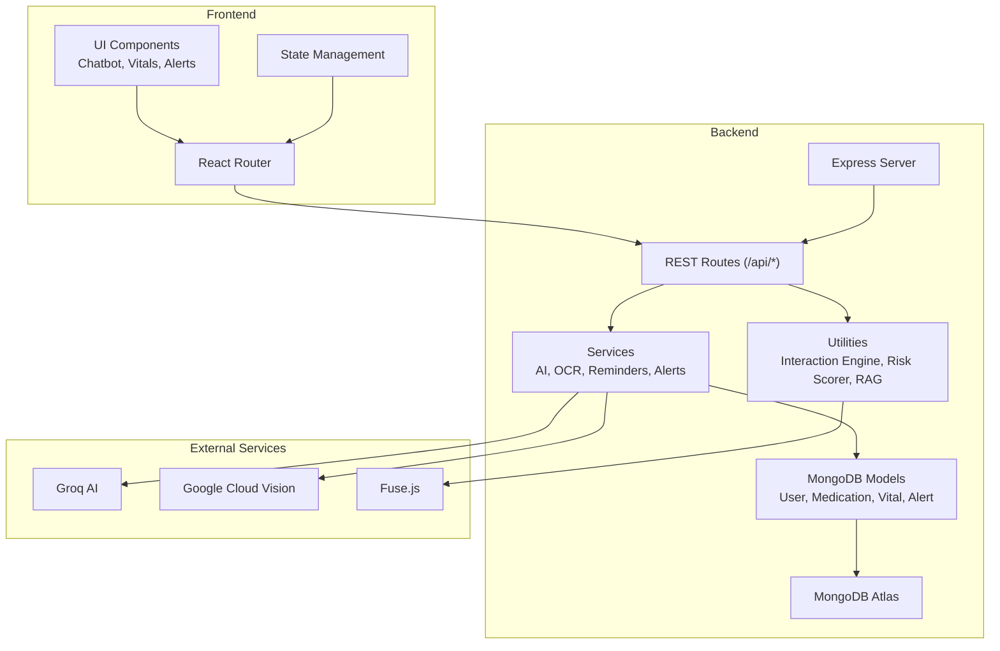

**Diagram sources**
- [backend/server.js:33-66](file://backend/server.js#L33-L66)
- [backend/package.json:13-31](file://backend/package.json#L13-L31)
- [frontend/package.json:12-31](file://frontend/package.json#L12-L31)

**Section sources**
- [backend/server.js:33-66](file://backend/server.js#L33-L66)
- [backend/package.json:13-31](file://backend/package.json#L13-L31)
- [frontend/package.json:12-31](file://frontend/package.json#L12-L31)

## Core Components
This section outlines the core features and capabilities as implemented in the codebase.

- Multi-disease risk assessment engine
  - Evidence-based scoring using Indian epidemiology and rule sets
  - Cultural intelligence via diet, activity, and demographic adjustments
  - Doctor consultation triggers and emergency alert logic
  - Personalized mitigation recommendations generated via AI or fallback library

- Drug interaction safety system
  - Fuzzy medicine name matching against a curated knowledge base
  - Real-time interaction detection across Allopathy, Ayurveda, and Homeopathy
  - Tiered safety alerts with mechanism and source attribution
  - AI-generated plain-language explanations for detected interactions

- AI-powered recommendation system
  - Personalized mitigation steps considering allergies, current medications, and profile
  - Fallback rules-based recommendations when AI is unavailable
  - Integration of cultural context and regional ingredients

- Medication management system
  - Prescription upload and OCR preprocessing
  - Fuzzy normalization to standard names
  - Adherence tracking and reminder automation
  - Prescription storage and history

- Vitals monitoring and health tracking
  - Logging and retrieving biometric vitals
  - Trend analysis and visualization-ready data
  - Doctor consultation triggers based on trends and thresholds

- Alert and notification system
  - Configurable alert preferences
  - Emergency protocols and critical alerts
  - Integration with reminders and doctor connect

- AI chat assistant
  - Conversational triage assistant
  - Context-aware responses aligned with user profile and risks

- Feature interconnections and data flows
  - User profile feeds risk scoring and recommendations
  - Interaction checks influence alerts and doctor triggers
  - Vitals and medications inform risk updates and reminders
  - OCR normalizes prescriptions for interaction and medication workflows

**Section sources**
- [VAIDYASETU_IMPLEMENTATION_PLAN.md:140-194](file://VAIDYASETU_IMPLEMENTATION_PLAN.md#L140-L194)
- [backend/src/utils/riskScorer.js:51-262](file://backend/src/utils/riskScorer.js#L51-L262)
- [backend/src/utils/interactionEngine.js:27-65](file://backend/src/utils/interactionEngine.js#L27-L65)
- [backend/src/services/aiService.js:10-78](file://backend/src/services/aiService.js#L10-L78)
- [backend/src/routes/medicationRoutes.js](file://backend/src/routes/medicationRoutes.js)
- [backend/src/routes/vitalsRoutes.js](file://backend/src/routes/vitalsRoutes.js)
- [backend/src/routes/alertRoutes.js](file://backend/src/routes/alertRoutes.js)
- [backend/src/routes/chatRoutes.js](file://backend/src/routes/chatRoutes.js)
- [backend/src/routes/ocrRoutes.js](file://backend/src/routes/ocrRoutes.js)

## Architecture Overview
The system follows a layered architecture:
- Presentation: React frontend with routing and state management
- API: Express.js REST endpoints under /api
- Business logic: Utilities for risk scoring and interaction detection
- Services: AI, OCR, reminders, and alert orchestration
- Data: MongoDB Atlas for user profiles, vitals, alerts, histories, and preferences

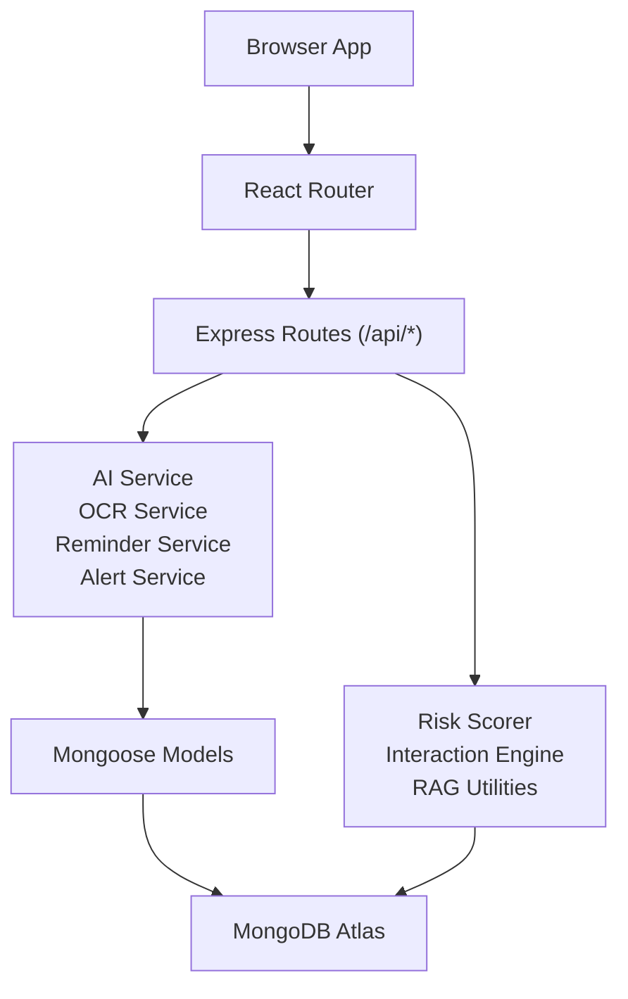

**Diagram sources**
- [backend/server.js:33-66](file://backend/server.js#L33-L66)
- [backend/src/utils/riskScorer.js:51-262](file://backend/src/utils/riskScorer.js#L51-L262)
- [backend/src/utils/interactionEngine.js:27-65](file://backend/src/utils/interactionEngine.js#L27-L65)
- [backend/src/services/aiService.js:10-78](file://backend/src/services/aiService.js#L10-L78)

## Detailed Component Analysis

### Multi-Disease Risk Assessment Engine
The risk engine computes preliminary and detailed risk insights for multiple conditions using:
- Evidence-based prevalence data stratified by age and gender
- Profile-driven factors (diet, activity, BMI, symptoms)
- Protective factors and missing data indicators
- Doctor consultation triggers and emergency alerts

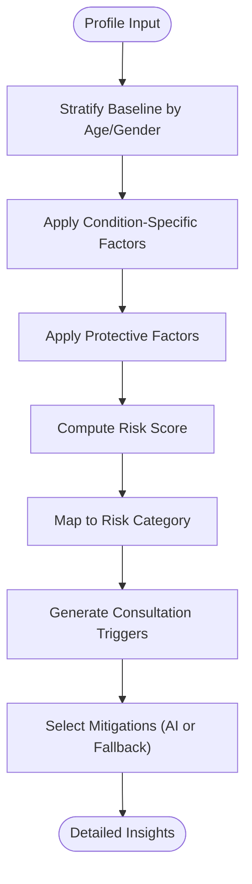

**Diagram sources**
- [backend/src/utils/riskScorer.js:51-262](file://backend/src/utils/riskScorer.js#L51-L262)
- [backend/src/services/aiService.js:10-78](file://backend/src/services/aiService.js#L10-L78)

**Section sources**
- [backend/src/utils/riskScorer.js:51-262](file://backend/src/utils/riskScorer.js#L51-L262)
- [backend/src/services/aiService.js:10-78](file://backend/src/services/aiService.js#L10-L78)

### Drug Interaction Safety System
The interaction checker performs:
- Fuzzy matching of user-entered or OCR-normalized medicine names
- Cross-system interaction detection (Allopathy + Ayurveda/Homeopathy)
- Tiered alert generation with severity, mechanism, and recommendations
- AI-powered plain-language explanations

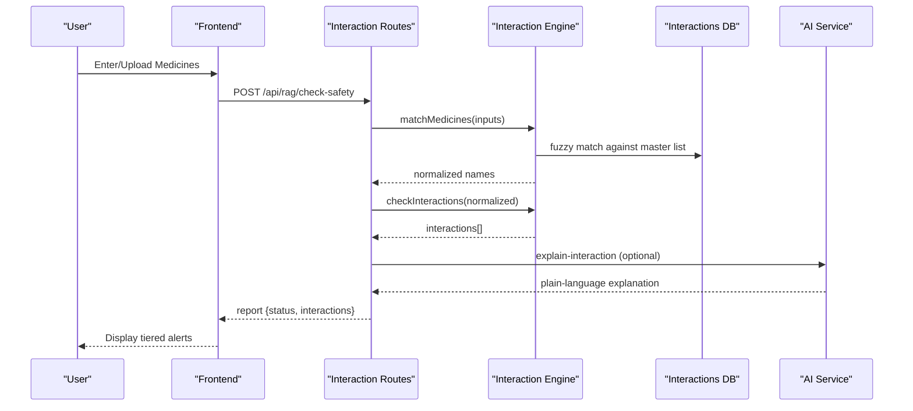

**Diagram sources**
- [backend/src/routes/ragRoutes.js](file://backend/src/routes/ragRoutes.js)
- [backend/src/utils/interactionEngine.js:27-65](file://backend/src/utils/interactionEngine.js#L27-L65)
- [backend/src/data/interactions.json:1-257](file://backend/src/data/interactions.json#L1-L257)
- [backend/src/services/aiService.js:10-78](file://backend/src/services/aiService.js#L10-L78)

**Section sources**
- [backend/src/utils/interactionEngine.js:27-65](file://backend/src/utils/interactionEngine.js#L27-L65)
- [backend/src/data/interactions.json:1-257](file://backend/src/data/interactions.json#L1-L257)
- [API_DOCS.md:11-28](file://API_DOCS.md#L11-L28)

### AI-Powered Recommendation System
Recommendations are generated using:
- LLM-based generation when API key is available
- Fallback rules-based library filtered by profile context
- Cultural and dietary considerations

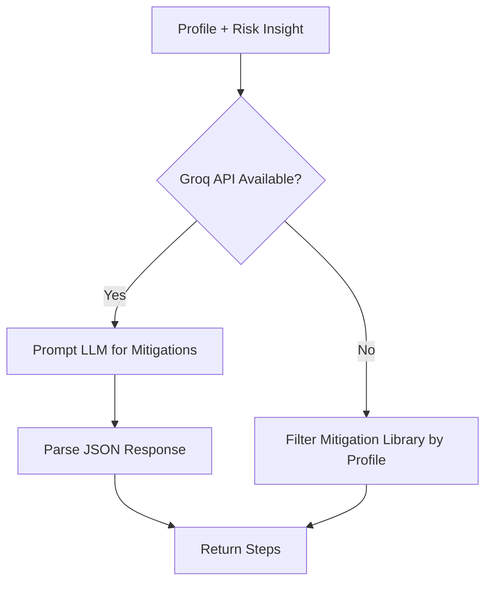

**Diagram sources**
- [backend/src/services/aiService.js:10-78](file://backend/src/services/aiService.js#L10-L78)
- [backend/src/utils/riskScorer.js:51-262](file://backend/src/utils/riskScorer.js#L51-L262)

**Section sources**
- [backend/src/services/aiService.js:10-78](file://backend/src/services/aiService.js#L10-L78)

### Medication Management System
The system supports:
- Prescription upload and OCR preprocessing
- Fuzzy normalization to standard names
- Storage of medications and adherence tracking
- Reminder automation and history logging

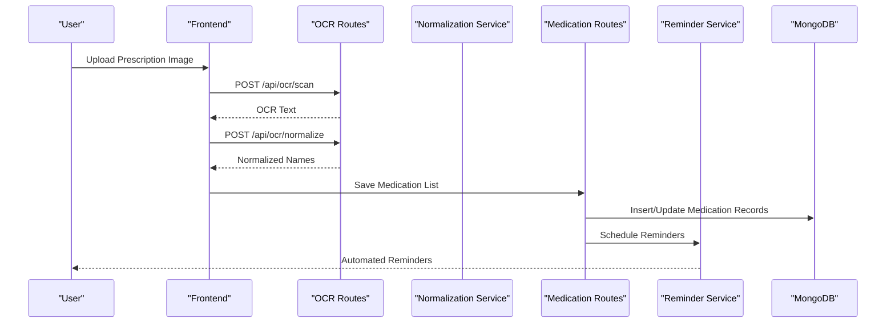

**Diagram sources**
- [backend/src/routes/ocrRoutes.js](file://backend/src/routes/ocrRoutes.js)
- [backend/src/routes/medicationRoutes.js](file://backend/src/routes/medicationRoutes.js)
- [backend/src/services/reminderService.js](file://backend/src/services/reminderService.js)
- [backend/src/models/Medication.js](file://backend/src/models/Medication.js)

**Section sources**
- [backend/src/routes/medicationRoutes.js](file://backend/src/routes/medicationRoutes.js)
- [backend/src/routes/ocrRoutes.js](file://backend/src/routes/ocrRoutes.js)
- [backend/src/services/reminderService.js](file://backend/src/services/reminderService.js)
- [backend/src/models/Medication.js](file://backend/src/models/Medication.js)

### Vitals Monitoring and Health Tracking
Users can log vitals and receive:
- Latest vitals retrieval
- Trend analysis and visualization
- Doctor consultation triggers based on abnormal trends

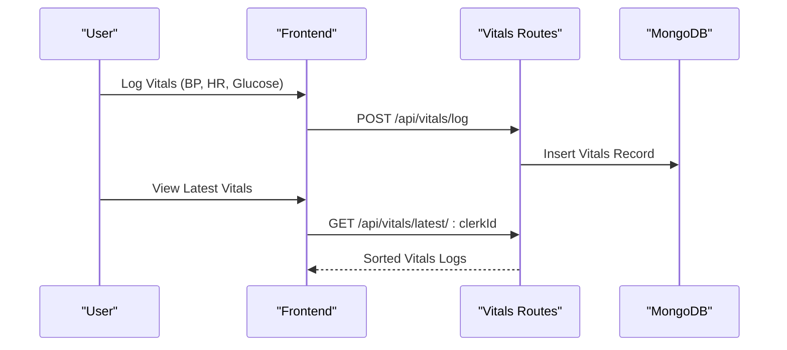

**Diagram sources**
- [backend/src/routes/vitalsRoutes.js](file://backend/src/routes/vitalsRoutes.js)
- [backend/src/models/Vital.js](file://backend/src/models/Vital.js)

**Section sources**
- [backend/src/routes/vitalsRoutes.js](file://backend/src/routes/vitalsRoutes.js)
- [backend/src/models/Vital.js](file://backend/src/models/Vital.js)

### Alert and Notification System
The alert hub provides:
- Retrieval of alerts with filtering
- Push notifications for critical and routine alerts
- Emergency protocols and doctor connect triggers

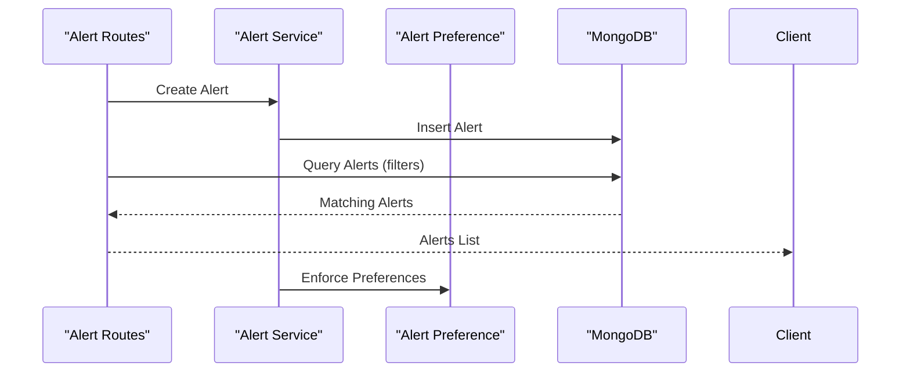

**Diagram sources**
- [backend/src/routes/alertRoutes.js](file://backend/src/routes/alertRoutes.js)
- [backend/src/models/Alert.js](file://backend/src/models/Alert.js)
- [backend/src/models/AlertPreference.js](file://backend/src/models/AlertPreference.js)

**Section sources**
- [backend/src/routes/alertRoutes.js](file://backend/src/routes/alertRoutes.js)
- [backend/src/models/Alert.js](file://backend/src/models/Alert.js)
- [backend/src/models/AlertPreference.js](file://backend/src/models/AlertPreference.js)

### AI Chat Assistant
The chat assistant offers:
- Floating triage assistant for symptom-based guidance
- Context-aware responses aligned with user profile and risks

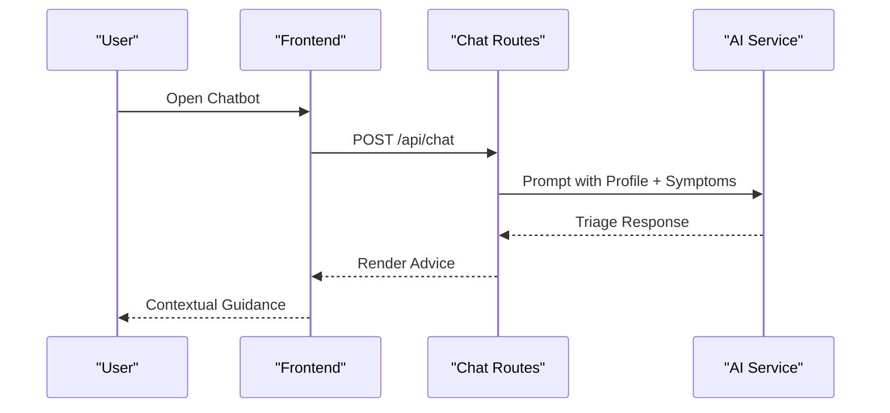

**Diagram sources**
- [backend/src/routes/chatRoutes.js](file://backend/src/routes/chatRoutes.js)
- [backend/src/services/aiService.js:10-78](file://backend/src/services/aiService.js#L10-L78)

**Section sources**
- [backend/src/routes/chatRoutes.js](file://backend/src/routes/chatRoutes.js)
- [backend/src/services/aiService.js:10-78](file://backend/src/services/aiService.js#L10-L78)

### Feature Interconnections and Data Flows
The following diagram shows how features interconnect and share data:

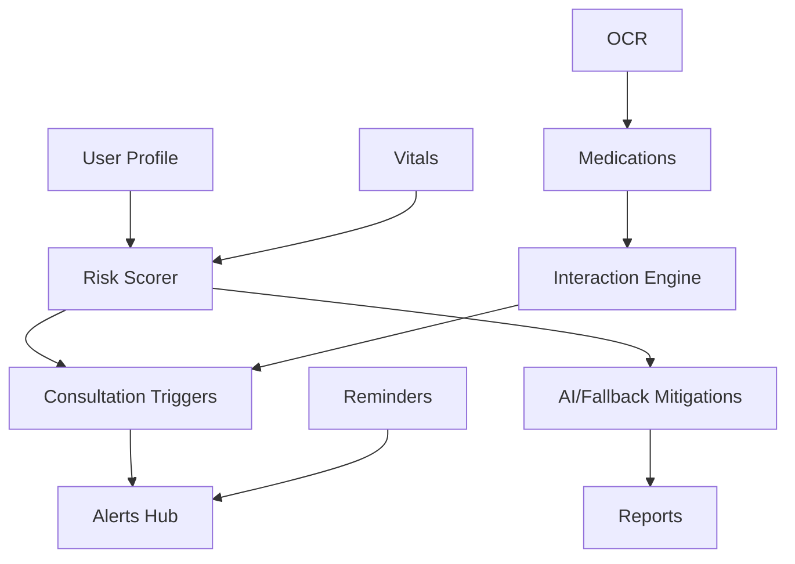

**Diagram sources**
- [backend/src/utils/riskScorer.js:51-262](file://backend/src/utils/riskScorer.js#L51-L262)
- [backend/src/utils/interactionEngine.js:27-65](file://backend/src/utils/interactionEngine.js#L27-L65)
- [backend/src/services/aiService.js:10-78](file://backend/src/services/aiService.js#L10-L78)
- [backend/src/routes/alertRoutes.js](file://backend/src/routes/alertRoutes.js)
- [backend/src/routes/medicationRoutes.js](file://backend/src/routes/medicationRoutes.js)
- [backend/src/routes/vitalsRoutes.js](file://backend/src/routes/vitalsRoutes.js)
- [backend/src/routes/ocrRoutes.js](file://backend/src/routes/ocrRoutes.js)

## Dependency Analysis
The backend depends on several external libraries and services:
- Express for routing and middleware
- Mongoose for MongoDB interactions
- Fuse.js for fuzzy medicine name matching
- Groq SDK for AI generation
- Google Cloud Vision and Tesseract for OCR
- Node-cron for scheduled jobs

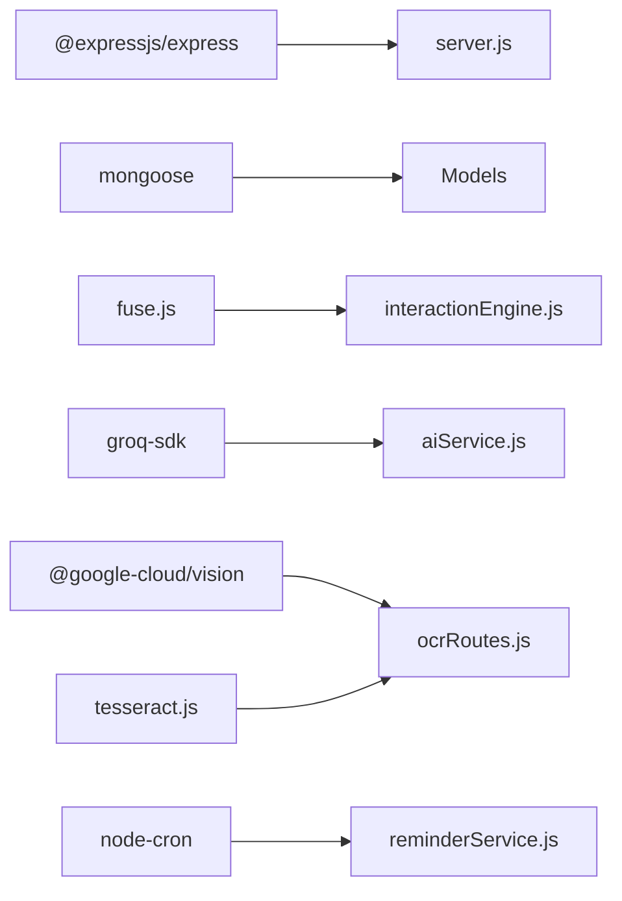

**Diagram sources**
- [backend/package.json:13-31](file://backend/package.json#L13-L31)
- [backend/server.js:33-66](file://backend/server.js#L33-L66)

**Section sources**
- [backend/package.json:13-31](file://backend/package.json#L13-L31)
- [backend/server.js:33-66](file://backend/server.js#L33-L66)

## Performance Considerations
- Fuzzy matching threshold and indexing: Tune Fuse.js parameters to balance recall and speed for medicine name matching.
- AI generation batching: Batch requests to Groq to minimize latency and cost.
- Database queries: Ensure proper indexing on clerkId, timestamps, and interaction fields to optimize reads.
- OCR preprocessing: Normalize images and leverage fallback OCR engines to improve accuracy.
- Background jobs: Use cron jobs judiciously to avoid contention with peak traffic.

[No sources needed since this section provides general guidance]

## Troubleshooting Guide
- Authentication and environment
  - Ensure Clerk OAuth credentials and Google Cloud Vision API keys are configured in the backend .env.
  - Verify MongoDB Atlas connectivity and IP whitelisting.

- API endpoints
  - Use the health check endpoint to confirm backend status.
  - Validate payload formats for interaction and vitals endpoints as documented.

- OCR and normalization
  - If OCR fails, verify image upload and fallback processing.
  - Confirm fuzzy normalization yields expected matches against the interactions database.

- Alerts and reminders
  - Check alert preferences and cron job initialization logs.
  - Ensure reminder service is started on server boot.

**Section sources**
- [README.md:8-14](file://README.md#L8-L14)
- [backend/server.js:68-94](file://backend/server.js#L68-L94)
- [API_DOCS.md:11-88](file://API_DOCS.md#L11-L88)

## Conclusion
VaidyaSetu integrates evidence-based risk modeling, cross-system drug interaction safety, AI-driven recommendations, and comprehensive health tracking to deliver a culturally intelligent, scalable platform for bridging Allopathy, Ayurveda, and Homeopathy. Its modular architecture, clear data flows, and feature interconnections position it to evolve toward advanced RAG capabilities and broader healthcare ecosystem integration.

[No sources needed since this section summarizes without analyzing specific files]

## Appendices

### API Reference Highlights
- Interaction & Safety Bridge
  - POST /api/rag/check-safety: Cross-reference medicines and return safety report
  - POST /api/interaction/explain-interaction: Plain-language explanation

- Vitals Telemetry
  - GET /api/vitals/latest/:clerkId: Latest vitals logs
  - POST /api/vitals/log: Save a vital record

- Alerts Hub
  - GET /api/alerts/:clerkId: Retrieve alerts with filters
  - POST /api/alerts: Push an alert

- OCR Vision Engine
  - POST /api/ocr/scan: Extract text from images
  - POST /api/ocr/normalize: Normalize to standard names

- Security & Governance
  - DELETE /api/governance/purge/:clerkId: Permanent purge
  - GET /api/governance/export/:clerkId: Export user data

**Section sources**
- [API_DOCS.md:11-88](file://API_DOCS.md#L11-L88)

### Data Sources and Knowledge Base
- Curated interaction database covering Allopathy, Ayurveda, and Homeopathy
- Reference datasets for Ayurveda, Homeopathy, ICMR guidelines, and IMPPAT interactions
- Chunked and embedded knowledge for future RAG implementation

**Section sources**
- [backend/src/data/interactions.json:1-257](file://backend/src/data/interactions.json#L1-L257)
- [backend/reference_data/IMPPAT_Herb_Drug_Interactions.csv](file://backend/reference_data/IMPPAT_Herb_Drug_Interactions.csv)
- [backend/reference_data/ICMR_Diabetes_Guidelines.txt](file://backend/reference_data/ICMR_Diabetes_Guidelines.txt)
- [backend/reference_data/ICMR_Anemia_Guidelines.txt](file://backend/reference_data/ICMR_Anemia_Guidelines.txt)
- [backend/reference_data/AYUSH_Herb_Nomenclature.txt](file://backend/reference_data/AYUSH_Herb_Nomenclature.txt)
- [backend/reference_data/CCRH_Homeopathy_Indications.txt](file://backend/reference_data/CCRH_Homeopathy_Indications.txt)
- [backend/knowledge-base/chunks/drugbank/1bd06522-d91a-4b06-8beb-441a2720371b.json](file://backend/knowledge-base/chunks/drugbank/1bd06522-d91a-4b06-8beb-441a2720371b.json)
- [backend/knowledge-base/chunks/icmr/0009e868-b77f-4756-80d0-c3f7eb0093ac.json](file://backend/knowledge-base/chunks/icmr/0009e868-b77f-4756-80d0-c3f7eb0093ac.json)
- [backend/knowledge-base/chunks/ccrh/191e2d32-75e6-48bb-bfc2-786563f83bdd.json](file://backend/knowledge-base/chunks/ccrh/191e2d32-75e6-48bb-bfc2-786563f83bdd.json)
- [backend/knowledge-base/chunks/ayush/e49899e5-1823-431a-8a77-377a17721485.json](file://backend/knowledge-base/chunks/ayush/e49899e5-1823-431a-8a77-377a17721485.json)