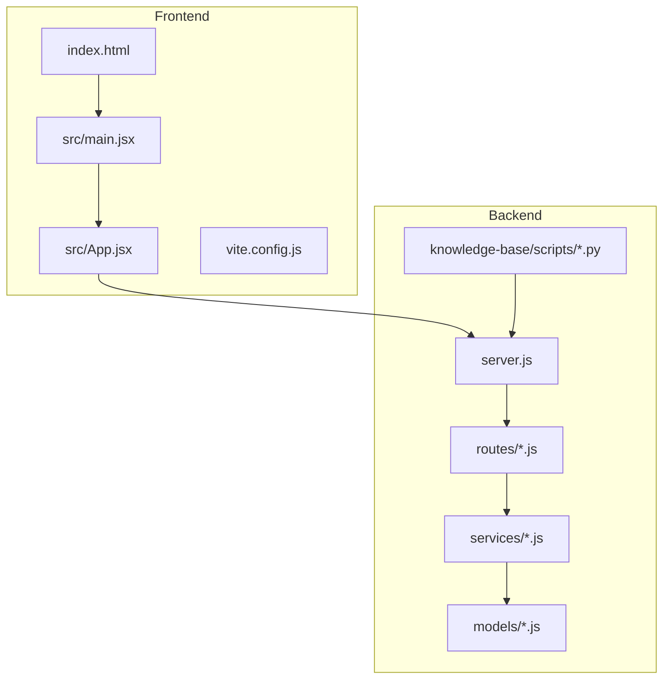
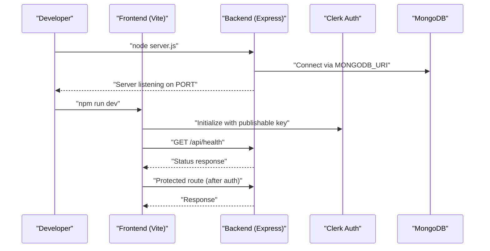
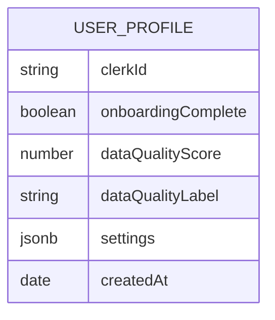
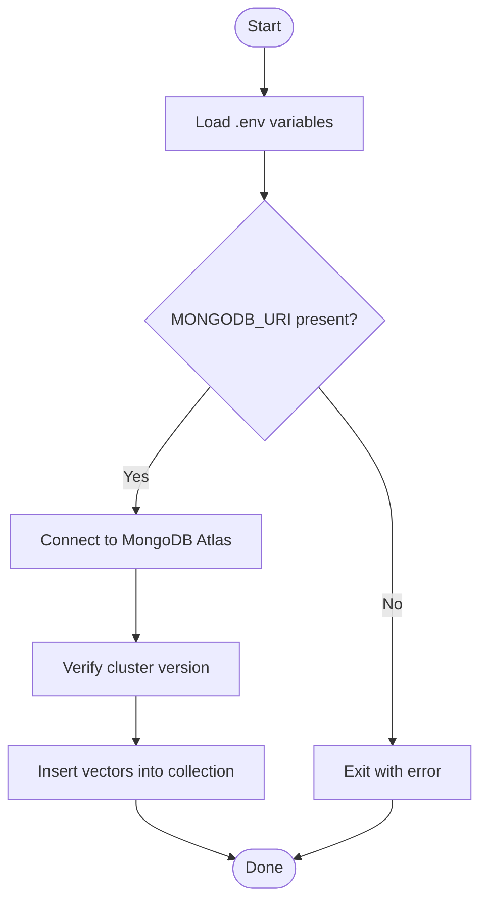
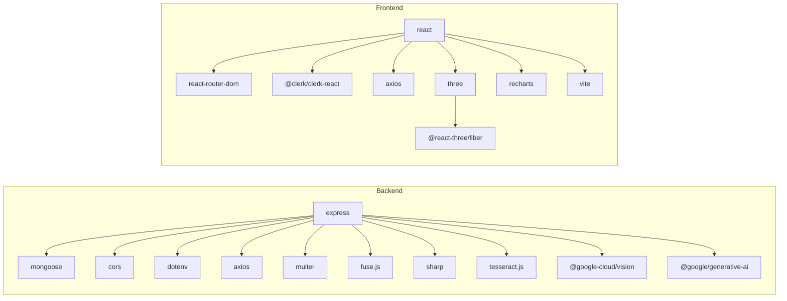

# Getting Started

<cite>
**Referenced Files in This Document**
- [README.md](file://README.md)
- [backend/package.json](file://backend/package.json)
- [frontend/package.json](file://frontend/package.json)
- [backend/server.js](file://backend/server.js)
- [backend/src/routes/fitnessRoutes.js](file://backend/src/routes/fitnessRoutes.js)
- [backend/src/services/groqVision.js](file://backend/src/services/groqVision.js)
- [frontend/src/App.jsx](file://frontend/src/App.jsx)
- [frontend/src/main.jsx](file://frontend/src/main.jsx)
- [frontend/vite.config.js](file://frontend/vite.config.js)
- [frontend/index.html](file://frontend/index.html)
- [backend/src/models/UserProfile.js](file://backend/src/models/UserProfile.js)
- [backend/knowledge-base/scripts/upload_vectors.py](file://backend/knowledge-base/scripts/upload_vectors.py)
</cite>

## Table of Contents
1. [Introduction](#introduction)
2. [Project Structure](#project-structure)
3. [Core Components](#core-components)
4. [Architecture Overview](#architecture-overview)
5. [Detailed Component Analysis](#detailed-component-analysis)
6. [Dependency Analysis](#dependency-analysis)
7. [Performance Considerations](#performance-considerations)
8. [Troubleshooting Guide](#troubleshooting-guide)
9. [Conclusion](#conclusion)
10. [Appendices](#appendices)

## Introduction
This guide helps you set up and run VaidyaSetu locally for development. It covers environment prerequisites, backend and frontend dependency installation, manual configuration for Google Cloud APIs and OAuth, environment variable setup, running the servers, and initial verification steps. The project integrates a modern React frontend with an Express backend, uses Clerk for authentication, and supports Google Fit and OCR capabilities via external services.

## Project Structure
VaidyaSetu is organized into two primary directories:
- backend: Node.js/Express server, routes, services, models, and knowledge base tooling
- frontend: React application bootstrapped with Vite, Clerk integration, and routing

**Diagram sources**
- [backend/server.js:1-94](file://backend/server.js#L1-L94)
- [frontend/src/main.jsx:1-26](file://frontend/src/main.jsx#L1-L26)
- [frontend/src/App.jsx:1-166](file://frontend/src/App.jsx#L1-L166)
- [frontend/vite.config.js:1-12](file://frontend/vite.config.js#L1-L12)
- [frontend/index.html:1-14](file://frontend/index.html#L1-L14)
- [backend/src/routes/fitnessRoutes.js:1-66](file://backend/src/routes/fitnessRoutes.js#L1-L66)
- [backend/src/services/groqVision.js:1-67](file://backend/src/services/groqVision.js#L1-L67)
- [backend/src/models/UserProfile.js:1-175](file://backend/src/models/UserProfile.js#L1-L175)
- [backend/knowledge-base/scripts/upload_vectors.py:1-44](file://backend/knowledge-base/scripts/upload_vectors.py#L1-L44)

**Section sources**
- [README.md:1-31](file://README.md#L1-L31)
- [backend/package.json:1-37](file://backend/package.json#L1-L37)
- [frontend/package.json:1-46](file://frontend/package.json#L1-L46)

## Core Components
- Backend server: Express application configured with CORS, JSON parsing, MongoDB connection, route registration, health check endpoint, and background services initialization.
- Frontend: React SPA using Clerk for authentication, Vite for dev/build, and routing for protected/private pages.
- Google Cloud integrations: Google Fit (fitness data sync) and OCR via Groq Vision fallback (when enabled).
- Authentication: Clerk publishable key and Google OAuth provider placeholder in the frontend.

Key runtime behaviors:
- Backend listens on a configurable port and initializes reminder and cron services on startup.
- Frontend reads environment variables for API base URL and Clerk publishable key, and redirects unauthenticated users to sign-in.

**Section sources**
- [backend/server.js:1-94](file://backend/server.js#L1-L94)
- [frontend/src/App.jsx:32-32](file://frontend/src/App.jsx#L32-L32)
- [frontend/src/main.jsx:7-11](file://frontend/src/main.jsx#L7-L11)

## Architecture Overview
High-level flow during development:
- Developer runs backend and frontend in separate terminals.
- Frontend requests protected routes and Clerk-managed authentication.
- Backend serves REST endpoints and background services.
- Optional Google Cloud features (Fit, Vision) require credentials and environment variables.

**Diagram sources**
- [backend/server.js:34-79](file://backend/server.js#L34-L79)
- [frontend/src/main.jsx:7-11](file://frontend/src/main.jsx#L7-L11)
- [frontend/src/App.jsx:68-82](file://frontend/src/App.jsx#L68-L82)

## Detailed Component Analysis

### Backend Setup and Dependencies
- Install dependencies:
  - Use the backend package manager to install Node.js dependencies.
- Environment variables:
  - Configure MongoDB connection string and optional Google Cloud/Groq keys as needed for features.
- Start the server:
  - Run the backend server script to start the Express app.

Verification:
- Health check endpoint confirms backend is reachable and DB connection status.

**Section sources**
- [backend/package.json:5-8](file://backend/package.json#L5-L8)
- [backend/server.js:34-79](file://backend/server.js#L34-L79)

### Frontend Setup and Dependencies
- Install dependencies:
  - Use the frontend package manager to install React and Vite dependencies.
- Environment variables:
  - Provide the Clerk publishable key and optional API base URL override.
- Start the development server:
  - Run the frontend dev script to launch Vite.

Verification:
- App initializes Clerk and navigates unauthenticated users to sign-in.
- After sign-in, the app checks profile existence and routes accordingly.

**Section sources**
- [frontend/package.json:6-11](file://frontend/package.json#L6-L11)
- [frontend/src/main.jsx:7-11](file://frontend/src/main.jsx#L7-L11)
- [frontend/src/App.jsx:68-82](file://frontend/src/App.jsx#L68-L82)

### Google Cloud APIs and OAuth Configuration
Manual steps required for Google Fit and Cloud Vision:
- Enable Fitness API and Cloud Vision API in the Google Cloud Console.
- Create OAuth 2.0 Web Application credentials.
- Add authorized origins and redirect URIs for localhost.
- Update backend .env with client ID and secret.

Notes:
- Fitness sync routes depend on a valid access token passed by the frontend.
- Vision fallback requires a valid API key for the OCR service.

**Section sources**
- [README.md:8-14](file://README.md#L8-L14)
- [backend/src/routes/fitnessRoutes.js:23-63](file://backend/src/routes/fitnessRoutes.js#L23-L63)
- [backend/src/services/groqVision.js:12-14](file://backend/src/services/groqVision.js#L12-L14)

### Environment Variables and .env Configuration
Backend variables:
- MONGODB_URI: MongoDB Atlas connection string.
- Optional: Google OAuth client ID/secret and Groq API key for Vision fallback.

Frontend variables:
- VITE_CLERK_PUBLISHABLE_KEY: Clerk publishable key.
- VITE_API_URL: Override backend API base URL if needed.

Initialization:
- Backend loads environment variables at startup.
- Frontend reads environment variables at runtime.

**Section sources**
- [backend/server.js:1-2](file://backend/server.js#L1-L2)
- [backend/server.js:41-43](file://backend/server.js#L41-L43)
- [frontend/src/main.jsx:7-11](file://frontend/src/main.jsx#L7-L11)
- [frontend/src/App.jsx:32-32](file://frontend/src/App.jsx#L32-L32)

### Running the Application Locally
- Backend:
  - Change to the backend directory and start the server.
- Frontend:
  - Change to the frontend directory and start the dev server.

Verification:
- Confirm backend responds to the health endpoint.
- Confirm frontend loads Clerk and navigates to onboarding or main dashboard after sign-in.

**Section sources**
- [README.md:16-27](file://README.md#L16-L27)
- [backend/server.js:69-75](file://backend/server.js#L69-L75)
- [frontend/src/App.jsx:68-82](file://frontend/src/App.jsx#L68-L82)

### Data Model Overview
The backend defines a comprehensive user profile schema capturing biometrics, lifestyle, diet, medical history, and platform settings. This informs how frontend pages and backend routes consume and persist user data.

**Diagram sources**
- [backend/src/models/UserProfile.js:15-91](file://backend/src/models/UserProfile.js#L15-L91)

**Section sources**
- [backend/src/models/UserProfile.js:1-175](file://backend/src/models/UserProfile.js#L1-L175)

### Knowledge Base Vector Upload Tool
A Python script demonstrates how to connect to MongoDB Atlas using environment variables and insert vector records into a collection. This is useful for preparing the knowledge base for retrieval.

**Diagram sources**
- [backend/knowledge-base/scripts/upload_vectors.py:11-28](file://backend/knowledge-base/scripts/upload_vectors.py#L11-L28)
- [backend/knowledge-base/scripts/upload_vectors.py:30-44](file://backend/knowledge-base/scripts/upload_vectors.py#L30-L44)

**Section sources**
- [backend/knowledge-base/scripts/upload_vectors.py:1-44](file://backend/knowledge-base/scripts/upload_vectors.py#L1-L44)

## Dependency Analysis
Runtime dependencies and their roles:
- Backend:
  - Express for HTTP server and routing
  - Mongoose for MongoDB connectivity
  - CORS for cross-origin requests
  - dotenv for environment loading
  - Google Cloud Vision and GenAI for OCR and AI features
  - Tesseract.js and Sharp for OCR/image processing
  - Multer for file uploads
  - Fuse.js for fuzzy search
  - Node-cron and rate-limit for background tasks and protection
- Frontend:
  - React and React Router for UI and navigation
  - Clerk for authentication
  - Axios for HTTP requests
  - Three.js and React Three Fiber for 3D visualization
  - Recharts for charts
  - TailwindCSS via Vite plugin for styling

**Diagram sources**
- [backend/package.json:13-31](file://backend/package.json#L13-L31)
- [frontend/package.json:12-31](file://frontend/package.json#L12-L31)

**Section sources**
- [backend/package.json:1-37](file://backend/package.json#L1-L37)
- [frontend/package.json:1-46](file://frontend/package.json#L1-L46)

## Performance Considerations
- Keep development dependencies minimal; rely on Vite for fast builds and hot reload.
- Use environment-specific configurations to avoid unnecessary logging and network calls in development.
- For OCR-heavy flows, consider caching and rate limiting to prevent excessive external API usage.
- Monitor MongoDB connection pooling and indexing for large datasets.

## Troubleshooting Guide
Common setup issues and resolutions:
- Port conflicts:
  - Backend default port is configurable via environment variable; adjust if 5000 is in use.
- Missing environment variables:
  - Backend requires a MongoDB URI; frontend requires a Clerk publishable key.
  - For Google Cloud features, ensure OAuth client credentials and Vision API key are set.
- Authentication errors:
  - Confirm Clerk publishable key is present and correct.
  - Ensure authorized origins and redirect URIs include the frontend origin.
- Database connection failures:
  - Verify the MongoDB URI and network connectivity.
- Google Fit sync failures:
  - Confirm access token validity and that the Fitness API is enabled.
- Vision fallback errors:
  - Ensure the Vision API key is set and the model is supported.

Initial verification steps:
- Backend health check endpoint should respond successfully.
- Frontend should initialize Clerk and redirect unauthenticated users to sign-in.
- After sign-in, the app should check profile existence and navigate appropriately.

**Section sources**
- [backend/server.js:34-79](file://backend/server.js#L34-L79)
- [backend/server.js:69-75](file://backend/server.js#L69-L75)
- [frontend/src/main.jsx:7-11](file://frontend/src/main.jsx#L7-L11)
- [frontend/src/App.jsx:68-82](file://frontend/src/App.jsx#L68-L82)
- [backend/src/routes/fitnessRoutes.js:23-63](file://backend/src/routes/fitnessRoutes.js#L23-L63)
- [backend/src/services/groqVision.js:12-14](file://backend/src/services/groqVision.js#L12-L14)

## Conclusion
You now have the essentials to set up VaidyaSetu locally: install dependencies for both backend and frontend, configure environment variables, enable Google Cloud APIs, and run the servers. Use the health check and authentication flows to verify your setup quickly. As you explore further, integrate Google Fit and Vision features by completing the manual configuration steps and updating environment variables accordingly.

## Appendices

### Appendix A: Quick Commands
- Backend:
  - Install dependencies and start server.
- Frontend:
  - Install dependencies and start dev server.

**Section sources**
- [README.md:16-27](file://README.md#L16-L27)

### Appendix B: Environment Variable Reference
- Backend:
  - MONGODB_URI: MongoDB Atlas connection string
  - Optional: Google OAuth client ID/secret, Vision API key
- Frontend:
  - VITE_CLERK_PUBLISHABLE_KEY: Clerk publishable key
  - VITE_API_URL: Override backend API base URL

**Section sources**
- [backend/server.js:1-2](file://backend/server.js#L1-L2)
- [backend/server.js:41-43](file://backend/server.js#L41-L43)
- [frontend/src/main.jsx:7-11](file://frontend/src/main.jsx#L7-L11)
- [frontend/src/App.jsx:32-32](file://frontend/src/App.jsx#L32-L32)