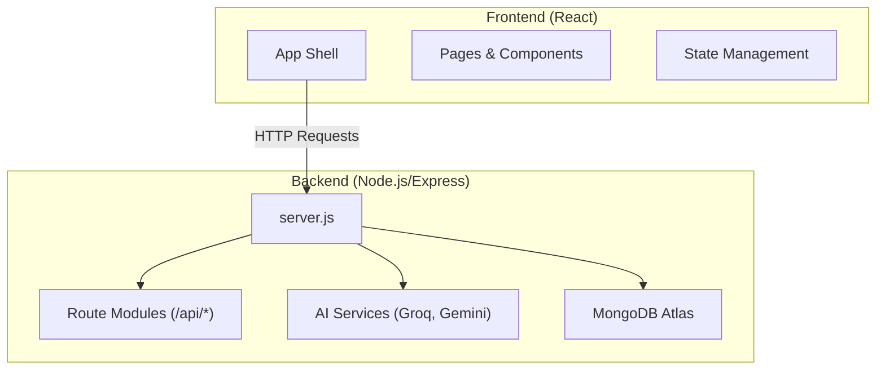
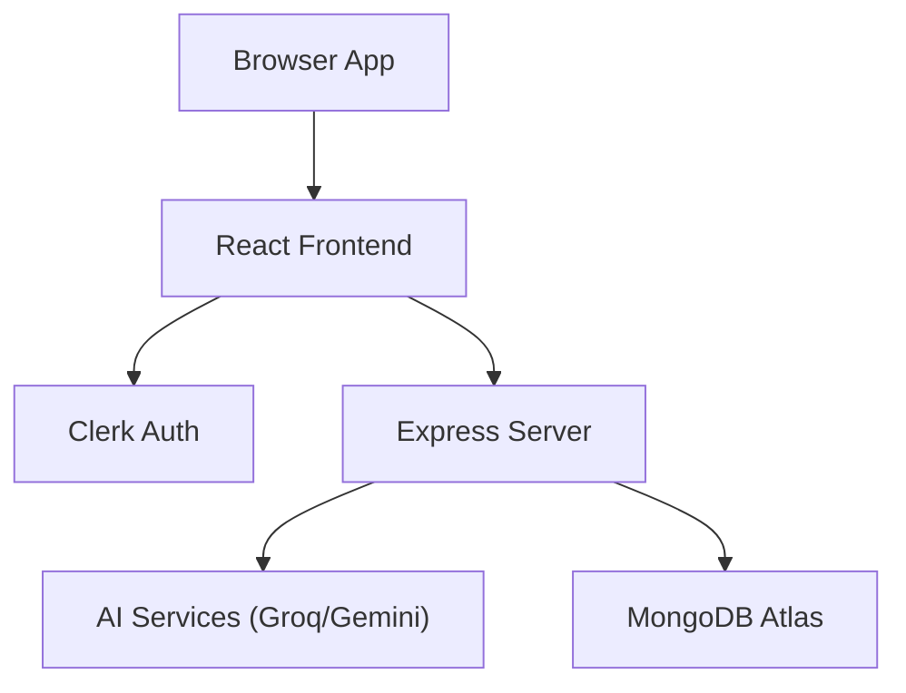
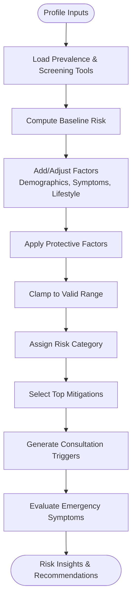
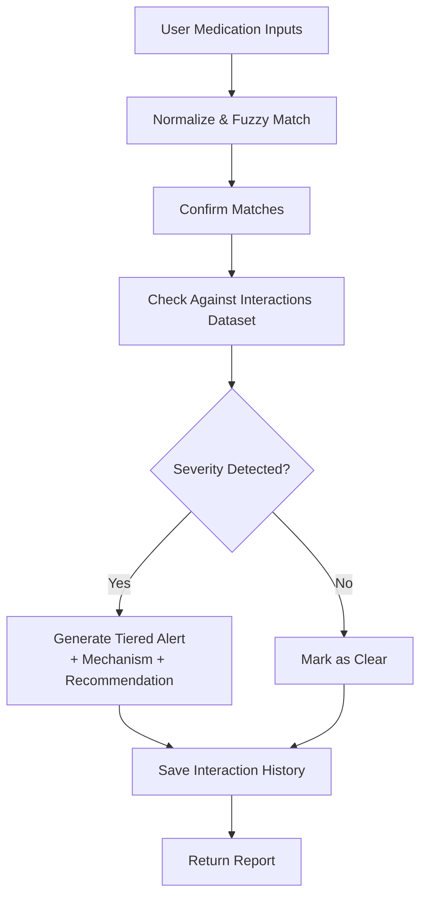
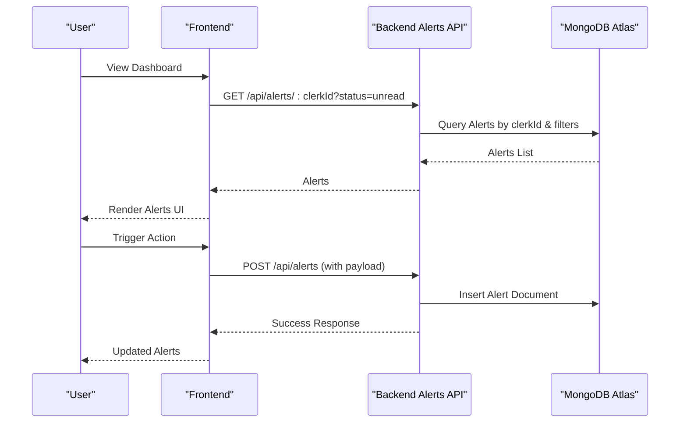
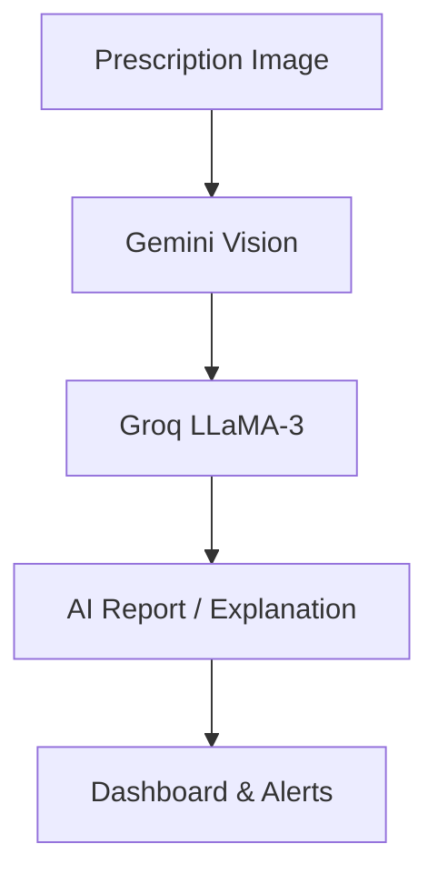
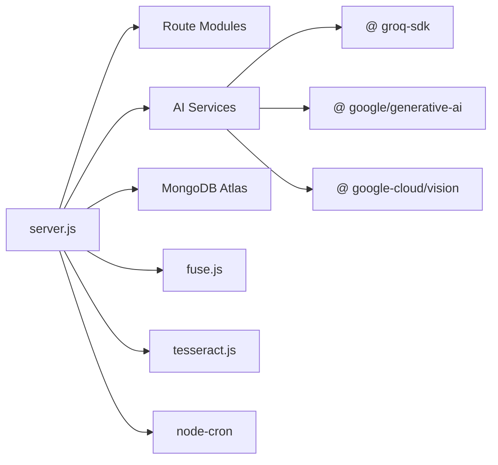

# Project Overview

<cite>
**Referenced Files in This Document**
- [README.md](file://README.md)
- [VAIDYASETU_IMPLEMENTATION_PLAN.md](file://VAIDYASETU_IMPLEMENTATION_PLAN.md)
- [API_DOCS.md](file://API_DOCS.md)
- [DATA_SOURCES.md](file://DATA_SOURCES.md)
- [backend/server.js](file://backend/server.js)
- [backend/package.json](file://backend/package.json)
- [frontend/package.json](file://frontend/package.json)
- [backend/src/models/UserProfile.js](file://backend/src/models/UserProfile.js)
- [backend/src/models/Medication.js](file://backend/src/models/Medication.js)
- [backend/src/models/Alert.js](file://backend/src/models/Alert.js)
- [backend/src/utils/riskScorer.js](file://backend/src/utils/riskScorer.js)
- [backend/src/utils/interactionEngine.js](file://backend/src/utils/interactionEngine.js)
- [vaidyasetu1/backend/server.js](file://vaidyasetu1/backend/server.js)
</cite>

## Table of Contents
1. [Introduction](#introduction)
2. [Project Structure](#project-structure)
3. [Core Components](#core-components)
4. [Architecture Overview](#architecture-overview)
5. [Detailed Component Analysis](#detailed-component-analysis)
6. [Dependency Analysis](#dependency-analysis)
7. [Performance Considerations](#performance-considerations)
8. [Troubleshooting Guide](#troubleshooting-guide)
9. [Conclusion](#conclusion)

## Introduction
VaidyaSetu is an AI-powered digital health platform designed to bridge Allopathy, Ayurveda, and Homeopathy. Its mission is to prevent potentially dangerous herb-drug interactions (HDIs) by combining rule-based risk scoring with AI-driven insights, while offering early disease prediction tailored to the Indian context. The platform positions itself as a unified health companion that empowers users with personalized risk assessments, safety alerts, and actionable recommendations grounded in credible data sources and AI/ML capabilities.

Key positioning in the healthcare ecosystem:
- Patient-centric: Onboarding, vitals tracking, and personalized health reports.
- Provider-enabling: Doctor finder, emergency alert triggers, and interoperability hooks.
- Evidence-backed: Integrates IMPPAT, DrugBank, ICMR, and WHO guidelines with AI augmentation.
- Scalable: Modular backend with MongoDB Atlas, AI/ML integrations, and extensible RAG pipeline.

Current status and phase context:
- Phase 0 complete: Foundation and environment setup are finished.
- Manual configuration steps are required for selected integrations (e.g., Google Fit and Vision APIs).
- The project includes a prior implementation branch demonstrating earlier architecture and feature set.

**Section sources**
- [README.md:1-31](file://README.md#L1-L31)
- [VAIDYASETU_IMPLEMENTATION_PLAN.md:24-46](file://VAIDYASETU_IMPLEMENTATION_PLAN.md#L24-L46)

## Project Structure
The repository is organized into:
- frontend: React-based web application with routing, state management, and UI components.
- backend: Node.js/Express REST API with modular route groups, AI services, OCR, and MongoDB Atlas integration.
- reference_data: Curated datasets and guidelines used for risk scoring and interaction modeling.
- vaidyasetu1: A prior implementation branch showcasing foundational features and architecture.

**Diagram sources**
- [backend/server.js:33-66](file://backend/server.js#L33-L66)
- [frontend/package.json:12-31](file://frontend/package.json#L12-L31)
- [backend/package.json:13-31](file://backend/package.json#L13-L31)

**Section sources**
- [backend/server.js:33-66](file://backend/server.js#L33-L66)
- [frontend/package.json:12-31](file://frontend/package.json#L12-L31)
- [backend/package.json:13-31](file://backend/package.json#L13-L31)

## Core Components
VaidyaSetu’s core capabilities are built around:
- Multi-disease risk assessment engine: Uses Indian epidemiology and user profile data to compute preliminary and detailed risk insights.
- Drug interaction safety analyzer: Matches user medications against a curated knowledge base and flags unsafe combinations across Allopathy, Ayurveda, and Homeopathy.
- Personalized recommendations: Mitigation steps and specialist recommendations derived from scoring logic and a mitigation library.
- Emergency alert system: Triggers critical alerts based on user-submitted symptoms and consult triggers.
- AI/ML integrations: Groq for rapid generation of reports and explanations; Gemini Vision and OCR fallbacks for prescription parsing; future RAG with vector search.

Technology stack summary:
- Frontend: React + Vite, Clerk for authentication, routing, state management, and UI libraries.
- Backend: Node.js + Express, MongoDB Atlas, AI/ML via Groq and Google AI.
- Data: Structured user profiles, vitals, medications, alerts, and interaction history.
- Integrations: Google Fit (steps), Google Cloud Vision (OCR), OCR engines (Tesseract), and external APIs (RxNav, openFDA).

**Section sources**
- [VAIDYASETU_IMPLEMENTATION_PLAN.md:85-103](file://VAIDYASETU_IMPLEMENTATION_PLAN.md#L85-L103)
- [API_DOCS.md:11-28](file://API_DOCS.md#L11-L28)
- [backend/src/utils/riskScorer.js:51-262](file://backend/src/utils/riskScorer.js#L51-L262)
- [backend/src/utils/interactionEngine.js:27-65](file://backend/src/utils/interactionEngine.js#L27-L65)

## Architecture Overview
The system follows a modular backend architecture with clearly separated concerns:
- server.js orchestrates middleware, routes, and background services.
- Route modules expose domain-specific endpoints (e.g., vitals, alerts, interactions, OCR).
- AI services integrate Groq and Gemini for report generation and OCR normalization.
- Data models define user profiles, medications, and alerts with rich metadata.
- Risk scoring and interaction detection encapsulate business logic for scoring and safety checks.

**Diagram sources**
- [backend/server.js:33-66](file://backend/server.js#L33-L66)
- [backend/server.js:40-43](file://backend/server.js#L40-L43)
- [backend/server.js:36-38](file://backend/server.js#L36-L38)

**Section sources**
- [backend/server.js:33-66](file://backend/server.js#L33-L66)
- [backend/server.js:40-43](file://backend/server.js#L40-L43)
- [backend/server.js:36-38](file://backend/server.js#L36-L38)

## Detailed Component Analysis

### Risk Assessment Engine
The risk engine computes preliminary and detailed risk scores for multiple conditions using:
- Demographic and lifestyle inputs from the user profile.
- Evidence-based prevalence data and screening tools aligned to Indian guidelines.
- Protective factors and mitigations drawn from a mitigation library.
- Emergency symptom capture to trigger urgent care alerts.

**Diagram sources**
- [backend/src/utils/riskScorer.js:51-262](file://backend/src/utils/riskScorer.js#L51-L262)

**Section sources**
- [backend/src/utils/riskScorer.js:51-262](file://backend/src/utils/riskScorer.js#L51-L262)
- [backend/src/models/UserProfile.js:15-175](file://backend/src/models/UserProfile.js#L15-L175)

### Interaction Safety Analyzer
The interaction analyzer performs:
- Fuzzy matching of user-entered medicine names against a master index.
- Cross-checking confirmed medicine lists against a curated interactions dataset spanning Allopathy, Ayurveda, and Homeopathy.
- Tiered alert generation with severity, mechanism, and recommendations.

**Diagram sources**
- [backend/src/utils/interactionEngine.js:27-65](file://backend/src/utils/interactionEngine.js#L27-L65)

**Section sources**
- [backend/src/utils/interactionEngine.js:27-65](file://backend/src/utils/interactionEngine.js#L27-L65)
- [API_DOCS.md:11-28](file://API_DOCS.md#L11-L28)

### Emergency Alert System
The alert system manages:
- Alert creation with type, priority, title, and description.
- Filtering and retrieval by user and status.
- Actionable URLs and expiry dates for time-bound notifications.
- Integration with risk scoring to trigger urgent consults and emergency symptoms.

**Diagram sources**
- [API_DOCS.md:51-67](file://API_DOCS.md#L51-L67)
- [backend/src/models/Alert.js:3-45](file://backend/src/models/Alert.js#L3-L45)

**Section sources**
- [API_DOCS.md:51-67](file://API_DOCS.md#L51-L67)
- [backend/src/models/Alert.js:3-45](file://backend/src/models/Alert.js#L3-L45)

### AI/ML Integrations
- Groq: Powers report generation, interaction explanations, and chatbot triage with fast inference.
- Gemini Vision: OCR pipeline for prescription images with fallbacks.
- Future RAG: Vector embeddings and Atlas Vector Search for dynamic retrieval of research evidence.

**Diagram sources**
- [API_DOCS.md:71-78](file://API_DOCS.md#L71-L78)
- [VAIDYASETU_IMPLEMENTATION_PLAN.md:65-82](file://VAIDYASETU_IMPLEMENTATION_PLAN.md#L65-L82)

**Section sources**
- [API_DOCS.md:71-78](file://API_DOCS.md#L71-L78)
- [VAIDYASETU_IMPLEMENTATION_PLAN.md:65-82](file://VAIDYASETU_IMPLEMENTATION_PLAN.md#L65-L82)

### Data Strategy and Knowledge Base
- IMPPAT, DrugBank, PubChem: Core interaction and mechanism data.
- ICMR, AYUSH, CCRH, WHO: Guidelines and standards for Indian context.
- Master index and embeddings: Enabling fuzzy search and future vector search.

**Section sources**
- [DATA_SOURCES.md:5-18](file://DATA_SOURCES.md#L5-L18)
- [VAIDYASETU_IMPLEMENTATION_PLAN.md:47-62](file://VAIDYASETU_IMPLEMENTATION_PLAN.md#L47-L62)

## Dependency Analysis
The backend depends on:
- Express for routing and middleware.
- Mongoose for MongoDB Atlas connectivity.
- Groq SDK and Google AI packages for AI/ML.
- Fuse.js for fuzzy matching.
- Multer and Tesseract for OCR.
- Node-cron for scheduled tasks.

**Diagram sources**
- [backend/server.js:33-66](file://backend/server.js#L33-L66)
- [backend/package.json:13-31](file://backend/package.json#L13-L31)

**Section sources**
- [backend/server.js:33-66](file://backend/server.js#L33-L66)
- [backend/package.json:13-31](file://backend/package.json#L13-L31)

## Performance Considerations
- API throughput: Groq enables rapid generation of reports and explanations; tune payload sizes and caching for optimal latency.
- OCR accuracy: Hybrid pipeline (Gemini -> Groq -> Tesseract) improves robustness; batch processing and rate limiting recommended.
- Database queries: Index fields like clerkId and timestamps; leverage Atlas aggregation for analytics.
- Background tasks: Cron jobs and reminder services should be monitored for resource usage and scheduling consistency.

[No sources needed since this section provides general guidance]

## Troubleshooting Guide
Common operational checks:
- Environment setup: Confirm MongoDB Atlas connection string and Clerk OAuth credentials.
- API health: Use the health endpoint to verify backend status and DB connectivity.
- OCR pipeline: Validate image upload and fallback chain; inspect logs for Gemini/Vision errors.
- Interaction analyzer: Verify fuzzy search index and interactions dataset integrity.

**Section sources**
- [backend/server.js:68-75](file://backend/server.js#L68-L75)
- [API_DOCS.md:71-78](file://API_DOCS.md#L71-L78)

## Conclusion
VaidyaSetu consolidates three healing traditions—Allopathy, Ayurveda, and Homeopathy—into a single, AI-enhanced health companion. By combining rule-based risk scoring, curated interaction databases, and AI/ML-powered insights, it supports early disease prediction, safe medication use, and timely interventions. The modular architecture, scalable data strategy, and phased roadmap position the platform to evolve toward advanced RAG, broader integrations, and seamless interoperability within India’s digital health ecosystem.

[No sources needed since this section summarizes without analyzing specific files]