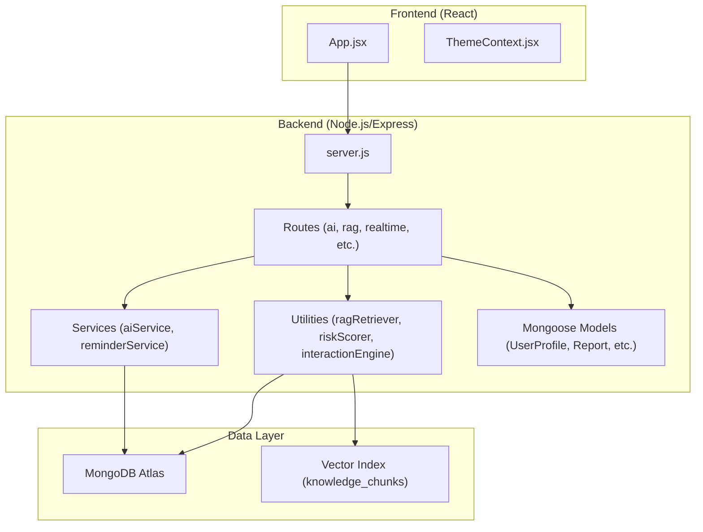
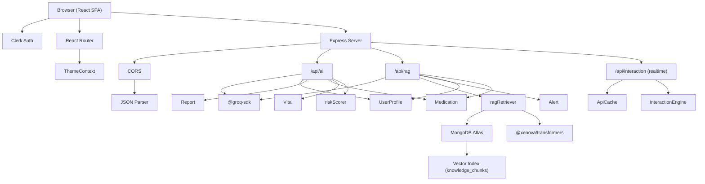
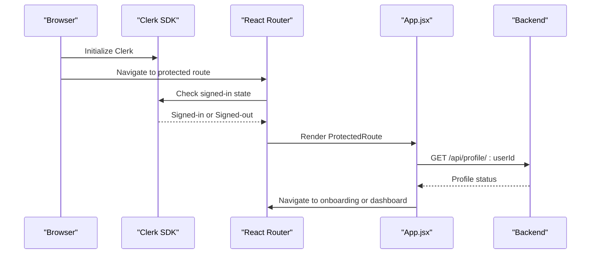
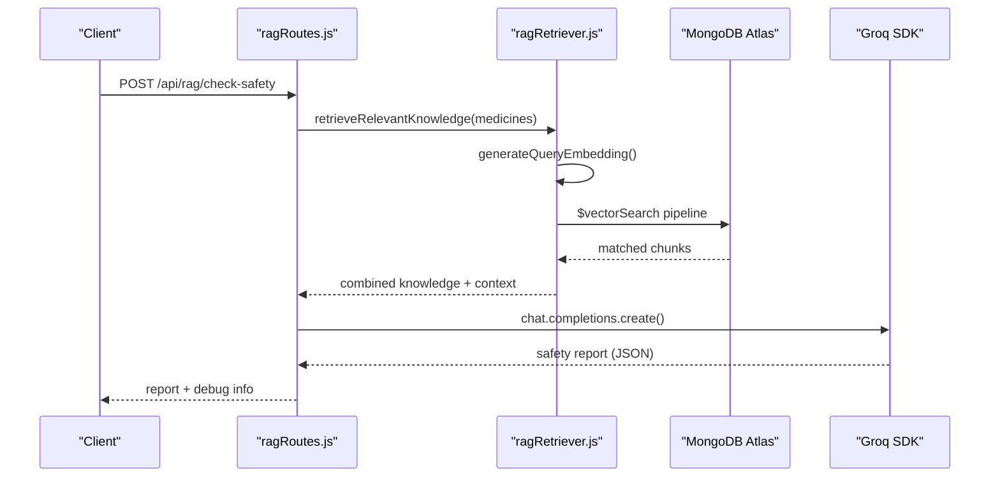
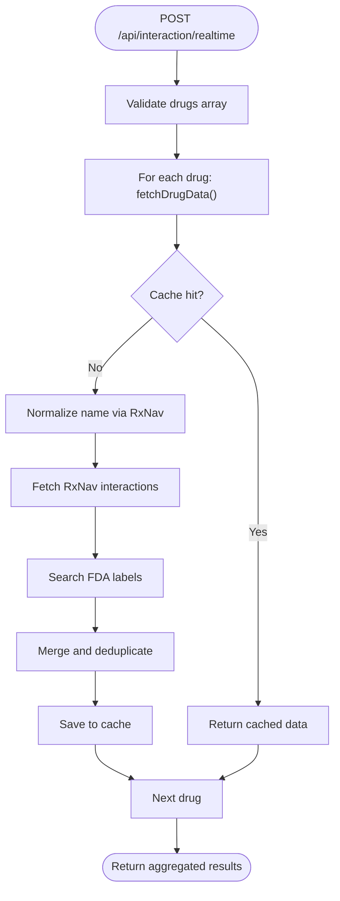
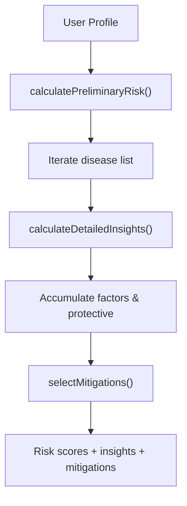
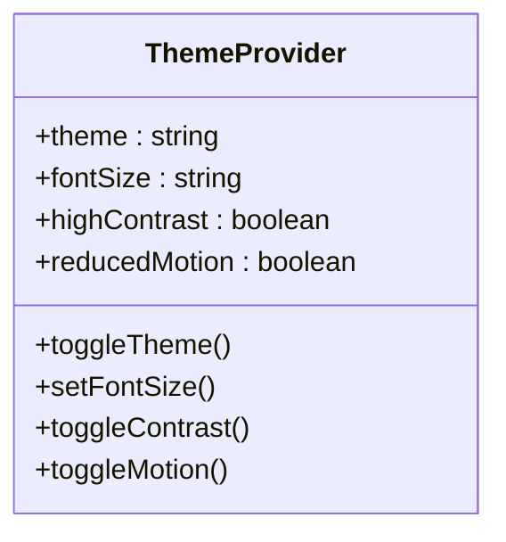
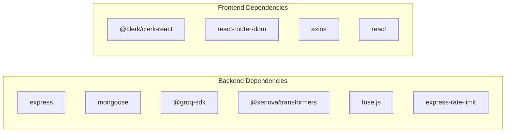

# System Architecture

<cite>
**Referenced Files in This Document**
- [server.js](file://backend/server.js)
- [package.json](file://backend/package.json)
- [App.jsx](file://frontend/src/App.jsx)
- [package.json](file://frontend/package.json)
- [UserProfile.js](file://backend/src/models/UserProfile.js)
- [aiRoutes.js](file://backend/src/routes/aiRoutes.js)
- [ragRoutes.js](file://backend/src/routes/ragRoutes.js)
- [realtimeInteractionRoutes.js](file://backend/src/routes/realtimeInteractionRoutes.js)
- [ragRetriever.js](file://backend/src/utils/ragRetriever.js)
- [ATLAS_VECTOR_CONFIG_GUIDE.md](file://backend/knowledge-base/ATLAS_VECTOR_CONFIG_GUIDE.md)
- [riskScorer.js](file://backend/src/utils/riskScorer.js)
- [interactionEngine.js](file://backend/src/utils/interactionEngine.js)
- [ThemeContext.jsx](file://frontend/src/context/ThemeContext.jsx)
- [README.md](file://README.md)
</cite>

## Table of Contents
1. [Introduction](#introduction)
2. [Project Structure](#project-structure)
3. [Core Components](#core-components)
4. [Architecture Overview](#architecture-overview)
5. [Detailed Component Analysis](#detailed-component-analysis)
6. [Dependency Analysis](#dependency-analysis)
7. [Performance Considerations](#performance-considerations)
8. [Troubleshooting Guide](#troubleshooting-guide)
9. [Conclusion](#conclusion)

## Introduction
This document describes the system architecture of VaidyaSetu, a health intelligence platform integrating a React frontend, a Node.js/Express backend, and MongoDB Atlas for data persistence. The backend follows a layered architecture with a presentation layer (Express routes), a business logic layer (services and utilities), and a data access layer (Mongoose models). The system implements a microservice-style API design with modular route handlers organized by functional domain. AI/ML integration leverages Groq SDK for LLM-driven insights, vector search via MongoDB Atlas vector search, and a knowledge base built from structured and scientific sources. Authentication is handled by Clerk, state management is implemented via React Context, and real-time capabilities are integrated through external APIs and caching.

## Project Structure
The repository is organized into:
- Frontend: React application with Clerk-based authentication, routing, and UI components.
- Backend: Express server exposing modular REST endpoints, Mongoose models, route handlers, services, and utilities.
- Knowledge Base: Structured datasets, chunked knowledge, embeddings, and Atlas vector index configuration.
- Scripts and Utilities: Data processing, indexing, and cron jobs.

**Diagram sources**
- [server.js:1-94](file://backend/server.js#L1-L94)
- [App.jsx:1-166](file://frontend/src/App.jsx#L1-L166)
- [UserProfile.js:1-175](file://backend/src/models/UserProfile.js#L1-L175)
- [ragRetriever.js:1-218](file://backend/src/utils/ragRetriever.js#L1-L218)
- [ATLAS_VECTOR_CONFIG_GUIDE.md:1-46](file://backend/knowledge-base/ATLAS_VECTOR_CONFIG_GUIDE.md#L1-L46)

**Section sources**
- [server.js:1-94](file://backend/server.js#L1-L94)
- [App.jsx:1-166](file://frontend/src/App.jsx#L1-L166)

## Core Components
- Presentation Layer (React):
  - Clerk-managed authentication and routing.
  - Protected routes and onboarding flow.
  - Theme and accessibility state via React Context.
- Business Logic Layer (Express):
  - Modular route handlers for AI insights, RAG safety checks, real-time drug interactions, and domain-specific features.
  - Services orchestrating AI/ML and background tasks.
  - Utilities implementing risk scoring, fuzzy medicine matching, and retrieval augmented generation.
- Data Access Layer (Mongoose):
  - Rich user profile model capturing biometric, lifestyle, diet, and health attributes.
  - Reports, vitals, medications, alerts, and caches persisted in MongoDB Atlas.

**Section sources**
- [App.jsx:1-166](file://frontend/src/App.jsx#L1-L166)
- [UserProfile.js:1-175](file://backend/src/models/UserProfile.js#L1-L175)
- [aiRoutes.js:1-299](file://backend/src/routes/aiRoutes.js#L1-L299)
- [ragRoutes.js:1-136](file://backend/src/routes/ragRoutes.js#L1-L136)
- [realtimeInteractionRoutes.js:1-206](file://backend/src/routes/realtimeInteractionRoutes.js#L1-L206)
- [ragRetriever.js:1-218](file://backend/src/utils/ragRetriever.js#L1-L218)
- [riskScorer.js:1-286](file://backend/src/utils/riskScorer.js#L1-L286)
- [interactionEngine.js:1-71](file://backend/src/utils/interactionEngine.js#L1-L71)

## Architecture Overview
VaidyaSetu employs a layered, microservice-style API design:
- Presentation: React SPA with Clerk authentication and protected routing.
- API Gateway/Entry: Express server registering modular route groups (/api/user, /api/ai, /api/rag, etc.).
- Domain Services: Route handlers encapsulate domain logic (AI report generation, RAG safety checks, real-time interactions).
- Data Access: Mongoose models abstract collections; vector search powered by MongoDB Atlas.
- AI/ML Integration: Groq SDK for LLMs; @xenova transformers for embeddings; RxNav/OpenFDA for live drug data; cache layer for resiliency.

**Diagram sources**
- [server.js:1-94](file://backend/server.js#L1-L94)
- [App.jsx:1-166](file://frontend/src/App.jsx#L1-L166)
- [aiRoutes.js:1-299](file://backend/src/routes/aiRoutes.js#L1-L299)
- [ragRoutes.js:1-136](file://backend/src/routes/ragRoutes.js#L1-L136)
- [realtimeInteractionRoutes.js:1-206](file://backend/src/routes/realtimeInteractionRoutes.js#L1-L206)
- [ragRetriever.js:1-218](file://backend/src/utils/ragRetriever.js#L1-L218)
- [UserProfile.js:1-175](file://backend/src/models/UserProfile.js#L1-L175)

## Detailed Component Analysis

### Authentication Architecture (Clerk)
- Frontend:
  - Clerk React SDK manages sign-in/sign-up and protected routes.
  - ProtectedRoute wrapper redirects unauthenticated users to the sign-in page.
  - On load, the app validates the session and navigates to onboarding or main app based on profile completeness.
- Backend:
  - No custom auth middleware is imported; authentication is delegated to Clerk front-end.
  - Routes consume user identity via Clerk identifiers (e.g., clerkId) passed from the client.

**Diagram sources**
- [App.jsx:34-83](file://frontend/src/App.jsx#L34-L83)

**Section sources**
- [App.jsx:1-166](file://frontend/src/App.jsx#L1-L166)

### AI/ML Integration and RAG Pipeline
- Groq SDK:
  - Used for generating AI reports and medicine insights.
  - Includes resilient fallback logic when rate-limited.
- Vector Search:
  - Embeddings generated via @xenova transformers pipeline.
  - Stored and queried in MongoDB Atlas with a vector index.
- Knowledge Base:
  - Structured chunks with metadata (source_database, content_type).
  - Atlas vector index configured with cosine similarity and filters.

**Diagram sources**
- [ragRoutes.js:22-133](file://backend/src/routes/ragRoutes.js#L22-L133)
- [ragRetriever.js:16-72](file://backend/src/utils/ragRetriever.js#L16-L72)
- [ATLAS_VECTOR_CONFIG_GUIDE.md:19-40](file://backend/knowledge-base/ATLAS_VECTOR_CONFIG_GUIDE.md#L19-L40)

**Section sources**
- [ragRoutes.js:1-136](file://backend/src/routes/ragRoutes.js#L1-L136)
- [ragRetriever.js:1-218](file://backend/src/utils/ragRetriever.js#L1-L218)
- [ATLAS_VECTOR_CONFIG_GUIDE.md:1-46](file://backend/knowledge-base/ATLAS_VECTOR_CONFIG_GUIDE.md#L1-L46)

### Real-Time Drug Interaction Orchestration
- Combines RxNav and OpenFDA to produce merged, deduplicated results.
- Implements a sliding-window rate limiter and MongoDB cache to improve resilience and reduce external API calls.
- Provides cache statistics endpoint for monitoring.

**Diagram sources**
- [realtimeInteractionRoutes.js:74-124](file://backend/src/routes/realtimeInteractionRoutes.js#L74-L124)
- [realtimeInteractionRoutes.js:127-182](file://backend/src/routes/realtimeInteractionRoutes.js#L127-L182)

**Section sources**
- [realtimeInteractionRoutes.js:1-206](file://backend/src/routes/realtimeInteractionRoutes.js#L1-L206)

### Risk Scoring and Mitigation Engine
- Calculates preliminary and detailed risk scores across multiple disease categories.
- Applies demographic, lifestyle, and symptom-based factors with protective adjustments.
- Generates personalized mitigation steps and consultation triggers.

**Diagram sources**
- [riskScorer.js:264-279](file://backend/src/utils/riskScorer.js#L264-L279)
- [riskScorer.js:51-262](file://backend/src/utils/riskScorer.js#L51-L262)

**Section sources**
- [riskScorer.js:1-286](file://backend/src/utils/riskScorer.js#L1-L286)

### State Management Patterns (Frontend)
- Theme and accessibility preferences are stored in localStorage and synchronized to DOM classes.
- Centralized provider pattern ensures consistent state across components.

**Diagram sources**
- [ThemeContext.jsx:5-46](file://frontend/src/context/ThemeContext.jsx#L5-L46)

**Section sources**
- [ThemeContext.jsx:1-55](file://frontend/src/context/ThemeContext.jsx#L1-L55)

## Dependency Analysis
- Backend dependencies include Express, Mongoose, Groq SDK, @xenova transformers, Fuse.js, and rate limiting utilities.
- Frontend dependencies include Clerk React, React Router, Axios, and UI libraries.

**Diagram sources**
- [package.json:13-31](file://backend/package.json#L13-L31)
- [package.json:12-30](file://frontend/package.json#L12-L30)

**Section sources**
- [package.json:1-37](file://backend/package.json#L1-L37)
- [package.json:1-46](file://frontend/package.json#L1-L46)

## Performance Considerations
- Vector Search Efficiency:
  - Atlas vector index configured with cosine similarity and filter fields to narrow results.
  - Aggregation pipeline limits candidates and applies post-filters for accuracy and speed.
- Caching:
  - MongoDB cache for real-time API responses reduces repeated external calls.
  - Embedding cache minimizes repeated vector generation.
- Resilience:
  - Fallback models for Groq when rate-limited.
  - Promise.allSettled for parallel drug data fetching to continue despite partial failures.
- Scalability:
  - Horizontal scaling of the Express server behind a reverse proxy/load balancer.
  - Offload heavy ML inference to dedicated containers or cloud functions if needed.
  - Consider CDN for static assets and API gateway for rate limiting and observability.

[No sources needed since this section provides general guidance]

## Troubleshooting Guide
- MongoDB Connection:
  - Verify MONGODB_URI and network access; check readiness in health endpoint.
- Vector Index Activation:
  - Ensure Atlas vector index is created and active before querying.
- Clerk Session Validation:
  - Confirm Clerk SDK initialization and route guards; ensure backend receives valid user identifiers.
- Real-Time API Limits:
  - Monitor rate limiter logs and cache stats; adjust thresholds if necessary.
- LLM Rate Limits:
  - Fallback model is used automatically; monitor logs for fallback events.

**Section sources**
- [server.js:40-94](file://backend/server.js#L40-L94)
- [ATLAS_VECTOR_CONFIG_GUIDE.md:13-45](file://backend/knowledge-base/ATLAS_VECTOR_CONFIG_GUIDE.md#L13-L45)
- [realtimeInteractionRoutes.js:184-201](file://backend/src/routes/realtimeInteractionRoutes.js#L184-L201)
- [ragRoutes.js:71-96](file://backend/src/routes/ragRoutes.js#L71-L96)

## Conclusion
VaidyaSetu integrates a modern React frontend with a modular Express backend, robust Mongoose data models, and AI/ML capabilities powered by Groq and MongoDB Atlas vector search. The system’s layered architecture, microservice-style routes, and resilient utilities enable scalable, real-time health insights. Authentication via Clerk and centralized state management via React Context provide a secure and accessible user experience. Proper configuration of the Atlas vector index and caching strategies are essential for optimal performance and reliability.