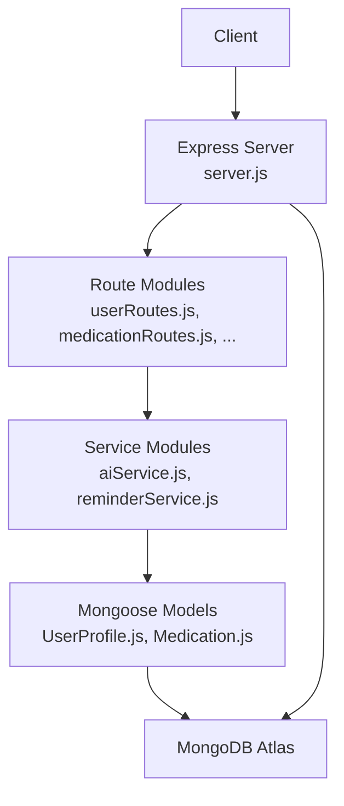
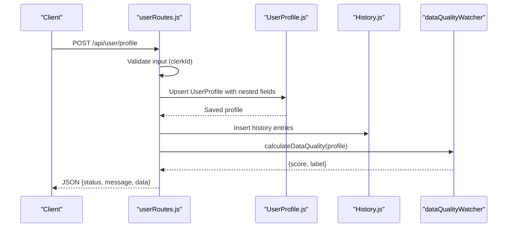
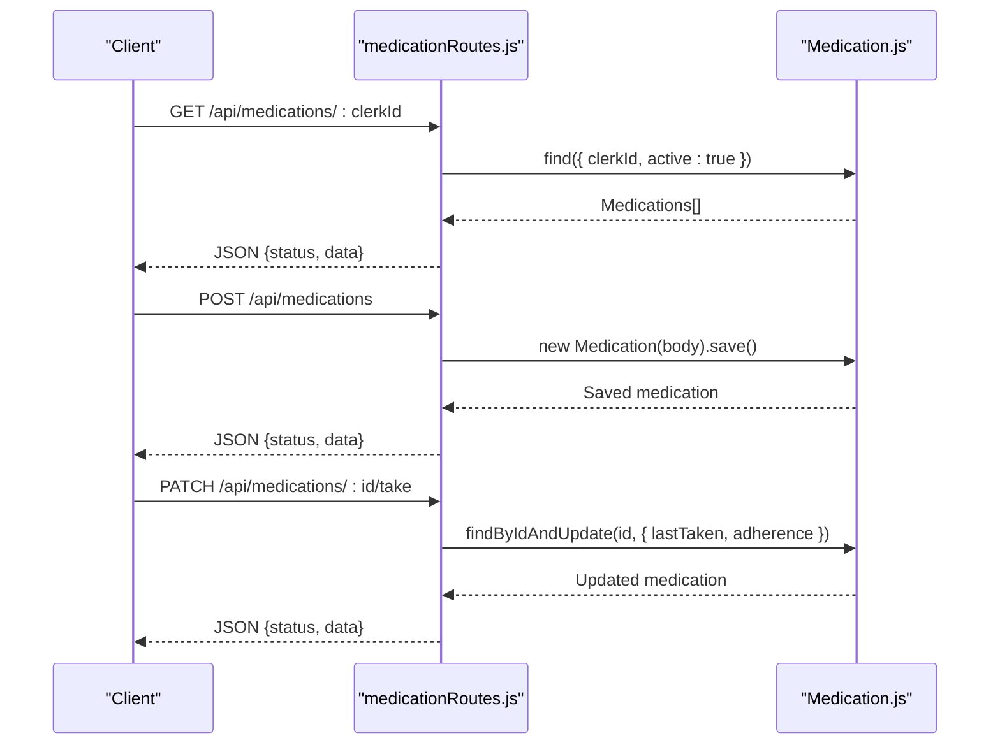
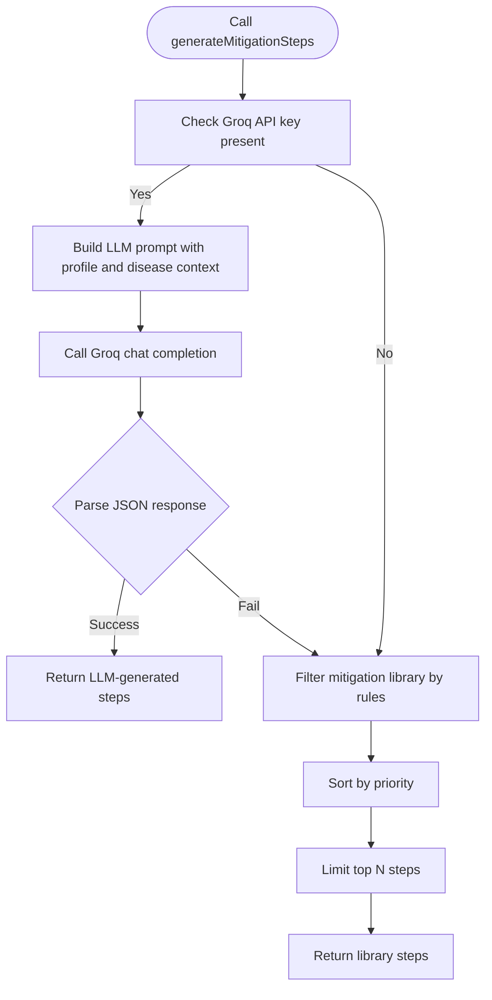
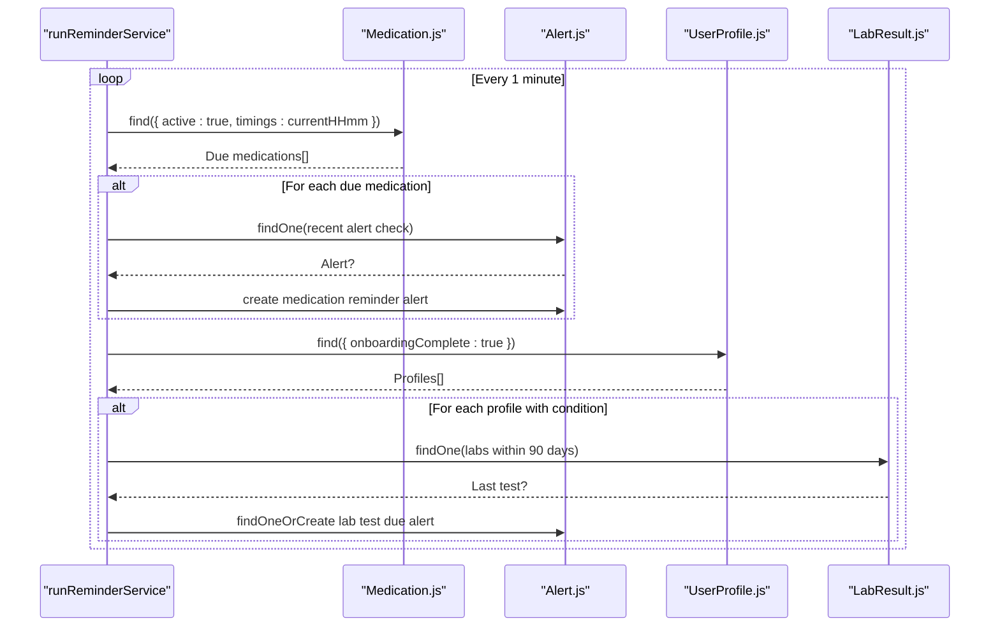
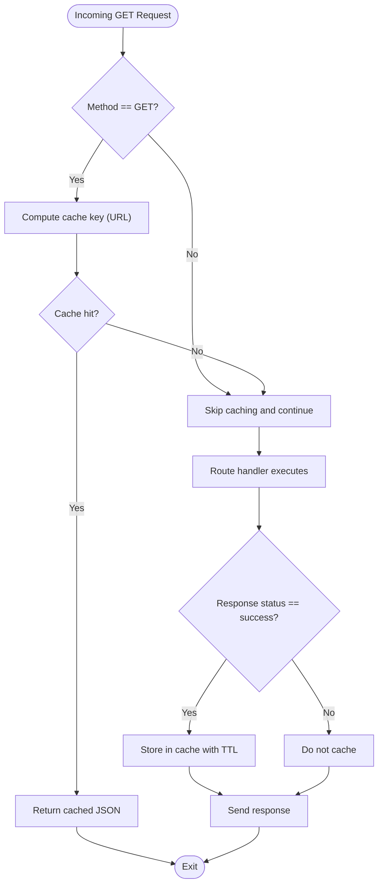
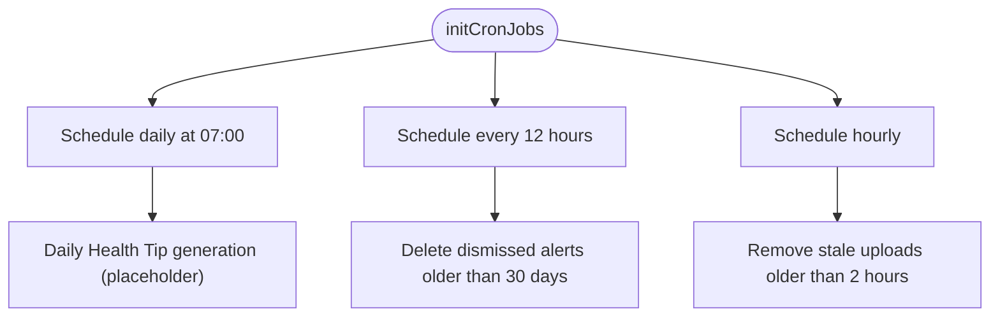
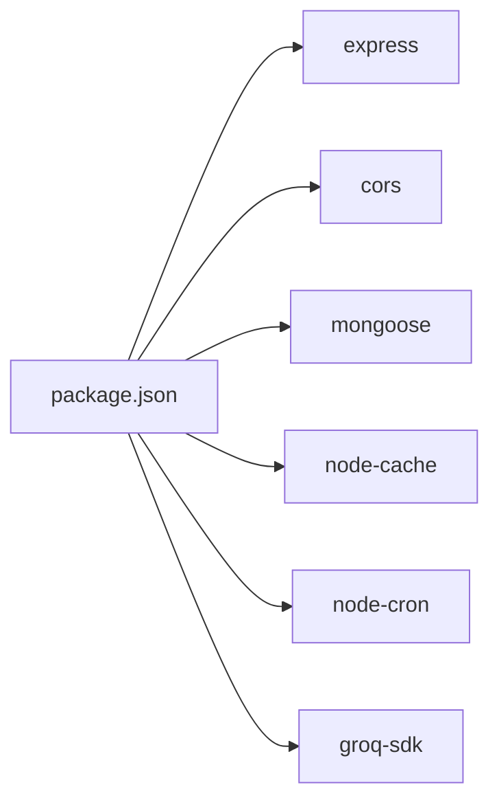

# Backend Architecture

<cite>
**Referenced Files in This Document**
- [server.js](file://backend/server.js)
- [package.json](file://backend/package.json)
- [userRoutes.js](file://backend/src/routes/userRoutes.js)
- [medicationRoutes.js](file://backend/src/routes/medicationRoutes.js)
- [UserProfile.js](file://backend/src/models/UserProfile.js)
- [Medication.js](file://backend/src/models/Medication.js)
- [aiService.js](file://backend/src/services/aiService.js)
- [reminderService.js](file://backend/src/services/reminderService.js)
- [cacheMiddleware.js](file://backend/src/utils/cacheMiddleware.js)
- [cronJobs.js](file://backend/src/scripts/cronJobs.js)
</cite>

## Table of Contents
1. [Introduction](#introduction)
2. [Project Structure](#project-structure)
3. [Core Components](#core-components)
4. [Architecture Overview](#architecture-overview)
5. [Detailed Component Analysis](#detailed-component-analysis)
6. [Dependency Analysis](#dependency-analysis)
7. [Performance Considerations](#performance-considerations)
8. [Troubleshooting Guide](#troubleshooting-guide)
9. [Conclusion](#conclusion)

## Introduction
This document describes the backend architecture of VaidyaSetu’s Node.js/Express system. It explains the layered architecture with an MVC-like separation, detailing how routes handle HTTP requests, services encapsulate business logic, and models manage data access via Mongoose. It also documents the modular routing system with more than 20 API endpoints grouped by functional domains, middleware configuration for CORS, JSON parsing, and caching, and the service layer including AI services, reminder services, and utility functions. Background job processing is covered through a reminder heartbeat and cron jobs. Finally, it illustrates route-to-service-to-model interactions and the separation of concerns across layers.

## Project Structure
The backend follows a feature-based structure under a single server entrypoint:
- server.js initializes Express, loads environment variables, configures middleware, connects to MongoDB, mounts routes, starts background services, and exposes a health endpoint.
- src/ contains three primary layers:
  - routes/: Feature-specific routers that define endpoints and orchestrate request handling.
  - services/: Business logic modules implementing domain services (e.g., AI, reminders).
  - models/: Mongoose schemas and models for data access.
  - utils/: Shared utilities (e.g., caching middleware).
  - scripts/: Background tasks and maintenance jobs (e.g., cron initialization).
- Root-level package.json defines dependencies and scripts.

```mermaid
graph TB
subgraph "Server"
S["server.js"]
end
subgraph "Routes"
RU["userRoutes.js"]
RM["medicationRoutes.js"]
RA["aiRoutes.js"]
RR["reportRoutes.js"]
RINT["interactionRoutes.js"]
RRT["realtimeInteractionRoutes.js"]
RAG["ragRoutes.js"]
RF["fitnessRoutes.js"]
RC["chatRoutes.js"]
RFB["feedbackRoutes.js"]
ROC["ocrRoutes.js"]
RV["vitalsRoutes.js"]
RL["labRoutes.js"]
RG["goalsRoutes.js"]
RAL["alertRoutes.js"]
RP["preferenceRoutes.js"]
RD["diseaseRoutes.js"]
RDOC["doctorRoutes.js"]
RAN["analyticsRoutes.js"]
end
subgraph "Services"
SAI["aiService.js"]
SRM["reminderService.js"]
end
subgraph "Models"
MUP["UserProfile.js"]
MMED["Medication.js"]
end
subgraph "Utils"
CM["cacheMiddleware.js"]
end
subgraph "Scripts"
CJ["cronJobs.js"]
end
S --> RU
S --> RM
S --> RA
S --> RR
S --> RINT
S --> RRT
S --> RAG
S --> RF
S --> RC
S --> RFB
S --> ROC
S --> RV
S --> RL
S --> RG
S --> RAL
S --> RP
S --> RD
S --> RDOC
S --> RAN
RU --> MUP
RM --> MMED
SAI --> MUP
SRM --> MMED
SRM --> MUP
SRM --> MUP
S --> CM
S --> CJ
```

**Diagram sources**
- [server.js:1-94](file://backend/server.js#L1-L94)
- [userRoutes.js:1-101](file://backend/src/routes/userRoutes.js#L1-L101)
- [medicationRoutes.js:1-66](file://backend/src/routes/medicationRoutes.js#L1-L66)
- [aiService.js:1-83](file://backend/src/services/aiService.js#L1-L83)
- [reminderService.js:1-84](file://backend/src/services/reminderService.js#L1-L84)
- [cacheMiddleware.js:1-43](file://backend/src/utils/cacheMiddleware.js#L1-L43)
- [cronJobs.js:1-67](file://backend/src/scripts/cronJobs.js#L1-L67)
- [UserProfile.js:1-175](file://backend/src/models/UserProfile.js#L1-L175)
- [Medication.js:1-46](file://backend/src/models/Medication.js#L1-L46)

**Section sources**
- [server.js:1-94](file://backend/server.js#L1-L94)
- [package.json:1-37](file://backend/package.json#L1-L37)

## Core Components
- Server bootstrap and middleware:
  - Loads environment variables, configures CORS and JSON parsing, connects to MongoDB, mounts modular routes, exposes a health endpoint, and starts background services.
- Modular routing:
  - Over 20 route modules grouped by functional domains (user, profile, AI, reports, interactions, RAG, fitness, chat, feedback, OCR, vitals, labs, goals, alerts, preferences, medications, governance, diseases, doctors, analytics).
- Service layer:
  - AI service integrates an LLM fallback strategy for generating mitigation steps.
  - Reminder service periodically checks due medications and lab test due dates to create alerts.
- Data access:
  - Mongoose models for user profiles and medications with rich schemas and indexes.
- Utilities:
  - Aggressive caching middleware for GET responses.
- Background jobs:
  - Reminder heartbeat and cron-based maintenance tasks.

**Section sources**
- [server.js:1-94](file://backend/server.js#L1-L94)
- [userRoutes.js:1-101](file://backend/src/routes/userRoutes.js#L1-L101)
- [medicationRoutes.js:1-66](file://backend/src/routes/medicationRoutes.js#L1-L66)
- [aiService.js:1-83](file://backend/src/services/aiService.js#L1-L83)
- [reminderService.js:1-84](file://backend/src/services/reminderService.js#L1-L84)
- [cacheMiddleware.js:1-43](file://backend/src/utils/cacheMiddleware.js#L1-L43)
- [cronJobs.js:1-67](file://backend/src/scripts/cronJobs.js#L1-L67)
- [UserProfile.js:1-175](file://backend/src/models/UserProfile.js#L1-L175)
- [Medication.js:1-46](file://backend/src/models/Medication.js#L1-L46)

## Architecture Overview
The system adheres to a layered architecture:
- Presentation Layer: Express routes define endpoints and handle HTTP requests/responses.
- Business Logic Layer: Services encapsulate domain logic (AI generation, reminders, utilities).
- Data Access Layer: Mongoose models abstract database operations.
- Infrastructure: Middleware (CORS, JSON parsing, caching), background jobs (reminder heartbeat and cron), and MongoDB connection.

**Diagram sources**
- [server.js:1-94](file://backend/server.js#L1-L94)
- [userRoutes.js:1-101](file://backend/src/routes/userRoutes.js#L1-L101)
- [medicationRoutes.js:1-66](file://backend/src/routes/medicationRoutes.js#L1-L66)
- [aiService.js:1-83](file://backend/src/services/aiService.js#L1-L83)
- [reminderService.js:1-84](file://backend/src/services/reminderService.js#L1-L84)
- [UserProfile.js:1-175](file://backend/src/models/UserProfile.js#L1-L175)
- [Medication.js:1-46](file://backend/src/models/Medication.js#L1-L46)

## Detailed Component Analysis

### Route Layer: User Management
- Endpoint summary:
  - POST /api/user/profile: Creates or updates a user profile during onboarding, logs history entries, and recalculates data quality.
  - DELETE /api/user/:clerkId: Purges all user-related collections for the given identifier.
- Processing logic:
  - Validates presence of required identifiers.
  - Normalizes flat input into nested field structures with metadata.
  - Writes audit history entries and updates data quality metrics.
  - Returns structured success/error responses.

**Diagram sources**
- [userRoutes.js:11-80](file://backend/src/routes/userRoutes.js#L11-L80)
- [UserProfile.js:1-175](file://backend/src/models/UserProfile.js#L1-L175)

**Section sources**
- [userRoutes.js:1-101](file://backend/src/routes/userRoutes.js#L1-L101)

### Route Layer: Medication Tracking
- Endpoint summary:
  - GET /api/medications/:clerkId: Lists active medications for a user.
  - POST /api/medications: Adds a new medication record.
  - PATCH /api/medications/:id/take: Marks a medication as taken and updates adherence.
  - DELETE /api/medications/:id: Deactivates a medication.
- Processing logic:
  - Uses Mongoose queries to filter by user and active status.
  - Updates adherence counters upon marking as taken.
  - Returns structured responses with status and data.

**Diagram sources**
- [medicationRoutes.js:9-63](file://backend/src/routes/medicationRoutes.js#L9-L63)
- [Medication.js:1-46](file://backend/src/models/Medication.js#L1-L46)

**Section sources**
- [medicationRoutes.js:1-66](file://backend/src/routes/medicationRoutes.js#L1-L66)
- [Medication.js:1-46](file://backend/src/models/Medication.js#L1-L46)

### Service Layer: AI Mitigation Steps
- Purpose:
  - Generates personalized mitigation steps for a disease using an LLM (Groq) with a robust fallback to a mitigation library.
- Inputs:
  - User profile context (age, BMI, allergies, current medications, diet).
  - Target disease identifier and risk score.
- Output:
  - Structured list of mitigation steps with priority and category.

**Diagram sources**
- [aiService.js:10-78](file://backend/src/services/aiService.js#L10-L78)

**Section sources**
- [aiService.js:1-83](file://backend/src/services/aiService.js#L1-L83)

### Service Layer: Reminder Service
- Purpose:
  - Periodically checks due medications and overdue lab tests to create alerts.
- Mechanism:
  - Runs on a 1-minute interval heartbeat.
  - Queries active medications matching current time windows and creates alerts if none were recently created.
  - For diabetes profiles, checks recent HbA1c/labs and triggers reminders if missing.

**Diagram sources**
- [reminderService.js:11-81](file://backend/src/services/reminderService.js#L11-L81)
- [Medication.js:1-46](file://backend/src/models/Medication.js#L1-L46)
- [UserProfile.js:1-175](file://backend/src/models/UserProfile.js#L1-L175)

**Section sources**
- [reminderService.js:1-84](file://backend/src/services/reminderService.js#L1-L84)

### Utility: Caching Middleware
- Purpose:
  - Aggressively caches GET responses globally for a configurable TTL.
- Behavior:
  - Intercepts res.json to cache successful responses.
  - Returns cached responses immediately on cache hit.

**Diagram sources**
- [cacheMiddleware.js:10-37](file://backend/src/utils/cacheMiddleware.js#L10-L37)

**Section sources**
- [cacheMiddleware.js:1-43](file://backend/src/utils/cacheMiddleware.js#L1-L43)

### Background Jobs: Cron Schedules
- Purpose:
  - Initialize and schedule recurring background tasks.
- Schedules:
  - Daily health tips generation placeholder.
  - Alert expiry cleanup (dismissed alerts older than 30 days).
  - Stale temporary file cleanup (older than 2 hours).

**Diagram sources**
- [cronJobs.js:12-66](file://backend/src/scripts/cronJobs.js#L12-L66)

**Section sources**
- [cronJobs.js:1-67](file://backend/src/scripts/cronJobs.js#L1-L67)

## Dependency Analysis
- External libraries:
  - Express for web framework, CORS and JSON parsing middleware.
  - Mongoose for MongoDB ODM.
  - node-cron for scheduling.
  - node-cache for in-memory caching.
  - Groq SDK for AI generation.
- Internal dependencies:
  - Routes depend on models for persistence.
  - Services depend on models and utilities for business logic.
  - Server orchestrates routes, middleware, background services, and DB connection.

**Diagram sources**
- [package.json:13-31](file://backend/package.json#L13-L31)

**Section sources**
- [package.json:1-37](file://backend/package.json#L1-L37)

## Performance Considerations
- Caching:
  - Apply the caching middleware to frequently accessed, idempotent GET endpoints to reduce load and latency.
- Indexing:
  - Ensure Mongoose indexes on commonly queried fields (e.g., clerkId, active flags) to optimize query performance.
- Background processing:
  - Use cron jobs for heavy maintenance tasks and keep the reminder heartbeat interval appropriate for the target environment.
- Data quality:
  - Onboarding and profile updates recalculate data quality scores; batch or debounce where possible to avoid redundant computations.

## Troubleshooting Guide
- Health endpoint:
  - Verify the health route returns the expected status and DB readiness indicator.
- MongoDB connectivity:
  - Confirm environment variables and connection URI; monitor connection logs.
- Reminder service:
  - Check logs for periodic execution and alert creation; validate timing window matching and recent alert suppression logic.
- Cron jobs:
  - Review scheduled tasks logs and confirm cleanup operations for stale files and alert purging.
- Caching:
  - Validate cache keys and TTL; ensure only successful responses are cached.

**Section sources**
- [server.js:68-93](file://backend/server.js#L68-L93)
- [reminderService.js:11-81](file://backend/src/services/reminderService.js#L11-L81)
- [cronJobs.js:12-66](file://backend/src/scripts/cronJobs.js#L12-L66)
- [cacheMiddleware.js:10-37](file://backend/src/utils/cacheMiddleware.js#L10-L37)

## Conclusion
VaidyaSetu’s backend employs a clean, layered architecture with clear separation of concerns. Routes handle HTTP concerns, services encapsulate business logic, and models manage data access. The modular routing system supports a broad set of health-related domains, while middleware and background jobs enhance performance and operational hygiene. The AI service and reminder service demonstrate practical integrations of external APIs and periodic maintenance, respectively. This structure supports scalability, maintainability, and extensibility across the platform’s functional domains.