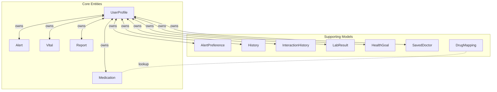
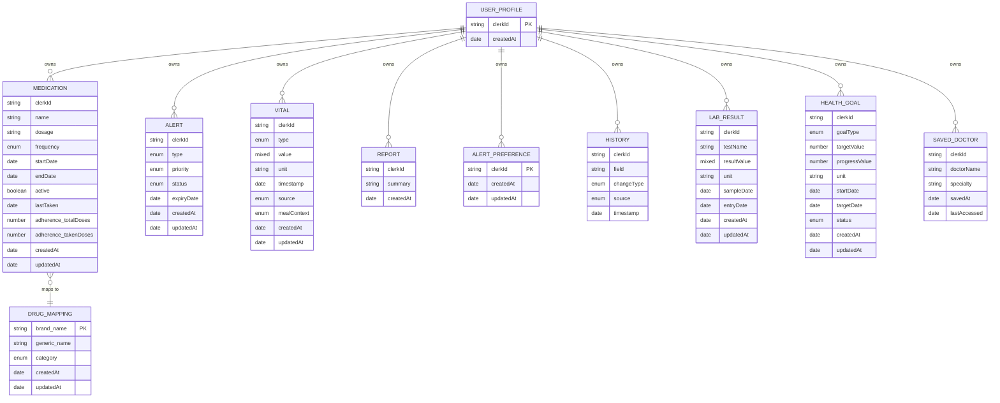
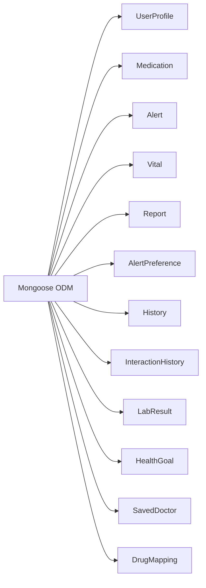

# Database Design

<cite>
**Referenced Files in This Document**
- [UserProfile.js](file://backend/src/models/UserProfile.js)
- [Medication.js](file://backend/src/models/Medication.js)
- [Alert.js](file://backend/src/models/Alert.js)
- [Vital.js](file://backend/src/models/Vital.js)
- [Report.js](file://backend/src/models/Report.js)
- [AlertPreference.js](file://backend/src/models/AlertPreference.js)
- [History.js](file://backend/src/models/History.js)
- [InteractionHistory.js](file://backend/src/models/InteractionHistory.js)
- [LabResult.js](file://backend/src/models/LabResult.js)
- [HealthGoal.js](file://backend/src/models/HealthGoal.js)
- [SavedDoctor.js](file://backend/src/models/SavedDoctor.js)
- [dbIndexes.js](file://backend/src/scripts/dbIndexes.js)
- [DrugMapping.js](file://backend/src/models/DrugMapping.js)
</cite>

## Table of Contents
1. [Introduction](#introduction)
2. [Project Structure](#project-structure)
3. [Core Components](#core-components)
4. [Architecture Overview](#architecture-overview)
5. [Detailed Component Analysis](#detailed-component-analysis)
6. [Dependency Analysis](#dependency-analysis)
7. [Performance Considerations](#performance-considerations)
8. [Troubleshooting Guide](#troubleshooting-guide)
9. [Conclusion](#conclusion)
10. [Appendices](#appendices)

## Introduction
This document describes the MongoDB Atlas database design for VaidyaSetu, focusing on the schema design for core entities and supporting models. It explains relationships, embedding versus referencing strategies, indexing patterns, validation rules, and operational aspects such as audit trails and lifecycle management. The design leverages Mongoose schemas with explicit indexes and structured documents to support efficient queries, reporting, and compliance with healthcare data handling requirements.

## Project Structure
The database design centers around user-centric collections that capture health profiles, medications, vitals, alerts, reports, and related metadata. Supporting models include preferences, history, interactions, goals, labs, and saved doctors. Indexes are defined both at the schema level and via a dedicated script for compound and text indexes.

**Diagram sources**
- [UserProfile.js:15-172](file://backend/src/models/UserProfile.js#L15-L172)
- [Medication.js:3-43](file://backend/src/models/Medication.js#L3-L43)
- [Alert.js:3-45](file://backend/src/models/Alert.js#L3-L45)
- [Vital.js:3-52](file://backend/src/models/Vital.js#L3-L52)
- [Report.js:3-47](file://backend/src/models/Report.js#L3-L47)
- [AlertPreference.js:3-41](file://backend/src/models/AlertPreference.js#L3-L41)
- [History.js:3-38](file://backend/src/models/History.js#L3-L38)
- [InteractionHistory.js:3-25](file://backend/src/models/InteractionHistory.js#L3-L25)
- [LabResult.js:3-48](file://backend/src/models/LabResult.js#L3-L48)
- [HealthGoal.js:3-48](file://backend/src/models/HealthGoal.js#L3-L48)
- [SavedDoctor.js:3-30](file://backend/src/models/SavedDoctor.js#L3-L30)
- [DrugMapping.js:3-31](file://backend/src/models/DrugMapping.js#L3-L31)

**Section sources**
- [UserProfile.js:15-172](file://backend/src/models/UserProfile.js#L15-L172)
- [Medication.js:3-43](file://backend/src/models/Medication.js#L3-L43)
- [Alert.js:3-45](file://backend/src/models/Alert.js#L3-L45)
- [Vital.js:3-52](file://backend/src/models/Vital.js#L3-L52)
- [Report.js:3-47](file://backend/src/models/Report.js#L3-L47)
- [AlertPreference.js:3-41](file://backend/src/models/AlertPreference.js#L3-L41)
- [History.js:3-38](file://backend/src/models/History.js#L3-L38)
- [InteractionHistory.js:3-25](file://backend/src/models/InteractionHistory.js#L3-L25)
- [LabResult.js:3-48](file://backend/src/models/LabResult.js#L3-L48)
- [HealthGoal.js:3-48](file://backend/src/models/HealthGoal.js#L3-L48)
- [SavedDoctor.js:3-30](file://backend/src/models/SavedDoctor.js#L3-L30)
- [DrugMapping.js:3-31](file://backend/src/models/DrugMapping.js#L3-L31)

## Core Components
This section documents the primary Mongoose schemas and their validation rules, required fields, and optional properties.

- UserProfile
  - Purpose: Central health profile and settings for a user identified by clerkId.
  - Key fields: Clerk identifier, biometrics, lifestyle, diet, medical history, onboarding flags, platform settings, screening questions, saved doctors, current location, and UI persistence.
  - Validation: Unique clerkId; enums for gender, units, themes, fonts, measurement systems, glucose units, reminder sound, and doctor filters.
  - Notes: Uses a reusable FieldSchema pattern for most attributes to track value, unit, lastUpdated, previousValue, and updateType.

- Medication
  - Purpose: Track prescribed and over-the-counter medications per user.
  - Key fields: Name, dosage, frequency (enum), timings, dates, active flag, lastTaken, adherence counters.
  - Validation: Required name, dosage, frequency enum; default daily timing; adherence counters initialized to zero.

- Alert
  - Purpose: System-generated or curated notifications for the user.
  - Key fields: Type, priority (enum), title, description, status (enum), action metadata, expiry date.
  - Validation: Required type, priority enum, status enum; indexed for fast filtering and expiry processing.

- Vital
  - Purpose: Capture vital signs and measurements with flexible value representation.
  - Key fields: Type (enum of vitals), value (mixed), unit, timestamp, source, notes, meal context.
  - Validation: Required type, value, unit; supports numeric and structured values (e.g., blood pressure object); indexed by type and timestamp.

- Report
  - Purpose: Aggregated health insights and recommendations.
  - Key fields: Summary, dynamic advice map, general tips, disclaimer, risk scores map, category insights map, mitigations map, creation timestamp.
  - Serialization: Flattened maps for JSON consumption.

**Section sources**
- [UserProfile.js:3-172](file://backend/src/models/UserProfile.js#L3-L172)
- [Medication.js:3-43](file://backend/src/models/Medication.js#L3-L43)
- [Alert.js:3-45](file://backend/src/models/Alert.js#L3-L45)
- [Vital.js:3-52](file://backend/src/models/Vital.js#L3-L52)
- [Report.js:3-47](file://backend/src/models/Report.js#L3-L47)

## Architecture Overview
The system follows a user-centric design where each user’s data is isolated by clerkId. Collections are designed for:
- Fast user-scoped reads via indexed clerkId.
- Timeline queries for vitals and history via timestamped fields.
- Preference-driven alert routing and thresholds.
- Auditability through history entries and timestamps.

**Diagram sources**
- [UserProfile.js:15-172](file://backend/src/models/UserProfile.js#L15-L172)
- [Medication.js:3-43](file://backend/src/models/Medication.js#L3-L43)
- [Alert.js:3-45](file://backend/src/models/Alert.js#L3-L45)
- [Vital.js:3-52](file://backend/src/models/Vital.js#L3-L52)
- [Report.js:3-47](file://backend/src/models/Report.js#L3-L47)
- [AlertPreference.js:3-41](file://backend/src/models/AlertPreference.js#L3-L41)
- [History.js:3-38](file://backend/src/models/History.js#L3-L38)
- [LabResult.js:3-48](file://backend/src/models/LabResult.js#L3-L48)
- [HealthGoal.js:3-48](file://backend/src/models/HealthGoal.js#L3-L48)
- [SavedDoctor.js:3-30](file://backend/src/models/SavedDoctor.js#L3-L30)
- [DrugMapping.js:3-31](file://backend/src/models/DrugMapping.js#L3-L31)

## Detailed Component Analysis

### UserProfile
- Embedding strategy: Uses a reusable FieldSchema for numerous attributes to maintain a compact, embedded document per user. This reduces joins and simplifies reads.
- Virtuals/middleware: No virtuals or middleware observed in the schema.
- Validation: Unique clerkId; enums for gender, measurement units, glucose units, and platform settings; defaults applied for many fields.
- Audit trail: Individual fields carry updateType and lastUpdated; a separate History model captures field-level change logs.

**Section sources**
- [UserProfile.js:3-172](file://backend/src/models/UserProfile.js#L3-L172)
- [History.js:3-38](file://backend/src/models/History.js#L3-L38)

### Medication
- Embedding strategy: Medications are embedded under the user profile via clerkId; adherence counters are nested for quick computation.
- Validation: Required name, dosage, frequency enum; default daily schedule; active flag and date range support lifecycle management.
- Lifecycle: startDate/endDate and active flag enable scheduling and deactivation; adherence metrics support patient engagement.

**Section sources**
- [Medication.js:3-43](file://backend/src/models/Medication.js#L3-L43)

### Alert
- Embedding strategy: Alerts are stored as separate documents per user, enabling independent status updates and expiration handling.
- Validation: Priority and status enums; indexed for fast filtering by status and for expiry processing.
- Lifecycle: Expiry date and timestamps support automated cleanup and prioritization.

**Section sources**
- [Alert.js:3-45](file://backend/src/models/Alert.js#L3-L45)
- [dbIndexes.js:17-19](file://backend/src/scripts/dbIndexes.js#L17-L19)

### Vital
- Embedding strategy: Vitals are stored as separate documents with a type discriminator and mixed value to support scalars and structured values.
- Validation: Enumerated vital types; required unit and value; timestamp default and source/meals context.
- Timeline queries: Indexed by type and timestamp for efficient dashboards and trend analysis.

**Section sources**
- [Vital.js:3-52](file://backend/src/models/Vital.js#L3-L52)
- [dbIndexes.js:21-22](file://backend/src/scripts/dbIndexes.js#L21-L22)

### Report
- Embedding strategy: Report aggregates are stored as single documents with dynamic maps for advice, risk scores, and mitigations.
- Serialization: Flattened maps for JSON consumption by clients.
- Lifecycle: Created timestamp supports retention and audit.

**Section sources**
- [Report.js:3-47](file://backend/src/models/Report.js#L3-L47)

### Supporting Models
- AlertPreference: Stores per-user alert preferences and thresholds; includes quiet hours and custom thresholds for vitals.
- History: Captures field-level changes with intent, notes, and source for auditability.
- InteractionHistory: Records drug interaction checks and AI explanations for traceability.
- LabResult: Stores lab test results with reference ranges and optional report references.
- HealthGoal: Tracks user-defined health targets with progress and status.
- SavedDoctor: Stores user-saved doctors with metadata and recency indexing.
- DrugMapping: Maps brand/generic names and categories; includes text index for fuzzy search.

**Section sources**
- [AlertPreference.js:3-41](file://backend/src/models/AlertPreference.js#L3-L41)
- [History.js:3-38](file://backend/src/models/History.js#L3-L38)
- [InteractionHistory.js:3-25](file://backend/src/models/InteractionHistory.js#L3-L25)
- [LabResult.js:3-48](file://backend/src/models/LabResult.js#L3-L48)
- [HealthGoal.js:3-48](file://backend/src/models/HealthGoal.js#L3-L48)
- [SavedDoctor.js:3-30](file://backend/src/models/SavedDoctor.js#L3-L30)
- [DrugMapping.js:3-35](file://backend/src/models/DrugMapping.js#L3-L35)

## Dependency Analysis
- Cohesion: Each model encapsulates a cohesive domain concept (profile, meds, vitals, alerts, reports).
- Coupling: Low coupling via clerkId scoping; minimal cross-document references.
- External dependencies: Mongoose ODM; indexes managed via schema and a dedicated script.

**Diagram sources**
- [UserProfile.js:15-172](file://backend/src/models/UserProfile.js#L15-L172)
- [Medication.js:3-43](file://backend/src/models/Medication.js#L3-L43)
- [Alert.js:3-45](file://backend/src/models/Alert.js#L3-L45)
- [Vital.js:3-52](file://backend/src/models/Vital.js#L3-L52)
- [Report.js:3-47](file://backend/src/models/Report.js#L3-L47)
- [AlertPreference.js:3-41](file://backend/src/models/AlertPreference.js#L3-L41)
- [History.js:3-38](file://backend/src/models/History.js#L3-L38)
- [InteractionHistory.js:3-25](file://backend/src/models/InteractionHistory.js#L3-L25)
- [LabResult.js:3-48](file://backend/src/models/LabResult.js#L3-L48)
- [HealthGoal.js:3-48](file://backend/src/models/HealthGoal.js#L3-L48)
- [SavedDoctor.js:3-30](file://backend/src/models/SavedDoctor.js#L3-L30)
- [DrugMapping.js:3-35](file://backend/src/models/DrugMapping.js#L3-L35)

**Section sources**
- [dbIndexes.js:5-31](file://backend/src/scripts/dbIndexes.js#L5-L31)

## Performance Considerations
- Indexing strategy:
  - Single-field: clerkId on user-scoped collections (UserProfile, Alert, Medication, Vital, Report, AlertPreference, History, LabResult, HealthGoal, SavedDoctor).
  - Compound: (clerkId, status) on Alert for fast unread/read/dismissed filtering; (clerkId, timestamp) on Vital for timeline queries.
  - Additional: createdAt descending for expiry processing; text index on DrugMapping for fuzzy search.
- Query patterns:
  - User-scoped reads dominate; ensure all user queries filter by clerkId.
  - Timeline queries benefit from timestamp indexes; sort by descending timestamp for recent-first views.
  - Aggregation pipelines can leverage indexes for match, sort, and group stages.
- Storage and serialization:
  - Mixed types enable flexible values but may increase storage variability; consider normalized subdocuments for very large structured values.
  - Flattened maps in Report reduce nesting for client consumption.

**Section sources**
- [dbIndexes.js:17-25](file://backend/src/scripts/dbIndexes.js#L17-L25)
- [Vital.js:23-36](file://backend/src/models/Vital.js#L23-L36)
- [Alert.js:12-18](file://backend/src/models/Alert.js#L12-L18)
- [Report.js:44-47](file://backend/src/models/Report.js#L44-L47)
- [DrugMapping.js:33-34](file://backend/src/models/DrugMapping.js#L33-L34)

## Troubleshooting Guide
- Missing indexes:
  - Run the indexing script to create compound and text indexes for production workloads.
- Slow timeline queries:
  - Verify (clerkId, timestamp) indexes exist on collections like Vital and ensure queries sort by timestamp descending.
- Alert expiry processing:
  - Confirm createdAt descending index exists and scheduled jobs query by expiryDate and status.
- Audit trail gaps:
  - Ensure History writes occur on profile field updates; confirm changeType and source fields are populated consistently.
- Data shape mismatches:
  - Review mixed-type fields (value in Vital, resultValue in LabResult) and ensure clients handle scalar and structured values.

**Section sources**
- [dbIndexes.js:5-31](file://backend/src/scripts/dbIndexes.js#L5-L31)
- [History.js:15-32](file://backend/src/models/History.js#L15-L32)
- [Vital.js:25-27](file://backend/src/models/Vital.js#L25-L27)
- [LabResult.js:19-21](file://backend/src/models/LabResult.js#L19-L21)

## Conclusion
The VaidyaSetu MongoDB design emphasizes user-scoped isolation, embedded flexibility for profile and vitals, and separate documents for alerts and reports. Indexing is tailored to frequent query patterns, and auditability is achieved through dedicated history and preference models. The schema supports scalable growth while maintaining performance for real-time dashboards and compliance-ready data handling.

## Appendices

### Data Lifecycle Management
- Creation: All user-scoped documents are created with timestamps; adherence counters initialize to zero for medications.
- Updates: Profile fields use FieldSchema to track lastUpdated and updateType; History captures field-level changes.
- Deletion: No explicit deletion observed; consider soft-deletion patterns for sensitive health data and implement retention policies aligned with compliance.

**Section sources**
- [UserProfile.js:5-13](file://backend/src/models/UserProfile.js#L5-L13)
- [History.js:15-37](file://backend/src/models/History.js#L15-L37)
- [Medication.js:39-42](file://backend/src/models/Medication.js#L39-L42)

### Audit Trails
- Field-level changes: History records oldValue, newValue, changeType, intent, notes, source, and unit.
- Timestamped events: All collections use timestamps; History includes a timeline index for chronological queries.

**Section sources**
- [History.js:3-38](file://backend/src/models/History.js#L3-L38)
- [dbIndexes.js:40-41](file://backend/src/scripts/dbIndexes.js#L40-L41)

### Data Validation Rules Summary
- UserProfile: Unique clerkId; enums for gender, units, settings; defaults for many fields.
- Medication: Required name, dosage, frequency enum; adherence counters default to zero.
- Alert: Required type, priority enum, status enum; indexed priority and status.
- Vital: Required type, value, unit; enum type and source; timestamp default.
- Report: Required summary, general_tips, disclaimer; maps default to empty objects.
- AlertPreference: Preferences array with enums; custom thresholds for vitals; quiet hours.
- History: Required field, changeType, source; optional intent and notes.
- LabResult: Required testName, resultValue, unit, sampleDate; optional reportRef.
- HealthGoal: Required goalType, targetValue, unit, targetDate; status enum.
- SavedDoctor: Required doctorName, specialty; indexed savedAt for recency.
- DrugMapping: Unique brand_name; text index for fuzzy search; category enum.

**Section sources**
- [UserProfile.js:16-91](file://backend/src/models/UserProfile.js#L16-L91)
- [Medication.js:9-42](file://backend/src/models/Medication.js#L9-L42)
- [Alert.js:9-44](file://backend/src/models/Alert.js#L9-L44)
- [Vital.js:9-51](file://backend/src/models/Vital.js#L9-L51)
- [Report.js:8-39](file://backend/src/models/Report.js#L8-L39)
- [AlertPreference.js:10-40](file://backend/src/models/AlertPreference.js#L10-L40)
- [History.js:9-37](file://backend/src/models/History.js#L9-L37)
- [LabResult.js:9-47](file://backend/src/models/LabResult.js#L9-L47)
- [HealthGoal.js:9-47](file://backend/src/models/HealthGoal.js#L9-L47)
- [SavedDoctor.js:9-29](file://backend/src/models/SavedDoctor.js#L9-L29)
- [DrugMapping.js:4-30](file://backend/src/models/DrugMapping.js#L4-L30)

### Aggregation Pipelines for Reporting
- Timeline visualization (Vitals):
  - Match by clerkId and date range.
  - Sort by timestamp ascending or descending.
  - Group by day/week/month for averages or counts.
- Risk scoring (Reports):
  - Unwind and compute derived metrics from maps.
  - Filter by category insights and mitigations.
- Alert summaries:
  - Group by type and status with counts and latest timestamps.
- Medication adherence:
  - Filter by active medications and compute taken/total ratios.

[No sources needed since this section provides general guidance]

### Security and Compliance Considerations
- Access control:
  - Enforce user isolation via clerkId in all queries.
  - Apply role-based permissions at the application layer for administrative tasks.
- Data minimization:
  - Store only necessary fields; avoid storing PHI beyond requirement.
- Retention and deletion:
  - Implement data retention policies with soft-delete and anonymization pathways.
- Backups:
  - Use MongoDB Atlas backups; encrypt at rest and in transit; enable audit logging.
- Validation:
  - Leverage schema enums and defaults to prevent malformed data entry.

[No sources needed since this section provides general guidance]