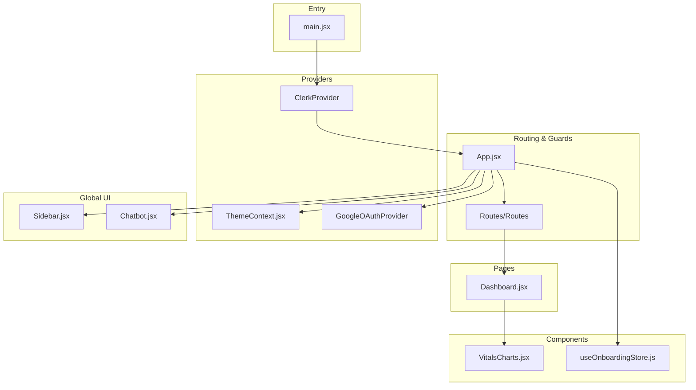
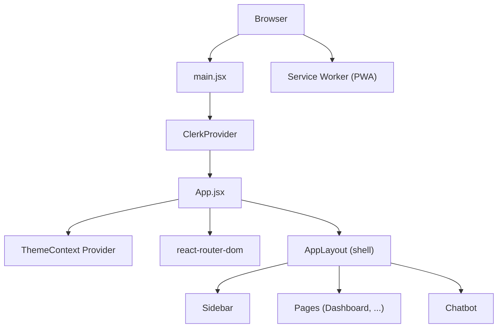
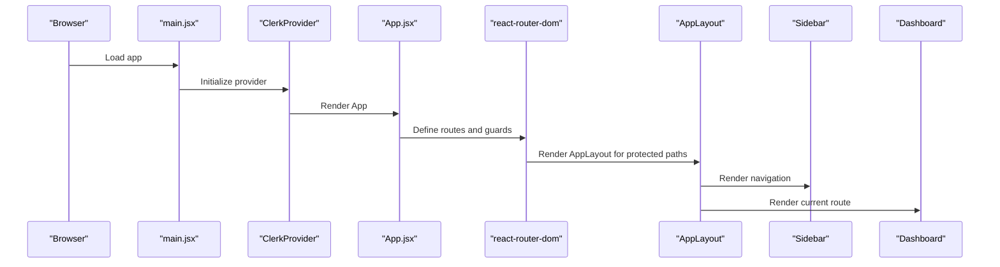
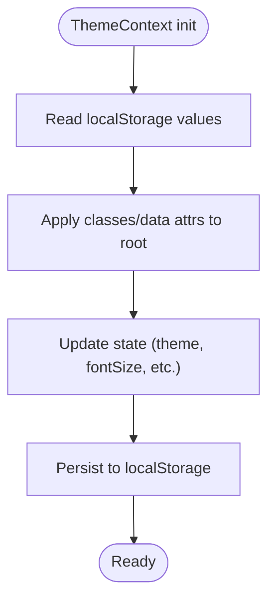
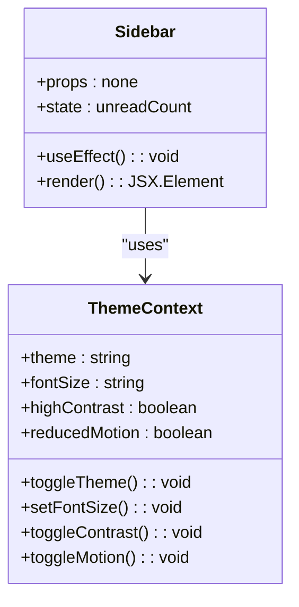
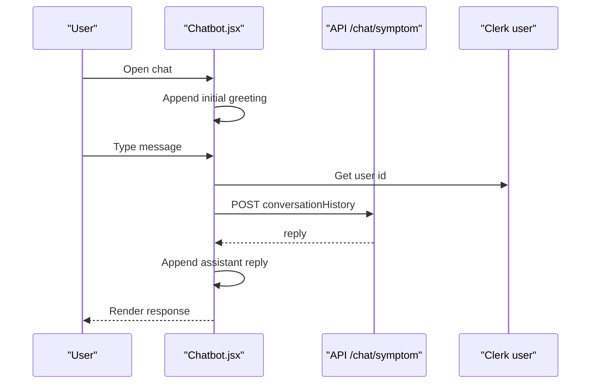
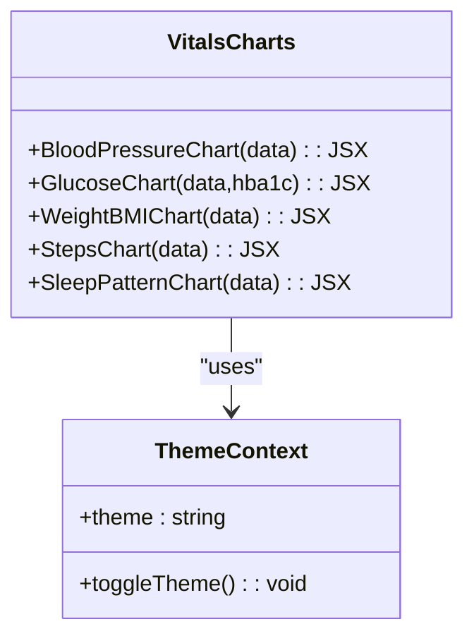
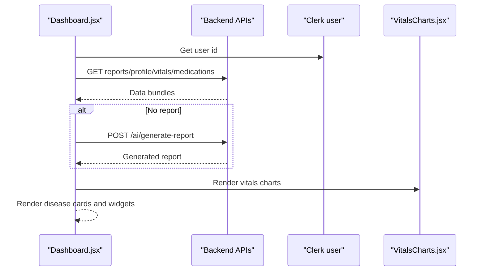
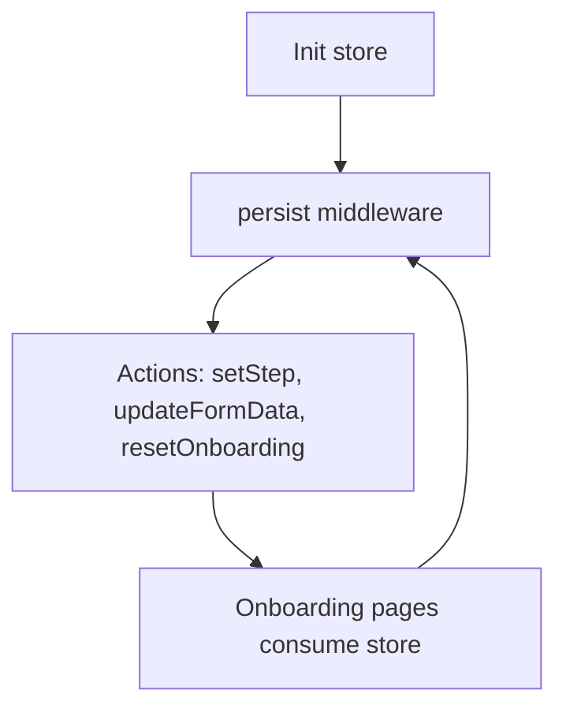
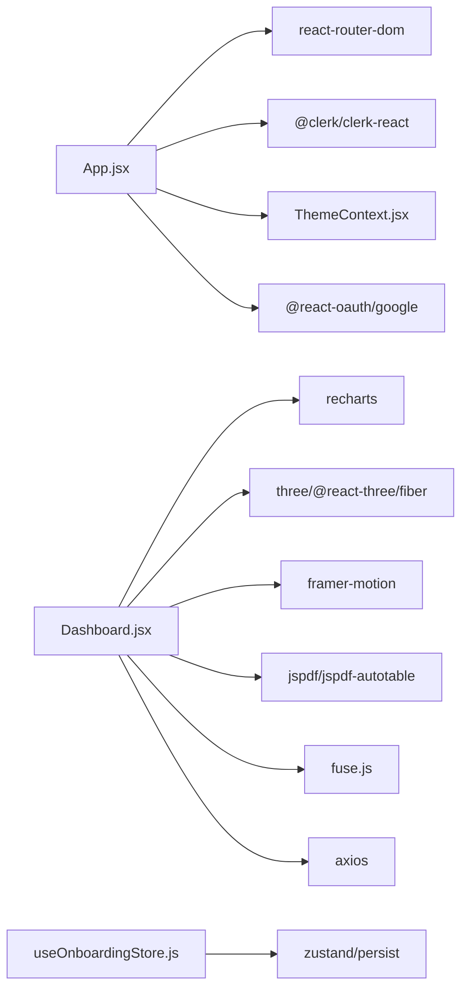

# Frontend Architecture

<cite>
**Referenced Files in This Document**
- [App.jsx](file://frontend/src/App.jsx)
- [main.jsx](file://frontend/src/main.jsx)
- [ThemeContext.jsx](file://frontend/src/context/ThemeContext.jsx)
- [Sidebar.jsx](file://frontend/src/components/Sidebar.jsx)
- [Chatbot.jsx](file://frontend/src/components/Chatbot.jsx)
- [VitalsCharts.jsx](file://frontend/src/components/VitalsCharts.jsx)
- [Dashboard.jsx](file://frontend/src/pages/Dashboard.jsx)
- [useOnboardingStore.js](file://frontend/src/store/useOnboardingStore.js)
- [package.json](file://frontend/package.json)
- [vite.config.js](file://frontend/vite.config.js)
</cite>

## Table of Contents
1. [Introduction](#introduction)
2. [Project Structure](#project-structure)
3. [Core Components](#core-components)
4. [Architecture Overview](#architecture-overview)
5. [Detailed Component Analysis](#detailed-component-analysis)
6. [Dependency Analysis](#dependency-analysis)
7. [Performance Considerations](#performance-considerations)
8. [Troubleshooting Guide](#troubleshooting-guide)
9. [Conclusion](#conclusion)

## Introduction
This document describes the frontend architecture of VaidyaSetu’s React 19 application. It focuses on the component-based structure, routing and navigation, state management, theming and accessibility, responsive design, and Progressive Web App capabilities. The analysis traces the component hierarchy from the root App.jsx down to specialized components such as the Chatbot, VitalsCharts, and disease cards, and explains how reusable UI components, page-level components, and context providers work together to deliver a cohesive user experience.

## Project Structure
The frontend is organized around a clear separation of concerns:
- Root entry renders the application within Clerk authentication and React Router.
- App.jsx defines the main application shell, routing, guards, and global UI elements.
- Components are grouped under src/components for shared UI building blocks.
- Pages are under src/pages for route-level views.
- Context providers manage cross-cutting concerns like theming.
- State stores (Zustand) encapsulate onboarding state.
- Vite config integrates Tailwind CSS and React Fast Refresh.

**Diagram sources**
- [main.jsx:1-26](file://frontend/src/main.jsx#L1-L26)
- [App.jsx:143-166](file://frontend/src/App.jsx#L143-L166)
- [ThemeContext.jsx:5-46](file://frontend/src/context/ThemeContext.jsx#L5-L46)
- [Sidebar.jsx:19-139](file://frontend/src/components/Sidebar.jsx#L19-L139)
- [Chatbot.jsx:8-202](file://frontend/src/components/Chatbot.jsx#L8-L202)
- [Dashboard.jsx:14-347](file://frontend/src/pages/Dashboard.jsx#L14-L347)
- [VitalsCharts.jsx:1-169](file://frontend/src/components/VitalsCharts.jsx#L1-L169)
- [useOnboardingStore.js:1-140](file://frontend/src/store/useOnboardingStore.js#L1-L140)

**Section sources**
- [main.jsx:1-26](file://frontend/src/main.jsx#L1-L26)
- [App.jsx:143-166](file://frontend/src/App.jsx#L143-L166)
- [vite.config.js:1-12](file://frontend/vite.config.js#L1-L12)

## Core Components
- App.jsx orchestrates routing, authentication guards, theme-aware layout, sidebar, chatbot, and service worker registration for PWA support.
- ThemeContext.jsx centralizes theme, font size, contrast, and motion preferences with persistence and DOM attribute updates.
- Sidebar.jsx provides responsive navigation with Clerk integration and real-time alert counts.
- Chatbot.jsx implements a floating chat interface with voice input, conversation history, and AI symptom checking.
- VitalsCharts.jsx offers reusable chart components for vitals visualization using Recharts.
- Dashboard.jsx composes multiple widgets, charts, and cards to present health insights and manages asynchronous data fetching and export.

**Section sources**
- [App.jsx:34-135](file://frontend/src/App.jsx#L34-L135)
- [ThemeContext.jsx:1-55](file://frontend/src/context/ThemeContext.jsx#L1-L55)
- [Sidebar.jsx:19-139](file://frontend/src/components/Sidebar.jsx#L19-L139)
- [Chatbot.jsx:8-202](file://frontend/src/components/Chatbot.jsx#L8-L202)
- [VitalsCharts.jsx:1-169](file://frontend/src/components/VitalsCharts.jsx#L1-L169)
- [Dashboard.jsx:14-347](file://frontend/src/pages/Dashboard.jsx#L14-L347)

## Architecture Overview
The frontend follows a layered architecture:
- Entry layer initializes Clerk and mounts the root App.
- Routing layer defines public/authenticated routes and protected routes.
- Layout layer hosts the main shell with sidebar, content area, disclaimer banner, and chatbot.
- Feature layer includes pages (Dashboard, Alerts, Vitals, etc.) and reusable components (VitalsCharts, Sidebar, Chatbot).
- State layer combines React hooks, custom contexts, and Zustand stores.
- Infrastructure layer handles PWA registration via service workers and asset delivery via Vite/Tailwind.

**Diagram sources**
- [main.jsx:13-25](file://frontend/src/main.jsx#L13-L25)
- [App.jsx:143-166](file://frontend/src/App.jsx#L143-L166)
- [ThemeContext.jsx:5-46](file://frontend/src/context/ThemeContext.jsx#L5-L46)
- [Sidebar.jsx:19-139](file://frontend/src/components/Sidebar.jsx#L19-L139)
- [Chatbot.jsx:8-202](file://frontend/src/components/Chatbot.jsx#L8-L202)

## Detailed Component Analysis

### App Shell and Routing
- Authentication guard: ProtectedRoute ensures unauthenticated users are redirected to sign-in.
- AppLayout coordinates theme toggling, sidebar, main content area, disclaimer banner, and chatbot.
- Service worker registration is performed in production to enable offline caching and installability.
- Routes cover dashboards, profiles, vitals, alerts, prescriptions, settings, and onboarding.

**Diagram sources**
- [main.jsx:13-25](file://frontend/src/main.jsx#L13-L25)
- [App.jsx:34-135](file://frontend/src/App.jsx#L34-L135)
- [Sidebar.jsx:19-139](file://frontend/src/components/Sidebar.jsx#L19-L139)
- [Dashboard.jsx:14-347](file://frontend/src/pages/Dashboard.jsx#L14-L347)

**Section sources**
- [App.jsx:34-135](file://frontend/src/App.jsx#L34-L135)
- [main.jsx:13-25](file://frontend/src/main.jsx#L13-L25)

### Theming and Accessibility
- ThemeContext manages theme, font size, high contrast, and reduced motion preferences.
- Persisted in localStorage and applied to the document root for cascading effects.
- Provides a toggle API for consumers and integrates with Tailwind-based dark mode.

**Diagram sources**
- [ThemeContext.jsx:5-46](file://frontend/src/context/ThemeContext.jsx#L5-L46)

**Section sources**
- [ThemeContext.jsx:1-55](file://frontend/src/context/ThemeContext.jsx#L1-L55)

### Sidebar Navigation
- Responsive design: mobile horizontal header with auth controls; desktop vertical sidebar.
- Clerk integration for user buttons and sign-in/sign-out.
- Real-time alert count polling and unread indicator.
- Navigation items mapped to routes with active state styling.

**Diagram sources**
- [Sidebar.jsx:19-139](file://frontend/src/components/Sidebar.jsx#L19-L139)
- [ThemeContext.jsx:5-46](file://frontend/src/context/ThemeContext.jsx#L5-L46)

**Section sources**
- [Sidebar.jsx:19-139](file://frontend/src/components/Sidebar.jsx#L19-L139)

### Chatbot Component
- Floating trigger button and modal chat window.
- Conversation state managed locally; sends history (excluding initial greeting) to backend.
- Voice input via SpeechRecognition with browser permission handling.
- Loading states and error fallback messaging.

**Diagram sources**
- [Chatbot.jsx:29-56](file://frontend/src/components/Chatbot.jsx#L29-L56)

**Section sources**
- [Chatbot.jsx:8-202](file://frontend/src/components/Chatbot.jsx#L8-L202)

### Vitals Charts Library
- Recharts-based components for blood pressure, glucose, weight/BMI, steps, and sleep pattern.
- Custom tooltips and theme-aware styling.
- Responsive containers and reference lines for clinical thresholds.

**Diagram sources**
- [VitalsCharts.jsx:31-169](file://frontend/src/components/VitalsCharts.jsx#L31-L169)
- [ThemeContext.jsx:5-46](file://frontend/src/context/ThemeContext.jsx#L5-L46)

**Section sources**
- [VitalsCharts.jsx:1-169](file://frontend/src/components/VitalsCharts.jsx#L1-L169)

### Dashboard Composition and Data Flow
- Fetches reports, latest vitals, profile, and medications concurrently.
- Generates AI report if missing and auto-generates upon first load.
- Renders predictive risk vectors as disease cards with expand/collapse and analytics tracking.
- Integrates 3D body scan visualization and export to PDF.

**Diagram sources**
- [Dashboard.jsx:65-143](file://frontend/src/pages/Dashboard.jsx#L65-L143)
- [VitalsCharts.jsx:31-169](file://frontend/src/components/VitalsCharts.jsx#L31-L169)

**Section sources**
- [Dashboard.jsx:14-347](file://frontend/src/pages/Dashboard.jsx#L14-L347)

### Onboarding State Management
- Zustand store persists onboarding form data across steps with a dedicated storage key.
- Provides setters for step transitions and partial updates to formData.

**Diagram sources**
- [useOnboardingStore.js:4-137](file://frontend/src/store/useOnboardingStore.js#L4-L137)

**Section sources**
- [useOnboardingStore.js:1-140](file://frontend/src/store/useOnboardingStore.js#L1-L140)

## Dependency Analysis
External libraries and integrations:
- Authentication: @clerk/clerk-react
- Routing: react-router-dom
- UI Icons: lucide-react
- Charts: recharts
- 3D: three, @react-three/fiber, @react-three/drei
- Motion: framer-motion
- PDF: jspdf, jspdf-autotable
- Search: fuse.js
- OAuth: @react-oauth/google
- State: zustand (with persist)
- HTTP: axios
- Dev/Build: vite, tailwindcss, @vitejs/plugin-react

**Diagram sources**
- [App.jsx:1-166](file://frontend/src/App.jsx#L1-L166)
- [Dashboard.jsx:1-347](file://frontend/src/pages/Dashboard.jsx#L1-L347)
- [useOnboardingStore.js:1-140](file://frontend/src/store/useOnboardingStore.js#L1-L140)
- [package.json:12-31](file://frontend/package.json#L12-L31)

**Section sources**
- [package.json:12-31](file://frontend/package.json#L12-L31)
- [vite.config.js:1-12](file://frontend/vite.config.js#L1-L12)

## Performance Considerations
- Concurrent data fetching reduces total load time on Dashboard.
- Localized state minimizes re-renders; avoid lifting unnecessary state.
- Chart components rely on ResponsiveContainer; ensure minimal reflows by keeping datasets stable.
- Service worker registration occurs once during initial render in production to enable caching.
- Use lazy loading for heavy 3D scenes and PDF generation to defer expensive operations.
- Debounce or throttle frequent updates (e.g., alert polling) to reduce network overhead.

[No sources needed since this section provides general guidance]

## Troubleshooting Guide
- Authentication redirects: Verify Clerk publishable key and afterSignInUrl/afterSignUpUrl.
- Protected route failures: Confirm ProtectedRoute wraps page components and user availability.
- Theme not applying: Check ThemeContext provider presence and localStorage values.
- Chatbot errors: Inspect axios endpoint and SpeechRecognition support; ensure HTTPS for microphone access.
- Service worker not registering: Confirm production build and /sw.js availability.

**Section sources**
- [main.jsx:9-21](file://frontend/src/main.jsx#L9-L21)
- [App.jsx:34-44](file://frontend/src/App.jsx#L34-L44)
- [ThemeContext.jsx:48-54](file://frontend/src/context/ThemeContext.jsx#L48-L54)
- [Chatbot.jsx:65-99](file://frontend/src/components/Chatbot.jsx#L65-L99)
- [App.jsx:60-66](file://frontend/src/App.jsx#L60-L66)

## Conclusion
VaidyaSetu’s frontend leverages a clean, component-driven architecture with robust routing, authentication, and state management. The App shell coordinates global UI elements, while reusable components like Sidebar, Chatbot, and VitalsCharts encapsulate cross-page functionality. ThemeContext and Zustand stores provide scalable state for accessibility and onboarding. The integration of Recharts, Three.js, and PDF generation enables rich visualizations and reporting. With service worker registration and responsive design, the application supports modern UX patterns and progressive capabilities.