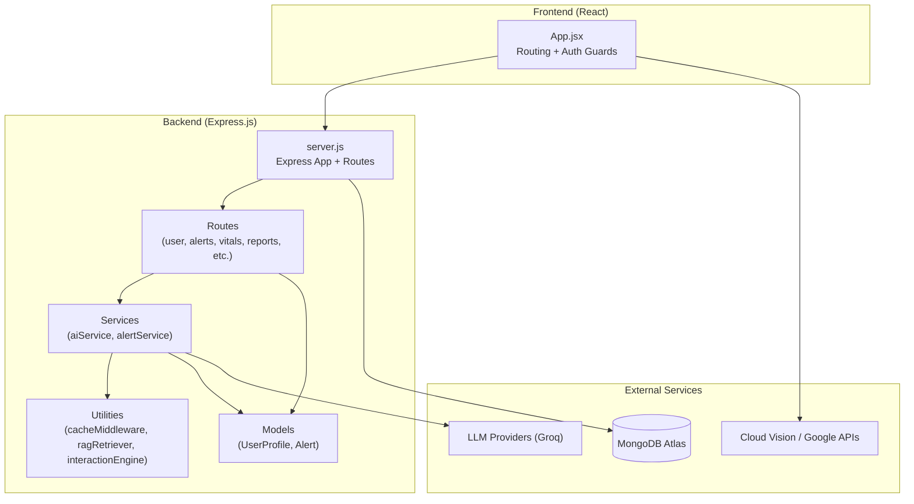
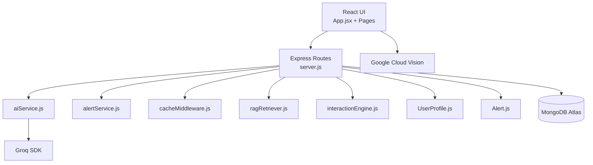
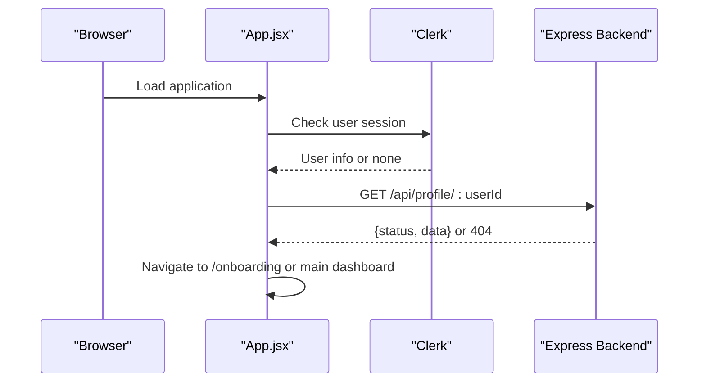
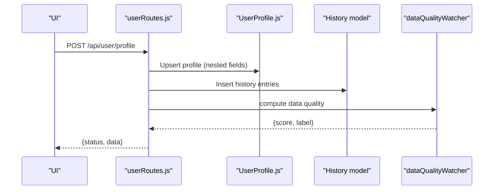
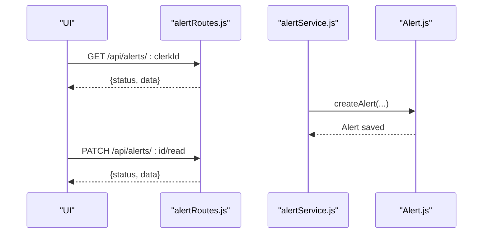
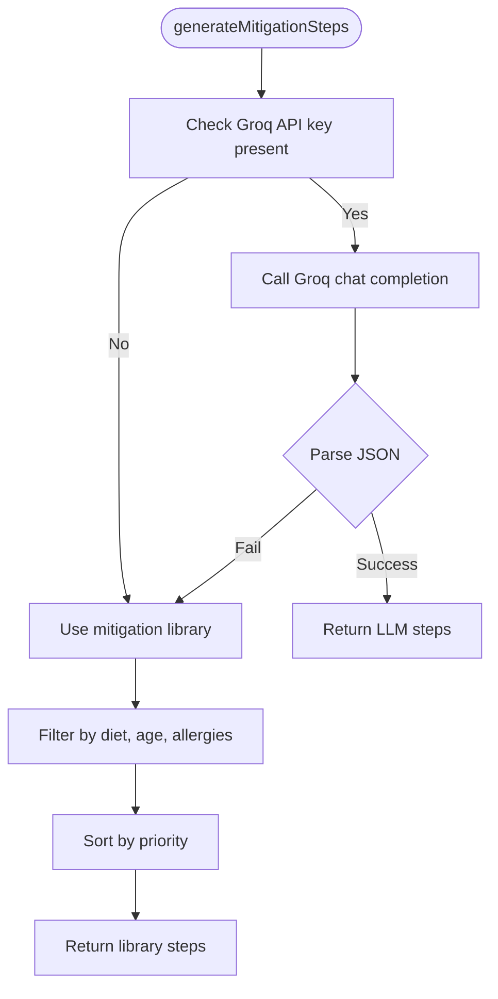
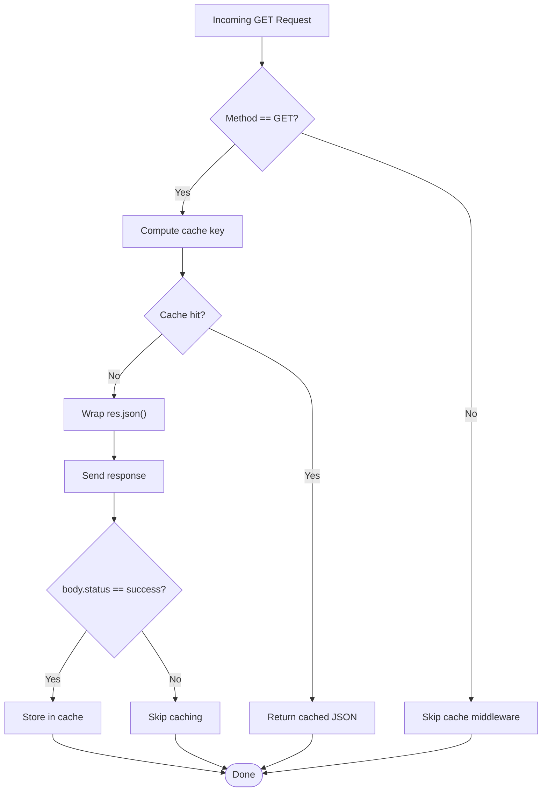
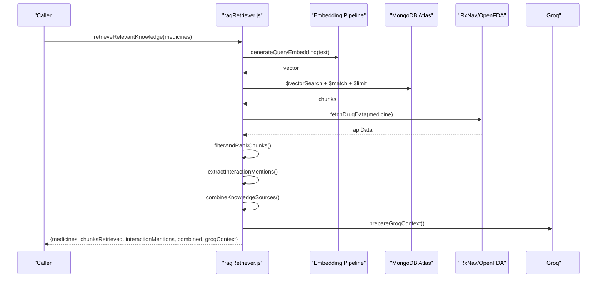
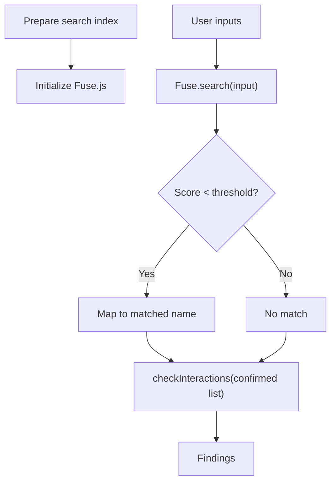
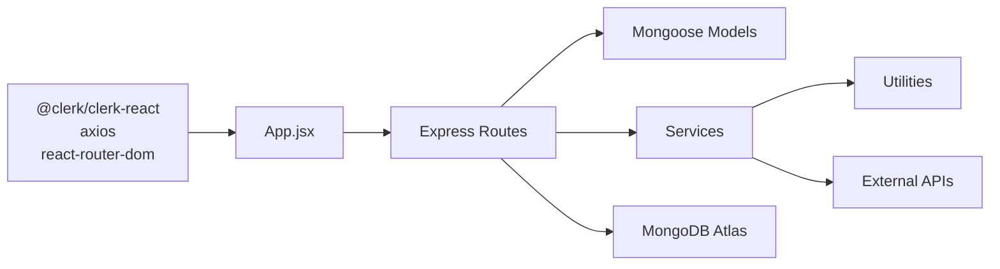

# System Architecture

<cite>
**Referenced Files in This Document**
- [README.md](file://README.md)
- [backend/package.json](file://backend/package.json)
- [frontend/package.json](file://frontend/package.json)
- [backend/server.js](file://backend/server.js)
- [frontend/src/App.jsx](file://frontend/src/App.jsx)
- [backend/src/models/UserProfile.js](file://backend/src/models/UserProfile.js)
- [backend/src/models/Alert.js](file://backend/src/models/Alert.js)
- [backend/src/routes/userRoutes.js](file://backend/src/routes/userRoutes.js)
- [backend/src/routes/alertRoutes.js](file://backend/src/routes/alertRoutes.js)
- [backend/src/services/aiService.js](file://backend/src/services/aiService.js)
- [backend/src/services/alertService.js](file://backend/src/services/alertService.js)
- [backend/src/utils/cacheMiddleware.js](file://backend/src/utils/cacheMiddleware.js)
- [backend/src/utils/ragRetriever.js](file://backend/src/utils/ragRetriever.js)
- [backend/src/utils/interactionEngine.js](file://backend/src/utils/interactionEngine.js)
</cite>

## Table of Contents
1. [Introduction](#introduction)
2. [Project Structure](#project-structure)
3. [Core Components](#core-components)
4. [Architecture Overview](#architecture-overview)
5. [Detailed Component Analysis](#detailed-component-analysis)
6. [Dependency Analysis](#dependency-analysis)
7. [Performance Considerations](#performance-considerations)
8. [Troubleshooting Guide](#troubleshooting-guide)
9. [Conclusion](#conclusion)
10. [Appendices](#appendices)

## Introduction
This document describes the system architecture of VaidyaSetu, a platform that bridges Allopathy, Ayurveda, and Homeopathy. It outlines the high-level layered architecture with:
- Presentation Layer (React frontend)
- Business Logic Layer (Express.js routes and services)
- Data Access Layer (Mongoose models)
- Integration Layer (external APIs)

It also documents component interactions, data flows, API communication patterns, microservice architecture principles, and cross-cutting concerns such as authentication, caching, error handling, and performance optimization. The backend follows a layered approach with routes, services, and utilities, while the frontend uses Clerk for authentication and React Router for navigation.

## Project Structure
The repository is organized into:
- frontend: React application with Clerk authentication and routing
- backend: Express.js server with modular routes, services, models, and utilities
- knowledge-base: vectorized knowledge chunks and scripts for embeddings
- reference_data: curated datasets for interactions and guidelines
- root: documentation and configuration files

**Diagram sources**
- [backend/server.js:1-94](file://backend/server.js#L1-L94)
- [frontend/src/App.jsx:143-166](file://frontend/src/App.jsx#L143-L166)
- [backend/src/models/UserProfile.js:1-175](file://backend/src/models/UserProfile.js#L1-L175)
- [backend/src/models/Alert.js:1-48](file://backend/src/models/Alert.js#L1-L48)
- [backend/src/utils/cacheMiddleware.js:1-43](file://backend/src/utils/cacheMiddleware.js#L1-L43)
- [backend/src/utils/ragRetriever.js:1-218](file://backend/src/utils/ragRetriever.js#L1-L218)
- [backend/src/utils/interactionEngine.js:1-71](file://backend/src/utils/interactionEngine.js#L1-L71)
- [backend/src/services/aiService.js:1-83](file://backend/src/services/aiService.js#L1-L83)
- [backend/src/services/alertService.js:1-99](file://backend/src/services/alertService.js#L1-L99)

**Section sources**
- [README.md:1-31](file://README.md#L1-L31)
- [backend/package.json:1-37](file://backend/package.json#L1-L37)
- [frontend/package.json:1-46](file://frontend/package.json#L1-L46)

## Core Components
- Frontend (Presentation Layer)
  - Authentication via Clerk with protected routes
  - Routing with React Router
  - API base URL configured from environment
- Backend (Business Logic Layer)
  - Express server with modular routes under /api/*
  - Services encapsulate domain logic (mitigation generation, alert triggers)
  - Utilities provide caching, RAG retrieval, and interaction matching
- Data Access Layer (Mongoose)
  - Models for user profiles and alerts with indexes for performance
- Integration Layer
  - External AI providers (Groq)
  - OCR and vision capabilities (Google Cloud Vision)
  - MongoDB Atlas for persistence

**Section sources**
- [frontend/src/App.jsx:32-83](file://frontend/src/App.jsx#L32-L83)
- [backend/server.js:46-66](file://backend/server.js#L46-L66)
- [backend/src/models/UserProfile.js:15-175](file://backend/src/models/UserProfile.js#L15-L175)
- [backend/src/models/Alert.js:3-45](file://backend/src/models/Alert.js#L3-L45)
- [backend/src/utils/cacheMiddleware.js:10-37](file://backend/src/utils/cacheMiddleware.js#L10-L37)
- [backend/src/utils/ragRetriever.js:156-215](file://backend/src/utils/ragRetriever.js#L156-L215)
- [backend/src/utils/interactionEngine.js:7-40](file://backend/src/utils/interactionEngine.js#L7-L40)
- [backend/src/services/aiService.js:10-78](file://backend/src/services/aiService.js#L10-L78)
- [backend/src/services/alertService.js:8-83](file://backend/src/services/alertService.js#L8-L83)

## Architecture Overview
VaidyaSetu employs a layered, modular backend with a clear separation of concerns:
- Presentation Layer: React SPA handles authentication, routing, and UI rendering
- Business Logic Layer: Express routes delegate to services for domain-specific logic
- Data Access Layer: Mongoose models define schemas and indexes for efficient queries
- Integration Layer: External APIs (Groq, Google Vision) are integrated via SDKs and HTTP clients

**Diagram sources**
- [backend/server.js:46-66](file://backend/server.js#L46-L66)
- [backend/src/services/aiService.js:1-83](file://backend/src/services/aiService.js#L1-L83)
- [backend/src/services/alertService.js:1-99](file://backend/src/services/alertService.js#L1-L99)
- [backend/src/utils/cacheMiddleware.js:1-43](file://backend/src/utils/cacheMiddleware.js#L1-L43)
- [backend/src/utils/ragRetriever.js:1-218](file://backend/src/utils/ragRetriever.js#L1-L218)
- [backend/src/utils/interactionEngine.js:1-71](file://backend/src/utils/interactionEngine.js#L1-L71)
- [backend/src/models/UserProfile.js:1-175](file://backend/src/models/UserProfile.js#L1-L175)
- [backend/src/models/Alert.js:1-48](file://backend/src/models/Alert.js#L1-L48)

## Detailed Component Analysis

### Authentication and Session Validation
- Frontend uses Clerk for sign-in/sign-up and protected route guards
- On load, the app validates the session and redirects to onboarding if profile is missing
- API base URL is configurable via environment variable

**Diagram sources**
- [frontend/src/App.jsx:47-83](file://frontend/src/App.jsx#L47-L83)
- [backend/server.js:46-66](file://backend/server.js#L46-L66)

**Section sources**
- [frontend/src/App.jsx:34-44](file://frontend/src/App.jsx#L34-L44)
- [frontend/src/App.jsx:68-82](file://frontend/src/App.jsx#L68-L82)

### User Profile Management
- Onboarding saves a flattened profile into a nested schema with metadata
- History entries are logged for initial saves
- Data quality metrics are computed and persisted

**Diagram sources**
- [backend/src/routes/userRoutes.js:11-80](file://backend/src/routes/userRoutes.js#L11-L80)
- [backend/src/models/UserProfile.js:15-175](file://backend/src/models/UserProfile.js#L15-L175)

**Section sources**
- [backend/src/routes/userRoutes.js:10-80](file://backend/src/routes/userRoutes.js#L10-L80)
- [backend/src/models/UserProfile.js:15-175](file://backend/src/models/UserProfile.js#L15-L175)

### Alert System
- Alerts are stored with priority, status, and optional actions
- Routes support listing, marking read, dismissing, bulk read, and analytics
- Service triggers alerts based on vitals and drug interactions

**Diagram sources**
- [backend/src/routes/alertRoutes.js:9-25](file://backend/src/routes/alertRoutes.js#L9-L25)
- [backend/src/routes/alertRoutes.js:31-48](file://backend/src/routes/alertRoutes.js#L31-L48)
- [backend/src/services/alertService.js:88-95](file://backend/src/services/alertService.js#L88-L95)
- [backend/src/models/Alert.js:3-45](file://backend/src/models/Alert.js#L3-L45)

**Section sources**
- [backend/src/routes/alertRoutes.js:1-168](file://backend/src/routes/alertRoutes.js#L1-L168)
- [backend/src/services/alertService.js:1-99](file://backend/src/services/alertService.js#L1-L99)
- [backend/src/models/Alert.js:1-48](file://backend/src/models/Alert.js#L1-L48)

### AI-Powered Mitigation Generation
- Uses Groq SDK when configured; falls back to a mitigation library otherwise
- Personalizes recommendations using user profile context

**Diagram sources**
- [backend/src/services/aiService.js:10-78](file://backend/src/services/aiService.js#L10-L78)

**Section sources**
- [backend/src/services/aiService.js:1-83](file://backend/src/services/aiService.js#L1-L83)

### Caching Strategy
- Aggressive caching for GET endpoints with a global cache
- Only successful responses are cached; cache key is derived from URL

**Diagram sources**
- [backend/src/utils/cacheMiddleware.js:10-37](file://backend/src/utils/cacheMiddleware.js#L10-L37)

**Section sources**
- [backend/src/utils/cacheMiddleware.js:1-43](file://backend/src/utils/cacheMiddleware.js#L1-L43)

### Retrieval-Augmented Generation (RAG) Pipeline
- Embedding pipeline initialized once and reused
- Vector search with fallback logic and post-processing
- Combines vector store results with real-time drug data and prepares context for LLM

**Diagram sources**
- [backend/src/utils/ragRetriever.js:156-215](file://backend/src/utils/ragRetriever.js#L156-L215)

**Section sources**
- [backend/src/utils/ragRetriever.js:1-218](file://backend/src/utils/ragRetriever.js#L1-L218)

### Interaction Matching Engine
- Builds a fuzzy search index from curated interaction data
- Matches user inputs to standardized names across Allopathy, Ayurveda, and Homeopathy

**Diagram sources**
- [backend/src/utils/interactionEngine.js:7-40](file://backend/src/utils/interactionEngine.js#L7-L40)
- [backend/src/utils/interactionEngine.js:45-65](file://backend/src/utils/interactionEngine.js#L45-L65)

**Section sources**
- [backend/src/utils/interactionEngine.js:1-71](file://backend/src/utils/interactionEngine.js#L1-L71)

## Dependency Analysis
- Frontend depends on Clerk for auth, Axios for HTTP, and React Router for navigation
- Backend depends on Express, Mongoose, and external SDKs (Groq, Google Vision)
- Routes depend on models and services; services depend on utilities and external APIs

**Diagram sources**
- [frontend/package.json:12-31](file://frontend/package.json#L12-L31)
- [backend/package.json:13-31](file://backend/package.json#L13-L31)
- [backend/server.js:46-66](file://backend/server.js#L46-L66)

**Section sources**
- [frontend/package.json:1-46](file://frontend/package.json#L1-L46)
- [backend/package.json:1-37](file://backend/package.json#L1-L37)
- [backend/server.js:1-94](file://backend/server.js#L1-L94)

## Performance Considerations
- Caching: Use cacheMiddleware for GET endpoints to reduce load and latency
- Indexes: Ensure database indexes on frequently queried fields (e.g., Alert clerkId, priority)
- Vector search: Tune candidate and limit parameters to balance recall and speed
- Embedding reuse: Initialize embedding pipeline once to avoid repeated initialization overhead
- Batch operations: Prefer bulk updates for alert read-all operations
- CDN and compression: Enable where applicable at the web server level

[No sources needed since this section provides general guidance]

## Troubleshooting Guide
- Health endpoint: Verify backend health at /api/health
- MongoDB connectivity: Check connection logs and URI configuration
- Clerk session issues: Confirm user presence and handle 404 for missing profiles
- Cache misses: Ensure GET requests and successful responses are being cached
- RAG failures: Review fallback logic and vector index availability
- External API errors: Validate API keys and quotas for Groq and Google Vision

**Section sources**
- [backend/server.js:68-75](file://backend/server.js#L68-L75)
- [backend/server.js:40-43](file://backend/server.js#L40-L43)
- [frontend/src/App.jsx:77-82](file://frontend/src/App.jsx#L77-L82)
- [backend/src/utils/cacheMiddleware.js:20-23](file://backend/src/utils/cacheMiddleware.js#L20-L23)
- [backend/src/utils/ragRetriever.js:52-71](file://backend/src/utils/ragRetriever.js#L52-L71)

## Conclusion
VaidyaSetu’s architecture cleanly separates concerns across layers, enabling maintainability and extensibility. The backend’s modular design with routes, services, and utilities supports scalable growth, while the frontend’s Clerk-based authentication and routing provide a smooth user experience. Integrations with Groq and Google Vision are strategically placed in services and utilities to keep business logic cohesive. With proper indexing, caching, and vector search tuning, the system can scale to serve diverse health domains spanning Allopathy, Ayurveda, and Homeopathy.

[No sources needed since this section summarizes without analyzing specific files]

## Appendices

### API Communication Patterns
- RESTful endpoints under /api/* with consistent status and data envelopes
- GET caching via cacheMiddleware for idempotent reads
- Bulk operations for alert management

**Section sources**
- [backend/server.js:46-66](file://backend/server.js#L46-L66)
- [backend/src/utils/cacheMiddleware.js:10-37](file://backend/src/utils/cacheMiddleware.js#L10-L37)
- [backend/src/routes/alertRoutes.js:134-145](file://backend/src/routes/alertRoutes.js#L134-L145)

### Infrastructure Requirements
- Backend runtime: Node.js with Express
- Database: MongoDB Atlas
- External APIs: Groq (LLM), Google Cloud Vision
- Frontend: Vite-based React with Clerk

**Section sources**
- [backend/package.json:13-31](file://backend/package.json#L13-L31)
- [frontend/package.json:12-31](file://frontend/package.json#L12-L31)
- [README.md:8-14](file://README.md#L8-L14)

### Deployment Topology
- Single-region deployment with Express serving frontend and backend
- Horizontal scaling: Stateless backend pods behind a load balancer
- Database: MongoDB Atlas cluster with replica sets
- Caching: Local NodeCache in-process; consider Redis for multi-instance deployments

[No sources needed since this section provides general guidance]