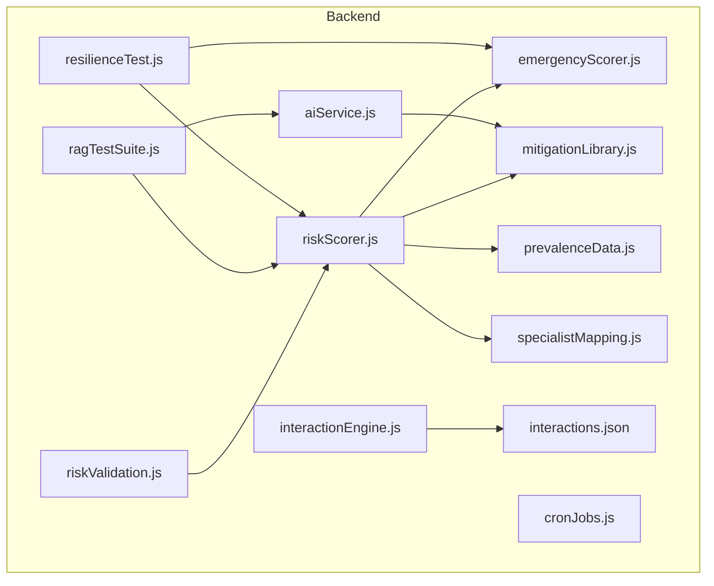
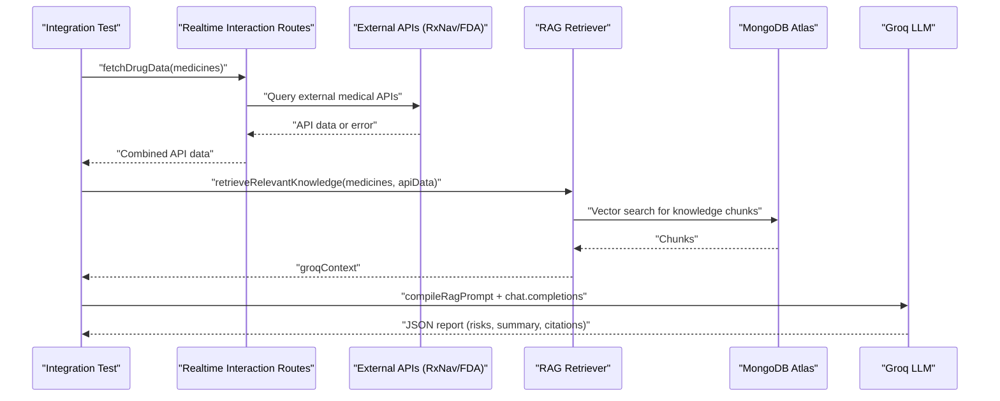
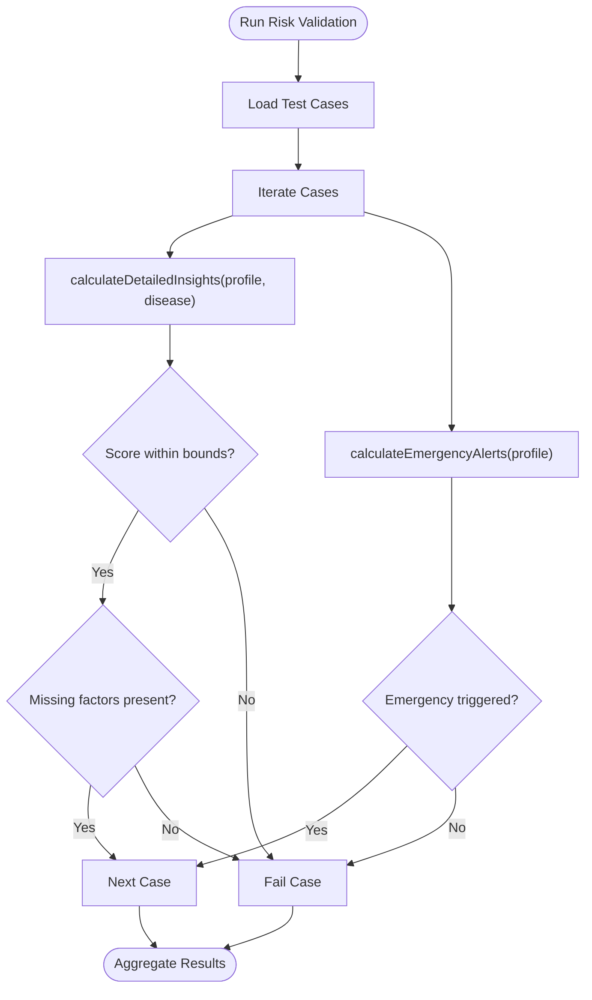
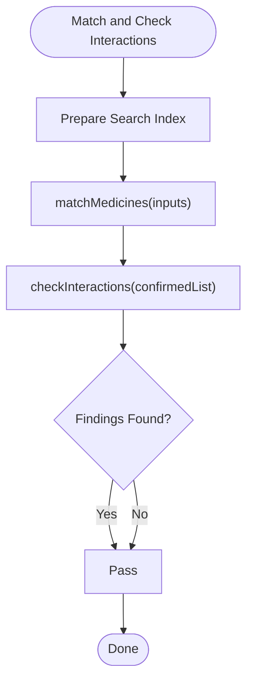
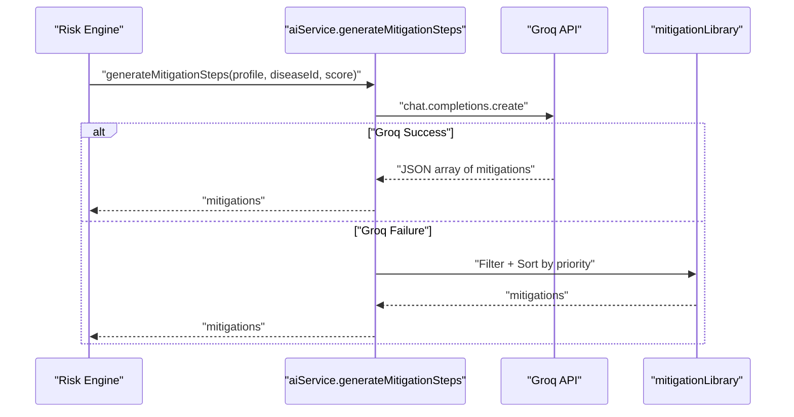
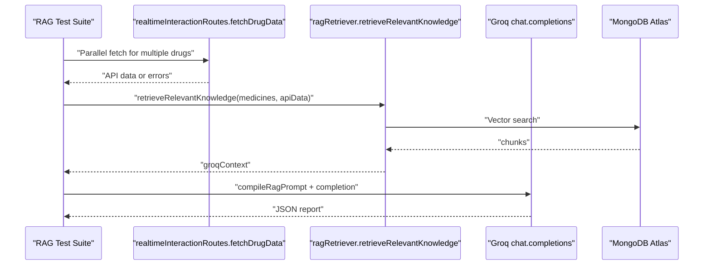
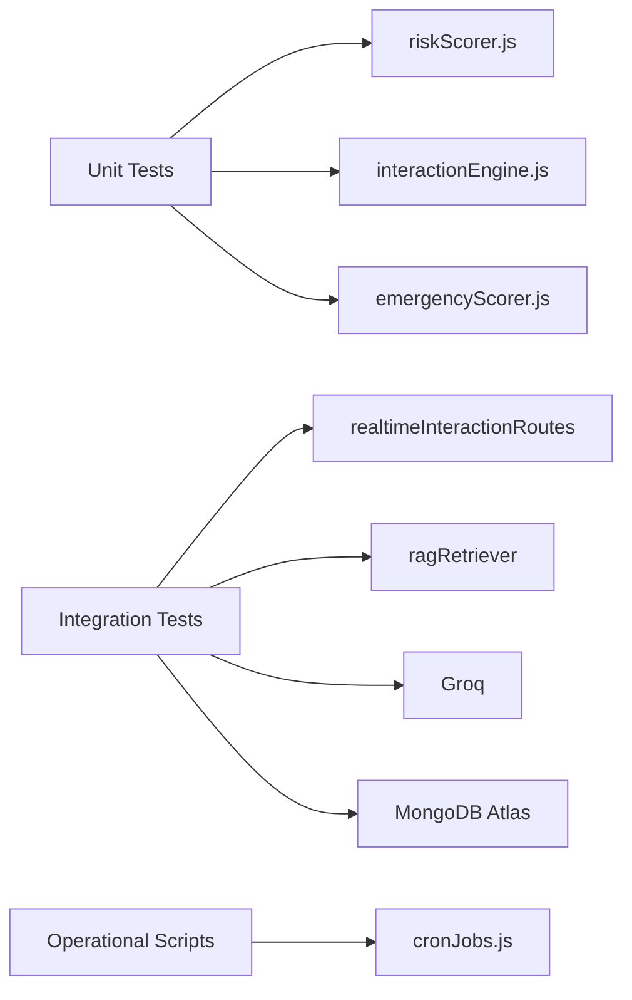

# Testing and Quality Assurance

<cite>
**Referenced Files in This Document**
- [package.json](file://backend/package.json)
- [riskScorer.js](file://backend/src/utils/riskScorer.js)
- [testRiskEngine.js](file://backend/src/utils/testRiskEngine.js)
- [riskValidation.js](file://backend/src/tests/riskValidation.js)
- [interactionEngine.js](file://backend/src/utils/interactionEngine.js)
- [emergencyScorer.js](file://backend/src/utils/emergencyScorer.js)
- [mitigationLibrary.js](file://backend/src/utils/mitigationLibrary.js)
- [prevalenceData.js](file://backend/src/utils/prevalenceData.js)
- [specialistMapping.js](file://backend/src/utils/specialistMapping.js)
- [interactions.json](file://backend/src/data/interactions.json)
- [ragTestSuite.js](file://backend/test/ragTestSuite.js)
- [resilienceTest.js](file://backend/test/resilienceTest.js)
- [aiService.js](file://backend/src/services/aiService.js)
- [cronJobs.js](file://backend/src/scripts/cronJobs.js)
</cite>

## Table of Contents
1. [Introduction](#introduction)
2. [Project Structure](#project-structure)
3. [Core Components](#core-components)
4. [Architecture Overview](#architecture-overview)
5. [Detailed Component Analysis](#detailed-component-analysis)
6. [Dependency Analysis](#dependency-analysis)
7. [Performance Considerations](#performance-considerations)
8. [Troubleshooting Guide](#troubleshooting-guide)
9. [Conclusion](#conclusion)
10. [Appendices](#appendices)

## Introduction
This document defines the testing and quality assurance strategy for VaidyaSetu. It covers unit testing for risk scoring algorithms, interaction engines, and utility functions; integration testing for API endpoints, database operations, and external service integrations; validation processes for the risk engine; performance and load testing methodologies; code quality standards; testing frameworks and mocks; continuous integration and quality gates; and guidelines for test-driven development, debugging, and profiling.

## Project Structure
The backend module includes:
- Core utilities under src/utils implementing the risk engine, interaction engine, emergency detection, mitigation library, prevalence data, and specialist mapping.
- Data under src/data containing interaction datasets.
- Tests under src/tests and backend/test for risk validation and RAG pipeline verification.
- Services under src/services integrating AI providers.
- Scripts under src/scripts for operational tasks like cron jobs.

**Diagram sources**
- [riskScorer.js:1-286](file://backend/src/utils/riskScorer.js#L1-L286)
- [interactionEngine.js:1-71](file://backend/src/utils/interactionEngine.js#L1-L71)
- [emergencyScorer.js:1-92](file://backend/src/utils/emergencyScorer.js#L1-L92)
- [mitigationLibrary.js:1-235](file://backend/src/utils/mitigationLibrary.js#L1-L235)
- [prevalenceData.js:1-88](file://backend/src/utils/prevalenceData.js#L1-L88)
- [specialistMapping.js:1-172](file://backend/src/utils/specialistMapping.js#L1-L172)
- [interactions.json:1-257](file://backend/src/data/interactions.json#L1-L257)
- [aiService.js:1-83](file://backend/src/services/aiService.js#L1-L83)
- [riskValidation.js:1-122](file://backend/src/tests/riskValidation.js#L1-L122)
- [ragTestSuite.js:1-118](file://backend/test/ragTestSuite.js#L1-L118)
- [resilienceTest.js:1-63](file://backend/test/resilienceTest.js#L1-L63)
- [cronJobs.js:1-67](file://backend/src/scripts/cronJobs.js#L1-L67)

**Section sources**
- [package.json:1-37](file://backend/package.json#L1-L37)

## Core Components
- Risk Scoring Engine: Implements evidence-based scoring, protective factors, missing data detection, emergency alerts, and mitigation selection.
- Interaction Engine: Fuzzy medicine name matching and cross-category interaction detection.
- Emergency Scorer: Critical symptom-based emergency protocol triggers aligned with Indian protocols.
- Mitigation Library: Rules-based, culturally calibrated recommendations.
- Prevalence Data: Demographic baselines and screening thresholds.
- Specialist Mapping: Specialty mapping for consultation triggers.
- AI Service: LLM-backed mitigation generation with robust fallback to the mitigation library.
- Cron Jobs: Background maintenance tasks for alerts and temporary files.

Key responsibilities:
- Unit tests validate scoring correctness, emergency detection, and mitigation selection.
- Integration tests validate API flows, database connectivity, and external provider resilience.
- Performance tests measure latency and throughput for the RAG pipeline and risk engine.

**Section sources**
- [riskScorer.js:1-286](file://backend/src/utils/riskScorer.js#L1-L286)
- [interactionEngine.js:1-71](file://backend/src/utils/interactionEngine.js#L1-L71)
- [emergencyScorer.js:1-92](file://backend/src/utils/emergencyScorer.js#L1-L92)
- [mitigationLibrary.js:1-235](file://backend/src/utils/mitigationLibrary.js#L1-L235)
- [prevalenceData.js:1-88](file://backend/src/utils/prevalenceData.js#L1-L88)
- [specialistMapping.js:1-172](file://backend/src/utils/specialistMapping.js#L1-L172)
- [aiService.js:1-83](file://backend/src/services/aiService.js#L1-L83)
- [cronJobs.js:1-67](file://backend/src/scripts/cronJobs.js#L1-L67)

## Architecture Overview
The testing architecture integrates unit-level validations with integration-level pipelines spanning real-time APIs, vector retrieval, and LLM completion.

**Diagram sources**
- [ragTestSuite.js:1-118](file://backend/test/ragTestSuite.js#L1-L118)
- [resilienceTest.js:1-63](file://backend/test/resilienceTest.js#L1-L63)

## Detailed Component Analysis

### Risk Engine Validation
The risk engine validates scoring logic, emergency sentinel triggers, and gender-specific exclusions. It ensures:
- Scores remain within expected bounds for healthy vs. high-risk profiles.
- Missing data factors are surfaced appropriately.
- Emergency alerts trigger for critical symptom pairs.
- Gender-specific conditions return N/A when inapplicable.

**Diagram sources**
- [riskValidation.js:1-122](file://backend/src/tests/riskValidation.js#L1-L122)
- [riskScorer.js:1-286](file://backend/src/utils/riskScorer.js#L1-L286)
- [emergencyScorer.js:1-92](file://backend/src/utils/emergencyScorer.js#L1-L92)

**Section sources**
- [riskValidation.js:1-122](file://backend/src/tests/riskValidation.js#L1-L122)
- [riskScorer.js:1-286](file://backend/src/utils/riskScorer.js#L1-L286)
- [emergencyScorer.js:1-92](file://backend/src/utils/emergencyScorer.js#L1-L92)

### Interaction Engine Testing
The interaction engine validates fuzzy matching and cross-category interaction detection. Tests ensure:
- Medicine names are matched with acceptable similarity thresholds.
- Interactions are detected when allopathy interacts with Ayurveda/Homeopathy.
- Edge cases handle missing aliases and unmatched inputs.

**Diagram sources**
- [interactionEngine.js:1-71](file://backend/src/utils/interactionEngine.js#L1-L71)
- [interactions.json:1-257](file://backend/src/data/interactions.json#L1-L257)

**Section sources**
- [interactionEngine.js:1-71](file://backend/src/utils/interactionEngine.js#L1-L71)
- [interactions.json:1-257](file://backend/src/data/interactions.json#L1-L257)

### Mitigation Generation and Fallback
The AI service attempts LLM-backed mitigation generation and falls back to the mitigation library when the LLM is unavailable or fails. Validation includes:
- Ensuring returned mitigations meet required fields.
- Filtering conflicts with allergies and current medications.
- Prioritizing recommendations by high/medium/low.

**Diagram sources**
- [aiService.js:1-83](file://backend/src/services/aiService.js#L1-L83)
- [mitigationLibrary.js:1-235](file://backend/src/utils/mitigationLibrary.js#L1-L235)

**Section sources**
- [aiService.js:1-83](file://backend/src/services/aiService.js#L1-L83)
- [mitigationLibrary.js:1-235](file://backend/src/utils/mitigationLibrary.js#L1-L235)

### RAG Pipeline Integration Tests
Two suites validate the RAG pipeline:
- Comprehensive test suite executes known interaction checks, measures performance, and validates accuracy.
- Resilience test verifies fallback to vector store knowledge when external APIs fail.

**Diagram sources**
- [ragTestSuite.js:1-118](file://backend/test/ragTestSuite.js#L1-L118)

**Section sources**
- [ragTestSuite.js:1-118](file://backend/test/ragTestSuite.js#L1-L118)
- [resilienceTest.js:1-63](file://backend/test/resilienceTest.js#L1-L63)

## Dependency Analysis
Testing dependencies and coupling:
- Unit tests depend on pure functions and in-memory data structures.
- Integration tests depend on external APIs, databases, and LLM providers.
- Cron jobs are operational tasks and not part of the test harness.

**Diagram sources**
- [riskScorer.js:1-286](file://backend/src/utils/riskScorer.js#L1-L286)
- [interactionEngine.js:1-71](file://backend/src/utils/interactionEngine.js#L1-L71)
- [emergencyScorer.js:1-92](file://backend/src/utils/emergencyScorer.js#L1-L92)
- [ragTestSuite.js:1-118](file://backend/test/ragTestSuite.js#L1-L118)
- [resilienceTest.js:1-63](file://backend/test/resilienceTest.js#L1-L63)
- [cronJobs.js:1-67](file://backend/src/scripts/cronJobs.js#L1-L67)

**Section sources**
- [package.json:32-35](file://backend/package.json#L32-L35)

## Performance Considerations
- Measure end-to-end latency for the RAG pipeline and risk engine calculations.
- Track average response times across multiple test cases and model fallbacks.
- Monitor database query performance and vector search efficiency.
- Validate CPU and memory usage during batch runs of integration tests.

[No sources needed since this section provides general guidance]

## Troubleshooting Guide
Common issues and resolutions:
- External API failures: The resilience test simulates RxNav/OpenFDA unavailability and verifies fallback to vector store knowledge.
- LLM rate limits or errors: The RAG suite includes fallback to a smaller model and graceful degradation.
- Data completeness: Risk validation surfaces missing factors to guide user input collection.
- Cron job failures: Review logs for scheduling and filesystem cleanup errors.

**Section sources**
- [resilienceTest.js:1-63](file://backend/test/resilienceTest.js#L1-L63)
- [ragTestSuite.js:1-118](file://backend/test/ragTestSuite.js#L1-L118)
- [riskValidation.js:1-122](file://backend/src/tests/riskValidation.js#L1-L122)
- [cronJobs.js:1-67](file://backend/src/scripts/cronJobs.js#L1-L67)

## Conclusion
The testing strategy combines targeted unit validations for risk scoring, interaction detection, and mitigation generation with robust integration tests for API flows, database operations, and external service resilience. The documented procedures enable reliable validation, performance measurement, and continuous quality assurance.

[No sources needed since this section summarizes without analyzing specific files]

## Appendices

### Testing Frameworks and Mocks
- Unit testing framework: Jest (installed as dev dependency).
- HTTP assertion and mocking: Supertest (installed as dev dependency).
- Mock strategies:
  - Risk engine: Use controlled input profiles and disease lists to assert deterministic outputs.
  - Interaction engine: Provide known medicine names and aliases to validate fuzzy matching and interaction detection.
  - Emergency scorer: Construct profiles with critical symptom combinations to assert emergency triggers.
  - AI service: Disable LLM to force fallback to the mitigation library; simulate LLM errors to verify fallback behavior.
  - RAG pipeline: Configure environment variables to simulate API failures and verify vector store fallback.

**Section sources**
- [package.json:32-35](file://backend/package.json#L32-L35)
- [testRiskEngine.js:1-53](file://backend/src/utils/testRiskEngine.js#L1-L53)
- [aiService.js:1-83](file://backend/src/services/aiService.js#L1-L83)

### Static Analysis and Code Quality Standards
- Enforce linting and formatting standards using ESLint and Prettier.
- Maintain a strict policy on:
  - Function purity for core utilities.
  - Explicit error handling and logging.
  - Input validation and defensive programming.
  - Minimal coupling between modules.
- Use type annotations and schema validation for runtime safety where applicable.

[No sources needed since this section provides general guidance]

### Continuous Integration and Quality Gates
- Automated regression testing: Execute unit and integration tests on every commit.
- Quality gates:
  - Minimum test coverage thresholds for core modules.
  - Zero failures in risk validation and RAG resilience tests.
  - Latency SLAs for LLM and database operations.
- Branch protection: Require passing tests and approvals before merging.

[No sources needed since this section provides general guidance]

### Test-Driven Development Guidelines
- Write unit tests before implementing core logic for risk scoring and interaction detection.
- Define clear acceptance criteria for emergency triggers and mitigation prioritization.
- Model test scenarios around real-world user profiles and edge cases.
- Refactor incrementally with continuous validation.

[No sources needed since this section provides general guidance]

### Debugging and Profiling Techniques
- Use structured logging to trace execution paths in risk scoring and RAG retrieval.
- Profile LLM completion latency and vector search performance.
- Instrument cron jobs to capture timing and error metrics.
- Employ environment flags to simulate failures and validate fallback behavior.

[No sources needed since this section provides general guidance]

### Maintaining Test Coverage and Reliability
- Track and report coverage for riskScorer, interactionEngine, emergencyScorer, and aiService.
- Regularly update test cases to reflect new diseases, interactions, and guidelines.
- Maintain a living document of known edge cases and remediations.

[No sources needed since this section provides general guidance]