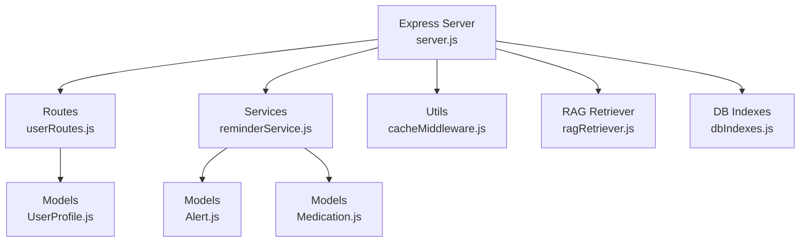
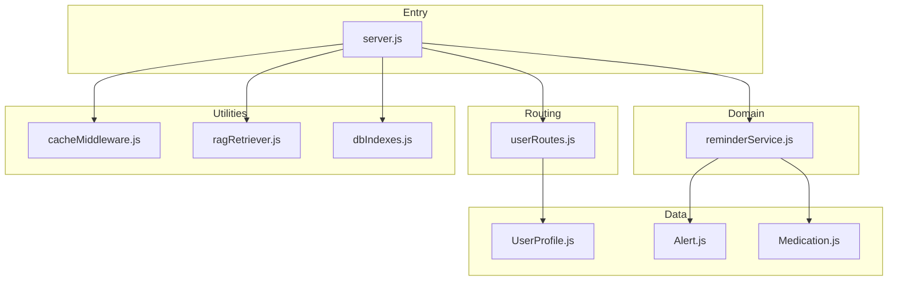
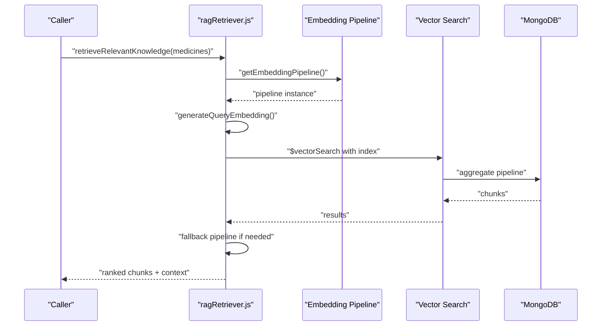
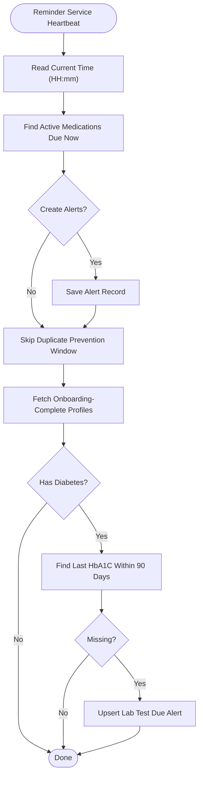

# Troubleshooting and Maintenance

<cite>
**Referenced Files in This Document**
- [server.js](file://backend/server.js)
- [package.json](file://backend/package.json)
- [README.md](file://README.md)
- [userRoutes.js](file://backend/src/routes/userRoutes.js)
- [UserProfile.js](file://backend/src/models/UserProfile.js)
- [reminderService.js](file://backend/src/services/reminderService.js)
- [dbIndexes.js](file://backend/src/scripts/dbIndexes.js)
- [cacheMiddleware.js](file://backend/src/utils/cacheMiddleware.js)
- [ragRetriever.js](file://backend/src/utils/ragRetriever.js)
- [Alert.js](file://backend/src/models/Alert.js)
- [Medication.js](file://backend/src/models/Medication.js)
</cite>

## Table of Contents
1. [Introduction](#introduction)
2. [Project Structure](#project-structure)
3. [Core Components](#core-components)
4. [Architecture Overview](#architecture-overview)
5. [Detailed Component Analysis](#detailed-component-analysis)
6. [Dependency Analysis](#dependency-analysis)
7. [Performance Considerations](#performance-considerations)
8. [Troubleshooting Guide](#troubleshooting-guide)
9. [Backup and Recovery](#backup-and-recovery)
10. [Monitoring and Logging](#monitoring-and-logging)
11. [Maintenance Procedures](#maintenance-procedures)
12. [Escalation and Support](#escalation-and-support)
13. [Conclusion](#conclusion)

## Introduction
This document provides comprehensive troubleshooting and maintenance guidance for VaidyaSetu’s backend. It covers database connectivity, API integration, performance bottlenecks, deployment issues, monitoring/logging/alerting, database maintenance, backups, disaster recovery, performance optimization, debugging workflows, and operational procedures. The content is grounded in the repository’s backend implementation and focuses on practical, actionable steps for production stability and reliability.

## Project Structure
The backend is an Express server with Mongoose-based MongoDB models, modular route handlers, utility modules for AI/ML retrieval, caching, and periodic services. Key areas for maintenance and troubleshooting include:
- Express server bootstrap and health endpoint
- Route modules for user/profile and related domains
- Mongoose models for user data, alerts, medications, and vitals
- Reminder service for periodic tasks
- Caching middleware for response caching
- RAG retrieval pipeline for knowledge search
- Database indexing script for performance tuning

**Diagram sources**
- [server.js:1-94](file://backend/server.js#L1-L94)
- [userRoutes.js:1-101](file://backend/src/routes/userRoutes.js#L1-L101)
- [reminderService.js:1-84](file://backend/src/services/reminderService.js#L1-L84)
- [cacheMiddleware.js:1-43](file://backend/src/utils/cacheMiddleware.js#L1-L43)
- [ragRetriever.js:1-218](file://backend/src/utils/ragRetriever.js#L1-L218)
- [UserProfile.js:1-175](file://backend/src/models/UserProfile.js#L1-L175)
- [Alert.js:1-48](file://backend/src/models/Alert.js#L1-L48)
- [Medication.js:1-46](file://backend/src/models/Medication.js#L1-L46)
- [dbIndexes.js:1-34](file://backend/src/scripts/dbIndexes.js#L1-L34)

**Section sources**
- [server.js:1-94](file://backend/server.js#L1-L94)
- [package.json:1-37](file://backend/package.json#L1-L37)
- [README.md:1-31](file://README.md#L1-L31)

## Core Components
- Express server initializes CORS, JSON parsing, connects to MongoDB, mounts routes, exposes a health endpoint, starts background services, and performs a RAG engine integrity check.
- Route modules handle user onboarding, account deletion, and related domain endpoints.
- Mongoose models define user profiles, alerts, medications, and vitals with indexed fields for efficient queries.
- Reminder service periodically creates alerts for medications and lab tests.
- Caching middleware caches successful GET responses globally with TTL.
- RAG retriever orchestrates vector search, fallbacks, filtering, and prompt construction for multi-drug interaction insights.
- DB indexing script defines compound indexes for alerts, vitals, and profiles.

**Section sources**
- [server.js:1-94](file://backend/server.js#L1-L94)
- [userRoutes.js:1-101](file://backend/src/routes/userRoutes.js#L1-L101)
- [UserProfile.js:1-175](file://backend/src/models/UserProfile.js#L1-L175)
- [reminderService.js:1-84](file://backend/src/services/reminderService.js#L1-L84)
- [cacheMiddleware.js:1-43](file://backend/src/utils/cacheMiddleware.js#L1-L43)
- [ragRetriever.js:1-218](file://backend/src/utils/ragRetriever.js#L1-L218)
- [dbIndexes.js:1-34](file://backend/src/scripts/dbIndexes.js#L1-L34)

## Architecture Overview
The backend follows a layered architecture:
- Entry point: Express server
- Routing: Modular route handlers
- Domain logic: Services (e.g., reminders)
- Data access: Mongoose models
- Utilities: Caching, RAG retrieval
- Background tasks: Cron jobs and reminder heartbeat

**Diagram sources**
- [server.js:1-94](file://backend/server.js#L1-L94)
- [userRoutes.js:1-101](file://backend/src/routes/userRoutes.js#L1-L101)
- [reminderService.js:1-84](file://backend/src/services/reminderService.js#L1-L84)
- [cacheMiddleware.js:1-43](file://backend/src/utils/cacheMiddleware.js#L1-L43)
- [ragRetriever.js:1-218](file://backend/src/utils/ragRetriever.js#L1-L218)
- [dbIndexes.js:1-34](file://backend/src/scripts/dbIndexes.js#L1-L34)
- [UserProfile.js:1-175](file://backend/src/models/UserProfile.js#L1-L175)
- [Alert.js:1-48](file://backend/src/models/Alert.js#L1-L48)
- [Medication.js:1-46](file://backend/src/models/Medication.js#L1-L46)

## Detailed Component Analysis

### Database Connectivity and Health
- MongoDB connection is established at startup and emits connection status logs.
- Health endpoint reports backend status and DB readiness.
- Integrity check validates the RAG retriever module loads successfully.

Common issues:
- Connection string misconfiguration
- Network restrictions or firewall blocking Atlas
- Authentication failures or expired credentials
- Replica set/network timeouts

Resolution steps:
- Verify environment variable for MongoDB URI.
- Confirm network access to Atlas and allowlist IPs.
- Validate credentials and permissions.
- Use health endpoint to confirm DB readiness.

**Section sources**
- [server.js:40-75](file://backend/server.js#L40-L75)

### API Integration Failures
- Routes are mounted under /api/* prefixes.
- Onboarding route requires a user identifier and persists structured profile data.
- Account deletion route purges user-related collections atomically via Promise.all.

Common issues:
- Missing required identifiers in requests
- Unauthorized or malformed payloads
- Database write errors during onboarding or deletion

Resolution steps:
- Ensure requests include required fields (e.g., user identifier).
- Validate payload structure against model expectations.
- Inspect route-level error logs for stack traces.

**Section sources**
- [server.js:45-66](file://backend/server.js#L45-L66)
- [userRoutes.js:10-80](file://backend/src/routes/userRoutes.js#L10-L80)
- [userRoutes.js:82-98](file://backend/src/routes/userRoutes.js#L82-L98)

### Performance Bottlenecks
- Caching middleware caches successful GET responses globally with a standard TTL.
- RAG retriever uses vector search with fallbacks and limits candidates/returns.
- Reminder service runs a periodic heartbeat to create alerts.

Common issues:
- Cache misses due to non-GET requests or unsuccessful responses
- Slow vector search due to insufficient indexes or large candidate sets
- High CPU usage from repeated embedding generation

Resolution steps:
- Confirm caching middleware applies only to GET requests and successful responses.
- Review and expand indexes for collections used in vector search and alerts.
- Monitor reminder service logs for execution errors and adjust intervals.

**Section sources**
- [cacheMiddleware.js:1-43](file://backend/src/utils/cacheMiddleware.js#L1-L43)
- [ragRetriever.js:25-72](file://backend/src/utils/ragRetriever.js#L25-L72)
- [reminderService.js:11-81](file://backend/src/services/reminderService.js#L11-L81)

### Deployment Issues
- Startup script runs the Express server.
- Environment variables are loaded via dotenv.
- Manual steps for enabling Google APIs and OAuth credentials are documented.

Common issues:
- Missing environment variables
- Port conflicts
- Missing optional Google API credentials impacting optional features

Resolution steps:
- Load environment variables before starting the server.
- Choose a non-conflicting port or configure reverse proxy.
- Enable required Google APIs and configure OAuth as per manual steps.

**Section sources**
- [package.json:5-7](file://backend/package.json#L5-L7)
- [server.js:1-34](file://backend/server.js#L1-L34)
- [README.md:8-14](file://README.md#L8-L14)

### RAG Retrieval Pipeline
The RAG retriever:
- Lazily initializes an embedding pipeline
- Generates embeddings for queries
- Performs vector search with a fallback pipeline
- Filters and ranks chunks, extracts interaction mentions, and prepares a Groq context

Common issues:
- Vector index missing or misconfigured
- Embedding pipeline initialization failures
- Aggregation pipeline errors

Resolution steps:
- Ensure Atlas vector index exists and is named as expected.
- Validate embedding model availability and network access.
- Check aggregation stages and fallback logic.

**Diagram sources**
- [ragRetriever.js:9-72](file://backend/src/utils/ragRetriever.js#L9-L72)
- [ragRetriever.js:156-215](file://backend/src/utils/ragRetriever.js#L156-L215)

**Section sources**
- [ragRetriever.js:1-218](file://backend/src/utils/ragRetriever.js#L1-L218)

### Reminder Service
The reminder service:
- Runs a periodic heartbeat to check due medications and lab tests
- Creates alerts for overdue medications and missing lab tests
- Uses simple checks to avoid duplicate alerts within a window

Common issues:
- Incorrect timing formats or timezones
- Missing or stale profile/test data
- Database write errors for alerts

Resolution steps:
- Verify timing formats and timezone settings.
- Ensure profiles and lab results are populated.
- Inspect reminder service logs for errors.

**Diagram sources**
- [reminderService.js:11-81](file://backend/src/services/reminderService.js#L11-L81)

**Section sources**
- [reminderService.js:1-84](file://backend/src/services/reminderService.js#L1-L84)

### Caching Strategy
The caching middleware:
- Intercepts GET requests and serves cached responses if present
- Caches successful responses globally with a TTL
- Prevents caching for non-GET or unsuccessful responses

Common issues:
- Non-GET requests bypass cache
- Successful responses not cached due to status checks
- Cache invalidation gaps

Resolution steps:
- Ensure GET requests and successful responses meet caching criteria.
- Adjust TTL based on data volatility.
- Monitor cache hit rates and tune durations.

**Section sources**
- [cacheMiddleware.js:1-43](file://backend/src/utils/cacheMiddleware.js#L1-L43)

### Database Indexes and Maintenance
The indexing script:
- Creates compound indexes for alerts (clerkId + status), vitals (clerkId + timestamp), and profiles (clerkId)
- Includes an index on creation time for expiry processing

Common issues:
- Missing indexes causing slow queries
- Index build conflicts or timeouts
- Outdated or redundant indexes

Resolution steps:
- Run the indexing script after schema updates or on deployment.
- Monitor slow queries and add targeted indexes.
- Periodically review and remove unused indexes.

**Section sources**
- [dbIndexes.js:1-34](file://backend/src/scripts/dbIndexes.js#L1-L34)

## Dependency Analysis
External dependencies relevant to operations:
- Express for routing and middleware
- Mongoose for MongoDB ODM
- Node-cache for in-memory caching
- Rate limiting and CORS for API protection and cross-origin access
- AI/ML libraries for embeddings and vector search
- OCR and image processing libraries for document handling

Operational implications:
- Ensure dependency versions align with security patches.
- Monitor resource usage of ML pipelines and OCR processing.
- Validate API rate limits and CORS policies.

**Section sources**
- [package.json:13-31](file://backend/package.json#L13-L31)

## Performance Considerations
- Use the caching middleware for static/idempotent endpoints.
- Apply compound indexes for frequent query patterns (alerts, vitals, profiles).
- Limit vector search candidates and returned chunks to balance latency and recall.
- Monitor reminder service execution and adjust intervals.
- Track DB connection readiness via the health endpoint.

[No sources needed since this section provides general guidance]

## Troubleshooting Guide

### Database Connectivity Problems
Symptoms:
- MongoDB connection errors at startup
- Health endpoint reports disconnected DB

Actions:
- Verify MongoDB URI and credentials.
- Check network access to Atlas and IP allowlists.
- Restart the server after fixing credentials.

**Section sources**
- [server.js:40-43](file://backend/server.js#L40-L43)
- [server.js:68-75](file://backend/server.js#L68-L75)

### API Integration Failures
Symptoms:
- Onboarding route returns validation errors
- Account deletion fails partway

Actions:
- Confirm presence of required identifiers in requests.
- Inspect route error logs for stack traces.
- Retry deletions after ensuring data consistency.

**Section sources**
- [userRoutes.js:16-18](file://backend/src/routes/userRoutes.js#L16-L18)
- [userRoutes.js:76-80](file://backend/src/routes/userRoutes.js#L76-L80)
- [userRoutes.js:94-98](file://backend/src/routes/userRoutes.js#L94-L98)

### Performance Bottlenecks
Symptoms:
- Slow response times for RAG queries
- Cache misses for frequently accessed endpoints

Actions:
- Review and apply database indexes.
- Increase cache TTL for stable endpoints.
- Reduce vector search candidates and tune fallback thresholds.

**Section sources**
- [dbIndexes.js:17-25](file://backend/src/scripts/dbIndexes.js#L17-L25)
- [cacheMiddleware.js:10-36](file://backend/src/utils/cacheMiddleware.js#L10-L36)
- [ragRetriever.js:36-71](file://backend/src/utils/ragRetriever.js#L36-L71)

### Deployment Issues
Symptoms:
- Server fails to start due to missing environment variables
- Port conflicts or Google API credential errors

Actions:
- Load environment variables before starting the server.
- Choose a non-conflicting port.
- Enable required Google APIs and configure OAuth credentials.

**Section sources**
- [server.js:1-34](file://backend/server.js#L1-L34)
- [README.md:8-14](file://README.md#L8-L14)

### RAG Retrieval Failures
Symptoms:
- Vector search errors or empty results
- Embedding pipeline initialization failures

Actions:
- Confirm Atlas vector index exists and is named correctly.
- Validate network access for model downloads.
- Inspect fallback pipeline logs.

**Section sources**
- [ragRetriever.js:36-71](file://backend/src/utils/ragRetriever.js#L36-L71)
- [server.js:84-92](file://backend/server.js#L84-L92)

### Reminder Service Errors
Symptoms:
- Missing medication or lab test alerts
- Errors logged by the reminder service

Actions:
- Verify timing formats and timezones.
- Ensure profiles and lab results are populated.
- Inspect reminder service logs for exceptions.

**Section sources**
- [reminderService.js:11-81](file://backend/src/services/reminderService.js#L11-L81)

### Caching Issues
Symptoms:
- Frequent cache misses
- Stale responses

Actions:
- Ensure GET requests and successful responses are cached.
- Adjust TTL based on data volatility.
- Monitor cache hit rates.

**Section sources**
- [cacheMiddleware.js:10-36](file://backend/src/utils/cacheMiddleware.js#L10-L36)

## Backup and Recovery
Backup strategy:
- Use MongoDB Atlas automated backups for point-in-time recovery.
- Export collections for critical data (profiles, alerts, medications) periodically.
- Store backups offsite and encrypt sensitive data.

Recovery procedure:
- Restore from latest backup to a staging environment.
- Validate data integrity and run smoke tests.
- Switch traffic after confirming recovery success.

Disaster recovery planning:
- Define RTO/RPO targets for critical data.
- Automate backups and test restoration regularly.
- Maintain runbooks for common failure scenarios.

[No sources needed since this section provides general guidance]

## Monitoring and Logging
Monitoring and logging strategies:
- Centralized logs for the Express server and background services.
- Health endpoint for basic liveness/readiness checks.
- Database connection state monitoring.
- Cache hit ratio and TTL metrics.
- Vector search latency and fallback triggers.
- Reminder service execution logs.

Error tracking and alerting:
- Log structured errors with context and correlation IDs.
- Integrate with an error tracking platform (e.g., Sentry).
- Configure alerts for sustained DB disconnections, cache failures, and service outages.

**Section sources**
- [server.js:68-75](file://backend/server.js#L68-L75)
- [reminderService.js:17](file://backend/src/services/reminderService.js#L17)
- [cacheMiddleware.js:21](file://backend/src/utils/cacheMiddleware.js#L21)
- [ragRetriever.js:55](file://backend/src/utils/ragRetriever.js#L55)

## Maintenance Procedures
Routine maintenance:
- Apply database indexes after schema changes.
- Rotate and audit environment variables and secrets.
- Review and prune old alerts and expired records.

Update procedures:
- Perform blue-green deployments or rolling restarts.
- Validate health endpoint post-update.
- Monitor logs and metrics for regressions.

System health checks:
- Daily checks of DB connectivity, cache, and reminder service.
- Weekly reviews of vector search performance and fallback usage.
- Monthly audits of backup integrity and restoration drills.

**Section sources**
- [dbIndexes.js:5-31](file://backend/src/scripts/dbIndexes.js#L5-L31)
- [server.js:77-93](file://backend/server.js#L77-L93)

## Escalation and Support
Escalation procedures:
- Tier 1: On-call engineer monitors health endpoint and logs.
- Tier 2: Database and API specialists investigate connectivity and performance.
- Tier 3: Platform and infrastructure teams for environment issues.

Support resources:
- Internal runbooks for troubleshooting common issues.
- Contact channels for vendor-specific support (e.g., MongoDB Atlas).
- Community forums for open-source dependencies.

[No sources needed since this section provides general guidance]

## Conclusion
This guide consolidates practical troubleshooting and maintenance practices for VaidyaSetu’s backend. By validating database connectivity, monitoring API health, applying database indexes, leveraging caching, and maintaining robust logging/alerting, teams can sustain reliable operations. Regular maintenance, backups, and DR testing further strengthen resilience. Use the referenced components and procedures to diagnose and resolve issues efficiently.