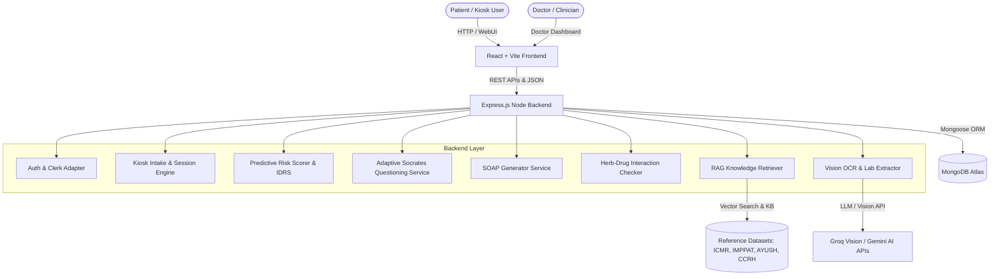

# VaidyaSetu (वैद्यसेतु) - Full Project Documentation

> **AI-Powered Integrative Health Platform & Early Disease Risk Assessment System**  
> *Bridging Allopathy, Ayurveda, and Homeopathy with Modern Machine Intelligence*

---

## 📋 Table of Contents

1. [Executive Summary & Mission](#-executive-summary--mission)
2. [System Architecture Overview](#-system-architecture-overview)
3. [Key Modules & Features](#-key-modules--features)
   - [1. Smart Kiosk Intake & Pre-Consultation](#1-smart-kiosk-intake--pre-consultation)
   - [2. Adaptive Socrates AI Clinical Assistant](#2-adaptive-socrates-ai-clinical-assistant)
   - [3. Clinical Doctor Dashboard & Auto-SOAP Generation](#3-clinical-doctor-dashboard--auto-soap-generation)
   - [4. Predictive Disease Risk Engine (18+ Conditions)](#4-predictive-disease-risk-engine-18-conditions)
   - [5. Cross-System Drug & Herb Interaction Checker](#5-cross-system-drug--herb-interaction-checker)
   - [6. Lab Report Analysis & Vision OCR](#6-lab-report-analysis--vision-ocr)
   - [7. Multilingual Support (13+ Languages)](#7-multilingual-support-13-languages)
4. [Technology Stack](#-technology-stack)
5. [Directory & File Structure](#-directory--file-structure)
6. [API Routes & Endpoint Reference](#-api-routes--endpoint-reference)
7. [Database Schema & Models](#-database-schema--models)
8. [Clinical Knowledge Base & RAG Architecture](#-clinical-knowledge-base--rag-architecture)
9. [Installation & Getting Started](#-installation--getting-started)
10. [Database Seeding & Test Scripts](#-database-seeding--test-scripts)

---

## 🎯 Executive Summary & Mission

**VaidyaSetu (वैद्यsetu)** is an advanced digital healthcare platform engineered to bridge the gap between traditional Indian medical systems (**AYUSH**: Ayurveda, Yoga, Unani, Siddha, Homeopathy) and modern **Allopathic medicine**. 

### Primary Goals:
- **Early Disease Detection**: Evaluate individual risk across 18+ major health conditions before acute symptom onset using evidence-based algorithms (such as the **Indian Diabetes Risk Score - IDRS** and Likelihood Ratio models).
- **Streamlined Pre-Consultation**: Enable patient self-service kiosks at clinics to capture biometrics, symptoms, and dynamic follow-up answers before seeing the physician.
- **Automated Clinical Workflow**: Generate structured **SOAP Notes** (Subjective, Objective, Assessment, Plan) and triage risk scores automatically for doctors, reducing patient intake overhead by up to 70%.
- **Cross-System Safety**: Prevent dangerous adverse interactions between modern pharmaceuticals (e.g., Lisinopril, Metformin) and traditional herbal remedies (e.g., Tulsi, Ashwagandha, Curcumin) using curated dataset mappings (IMPPAT, AYUSH, CCRH).

---

## 🏗️ System Architecture Overview



---

## 🚀 Key Modules & Features

### 1. Smart Kiosk Intake & Pre-Consultation
- **Location**: `frontend/src/pages/KioskIntake.jsx`, `backend/src/routes/kioskRoutes.js`
- Walk-up patient interface for clinics and health centers.
- Step-by-step biometric logging: Blood Pressure, SpO2, Heart Rate, Blood Sugar, Temperature, BMI, and Chief Complaints.
- Real-time patient queue insertion (`backend/seed_kiosk_queue.js`).

### 2. Adaptive Socrates AI Clinical Assistant
- **Location**: `backend/src/services/adaptiveSocratesService.js`
- Dynamically generates clinical follow-up questions tailored to the patient's reported symptoms using medical diagnostic frameworks.
- Adapts question depth based on risk signals and severity indicators.

### 3. Clinical Doctor Dashboard & Auto-SOAP Generation
- **Location**: `frontend/src/pages/DoctorDashboard.jsx`, `backend/src/services/soapGeneratorService.js`
- Displays live patient queue sorted by severity and emergency flags.
- Automatically compiles pre-consultation intake data into a standardized **SOAP Note**:
  - **Subjective**: Patient complaints, history, and Socrates QA responses.
  - **Objective**: Recorded vitals, lab reports, and biometrics.
  - **Assessment**: AI predictive risk scores and differential risk categories.
  - **Plan**: Recommended diagnostic tests, integrative lifestyle/dietary guidance, and safety flags.

### 4. Predictive Disease Risk Engine (18+ Conditions)
- **Location**: `backend/src/utils/riskScorer.js`, `backend/src/services/predictiveRiskAiService.js`
- Multi-factor risk scoring covering 18+ health conditions:
  - **Diabetes Mellitus** (Calculated via Indian Diabetes Risk Score - IDRS)
  - **Hypertension & Cardiovascular Diseases**
  - **Iron Deficiency Anemia**
  - **Thyroid Dysfunction** (Hypo/Hyperthyroidism via Likelihood Ratios)
  - **Respiratory Conditions** (Asthma, COPD indicators)
  - **PCOS / Women's Hormonal Health**
  - **Chronic Kidney Disease (CKD)**
  - **Mental Health & Anxiety Risk**
- Incorporates baseline Indian epidemiological prevalence data (`prevalenceData.js`), demographic factors, waist circumference, physical activity, and family history.

### 5. Cross-System Drug & Herb Interaction Checker
- **Location**: `backend/src/utils/interactionChecker.js`, `backend/src/routes/interactionRoutes.js`
- Cross-references allopathic prescriptions with traditional Ayurvedic/Homeopathic supplements.
- Identifies critical, moderate, and mild interactions (e.g., Lisinopril + Tulsi potentiation, Metformin + Karela hypoglycemic risk).
- Powered by the **IMPPAT Database** (`reference_data/IMPPAT_Herb_Drug_Interactions.csv`).

### 6. Lab Report Analysis & Vision OCR
- **Location**: `backend/src/routes/ocrRoutes.js`, `backend/src/services/visionOcr.js`
- Upload patient lab reports (blood panels, HbA1c, lipid profiles, CBC).
- Extracts structured quantitative values using OCR/Vision processing and highlights out-of-bound lab ranges automatically.

### 7. Multilingual Support (13+ Languages)
- **Location**: `frontend/src/i18n.js`, `frontend/src/locales/`
- Full localization for 13 regional Indian languages: Assamese (`as`), Bengali (`bn`), English (`en`), Gujarati (`gu`), Hindi (`hi`), Kannada (`kn`), Malayalam (`ml`), Marathi (`mr`), Odia (`or`), Punjabi (`pa`), Tamil (`ta`), Telugu (`te`), Urdu (`ur`).

---

## 🛠️ Technology Stack

| Layer | Technologies Used |
| :--- | :--- |
| **Frontend Framework** | React 18, Vite |
| **UI & Styling** | Vanilla CSS Design Tokens, Lucide Icons, Recharts, 3D Body Scan Viewer |
| **Localization** | i18next, react-i18next |
| **Authentication** | Custom Auth Gateway & Clerk Adapter (`clerkAdapter.jsx`) |
| **Backend Runtime** | Node.js (v18+) |
| **API Framework** | Express.js |
| **Database** | MongoDB Atlas with Mongoose ORM |
| **AI / LLM Integration** | Groq Vision, Google Gemini 1.5/2.0 API, Adaptive Socrates AI |
| **RAG / Vector Search** | Hybrid Keyword & Vector Search against Clinical Datasets |

---

## 📁 Directory & File Structure

```
VaidyaSetu/
├── VAIDYASETU_ALGORITHMS.txt     # Complete algorithmic formulas & mathematical weights
├── bundle_source.bat            # One-click batch utility to bundle source code
├── full_source_code.txt         # Bundled full source code text file
├── PROJECT_DOCUMENTATION.md     # Full markdown documentation (This file)
│
├── backend/
│   ├── server.js                # Express server entry point & middleware registration
│   ├── seed_demo_user.js        # Seed script for demo patient profile
│   ├── seed_kiosk_queue.js      # Seed script for kiosk doctor queue
│   ├── seed_drug_mappings.js    # Seed script for herb-drug interaction mappings
│   │
│   ├── src/
│   │   ├── models/              # Mongoose DB Models
│   │   │   ├── UserProfile.js
│   │   │   ├── IntakeSession.js
│   │   │   ├── Vital.js
│   │   │   ├── Medication.js
│   │   │   ├── DrugMapping.js
│   │   │   ├── Alert.js
│   │   │   └── ...
│   │   ├── routes/              # Express API Route Handlers
│   │   │   ├── authRoutes.js
│   │   │   ├── kioskRoutes.js
│   │   │   ├── aiRoutes.js
│   │   │   ├── interactionRoutes.js
│   │   │   ├── profileRoutes.js
│   │   │   ├── vitalsRoutes.js
│   │   │   ├── ocrRoutes.js
│   │   │   └── ...
│   │   ├── services/            # Business Logic & AI Services
│   │   │   ├── adaptiveSocratesService.js
│   │   │   ├── soapGeneratorService.js
│   │   │   ├── predictiveRiskAiService.js
│   │   │   ├── groqVision.js
│   │   │   └── ...
│   │   └── utils/               # Scoring & Utility Libraries
│   │       ├── riskScorer.js
│   │       ├── interactionChecker.js
│   │       ├── emergencyScorer.js
│   │       ├── ragRetriever.js
│   │       └── prevalenceData.js
│   │
│   └── test/                    # Integration & Unit Tests
│       ├── test_phase1.js
│       ├── test_phase3.js
│       ├── test_phase4.js
│       └── test_pre_consultation.js
│
├── frontend/
│   ├── index.html
│   ├── vite.config.js
│   ├── package.json
│   ├── src/
│   │   ├── App.jsx              # Main React application shell & routes
│   │   ├── main.jsx             # React DOM root entry
│   │   ├── i18n.js              # Multi-language configuration
│   │   ├── auth/                # Clerk & custom authentication adapter
│   │   ├── components/          # Reusable UI Components
│   │   │   ├── Sidebar.jsx
│   │   │   ├── Chatbot.jsx
│   │   │   ├── BodyScan3D.jsx
│   │   │   ├── VitalsCharts.jsx
│   │   │   └── disease-cards/
│   │   ├── context/             # React Context Providers (AuthContext, ThemeContext)
│   │   ├── pages/               # Application Views / Pages
│   │   │   ├── KioskIntake.jsx  # Smart Patient Kiosk
│   │   │   ├── DoctorDashboard.jsx # Clinician View
│   │   │   ├── Dashboard.jsx    # Patient Dashboard
│   │   │   ├── AuthGateway.jsx  # Login / Signup
│   │   │   ├── HealthProfile.jsx
│   │   │   ├── Vitals.jsx
│   │   │   ├── Prescriptions.jsx
│   │   │   └── onboarding/      # 7-Step Health Questionnaire
│   │   └── locales/             # i18n JSON translations (13 languages)
│   
└── reference_data/              # Clinical Datasets
    ├── AYUSH_Herb_Nomenclature.txt
    ├── CCRH_Homeopathy_Indications.txt
    ├── ICMR_Anemia_Guidelines.txt
    ├── ICMR_Diabetes_Guidelines.txt
    └── IMPPAT_Herb_Drug_Interactions.csv
```

---

## 🔌 API Routes & Endpoint Reference

### 🔐 Authentication (`/api/auth`)
- `POST /api/auth/login` - Authenticate user credentials.
- `POST /api/auth/register` - Create a new patient or doctor account.
- `GET /api/auth/me` - Fetch current user session payload.

### 🏥 Kiosk & Intake (`/api/kiosk`)
- `POST /api/kiosk/session/start` - Initialize a new kiosk intake session.
- `POST /api/kiosk/session/step` - Update biometrics, vitals, or symptoms for current step.
- `POST /api/kiosk/session/socrates-qa` - Submit Socrates response and retrieve next dynamic follow-up question.
- `POST /api/kiosk/session/complete` - Finalize intake, generate SOAP note, and append patient to doctor queue.
- `GET /api/kiosk/queue` - Fetch live doctor queue with priority flags.

### 🤖 AI Services & SOAP (`/api/ai`)
- `POST /api/ai/generate-soap` - Manually trigger SOAP note generation for a patient session.
- `POST /api/ai/predictive-risk` - Calculate comprehensive multi-disease risk profile.
- `POST /api/ai/rag-query` - Query clinical vector storage for medical guidelines.

### 💊 Herb-Drug Interactions (`/api/interactions`)
- `POST /api/interactions/check` - Evaluate potential adverse interactions between listed pharmaceuticals and herbal remedies.
- `GET /api/interactions/herb-info/:name` - Retrieve botanical nomenclature and active compound data.

### 📊 Vitals & Profile (`/api/vitals`, `/api/profile`)
- `GET /api/vitals/history` - Retrieve historical vitals time-series.
- `POST /api/vitals/log` - Record new vital readings.
- `GET /api/profile` - Get user biometrics, medical history, and lifestyle factors.
- `PUT /api/profile` - Update user health profile.

---

## 🗄️ Database Schema & Models

### 1. `UserProfile` (`backend/src/models/UserProfile.js`)
- `userId` (String, Indexed)
- `demographics`: `{ age, gender, waistCircumference, height, weight, bmi }`
- `lifestyle`: `{ physicalActivity, dietType, smoking, alcohol, sleepHours }`
- `familyHistory`: Array of conditions (`['diabetes', 'hypertension']`)
- `preferredLanguage`: String (Default: `'en'`)

### 2. `IntakeSession` (`backend/src/models/IntakeSession.js`)
- `sessionId` (String, Unique)
- `patientId` (String, Ref: UserProfile)
- `chiefComplaints` (Array of Strings)
- `vitals`: `{ bpSystolic, bpDiastolic, spo2, heartRate, bloodSugar, tempF }`
- `socratesQA`: Array of `{ questionId, questionText, userResponse }`
- `soapNote`: `{ subjective, objective, assessment, plan }`
- `queueStatus`: Enum (`'waiting'`, `'in-consultation'`, `'completed'`)
- `priorityScore`: Number (Dynamic urgency index)

### 3. `DrugMapping` (`backend/src/models/DrugMapping.js`)
- `brandName` / `herbName`: Standardized name.
- `systemType`: Enum (`'Allopathy'`, `'Ayurveda'`, `'Homeopathy'`)
- `activeIngredients`: Array of active phytoconstituents / APIs.
- `knownInteractions`: Array of severity, mechanism, and clinical advice.

---

## 📚 Clinical Knowledge Base & RAG Architecture

VaidyaSetu integrates verified clinical datasets stored in `reference_data/`:
1. **IMPPAT (Indian Medicinal Plants, Phytochemistry And Therapeutics)**: Contains dataset of herb-drug interaction pairs and chemical constituents.
2. **ICMR Guidelines**: Standard treatment protocols for Type 2 Diabetes Mellitus and Iron Deficiency Anemia in India.
3. **AYUSH Herb Nomenclature**: Standardized Ayurvedic plant names and classical formulations.
4. **CCRH Homeopathy Indications**: Central Council for Research in Homoeopathy remedy mappings.

---

## ⚙️ Installation & Getting Started

### Prerequisites
- **Node.js**: v18.0.0 or higher
- **npm**: v9.0.0 or higher
- **MongoDB**: Local MongoDB instance or MongoDB Atlas Connection URI

### 1. Clone & Setup Environment
```bash
git clone https://github.com/akshatatcodes/VaidyaSetu.git
cd VaidyaSetu
```

### 2. Backend Setup
```bash
cd backend
npm install
```
Create a `.env` file in `backend/.env`:
```env
PORT=5000
MONGO_URI=mongodb://localhost:27017/vaidyasetu
GROQ_API_KEY=your_groq_api_key_here
GEMINI_API_KEY=your_gemini_api_key_here
CLERK_SECRET_KEY=your_clerk_secret_key_here
```

Start the backend server:
```bash
node server.js
```

### 3. Frontend Setup
Open a new terminal window:
```bash
cd frontend
npm install
```
Create a `.env` file in `frontend/.env`:
```env
VITE_API_BASE_URL=http://localhost:5000/api
VITE_CLERK_PUBLISHABLE_KEY=your_clerk_publishable_key_here
```

Start the frontend development server:
```bash
npm run dev
```

The application will be accessible at `http://localhost:5173`.

---

## 🧪 Database Seeding & Test Scripts

To quickly test the pre-consultation flow and doctor dashboard with sample data, run the provided utility scripts in the `backend/` directory:

```bash
cd backend

# Seed demo user profile
node seed_demo_user.js

# Seed sample kiosk queue for doctor dashboard
node seed_kiosk_queue.js

# Seed drug & herb interaction mappings
node seed_drug_mappings.js

# Run Phase 1 - 4 Automated Test Suites
node test_phase1.js
node test_phase3.js
node test_phase4.js
node test_pre_consultation.js
```

---

*Documentation compiled for VaidyaSetu Version 1.0.0.*
