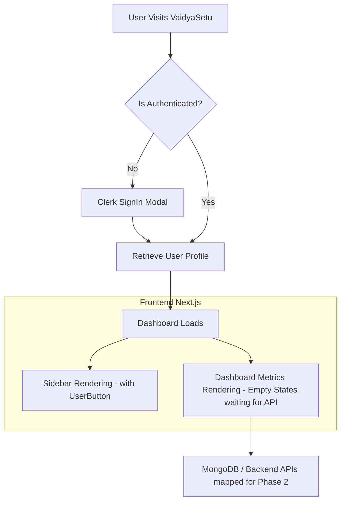

# VaidyaSetu - Phase 1 Documentation

## 1. Problem Statement & Context
The goal of **VaidyaSetu** is to build a professional, persistent health dashboard that bridges Allopathy and AYUSH through an AI-powered healthcare platform. Phase 1 focuses heavily on laying out the architectural foundation, establishing routing and dashboard layouts, and most importantly—securing the platform with robust Identity Management and Authentication.

## 2. Technical Stack Used
- **Frontend Core:** Next.js (Version 16.2.2 with Turbopack)
- **Styling:** Tailwind CSS V4 + Lucide React (for dynamic iconography)
- **Authentication:** Clerk v7 
- **Backend Core:** Node.js + Express
- **Database:** MongoDB Atlas (mongoose)

## 3. What We Accomplished in Phase 1
1. **Clean Slate & Scaffolding:** Ousted the default Vercel generic starting pages and replaced them with our custom Healthcare Dashboard Layout spanning `layout.tsx` and `page.tsx`.
2. **Dashboard UI Construction:** Assembled a multi-pane responsive layout that holds logic for Health Scores, Active Medicine trackers, Predicted Risks, and a Timeline/Prescription zone.
3. **Authentication Strategy (Clerk integration):**
   - Implemented `@clerk/nextjs` into the `layout.tsx`.
   - Setup Environment Variables (`CLERK_SECRET_KEY` and `NEXT_PUBLIC_CLERK_PUBLISHABLE_KEY`) to tie into the backend properly.
   - Built an interactive **Sidebar** equipped with dynamic Clerk Hooks. If unauthenticated, you get our styled "Sign In" button; if authenticated, a full `UserButton` drops into place.
   - Replaced all raw dummy strings and hard-coded values with Next.js specific conditional renderings pulling from `await auth()` and `currentUser()`. 
4. **Proxy Route Protection:** Adapted the system to the breaking changes of Next.js 16 by creating `proxy.ts` (Next's evolved `middleware.ts`) which protects arbitrary routes and checks authentication statuses in real-time gracefully. 

## 4. Architecture Flowchart (Mermaid)

