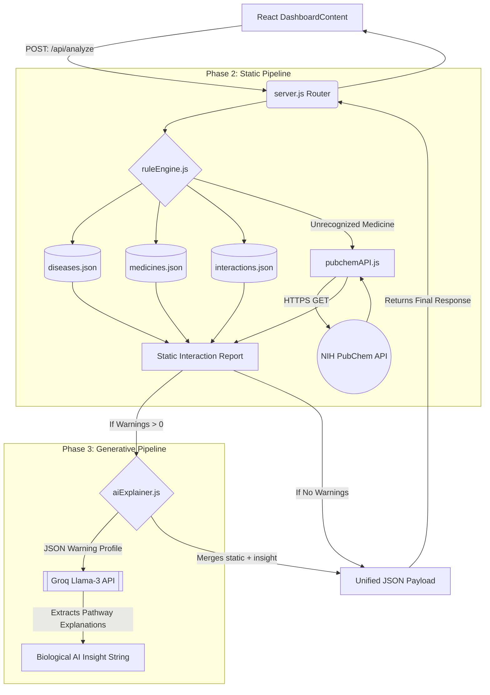

# VaidyaSetu Phase 2 & Phase 3 Technical Documentation

## Executive Summary
This document encapsulates the completed backend architecture for both **Phase 2 (Static AYUSH Engine)** and **Phase 3 (Llama-3 Generative Integration)**. Because both phases were developed sequentially to ensure database connectivity, they have been committed safely to the `main` branch, and ongoing developments are isolated in `phase-3`.

---

## 1. Phase 2: Static AYUSH/Allopathy Engine
The core goal of Phase 2 was to construct a rigid, localized rules-based JSON engine (`ruleEngine.js`) to evaluate unified user profiles for massive conflicts.

### Data Expansion & Integration
* `diseases.json`: Mass-expanded to encompass primary Indian conditions (Type-2 Diabetes, Hypertension, PCOS, Anemia). Contains general protocols AND traditional AYUSH recommendations.
* `medicines.json`: Fully hydrated with baseline AYUSH herbs (Ashwagandha, Tulsi, Guduchi, Triphala, etc.) alongside Allopathic standards.
* `pubchemAPI.js`: Due to the infinite nature of Allopathic pharmaceutical compounds, we bypassed hardcoding and bridged a live pipeline to the National Institutes of Health (NIH) **PubChem REST API**. Unknown chemicals are dynamically pinged, validated, and cached structurally into the frontend state.

---

## 2. Phase 3: Llama-3 Generative Insights Layer
The core goal of Phase 3 was dissolving the rigid nature of Phase 2's dataset outputs by integrating **Groq's** high-speed inference SDK.

### The Hybrid Pipeline
Instead of returning cold high-severity text strings to the frontend, the pipeline parses the Static Report array into a constrained Llama-3 prompt securely forcing the AI to strictly *explain the biological/chemical mechanism* of the static warnings, achieving 0% medical hallucination. Model Used: `llama-3.1-8b-instant`.

---

## 3. Execution Architecture Flow

## 4. Frontend System Overhauls
* **Intelligent Onboarding Modal**: Replaced a rigid input UI with an interactive "Quick Actions" condition matrix (tailored to Indian prevalent diseases) paired with an embedded Autocomplete lookup.
* **Component Responsiveness**: Reprogrammed arbitrary overflow grids into native Tailwind flex grids. The `Sidebar` component fluently detaches into a horizontal mobile navigation cluster with native scrolling capability, neutralizing scaling breaks.
* **Llama Insight Output**: Rendered a responsive, animated "Glowing UI Box" that specifically allocates space to format and present the LLM biological explanations synchronously above standard interaction tables.
