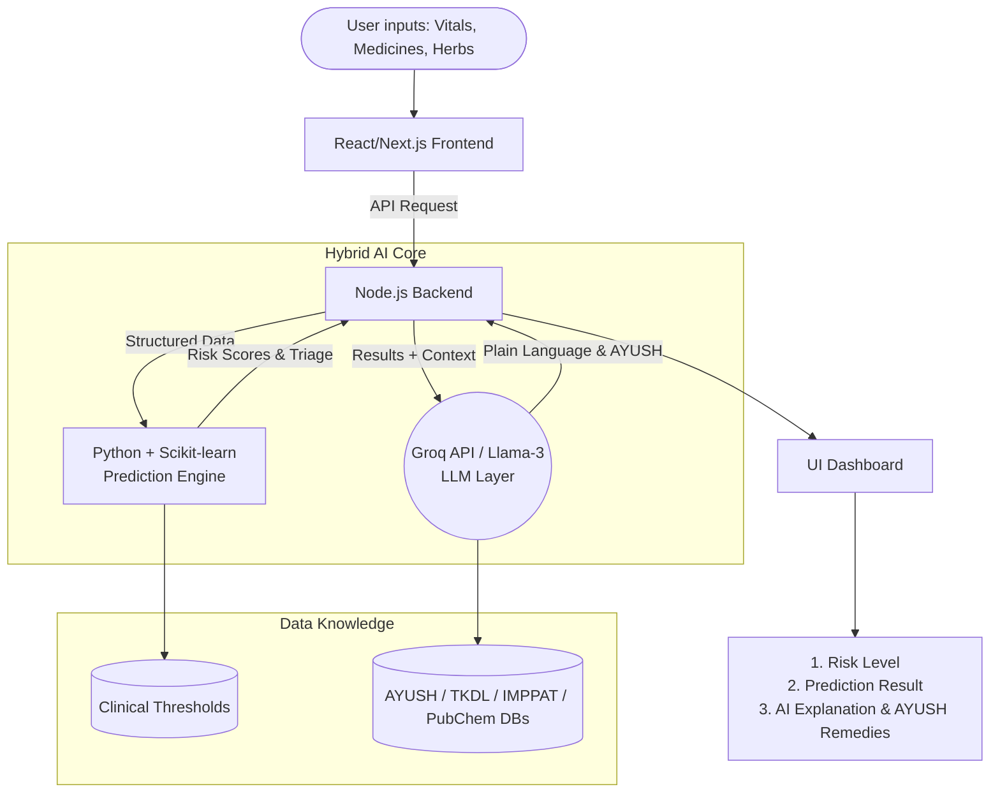
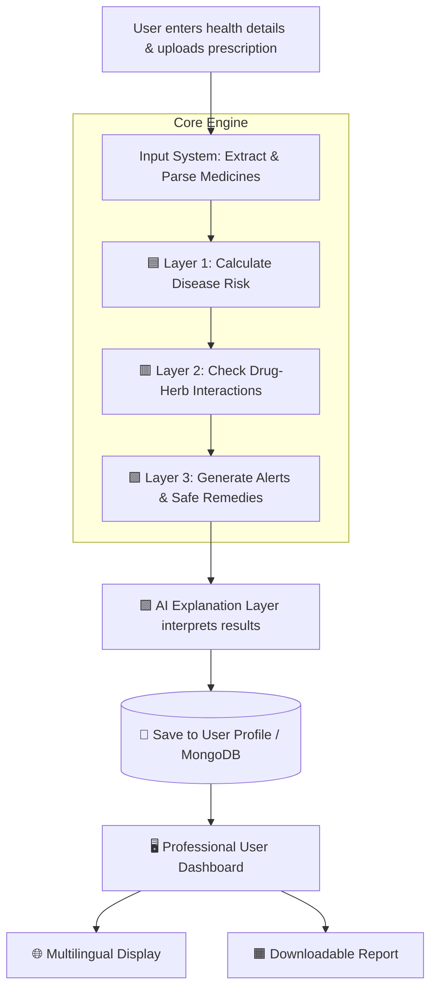

# VaidyaSetu: Bridging the Safety Gap in Pluralistic Healthcare 🌿💊

## 🚀 Elevator Pitch
"Every day in India, millions mix paracetamol with *haldi doodh*, or BP medicine with Arjuna bark. They think they're being healthy—but some combinations cause internal bleeding, liver damage, or dangerous blood sugar drops. And nobody warns them. 
**VaidyaSetu** is India's first AI-powered drug-herb interaction checker. We don't just predict diseases; we predict the preventable, hidden medical emergencies that happen when two complete healthcare systems—Allopathy and AYUSH—operate in silos."

## ⚠️ The Problem (Early Disease Risk Context)
India is uniquely pluralistic. Over 70% of Indians consume some form of traditional remedy alongside modern medicine. 
However, **there is zero safety layer**. Doctors don't ask about herbs; Ayurvedic practitioners don't know the exact chemical interactions of modern pills.
This leads to silent health crises. We are focused on **predicting early-stage health risks** (like hypoglycemia, sudden BP drops, or GI bleeding) *before* they escalate into chronic diseases or emergencies.

## 💡 The Solution: VaidyaSetu
A fast, highly accessible platform where users input their health vitals alongside their prescribed medicines and traditional remedies.
1. **Early Disease Risk Prediction**: Evaluates structured vitals (Age, Weight, BP, Glucose, Hb) to predict risks of lifestyle diseases like Diabetes, Hypertension, and Anemia.
2. **Instant Interaction Checker**: Cross-references pharmacological databases and flags medicine-herb combinations as Safe, Moderate Warning, or High Risk based on the user's health profile.
3. **Contextual AI Explanations**: Translates the hard data into simple, human-readable language, offering culturally relevant AYUSH suggestions (e.g., "You may be at risk for anemia. Include iron-rich foods like spinach and consider Ashwagandha. But avoid combining X with Y as both thin the blood.").

## 🛠️ Final Complete Architecture: Core Engine + Supporting Modules

The application is built on a 3-Layer Core Engine, wrapped in 4 essential product modules to create a complete, competition-ready product.

### The 3-Layer Core Engine (The USP)
1. **🟦 Layer 1 — Disease Risk Predictor:** Uses Python ML to evaluate user health vitals (Age, BP, Sugar) to generate AI predictions, explainability ("WHY"), and future health simulations.
2. **🟥 Layer 2 — Drug-Herb Safety Engine (⭐ MAIN USP):** Cross-references JSON databases populated from **IMPPAT** (Indian Medicinal Plants), **TKDL** (Traditional Knowledge Digital Library), official **Ministry of AYUSH** guidelines, and **PubChem** to detect drug ↔ herb interactions and biological pathway conflicts.
3. **🟩 Layer 3 — Smart Alerts + Remedy Finder:** Generates personalized alerts, suggests safe alternatives, and creates daily action plans based on the outputs of Layers 1 and 2.

### The 5 Supporting Product Modules
1. **🔐 User Identity & Persistence:** Uses secure authentication (e.g., Firebase Auth/MongoDB) to save user profiles. Returning users instantly access their medical history, active prescriptions, and can track their health risk timeline without re-entering data.
2. **🟨 Input Processing System:** Handles messy real-world data via AI-powered Image OCR (Prescription Upload), PDF Document Parsing, and Manual Text Input to cleanly feed the engine.
3. **🟪 AI Interpretation Layer:** Powered by Groq/Llama-3. Translates raw data into simple language and generates the "WHY" reasoning behind risk scores.
4. **🟧 Smart Report Generator:** Compiles risk scores, probabilities, warnings, Do's/Don'ts, and safe alternatives into a professional, downloadable PDF output.
5. **🌐 Multilingual Engine:** Dynamically translates outputs into English, Hindi, and Marathi to ensure high accessibility.

### 📊 System Architecture Diagram

## 👣 User Journey & Step-by-Step Flow

## 🌟 Strategic Improvements & Pitch Roadmap
To make this a winning concept, the roadmap includes these key additions:
1. **High Accessibility Bots**: Using Telegram / WhatsApp Sandboxes to allow anyone to just text symptoms or mixtures without downloading an app.
2. **Prescription OCR**: Allowing users to upload a photo of a doctor's physical prescription to auto-fill their allopathic medicine list.
3. **Voice-First Input**: Supporting rural and elderly populations via voice commands in regional languages (Hindi, Tamil, Marathi).
4. **B2B API for E-Pharmacies (Business Model)**: Selling the engine as an API to platforms like Tata 1mg or Eka Care so they can proactively warn users at checkout if they combine conflicting medicines.
